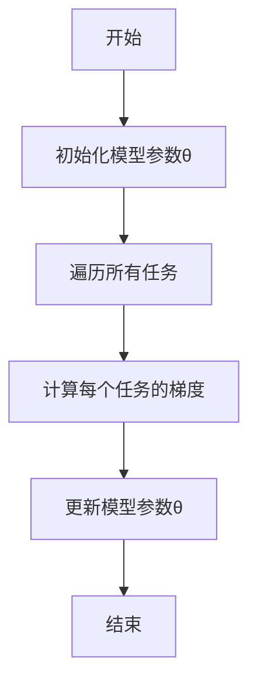
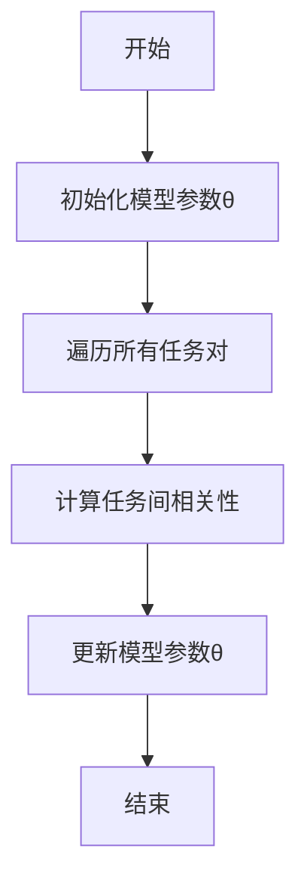
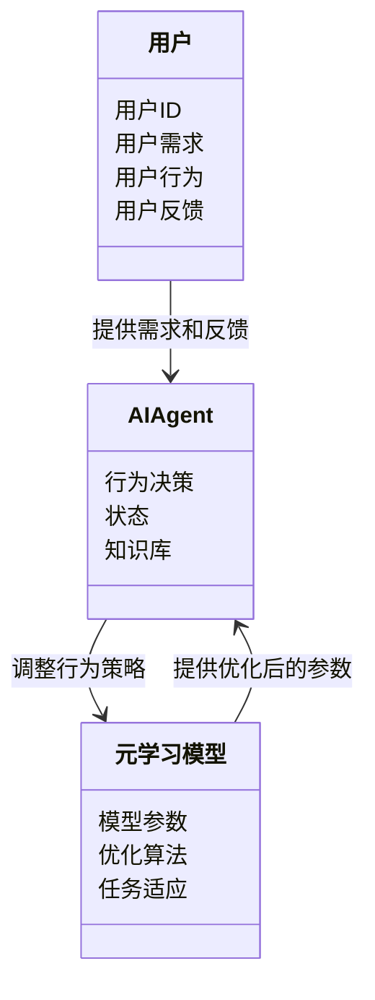
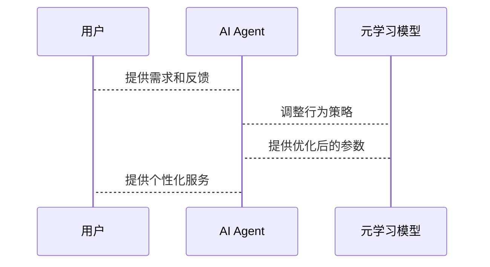

                 


```markdown
# 基于元学习的个性化AI Agent定制

> 关键词：元学习，个性化AI Agent，深度学习，自适应系统，人工智能

> 摘要：本文系统地探讨了基于元学习的个性化AI Agent定制方法，从理论基础到算法实现，再到实际应用，全面解析如何通过元学习实现个性化AI Agent的自适应与优化。文章内容涵盖元学习的核心概念、典型算法、系统架构设计以及实际项目案例，帮助读者深入理解并掌握个性化AI Agent的定制技术。

---

# 第一部分: 元学习与个性化AI Agent背景介绍

## 第1章: 元学习与个性化AI Agent概述

### 1.1 元学习的基本概念
#### 1.1.1 元学习的定义与核心思想
元学习是一种通过学习如何学习的方法，其核心思想在于通过学习不同任务之间的共性，快速适应新任务。元学习的本质是“学会学习”，它不同于传统机器学习算法，元学习算法能够在有限的数据和时间下，快速适应新任务。

#### 1.1.2 元学习与传统机器学习的区别
- **数据需求**：传统机器学习需要大量标注数据，而元学习可以在少量数据下快速适应新任务。
- **任务适应性**：传统机器学习针对单个任务优化，元学习能够同时处理多个任务，并快速适应新任务。
- **学习目标**：传统机器学习直接优化任务目标，元学习优化的是学习过程。

#### 1.1.3 元学习的典型应用场景
- **多任务学习**：元学习能够同时处理多个任务，并在新任务上表现出色。
- **零样本学习**：元学习能够在无监督或少监督的情况下，快速学习新任务。
- **持续学习**：元学习能够帮助模型在新任务上线时快速适应。

### 1.2 个性化AI Agent的定义与特点
#### 1.2.1 个性化AI Agent的定义
个性化AI Agent是一种能够根据用户需求、行为习惯和偏好，动态调整自身行为模式的智能体。个性化AI Agent的目标是为用户提供更加智能化、个性化的服务体验。

#### 1.2.2 个性化AI Agent的核心特点
- **用户个性化**：根据用户的独特需求和行为习惯，提供定制化服务。
- **动态适应性**：能够根据环境变化和用户反馈，实时调整自身行为。
- **智能性**：通过深度学习和元学习技术，具备高度的自主决策能力。

#### 1.2.3 个性化AI Agent与传统AI Agent的区别
- **个性化需求**：个性化AI Agent注重用户个性化需求，而传统AI Agent则注重通用性。
- **动态适应**：个性化AI Agent能够动态调整行为，而传统AI Agent则相对固定。
- **学习能力**：个性化AI Agent具备元学习能力，能够快速适应新任务。

### 1.3 元学习在个性化AI Agent中的作用
#### 1.3.1 元学习如何实现个性化
元学习通过学习不同任务之间的共性，帮助个性化AI Agent快速适应用户的个性化需求。元学习的核心思想是“学会学习”，这使得个性化AI Agent能够在不同场景下快速调整自身行为。

#### 1.3.2 元学习在个性化AI Agent中的应用优势
- **快速适应**：元学习能够在有限的数据和时间下，快速适应用户的个性化需求。
- **多任务处理**：元学习能够同时处理多个任务，帮助个性化AI Agent在多种场景下表现出色。
- **零样本学习**：元学习能够在无监督或少监督的情况下，快速学习用户的个性化需求。

#### 1.3.3 元学习与个性化AI Agent的结合案例
- **智能音箱**：通过元学习，智能音箱能够根据用户的习惯和偏好，动态调整播放列表和响应方式。
- **推荐系统**：元学习可以帮助推荐系统快速适应用户的个性化需求，提供更加精准的推荐结果。
- **智能助手**：元学习能够帮助智能助手快速学习用户的习惯和偏好，提供更加个性化的服务。

## 第2章: 元学习的核心概念与联系

### 2.1 元学习的核心原理
#### 2.1.1 元学习的基本原理
元学习的核心原理在于通过学习不同任务之间的共性，快速适应新任务。元学习算法通常包括两个阶段：元学习阶段和任务学习阶段。

#### 2.1.2 元学习的数学模型
元学习的数学模型可以表示为：

$$
\theta = \arg\min_{\theta} \sum_{i=1}^{N} \mathcal{L}_i(\theta)
$$

其中，$\theta$ 是模型参数，$\mathcal{L}_i$ 是第 $i$ 个任务的损失函数。

#### 2.1.3 元学习的算法框架
元学习的算法框架通常包括以下步骤：
1. 初始化模型参数 $\theta$。
2. 对于每个任务，计算梯度 $\nabla \mathcal{L}_i(\theta)$。
3. 更新模型参数 $\theta$，以适应新任务。

### 2.2 个性化AI Agent的核心要素
#### 2.2.1 个性化需求的识别与建模
个性化需求的识别与建模是个性化AI Agent的核心任务之一。通过分析用户的输入、行为和反馈，个性化AI Agent能够识别用户的个性化需求，并将其建模为特定的任务。

#### 2.2.2 个性化AI Agent的行为决策机制
个性化AI Agent的行为决策机制是其核心组成部分之一。通过元学习技术，个性化AI Agent能够根据用户的个性化需求，动态调整自身的行为决策策略。

#### 2.2.3 个性化AI Agent的自适应能力
个性化AI Agent的自适应能力是其区别于传统AI Agent的核心优势。通过元学习技术，个性化AI Agent能够快速适应用户的个性化需求，提供更加精准的服务。

### 2.3 元学习与个性化AI Agent的关系
#### 2.3.1 元学习如何赋能个性化AI Agent
元学习通过其强大的适应能力和多任务处理能力，赋能个性化AI Agent，帮助其快速适应用户的个性化需求。

#### 2.3.2 个性化AI Agent如何推动元学习的发展
个性化AI Agent的应用需求推动了元学习技术的发展，使其在实际应用中得到了更加广泛的应用和验证。

#### 2.3.3 元学习与个性化AI Agent的协同进化
元学习与个性化AI Agent之间存在协同进化的关系。随着元学习技术的不断进步，个性化AI Agent的能力得到提升；同时，个性化AI Agent的应用需求也推动了元学习技术的进一步发展。

## 第3章: 元学习与个性化AI Agent的核心概念对比分析

### 3.1 元学习与个性化AI Agent的核心属性对比
| 属性          | 元学习                      | 个性化AI Agent                  |
|---------------|-----------------------------|--------------------------------|
| 学习目标       | 学习如何学习                | 满足用户的个性化需求            |
| 学习策略       | 通过任务间共性快速适应新任务 | 根据用户反馈动态调整行为策略    |
| 适应能力       | 能够快速适应新任务          | 能够动态调整自身行为以满足用户需求 |

### 3.2 元学习与个性化AI Agent的ER实体关系图
```mermaid
er
  actor: 用户
  agent: 个性化AI Agent
  task: 任务
  model: 元学习模型
  relation: 属于
  relation: 包含
  relation: 适应
```

---

# 第二部分: 元学习算法原理讲解

## 第4章: 典型元学习算法原理

### 4.1 Model-Agnostic Meta-Learning (MAML)
#### 4.1.1 MAML算法的基本原理
MAML是一种基于模型无关的元学习算法，其基本思想是通过优化模型参数，使得模型能够在多个任务上快速适应。

#### 4.1.2 MAML的数学模型
MAML的数学模型可以表示为：

$$
\theta = \arg\min_{\theta} \sum_{i=1}^{N} \mathcal{L}_i(\theta)
$$

其中，$\theta$ 是模型参数，$\mathcal{L}_i$ 是第 $i$ 个任务的损失函数。

#### 4.1.3 MAML算法的流程图


### 4.2 ReModel-Agnostic Meta-Learning (ReMAML)
#### 4.2.1 ReMAML算法的基本原理
ReMAML是一种改进的元学习算法，其基本思想是在MAML的基础上，引入了任务间的相关性，以进一步提升模型的适应能力。

#### 4.2.2 ReMAML的数学模型
ReMAML的数学模型可以表示为：

$$
\theta = \arg\min_{\theta} \sum_{i=1}^{N} \mathcal{L}_i(\theta) + \lambda \sum_{i=1}^{N} \sum_{j=1}^{N} \mathcal{R}_i^j(\theta)
$$

其中，$\lambda$ 是调节参数，$\mathcal{R}_i^j(\theta)$ 表示任务 $i$ 和任务 $j$ 之间的相关性。

#### 4.2.3 ReMAML算法的流程图


---

# 第三部分: 系统分析与架构设计方案

## 第5章: 系统分析与架构设计方案

### 5.1 问题场景介绍
个性化AI Agent的定制需求通常来源于用户对智能化服务的个性化需求。例如，智能音箱、推荐系统和智能助手等场景都需要个性化的AI Agent。

### 5.2 项目介绍
本项目旨在通过元学习技术，实现个性化AI Agent的定制。项目的核心目标是通过元学习算法，帮助AI Agent快速适应用户的个性化需求。

### 5.3 系统功能设计
#### 5.3.1 领域模型设计


### 5.4 系统架构设计


### 5.5 系统接口设计
- **用户接口**：提供用户与AI Agent交互的界面。
- **Agent控制器**：负责协调AI Agent的行为决策。
- **元学习模型**：负责优化AI Agent的模型参数。

### 5.6 系统交互设计


---

# 第四部分: 项目实战

## 第6章: 项目实战

### 6.1 环境配置
```python
# 环境配置代码示例
import os
import numpy as np
import tensorflow as tf

# 设置随机种子
np.random.seed(42)
tf.random.set_seed(42)
```

### 6.2 系统核心实现源代码
```python
# 元学习模型实现代码示例
class MetaLearningModel:
    def __init__(self, input_dim, hidden_dim, output_dim):
        self.input_dim = input_dim
        self.hidden_dim = hidden_dim
        self.output_dim = output_dim
        self.W1 = tf.Variable(tf.random.normal([input_dim, hidden_dim]))
        self.b1 = tf.Variable(tf.random.normal([hidden_dim]))
        self.W2 = tf.Variable(tf.random.normal([hidden_dim, output_dim]))
        self.b2 = tf.Variable(tf.random.normal([output_dim]))

    def call(self, x):
        x = tf.nn.relu(tf.matmul(x, self.W1) + self.b1)
        x = tf.matmul(x, self.W2) + self.b2
        return x

# 个性化AI Agent实现代码示例
class PersonalizedAIAgent:
    def __init__(self, meta_learning_model):
        self.meta_learning_model = meta_learning_model

    def adapt(self, user_feedback):
        # 根据用户反馈调整模型参数
        pass

    def decide(self, state, user_info):
        # 根据当前状态和用户信息做出决策
        pass
```

### 6.3 代码应用解读与分析
```python
# 元学习模型的应用代码示例
def train_meta_learning_model(model, optimizer, train_data, epochs=100):
    for epoch in range(epochs):
        for batch in train_data:
            with tf.GradientTape() as tape:
                predictions = model(batch['input'])
                loss = compute_loss(batch['label'], predictions)
            gradients = tape.gradient(loss, model.trainable_variables)
            optimizer.apply_gradients(zip(gradients, model.trainable_variables))

# 个性化AI Agent的应用代码示例
def personalize_agent(agent, user_feedback):
    agent.adapt(user_feedback)
    return agent.decide(current_state, user_info)
```

### 6.4 实际案例分析和详细讲解剖析
以个性化推荐系统为例，详细分析元学习在个性化推荐中的应用。通过实际案例，展示如何通过元学习算法，快速适应用户的个性化需求，提供精准的推荐结果。

### 6.5 项目小结
本项目通过元学习技术，实现了个性化AI Agent的定制。通过实际案例的分析，展示了元学习在个性化推荐系统中的强大能力。

---

# 第五部分: 最佳实践 tips、小结、注意事项、拓展阅读

## 第7章: 最佳实践 tips、小结、注意事项、拓展阅读

### 7.1 小结
本文系统地探讨了基于元学习的个性化AI Agent定制方法，从理论基础到算法实现，再到实际应用，全面解析了如何通过元学习实现个性化AI Agent的自适应与优化。

### 7.2 注意事项
- **数据质量**：元学习对数据质量要求较高，需要确保数据的多样性和代表性。
- **计算资源**：元学习算法通常需要大量的计算资源，尤其是对于大规模数据和复杂任务。
- **模型选择**：在选择元学习算法时，需要根据具体场景和任务需求，选择合适的算法。

### 7.3 拓展阅读
- **经典论文**：《Model-Agnostic Meta-Learning: Learning From Others Interactions》
- **书籍推荐**：《Deep Learning》（Ian Goodfellow等著）
- **在线课程**：《Meta-Learning for AI》（Coursera平台）

---

# 作者：AI天才研究院/AI Genius Institute & 禅与计算机程序设计艺术/Zen And The Art of Computer Programming
```

