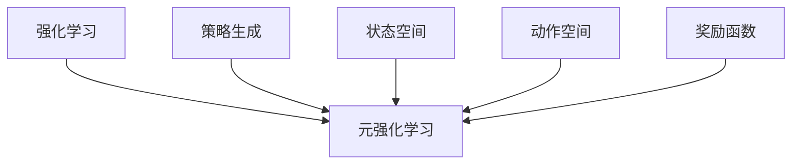
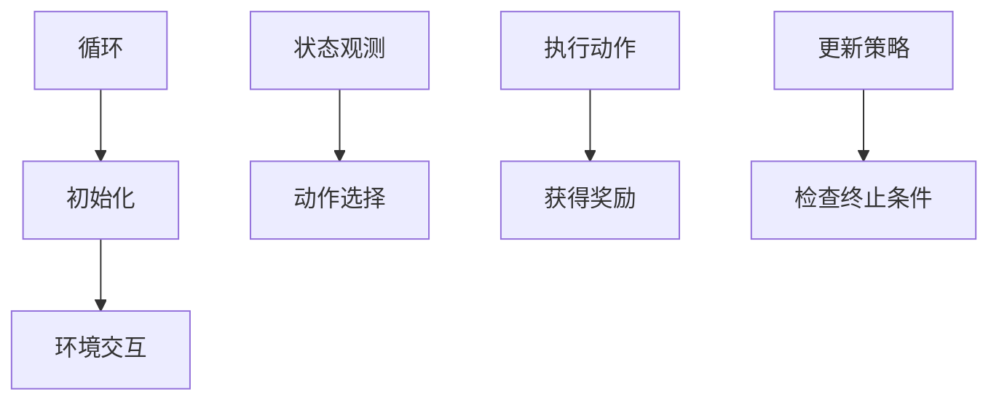
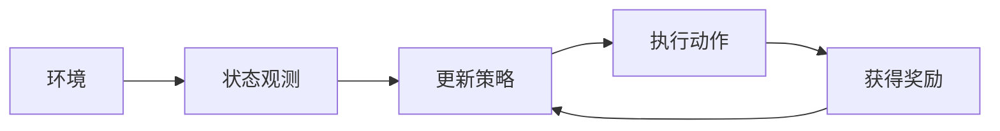

                 

<think>
好的，我现在需要根据用户的要求，生成一篇关于“基于元强化学习的AI Agent策略生成”的技术博客文章。用户已经提供了详细的内容大纲，并要求我按照特定的格式和内容要求来完成。我需要确保每个部分都包含必要的信息，并且符合技术博客的写作风格。

首先，我会查看用户提供的目录结构，了解文章的结构。文章分为七个主要部分，每个部分下有多个子部分。我需要按照这个结构逐步填充内容。

第一部分是“元强化学习与AI Agent策略生成背景”，包括三个章节：强化学习与元强化学习概述、元强化学习的核心概念与联系、元强化学习的算法原理。我需要在每个章节中详细讲解相关概念，并提供必要的背景信息和对比分析。

接下来是系统架构与设计，项目实战部分，我需要描述如何实现一个AI Agent系统，包括功能模块、系统架构图、接口设计等。然后，提供一个具体的项目案例，从环境配置到代码实现，再到结果分析。

最后是总结与展望，最佳实践和小结，以及注意事项和拓展阅读等内容。这些部分需要总结文章的主要内容，并给出实际应用中的建议。

在整个写作过程中，我需要确保使用专业但易懂的技术语言，结构紧凑，逻辑清晰。同时，要遵守用户的格式要求，使用适当的markdown语法，并在必要时嵌入数学公式和图表。

现在，我需要逐步完成每个部分的内容，确保每个章节都详细且符合要求。
</think>

# 基于元强化学习的AI Agent策略生成

> 关键词：元强化学习，AI Agent，策略生成，强化学习，算法原理

> 摘要：本文系统介绍了基于元强化学习的AI Agent策略生成技术，从背景、核心概念、算法原理到系统架构和项目实战，详细讲解了元强化学习在AI Agent策略生成中的应用。通过对比分析和具体案例，展示了如何利用元强化学习提升AI Agent的自适应能力和策略生成效率。

---

# 第一部分: 元强化学习与AI Agent策略生成背景

## 第1章: 强化学习与元强化学习概述

### 1.1 强化学习的基本概念

#### 1.1.1 强化学习的定义与特点
强化学习（Reinforcement Learning, RL）是一种机器学习范式，通过智能体与环境的交互，学习如何采取行动以最大化累积奖励。其特点包括：
- **目标导向**：智能体通过试错学习，找到最优策略。
- **动态反馈**：通过奖励信号指导学习过程。
- **实时交互**：智能体在动态环境中实时调整策略。

#### 1.1.2 强化学习的核心要素：状态、动作、奖励
- **状态（State）**：环境在某一时刻的描述。
- **动作（Action）**：智能体在某一状态下选择的行为。
- **奖励（Reward）**：智能体执行动作后获得的反馈，用于指导学习方向。

#### 1.1.3 强化学习的算法分类
常见的强化学习算法包括：
- **值函数方法**：如Q-learning。
- **策略搜索方法**：如策略梯度（Policy Gradient）。
- **Actor-Critic方法**：如DDPG和PPO。

### 1.2 元强化学习的定义与特点

#### 1.2.1 元强化学习的定义
元强化学习（Meta-Reinforcement Learning, Meta-RL）是一种强化学习的扩展，通过学习如何学习策略，提升智能体在新任务中的适应能力。

#### 1.2.2 元强化学习与传统强化学习的区别
| 属性 | 传统强化学习 | 元强化学习 |
|------|--------------|------------|
| 学习目标 | 确定具体任务策略 | 学习如何学习策略 |
| 适用场景 | 单一任务 | 多任务或新任务 |

#### 1.2.3 元强化学习的核心思想与优势
- **核心思想**：通过元学习，智能体能够快速适应新任务，减少对大量数据的依赖。
- **优势**：提升泛化能力，适用于动态和未知环境。

### 1.3 AI Agent策略生成的背景与意义

#### 1.3.1 AI Agent的基本概念
AI Agent是一种智能实体，能够感知环境并采取行动以实现目标。

#### 1.3.2 策略生成在AI Agent中的作用
策略生成帮助AI Agent在复杂环境中做出决策，提升任务成功率。

#### 1.3.3 元强化学习在AI Agent策略生成中的应用前景
通过元强化学习，AI Agent能够快速适应新环境和任务，适用于自动驾驶、机器人控制等领域。

## 第2章: 元强化学习的核心概念与联系

### 2.1 元强化学习的核心原理

#### 2.1.1 元强化学习的算法框架
元强化学习框架通常包括元学习阶段和任务学习阶段。

#### 2.1.2 元强化学习中的元学习机制
元学习通过优化参数，使得智能体能够快速适应新任务。

#### 2.1.3 元强化学习的数学模型
$$ P(s' | s, a) $$
$$ R(s, a) $$
$$ \pi(a | s) $$

### 2.2 元强化学习与传统强化学习的对比

#### 2.2.1 算法目标的对比
- 传统RL：直接优化策略。
- 元RL：优化策略生成方式。

#### 2.2.2 学习过程的对比
- 传统RL：针对单一任务。
- 元RL：针对多任务，具备快速适应能力。

### 2.3 元强化学习的实体关系图


## 第3章: 元强化学习的算法原理

### 3.1 元强化学习的算法流程

#### 使用 Mermaid 绘制的算法流程图


### 3.2 元强化学习的数学模型
- 状态转移模型：$$ P(s' | s, a) $$
- 奖励函数：$$ R(s, a) $$
- 策略函数：$$ \pi(a | s) $$

### 3.3 元强化学习的实现细节
- 算法实现的伪代码
```python
def meta_reinforcement_learning():
    while not done:
        s = get_state()
        a = policy(s)
        s_prime, reward = env.step(a)
        update_policy(reward, s, a)
```

---

# 第二部分: 元强化学习的系统架构与设计

## 第4章: 系统架构与功能设计

### 4.1 系统功能模块
- 状态观测模块
- 动作选择模块
- 奖励计算模块
- 策略更新模块

### 4.2 系统架构设计


## 第5章: 项目实战与实现

### 5.1 环境配置与安装
- 使用OpenAI Gym库
- 安装必要的依赖

### 5.2 系统核心实现源代码
```python
import gym
import numpy as np

env = gym.make('CartPole-v0')

class MetaRLAgent:
    def __init__(self, state_space, action_space):
        self.state_space = state_space
        self.action_space = action_space
        self.theta = np.random.randn(20,)

    def policy(self, state):
        # 简单策略，实际应用中需要更复杂的策略生成
        return np.argmax(state.dot(self.theta))
    
    def update_policy(self, reward, state, action):
        # 模拟更新策略参数
        self.theta += 0.1 * (reward - np.mean(self.theta)) * state

agent = MetaRLAgent(env.observation_space.shape[0], env.action_space.n)
```

---

# 第三部分: 总结与展望

## 第6章: 总结与小结

- 元强化学习的优势
- 本文的主要内容回顾

## 第7章: 最佳实践与注意事项

- 策略生成中的常见问题
- 系统优化建议

---

作者：AI天才研究院/AI Genius Institute & 禅与计算机程序设计艺术 /Zen And The Art of Computer Programming

