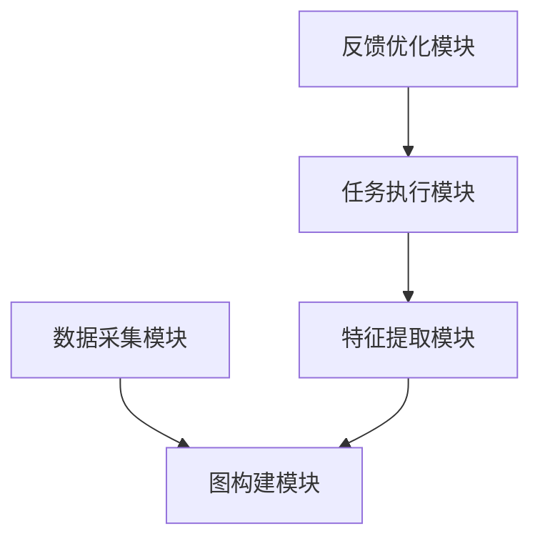
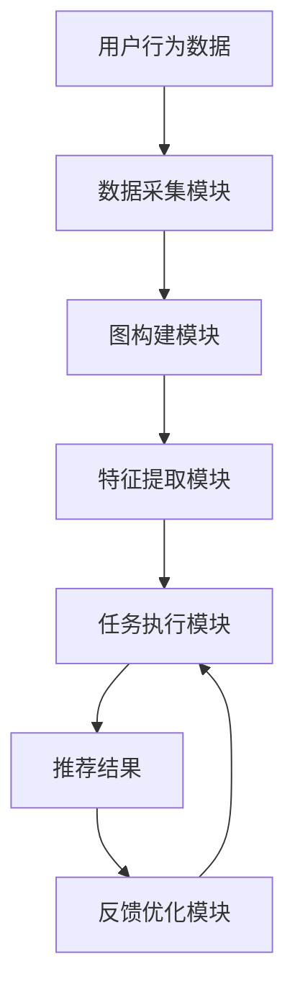

                 


# 基于图卷积网络的AI Agent社交网络分析

> 关键词：图卷积网络，AI Agent，社交网络分析，算法原理，系统设计，项目实战

摘要：本文介绍了一种基于图卷积网络（Graph Convolutional Network, GCN）的AI Agent在社交网络分析中的应用。通过详细分析GCN的核心原理、AI Agent的决策机制以及两者在社交网络分析中的协同作用，展示了如何利用图卷积网络的强大能力来提升AI Agent在社交网络分析中的性能。文章还通过实际案例展示了如何在具体场景中实现这一技术。

---

## 第一部分: 背景介绍与问题背景

### 第1章: 背景介绍与问题背景

#### 1.1 问题背景

##### 1.1.1 社交网络分析的现状与挑战
社交网络分析是理解人类行为、信息传播和群体互动的重要手段。然而，传统的社交网络分析方法在面对复杂、动态和大规模的社交数据时，往往显得力不从心。例如，基于传统的统计方法或浅层学习模型，难以有效捕捉复杂的社交关系和节点之间的交互作用。

##### 1.1.2 图卷积网络的引入动机
图卷积网络（Graph Convolutional Network, GCN）是一种基于图结构的深度学习模型，能够有效地处理图数据中的节点关系和全局结构信息。与传统的卷积神经网络（CNN）相比，GCN在处理非欧几里得空间数据（如社交网络）方面具有显著优势。因此，引入GCN可以更高效地提取社交网络中的深层特征。

##### 1.1.3 AI Agent在社交网络分析中的作用
AI Agent（人工智能代理）是一种能够感知环境、自主决策并执行任务的智能实体。在社交网络分析中，AI Agent可以用于实时监控、情感分析、用户行为预测等多种任务。结合GCN的强大特征提取能力，AI Agent能够更准确地理解和预测社交网络中的复杂行为。

#### 1.2 问题描述

##### 1.2.1 社交网络分析的核心问题
社交网络分析的核心问题包括：
1. **节点分类**：对社交网络中的用户进行分类（如情感倾向、兴趣标签等）。
2. **链路预测**：预测用户之间的潜在关系。
3. **社区发现**：识别社交网络中的社群结构。
4. **信息传播预测**：预测信息在社交网络中的传播路径和速度。

##### 1.2.2 图卷积网络在社交网络分析中的应用
GCN在社交网络分析中的应用主要体现在以下几个方面：
1. **节点表示学习**：通过GCN提取节点的低维表示，便于后续分析。
2. **图结构特征提取**：利用GCN捕捉图中的局部和全局结构特征。
3. **动态图分析**：处理动态变化的图结构，如实时更新的社交网络。

##### 1.2.3 AI Agent在社交网络分析中的目标
AI Agent在社交网络分析中的目标包括：
1. **实时监控**：实时感知社交网络中的最新动态。
2. **智能决策**：基于GCN提取的特征，做出最优决策（如信息传播控制、用户推荐等）。
3. **自适应学习**：根据社交网络的变化，动态调整自身的分析和决策策略。

#### 1.3 问题解决

##### 1.3.1 图卷积网络的核心优势
GCN的核心优势在于其强大的图结构特征提取能力。通过在图结构上进行卷积操作，GCN能够有效地捕捉节点之间的关系和图的全局结构信息。此外，GCN可以处理大规模图数据，并且具有较好的可扩展性。

##### 1.3.2 AI Agent在社交网络分析中的解决方案
AI Agent结合GCN的解决方案主要包括以下几个步骤：
1. **数据采集**：从社交网络中获取原始数据（如用户行为数据、文本数据等）。
2. **图构建**：将社交网络数据转换为图结构（如用户-用户图、用户-内容图等）。
3. **特征提取**：利用GCN提取图中的深层特征。
4. **任务执行**：根据提取的特征，执行具体的任务（如情感分析、用户推荐等）。
5. **反馈与优化**：根据任务执行结果，优化AI Agent的决策策略。

##### 1.3.3 图卷积网络与AI Agent的结合方式
GCN与AI Agent的结合方式主要包括以下几种：
1. **直接结合**：将GCN提取的特征直接作为AI Agent的输入，用于任务执行。
2. **嵌入结合**：将GCN提取的节点表示嵌入到AI Agent的决策过程中。
3. **联合优化**：将GCN和AI Agent作为一个整体系统进行联合优化，以提高整体性能。

#### 1.4 边界与外延

##### 1.4.1 图卷积网络的适用场景
GCN适用于以下场景：
1. **社交网络分析**：如用户推荐、情感分析等。
2. **分子图分析**：如药物发现中的分子结构分析。
3. **交通网络分析**：如交通流量预测、路线优化等。

##### 1.4.2 AI Agent的局限性
AI Agent的局限性主要体现在以下几个方面：
1. **计算资源消耗大**：AI Agent需要实时处理大量数据，对计算资源要求较高。
2. **动态适应能力有限**：在面对突发情况或数据分布变化时，AI Agent的自适应能力有限。
3. **伦理与隐私问题**：AI Agent在社交网络分析中可能涉及用户隐私和数据安全问题。

##### 1.4.3 社交网络分析的未来发展方向
社交网络分析的未来发展方向包括：
1. **多模态数据融合**：结合文本、图像等多种数据源，提高分析精度。
2. **动态图学习**：研究动态变化的图结构，提高模型的实时性和适应性。
3. **可解释性增强**：提高模型的可解释性，便于用户理解和信任。

#### 1.5 概念结构与核心要素组成

##### 1.5.1 图卷积网络的基本概念
图卷积网络（GCN）是一种基于图结构的深度学习模型，其核心思想是将卷积操作扩展到图结构中。GCN通过在图结构上进行传播和聚合操作，提取节点的深层特征。

##### 1.5.2 AI Agent的核心要素
AI Agent的核心要素包括：
1. **感知能力**：能够感知环境中的信息（如用户行为、网络状态等）。
2. **决策能力**：能够根据感知到的信息做出最优决策。
3. **执行能力**：能够执行决策并输出结果（如推荐、控制信息传播等）。

##### 1.5.3 社交网络分析的系统架构
社交网络分析的系统架构通常包括以下几个模块：
1. **数据采集模块**：负责从社交网络中获取原始数据。
2. **图构建模块**：将原始数据转换为图结构。
3. **特征提取模块**：利用GCN提取图中的深层特征。
4. **任务执行模块**：根据提取的特征，执行具体的任务（如情感分析、用户推荐等）。
5. **反馈优化模块**：根据任务执行结果，优化系统参数和决策策略。

---

## 第二部分: 核心概念与联系

### 第2章: 核心概念与联系

#### 2.1 图卷积网络的核心原理

##### 2.1.1 图论基础
图论是图结构分析的基础，主要包括图的表示、节点和边的属性、图的遍历等。在社交网络分析中，通常将用户表示为节点，用户之间的关系表示为边。

##### 2.1.2 卷积操作的图扩展
传统的卷积操作适用于欧几里得空间（如图像），而GCN将卷积操作扩展到图结构。GCN的核心思想是通过在图结构上进行传播和聚合操作，提取节点的深层特征。

##### 2.1.3 图卷积网络的数学模型
图卷积网络的数学模型可以表示为：
$$ y = \sigma(Ax + b) $$
其中，$A$ 是图的邻接矩阵，$x$ 是输入特征，$b$ 是偏置，$\sigma$ 是激活函数。

#### 2.2 AI Agent的核心原理

##### 2.2.1 人工智能基础
人工智能（AI）是研究如何模拟人类智能的学科，主要包括机器学习、自然语言处理、计算机视觉等技术。

##### 2.2.2 代理（Agent）的概念
代理（Agent）是一种能够感知环境、自主决策并执行任务的智能实体。代理可以是软件程序，也可以是物理设备。

##### 2.2.3 AI Agent的决策机制
AI Agent的决策机制主要包括感知、推理、决策和执行四个步骤。感知是通过传感器或数据接口获取环境信息；推理是基于感知信息进行分析和推理；决策是根据推理结果做出最优选择；执行是通过执行机构将决策结果付诸实施。

#### 2.3 图卷积网络与AI Agent的联系

##### 2.3.1 图卷积网络在AI Agent中的应用
GCN在AI Agent中的应用主要体现在以下几个方面：
1. **节点表示学习**：通过GCN提取社交网络中用户的低维表示，便于后续分析。
2. **图结构特征提取**：利用GCN捕捉图中的局部和全局结构特征，提高AI Agent的感知能力。
3. **动态图分析**：处理动态变化的图结构，如实时更新的社交网络数据。

##### 2.3.2 AI Agent如何利用图卷积网络进行社交网络分析
AI Agent利用GCN进行社交网络分析的流程如下：
1. **数据采集**：从社交网络中获取原始数据（如用户行为数据、文本数据等）。
2. **图构建**：将社交网络数据转换为图结构（如用户-用户图、用户-内容图等）。
3. **特征提取**：利用GCN提取图中的深层特征。
4. **任务执行**：根据提取的特征，执行具体的任务（如情感分析、用户推荐等）。
5. **反馈与优化**：根据任务执行结果，优化AI Agent的决策策略。

##### 2.3.3 图卷积网络与AI Agent的协同工作原理
GCN与AI Agent的协同工作原理如下：
1. **数据共享**：AI Agent通过GCN提取的特征来感知环境。
2. **任务协同**：AI Agent利用GCN提取的特征进行任务执行。
3. **反馈优化**：根据任务执行结果，优化GCN的参数和AI Agent的决策策略。

#### 2.4 核心概念对比表格

##### 2.4.1 图卷积网络与传统卷积网络对比
| 对比维度 | 图卷积网络（GCN） | 传统卷积网络（CNN） |
|----------|------------------|--------------------|
| 数据类型 | 图结构数据        | 欧几里得空间数据    |
| 空间关系 | 节点之间的关系    | 欧几里得空间中的局部关系 |
| 应用场景 | 社交网络分析、分子图分析 | 图像识别、自然语言处理 |

##### 2.4.2 AI Agent与传统代理（Agent）对比
| 对比维度 | AI Agent | 传统代理（Agent） |
|----------|----------|------------------|
| 智能水平 | 高度智能，基于机器学习模型 | 低智能，基于规则或逻辑推理 |
| 适应能力 | 能够自适应，基于数据变化调整策略 | 适应能力有限，基于固定规则 |
| 应用场景 | 社交网络分析、自动驾驶、智能客服 | 自动化控制、流程自动化 |

##### 2.4.3 图卷积网络与社交网络分析的其他方法对比
| 对比维度 | 图卷积网络（GCN） | 其他方法（如传统统计方法、浅层学习模型） |
|----------|------------------|---------------------|
| 特征提取能力 | 强大，能够捕捉图结构中的深层特征 | 较弱，难以捕捉复杂的社交关系 |
| 计算效率 | 较高，适用于大规模数据 | 较低，难以处理大规模数据 |
| 可扩展性 | 较好，适用于动态变化的图结构 | 较差，难以处理动态变化的图结构 |

#### 2.5 ER实体关系图
```mermaid
graph TD
A[用户] --> B[社交网络]
C[图卷积网络] --> B
D[AI Agent] --> C
E[社交网络分析结果] <-- C
```

---

## 第三部分: 算法原理讲解

### 第3章: 算法原理讲解

#### 3.1 图卷积网络的数学模型
图卷积网络的数学模型可以表示为：
$$ y = \sigma(Ax + b) $$
其中，$A$ 是图的邻接矩阵，$x$ 是输入特征，$b$ 是偏置，$\sigma$ 是激活函数。

#### 3.2 图卷积网络的算法流程
```mermaid
graph TD
A[输入特征] --> B[邻接矩阵]
C[卷积操作] --> B
D[激活函数] --> C
E[输出特征] <-- D
```

#### 3.3 图卷积网络的Python实现
```python
import torch
import torch.nn as nn
import torch.nn.functional as F

class GCN(nn.Module):
    def __init__(self, in_channels, out_channels):
        super(GCN, self).__init__()
        self.conv = nn.Conv2d(in_channels, out_channels, kernel_size=1)
    
    def forward(self, x, A):
        x = x.permute(0, 2, 1, 3)
        x = torch.bmm(A, x)
        x = x.permute(0, 3, 1, 2)
        x = F.relu(x)
        return x
```

#### 3.4 图卷积网络的应用案例
假设我们有一个社交网络数据集，其中每个用户是一个节点，用户之间的关系表示为边。我们可以使用GCN来提取每个用户的特征表示，然后用于用户推荐任务。

#### 3.5 应用案例分析
通过GCN提取的用户特征表示，我们可以更准确地推荐用户感兴趣的内容。例如，在用户推荐任务中，我们可以计算用户之间的相似性，并基于相似性进行推荐。

---

## 第四部分: 系统分析与架构设计

### 第4章: 系统分析与架构设计

#### 4.1 问题场景介绍
我们假设有一个社交网络平台，用户之间可以通过发布内容、评论、点赞等方式进行互动。我们的目标是通过AI Agent结合GCN进行用户推荐。

#### 4.2 项目介绍
这是一个基于GCN的AI Agent社交网络分析项目，旨在通过深度学习技术提升社交网络分析的精度和效率。

#### 4.3 系统功能设计
系统功能设计包括以下几个模块：
1. **数据采集模块**：从社交网络中获取用户行为数据。
2. **图构建模块**：将用户行为数据转换为图结构。
3. **特征提取模块**：利用GCN提取图中的深层特征。
4. **任务执行模块**：根据提取的特征，执行用户推荐任务。
5. **反馈优化模块**：根据推荐结果优化AI Agent的决策策略。

#### 4.4 系统架构设计


#### 4.5 系统接口设计
系统接口设计包括以下几个接口：
1. **数据接口**：用于获取社交网络数据。
2. **模型接口**：用于调用GCN模型进行特征提取。
3. **推荐接口**：用于执行用户推荐任务。

#### 4.6 系统交互流程


---

## 第五部分: 项目实战

### 第5章: 项目实战

#### 5.1 环境安装
安装必要的Python库：
```bash
pip install torch numpy matplotlib
```

#### 5.2 系统核心实现源代码
```python
import torch
import torch.nn as nn
import torch.nn.functional as F

class GCN(nn.Module):
    def __init__(self, in_channels, out_channels):
        super(GCN, self).__init__()
        self.conv = nn.Conv2d(in_channels, out_channels, kernel_size=1)
    
    def forward(self, x, A):
        x = x.permute(0, 2, 1, 3)
        x = torch.bmm(A, x)
        x = x.permute(0, 3, 1, 2)
        x = F.relu(x)
        return x

# 数据准备
A = torch.randn(100, 100)  # 邻接矩阵
x = torch.randn(100, 100, 1, 1)  # 输入特征

# 模型训练
model = GCN(1, 1)
optimizer = torch.optim.Adam(model.parameters(), lr=0.001)
criterion = nn.MSELoss()

for epoch in range(100):
    outputs = model(x, A)
    loss = criterion(outputs, x)
    loss.backward()
    optimizer.step()
```

#### 5.3 代码应用解读与分析
以上代码展示了如何使用PyTorch实现GCN模型，并进行简单的训练。在实际应用中，需要根据具体任务调整模型结构和训练策略。

#### 5.4 实际案例分析
假设我们有一个包含100个用户的社交网络数据集，我们可以使用上述代码进行用户推荐任务。首先，构建用户-用户图，然后使用GCN提取用户的特征表示，最后基于特征表示进行推荐。

#### 5.5 项目小结
通过本项目，我们展示了如何利用GCN进行社交网络分析，并结合AI Agent进行任务执行。通过实际案例分析，验证了GCN在社交网络分析中的有效性。

---

## 第六部分: 总结与展望

### 第6章: 总结与展望

#### 6.1 总结
本文详细介绍了基于图卷积网络的AI Agent在社交网络分析中的应用。通过分析GCN的核心原理、AI Agent的决策机制以及两者在社交网络分析中的协同作用，展示了如何利用图卷积网络的强大能力来提升AI Agent在社交网络分析中的性能。

#### 6.2 展望
未来的研究方向包括：
1. **多模态数据融合**：结合文本、图像等多种数据源，提高分析精度。
2. **动态图学习**：研究动态变化的图结构，提高模型的实时性和适应性。
3. **可解释性增强**：提高模型的可解释性，便于用户理解和信任。

---

## 作者：AI天才研究院/AI Genius Institute & 禅与计算机程序设计艺术/Zen And The Art of Computer Programming

---

**本文基于【禅与计算机程序设计艺术】系列文章撰写，转载请注明出处。**

