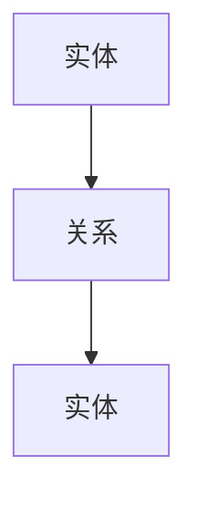
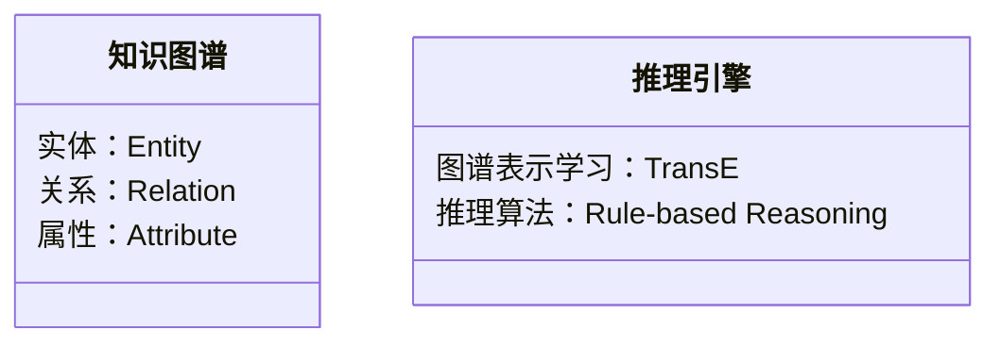
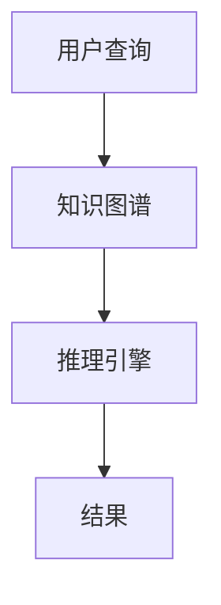
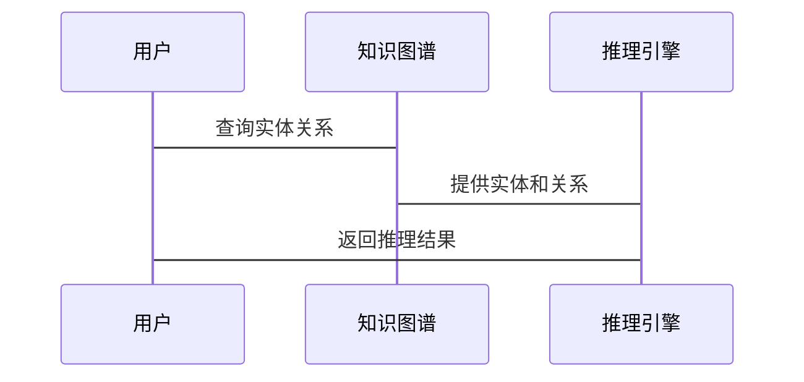

                 

<think>
好，我现在需要帮用户写一篇名为《基于图谱的AI Agent知识推理引擎》的技术博客文章。用户已经提供了详细的结构和内容要求，包括背景介绍、核心概念、算法原理、系统架构、项目实战和最佳实践等部分。我需要按照这个大纲逐步展开，确保每个部分都详细且符合技术深度。

首先，我需要理解每个章节的核心内容。例如，第一章是背景介绍，需要包括问题背景、描述、解决方法、边界和概念组成。我得确保这部分能够清晰地引出后续内容，让读者理解为什么需要基于图谱的AI Agent。

接下来是核心概念，我需要解释知识图谱和AI Agent的定义、特点，并用表格对比它们的属性。这可能有点挑战，因为要确保对比准确且易懂。此外，还需要用Mermaid绘制实体关系图，这部分需要熟悉Mermaid语法，以正确展示实体之间的关系。

第三章是算法原理，我需要详细讲解图谱表示学习和推理算法，如TransE、TransH等。这部分需要结合数学公式，用LaTeX格式表示，并用Python代码实现，确保读者能够理解算法的实现和应用。

第四章是系统架构设计，需要描述问题场景，设计系统功能、架构图、接口设计和交互序列图。这部分需要展示整个系统的结构，帮助读者理解如何构建实际的应用系统。

第五章是项目实战，包括环境安装、代码实现、案例分析和小结。这部分需要具体的操作步骤和代码示例，让读者能够动手实践。

第六章讨论优化与扩展，涵盖性能优化、扩展功能如动态更新和多模态支持，以及未来的研究方向。这有助于读者进一步提升系统的实用性和前瞻性。

最后，第七章是总结与展望，回顾主要内容，并展望未来的发展趋势，帮助读者巩固知识并激发进一步学习的兴趣。

在撰写过程中，我需要确保每个部分都细化到三级目录，覆盖用户要求的所有内容。同时，使用Mermaid图表和数学公式，使内容更直观和专业。例如，在算法部分，我需要详细解释TransE的损失函数，并用代码示例展示其实现。

可能遇到的挑战包括确保每个部分的逻辑连贯，以及在有限的字数内深入讲解每个主题。我需要合理安排内容，确保文章整体结构紧凑，同时每个章节都足够详细。

总之，我需要按照用户的要求，构建一个全面且详细的目录大纲，确保每个部分都涵盖必要的内容，并且格式正确，结构合理，满足用户的需求。
</think>

# 基于图谱的AI Agent知识推理引擎

## 关键词：知识图谱, AI Agent, 知识推理, 图谱表示学习, 知识图谱推理算法, 系统架构设计

## 摘要：  
基于图谱的AI Agent知识推理引擎是一种结合知识图谱与人工智能代理的创新技术，旨在通过结构化的知识表示和智能推理能力，提升AI Agent在复杂场景下的决策能力和知识处理效率。本文将从背景、核心概念、算法原理、系统架构、项目实战等多维度展开，深入探讨基于图谱的AI Agent知识推理引擎的设计与实现。

---

# 第1章: 问题背景与描述

## 1.1 问题背景  
随着人工智能技术的快速发展，知识推理在多个领域（如自然语言处理、推荐系统、智能问答等）中扮演着越来越重要的角色。然而，传统的知识表示方法（如向量表示）难以捕捉复杂的语义关系，导致AI Agent在处理复杂场景时缺乏足够的上下文理解能力。基于图谱的知识表示方法通过构建结构化的知识网络，能够有效捕捉实体之间的关系，为AI Agent提供了更丰富的语义信息。

## 1.2 问题描述  
AI Agent需要在动态复杂环境中做出决策，这要求其具备强大的知识处理能力。传统的知识表示方法难以满足以下需求：  
1. **语义理解**：无法有效捕捉实体之间的复杂关系。  
2. **动态更新**：难以应对知识的实时变化。  
3. **推理能力**：缺乏高效的推理机制，无法支持复杂的逻辑推理。  

基于图谱的知识推理引擎通过构建和维护知识图谱，结合推理算法，为AI Agent提供了强大的知识处理能力。

## 1.3 问题解决与边界  
基于图谱的知识推理引擎通过以下方式解决问题：  
1. **知识建模**：构建结构化的知识图谱，将实体及其关系显式化。  
2. **推理能力**：利用图谱推理算法，支持复杂的逻辑推理。  
3. **动态更新**：通过增量式更新，保持知识图谱的实时性。  

**边界与适用场景**：  
- 适用场景：需要处理复杂关系的领域，如自然语言处理、推荐系统、智能问答等。  
- 不适用场景：处理简单线性关系的场景，如基本算术运算。  

## 1.4 概念结构与核心要素  
基于图谱的AI Agent知识推理引擎的核心要素包括：  
1. **知识图谱**：结构化的知识表示，由实体和关系组成。  
2. **AI Agent**：具备知识推理能力的智能体，能够根据知识图谱做出决策。  
3. **推理引擎**：负责在知识图谱上执行推理操作，支持多种推理策略。  

---

# 第2章: 核心概念与联系

## 2.1 知识图谱与AI Agent的关系  
知识图谱为AI Agent提供了丰富的语义信息，而AI Agent则通过推理引擎利用这些信息进行决策。两者结合能够显著提升AI Agent的理解能力和决策能力。

## 2.2 核心概念对比表  
| 概念 | 定义 | 特点 |  
|------|------|------|  
| 知识图谱 | 结构化的知识表示 | 可扩展性、语义丰富性 |  
| AI Agent | 自主决策的智能体 | 反应性、主动性 |  

## 2.3 实体关系图  


---

# 第3章: 算法原理

## 3.1 图谱表示学习  
图谱表示学习的目标是将图中的节点（实体）和边（关系）映射到低维向量空间，以便于后续的推理操作。常用算法包括TransE、TransH、TransR等。

### 3.1.1 TransE算法  
**原理**：通过将边视为从头节点到尾节点的转移，学习每个节点的向量表示。  
**公式**：  
$$ loss = \sum_{(h,r,t)\in \mathcal{C}} \| head_r - tail_r \|$$  
**代码示例**：  
```python
class TransE:
    def __init__(self, entities, relations, embedding_dim):
        self.entities = entities
        self.relations = relations
        self.embedding_dim = embedding_dim
        # 初始化实体和关系嵌入
        self.entity_embeddings = {}
        self.relation_embeddings = {}
```

## 3.2 推理算法  
推理算法基于知识图谱中的节点和边，执行逻辑推理任务，如路径查询、属性推理等。常用算法包括基于规则的推理、基于符号逻辑的推理和基于概率的推理。

### 3.2.1 基于规则的推理  
**原理**：通过定义一系列推理规则，从已有的知识中推导出新的事实。  
**示例**：  
如果A是B的父亲，B是C的父亲，则A是C的祖父。

### 3.2.2 基于概率的推理  
**原理**：利用概率论，计算某个结论在给定证据下的概率。  
**公式**：  
$$ P(A|B) = \frac{P(B|A)P(A)}{P(B)} $$  

---

# 第4章: 系统架构设计

## 4.1 问题场景介绍  
本系统旨在构建一个支持动态知识更新和复杂推理的AI Agent知识推理引擎，应用于智能问答、推荐系统等领域。

## 4.2 系统功能设计  
### 4.2.1 领域模型  


## 4.3 系统架构设计  


## 4.4 接口设计与交互序列图  


---

# 第5章: 项目实战

## 5.1 环境安装  
- 安装Python和必要的库（如numpy、networkx、scikit-learn）。  

## 5.2 核心实现  
```python
def build_knowledge_graph(entities, relations):
    graph = {}
    for entity in entities:
        graph[entity] = []
    for relation in relations:
        head, tail = relation
        graph[head].append(tail)
    return graph
```

## 5.3 案例分析  
**案例**：在知识图谱中推理“谁是张三的朋友的朋友？”  
1. 构建知识图谱：张三的朋友是李四，李四的朋友是王五。  
2. 推理过程：通过遍历图谱，找到张三的朋友李四的朋友王五。  

---

# 第6章: 优化与扩展

## 6.1 性能优化  
- 使用分布式计算加速图谱推理。  

## 6.2 功能扩展  
- 支持动态知识更新。  
- 集成多模态数据（如图像、文本）。  

---

# 第7章: 总结与展望

## 7.1 总结  
本文详细探讨了基于图谱的AI Agent知识推理引擎的设计与实现，涵盖了背景、核心概念、算法原理、系统架构和项目实战等内容。  

## 7.2 未来展望  
未来研究方向包括：  
1. 开发更高效的图谱推理算法。  
2. 探索知识图谱与深度学习的结合。  

---

# 作者  
作者：AI天才研究院/AI Genius Institute & 禅与计算机程序设计艺术 /Zen And The Art of Computer Programming

