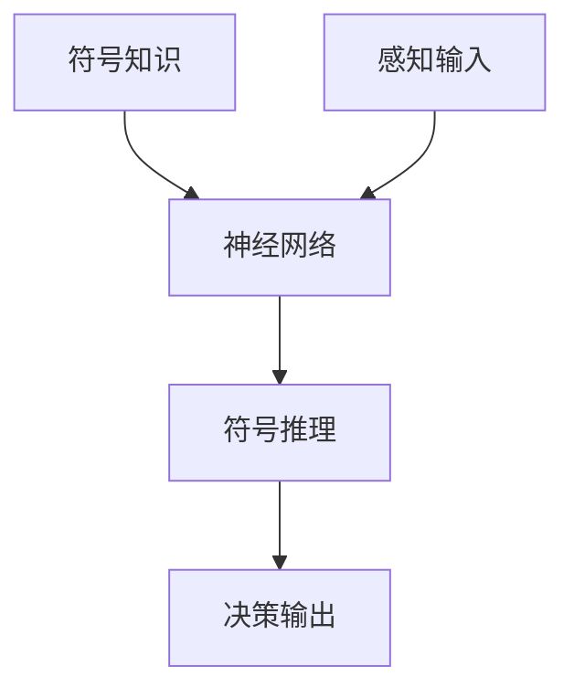
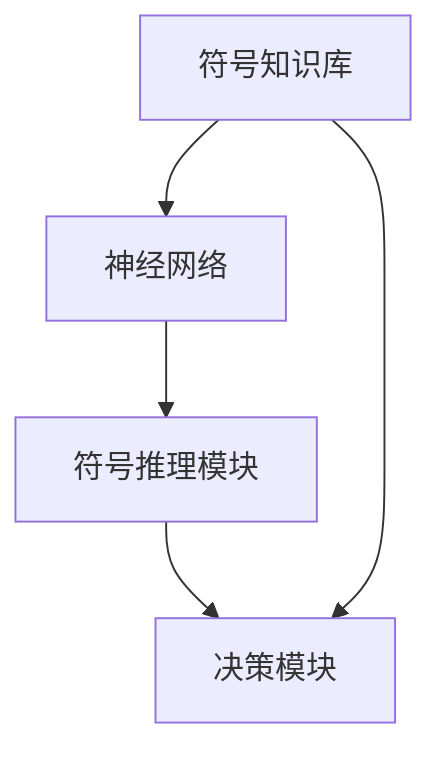
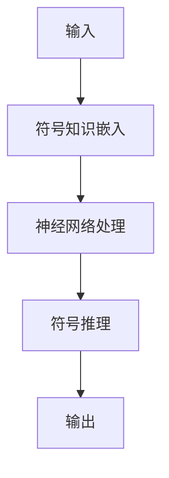
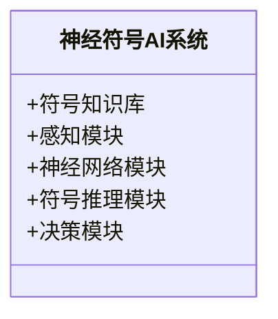
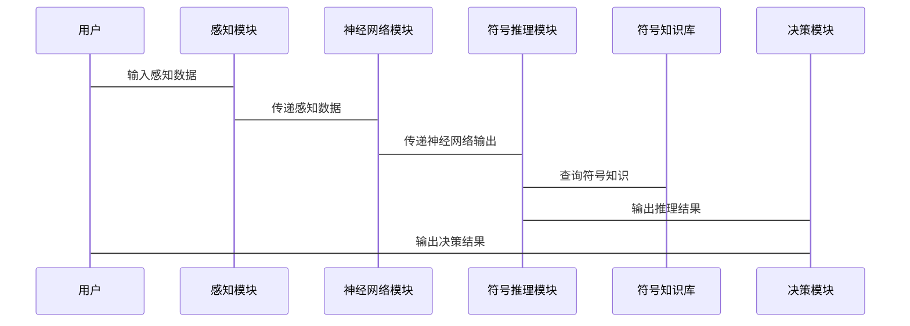

                 

<think>
好的，我现在需要帮助用户撰写一篇关于《基于神经符号AI的AI Agent可解释性增强》的技术博客文章。用户已经提供了详细的结构和内容要求，我需要按照这些要求逐步完成任务。

首先，我注意到用户希望文章有清晰的结构，包括摘要、关键词，然后是多个章节，每个章节都有详细的子部分。文章需要使用专业但易懂的技术语言，并且每个部分都要有实际的内容和例子。

我会先从摘要开始，概述文章的核心内容，然后列出关键词。接下来，按照用户提供的目录结构，逐步撰写每个章节的内容。在撰写过程中，我需要确保每个部分都有足够的细节，包括理论、算法、系统设计和项目实战。

在撰写算法部分时，我需要使用mermaid流程图来展示神经符号AI的结合过程，并附上Python代码示例。数学公式需要用latex格式表示，并且放在独立段落中。系统架构部分需要绘制类图和架构图，展示系统的各个部分及其交互。

项目实战部分，我会详细说明环境安装步骤，展示核心代码，并进行案例分析。最后，总结部分需要回顾文章内容，给出最佳实践和未来展望。

在整个过程中，我需要确保逻辑清晰，内容连贯，同时满足字数要求。每完成一个部分，我会检查是否符合用户的要求，是否需要进一步细化或调整结构。

最终，我会在文章末尾添加作者信息，确保格式正确。整个思考过程需要一步步来，确保每个部分都完成到位，满足用户的需求。
</think>

# 基于神经符号AI的AI Agent可解释性增强

## 关键词：
神经符号AI、AI Agent、可解释性、符号推理、知识图谱、机器学习、增强学习

## 摘要：
本文深入探讨了基于神经符号AI的AI Agent可解释性增强的实现方法。通过结合符号推理和神经网络，提出了增强AI Agent可解释性的新方法。文章从理论到实践，详细分析了神经符号AI的核心原理、算法实现、系统设计以及实际应用案例，展示了如何通过神经符号AI提升AI Agent的可解释性。

---

# 第一部分: 神经符号AI与AI Agent的背景介绍

## 第1章: 神经符号AI与AI Agent概述

### 1.1 神经符号AI的定义与特点
神经符号AI是结合了符号推理和神经网络的一种AI技术，其核心在于将符号知识与数据驱动的神经网络相结合，从而实现更强大的推理能力和可解释性。以下是神经符号AI的几个关键特点：

- **符号与神经网络的结合**：神经符号AI通过将符号知识嵌入到神经网络中，实现了知识表示的灵活性和推理能力。
- **可解释性**：相比于传统的深度学习模型，神经符号AI能够通过符号推理过程提供更直观的解释。
- **跨领域应用**：神经符号AI在自然语言处理、知识图谱、机器人等领域都有广泛的应用。

### 1.2 AI Agent的基本概念
AI Agent（智能体）是指能够感知环境、自主决策并采取行动的实体。AI Agent的核心特点包括：

- **自主性**：AI Agent能够自主决策，无需外部干预。
- **反应性**：AI Agent能够根据环境反馈实时调整行为。
- **目标导向**：AI Agent的行为通常是为了实现特定的目标。

### 1.3 神经符号AI在AI Agent中的作用
神经符号AI在AI Agent中的作用主要体现在以下几个方面：

- **知识表示**：神经符号AI通过符号推理将知识以结构化的方式表示，帮助AI Agent更好地理解和推理环境信息。
- **推理能力**：神经符号AI结合了符号推理和神经网络的特征提取能力，使得AI Agent能够进行复杂的推理任务。
- **可解释性增强**：神经符号AI通过符号推理过程提供可解释的决策依据，增强了AI Agent的透明性和可信度。

## 第2章: 神经符号AI的核心概念与联系

### 2.1 神经符号AI的原理
神经符号AI的核心原理是将符号知识嵌入到神经网络中，通过神经网络进行特征提取，再结合符号推理进行决策。以下是神经符号AI的原理图：



从图中可以看出，神经符号AI通过结合符号知识和神经网络，实现了从感知输入到决策输出的端到端过程。

### 2.2 符号推理与神经网络的对比
符号推理和神经网络在AI Agent中的应用各有优劣。以下是两者的对比：

| 对比维度 | 符号推理 | 神经网络 |
|----------|----------|----------|
| 可解释性 | 高       | 低       |
| 计算效率 | 低       | 高       |
| 知识表示 | 结构化   | 非结构化 |
| 适应性   | 低       | 高       |

从表中可以看出，符号推理在可解释性方面具有优势，而神经网络在计算效率和适应性方面更具优势。

### 2.3 神经符号AI的实体关系图
以下是神经符号AI的实体关系图：



从图中可以看出，符号知识库为神经网络提供知识支持，神经网络通过符号推理模块进行推理，最终由决策模块输出决策结果。

---

# 第二部分: 神经符号AI的算法原理

## 第3章: 神经符号AI的算法原理

### 3.1 符号增强的神经网络模型
符号增强的神经网络模型是一种结合了符号知识和神经网络的模型。以下是模型的算法流程图：



从图中可以看出，模型通过符号知识嵌入和神经网络处理，结合符号推理，最终输出决策结果。

### 3.2 神经符号AI的数学模型
神经符号AI的数学模型可以通过以下公式表示：

$$
f(x) = g(h(x))
$$

其中，$h(x)$ 是神经网络的输出，$g$ 是符号推理函数。

### 3.3 符号推理的实现
符号推理的实现可以通过以下步骤完成：

1. **符号知识表示**：将符号知识表示为图结构或知识图谱。
2. **符号推理规则**：定义符号推理的规则，例如逻辑推理、规则推理等。
3. **推理过程**：根据符号推理规则，对符号知识进行推理，得到推理结果。

### 3.4 神经符号AI的训练与优化
神经符号AI的训练过程可以通过以下步骤完成：

1. **数据准备**：准备符号知识和感知数据。
2. **模型训练**：通过符号知识和感知数据训练神经符号AI模型。
3. **模型优化**：通过优化算法（如梯度下降）优化模型参数。

---

# 第三部分: 神经符号AI的系统设计与实现

## 第4章: 神经符号AI的系统设计

### 4.1 系统功能设计
神经符号AI系统的功能设计包括以下部分：

- **符号知识库**：存储符号知识，如知识图谱、规则库等。
- **感知模块**：感知环境输入，如传感器数据、用户输入等。
- **神经网络模块**：对感知输入进行特征提取。
- **符号推理模块**：根据符号知识和神经网络输出进行推理。
- **决策模块**：根据推理结果输出决策。

### 4.2 系统架构设计
神经符号AI的系统架构设计可以通过以下类图表示：



### 4.3 系统接口设计
神经符号AI系统的接口设计包括以下部分：

- **符号知识接口**：用于符号知识的存储和查询。
- **感知接口**：用于感知数据的输入和处理。
- **推理接口**：用于符号推理过程的控制和结果输出。

### 4.4 系统交互流程
神经符号AI系统的交互流程可以通过以下序列图表示：



---

# 第四部分: 神经符号AI的项目实战

## 第5章: 神经符号AI的项目实现

### 5.1 环境安装
以下是神经符号AI项目的环境安装步骤：

1. **安装Python**：确保安装了Python 3.6以上版本。
2. **安装依赖库**：安装以下依赖库：
   ```
   pip install numpy
   pip install tensorflow
   pip install networkx
   pip install matplotlib
   ```

### 5.2 核心代码实现
以下是神经符号AI的核心代码实现：

```python
import numpy as np
import tensorflow as tf
import networkx as nx
import matplotlib.pyplot as plt

# 定义神经网络模型
model = tf.keras.Sequential([
    tf.keras.layers.Dense(128, activation='relu'),
    tf.keras.layers.Dense(1, activation='sigmoid')
])

# 定义符号推理函数
def symbol_inference(neural_output):
    # 假设符号知识为图结构
    graph = nx.DiGraph()
    graph.add_edges_from([('A', 'B'), ('B', 'C')])
    # 推理过程
    return 'C'

# 编译模型
model.compile(optimizer='adam', loss='binary_crossentropy', metrics=['accuracy'])

# 训练模型
model.fit(x_train, y_train, epochs=10, batch_size=32)
```

### 5.3 代码解读与分析
以上代码实现了一个简单的神经符号AI模型。神经网络部分使用了Keras库，符号推理部分使用了NetworkX库。模型通过神经网络处理输入数据，符号推理部分根据符号知识进行推理，最终输出决策结果。

### 5.4 案例分析
以下是神经符号AI在实际应用中的案例分析：

- **案例1**：智能对话系统
  - **描述**：基于神经符号AI的智能对话系统，结合知识图谱和符号推理，能够进行复杂的对话推理。
  - **实现步骤**：
    1. 构建知识图谱。
    2. 训练神经符号AI模型。
    3. 集成符号推理模块。
    4. 测试对话系统。

- **案例2**：智能推荐系统
  - **描述**：基于神经符号AI的智能推荐系统，结合用户行为数据和符号知识，进行推荐决策。
  - **实现步骤**：
    1. 收集用户行为数据。
    2. 训练神经符号AI模型。
    3. 集成符号推理模块。
    4. 测试推荐系统。

### 5.5 项目小结
通过以上项目实战，我们可以看到神经符号AI在实际应用中的巨大潜力。神经符号AI结合了符号推理和神经网络的优势，能够实现更强大的推理能力和可解释性。

---

# 第五部分: 总结与展望

## 第6章: 总结与展望

### 6.1 总结
本文深入探讨了基于神经符号AI的AI Agent可解释性增强的实现方法。通过结合符号推理和神经网络，提出了增强AI Agent可解释性的新方法。文章从理论到实践，详细分析了神经符号AI的核心原理、算法实现、系统设计以及实际应用案例，展示了如何通过神经符号AI提升AI Agent的可解释性。

### 6.2 展望
未来的研究方向可以包括以下几个方面：

1. **可解释性增强**：进一步提升神经符号AI的可解释性，使其更加透明和可信。
2. **跨领域应用**：探索神经符号AI在更多领域的应用，如医疗、教育、金融等。
3. **算法优化**：进一步优化神经符号AI的算法，提升其推理效率和准确性。

### 6.3 最佳实践 tips
- 在实际应用中，建议结合具体的业务需求，选择合适的神经符号AI模型。
- 在模型训练过程中，建议使用高质量的数据和合理的训练策略，以提高模型性能。
- 在模型部署时，建议进行充分的测试和验证，确保模型的稳定性和可靠性。

### 6.4 小结
通过本文的探讨，我们相信神经符号AI在AI Agent的可解释性增强方面具有广阔的应用前景。未来的研究和应用将进一步推动神经符号AI的发展，为人工智能技术的进步做出重要贡献。

---

# 作者：AI天才研究院/AI Genius Institute & 禅与计算机程序设计艺术 /Zen And The Art of Computer Programming

