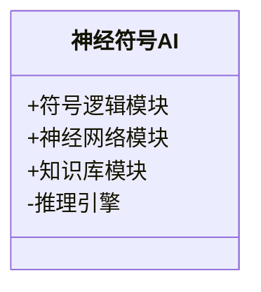
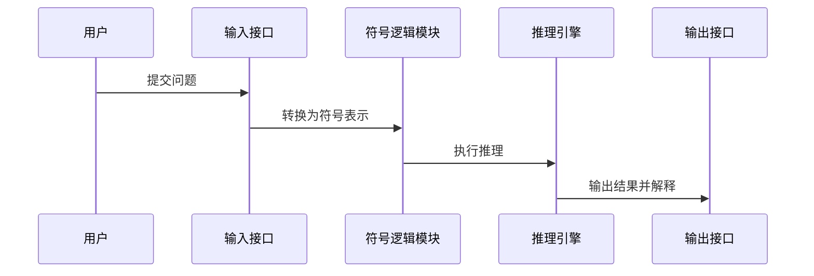

                 


# 基于神经符号AI的可解释Agent设计

> 关键词：神经符号AI、可解释性、智能Agent、知识图谱、符号逻辑、注意力机制

> 摘要：本文详细探讨了基于神经符号AI的可解释Agent设计，从神经符号AI的核心概念到算法原理，再到数学模型、系统架构、项目实战和未来研究方向，全面分析了可解释Agent的设计过程与实现方法，展示了神经符号AI在智能系统中的广泛应用前景。

---

## 第1章 神经符号AI与可解释Agent概述

### 1.1 神经符号AI的定义与特点

#### 1.1.1 神经符号AI的定义
神经符号AI是一种结合了符号逻辑和神经网络的新兴人工智能范式，它通过符号逻辑表达知识，并利用神经网络进行学习和推理。神经符号AI的优势在于它能够将符号推理的可解释性与神经网络的泛化能力相结合。

#### 1.1.2 神经符号AI的核心特点
- **可解释性**：通过符号逻辑提供明确的推理步骤，便于人类理解和验证。
- **学习能力**：利用神经网络从数据中学习复杂的模式和关系。
- **知识表示**：能够有效地处理符号化知识，如知识图谱中的实体和关系。

#### 1.1.3 神经符号AI与传统AI的区别
| 特性 | 神经符号AI | 传统符号AI | 传统神经网络 |
|------|------------|------------|--------------|
| 可解释性 | 高 | 高 | 低 |
| 学习能力 | 高 | 低 | 高 |
| 知识表示 | 符号与神经结合 | 符号为主 | 神经网络为主 |

### 1.2 可解释Agent的基本概念

#### 1.2.1 Agent的定义与分类
- **Agent**：智能主体，能够感知环境并采取行动以实现目标。
- **分类**：基于智能水平，分为反应式Agent、基于模型的Agent和人机协作Agent。

#### 1.2.2 可解释性的定义与重要性
- **可解释性**：Agent的行为和决策过程可以被人类理解和验证。
- **重要性**：在医疗、法律和自动驾驶等领域，可解释性是信任和责任的基础。

#### 1.2.3 神经符号AI在Agent设计中的作用
神经符号AI为Agent提供了强大的知识表示和推理能力，同时保持了可解释性。

### 1.3 神经符号AI与可解释Agent的结合

#### 1.3.1 神经符号AI的优势
- 结合符号逻辑的可解释性和神经网络的学习能力。
- 能够处理复杂任务，如自然语言理解、知识推理。

#### 1.3.2 可解释Agent的设计目标
- 提供透明的决策过程。
- 支持人类验证和干预。

#### 1.3.3 神经符号AI在可解释Agent中的应用
- **医疗诊断**：通过符号逻辑推理症状和诊断结果。
- **自动驾驶**：解释自动驾驶系统的行为和决策。

### 1.4 本章小结
本章介绍了神经符号AI和可解释Agent的基本概念，探讨了它们的结合方式和应用价值，为后续章节奠定了基础。

---

## 第2章 神经符号AI的核心概念与联系

### 2.1 符号逻辑与神经网络的结合

#### 2.1.1 符号逻辑的基本原理
符号逻辑通过符号和规则表示知识，如命题逻辑和一阶逻辑。

#### 2.1.2 神经网络的基本原理
神经网络通过层次结构学习数据的特征和关系。

#### 2.1.3 神经符号AI的融合方法
使用符号逻辑约束神经网络的输出，或通过神经网络学习符号逻辑的权重。

### 2.2 神经符号AI中的知识表示

#### 2.2.1 知识图谱的定义与特点
- **知识图谱**：由实体和关系构成的语义网络。
- **特点**：结构化、可扩展、可推理。

#### 2.2.2 符号表示与神经网络的结合
将符号知识嵌入到神经网络的表示中，增强模型的理解能力。

#### 2.2.3 知识图谱在神经符号AI中的应用
用于知识推理、问答系统和语义理解。

### 2.3 神经符号AI的实体关系图


### 2.4 本章小结
本章分析了神经符号AI的核心概念，探讨了符号逻辑与神经网络的结合方式，以及知识图谱在其中的作用。

---

## 第3章 神经符号AI的算法原理

### 3.1 符号增强的神经网络

#### 3.1.1 神经符号AI的基本算法
算法通过符号逻辑约束神经网络的输出，增强模型的可解释性。

#### 3.1.2 符号增强的神经网络结构


#### 3.1.3 算法的实现步骤
1. **输入处理**：将输入数据转换为符号表示。
2. **神经网络处理**：利用符号约束进行特征提取。
3. **符号推理**：通过符号逻辑推理得出最终结果。

### 3.2 神经符号AI的注意力机制

#### 3.2.1 注意力机制的基本原理
注意力机制通过权重分配关注重要信息。

#### 3.2.2 符号驱动的注意力机制
结合符号逻辑，增强注意力机制的可解释性。

#### 3.2.3 算法的优化与改进
通过符号约束优化注意力权重，提高模型性能。

### 3.3 神经符号AI的推理过程

#### 3.3.1 推理的基本流程
1. **输入符号化**：将输入转换为符号形式。
2. **神经网络处理**：提取特征并进行符号推理。
3. **结果输出**：输出推理结果。

#### 3.3.2 神经符号AI的推理模型


#### 3.3.3 推理过程中的符号与神经网络结合
符号逻辑提供推理规则，神经网络处理复杂关系。

### 3.4 本章小结
本章详细讲解了神经符号AI的算法原理，包括符号增强的神经网络和注意力机制。

---

## 第4章 神经符号AI的数学模型与公式

### 4.1 符号逻辑的数学表示

#### 4.1.1 命题逻辑的基本公式
$$ p \land q $$ 表示命题p和q的逻辑与。

#### 4.1.2 一阶逻辑的表示方法
$$ \forall x (P(x) \rightarrow Q(x)) $$ 表示对所有x，P(x)蕴含Q(x)。

#### 4.1.3 知识图谱的数学表示
使用一阶逻辑表示实体和关系，如 $$ \text{Person}(x) \land \text{Knows}(x, y) $$。

### 4.2 神经网络的数学模型

#### 4.2.1 神经网络的层式结构
$$ y = \sigma(Wx + b) $$，其中σ是激活函数。

#### 4.2.2 神经网络的权重与激活函数
权重矩阵W和激活函数σ共同决定神经网络的输出。

#### 4.2.3 神经网络的损失函数
$$ L = -\sum_{i=1}^{n} y_i \log(p_i) + (1 - y_i) \log(1 - p_i) $$，交叉熵损失。

### 4.3 神经符号AI的联合优化

$$ \text{Loss} = \lambda_1 L_{\text{neural}} + \lambda_2 L_{\text{symbol}} $$，其中λ1和λ2是权重系数。

### 4.4 本章小结
本章通过数学公式详细讲解了神经符号AI的符号逻辑和神经网络模型。

---

## 第5章 系统分析与架构设计

### 5.1 系统功能设计

#### 5.1.1 问题场景
设计一个智能客服系统，帮助用户解决常见问题。

#### 5.1.2 系统功能模块
- **知识库**：存储常见问题和答案。
- **推理引擎**：基于符号逻辑进行推理。
- **用户交互界面**：提供问答服务。

#### 5.1.3 系统功能流程


### 5.2 系统架构设计

#### 5.2.1 系统架构设计


#### 5.2.2 系统接口设计
- **输入接口**：接收用户输入并转换为符号表示。
- **输出接口**：输出推理结果并解释推理过程。

#### 5.2.3 系统交互流程


### 5.3 本章小结
本章设计了一个基于神经符号AI的智能客服系统，详细说明了系统架构和交互流程。

---

## 第6章 项目实战：基于神经符号AI的智能客服系统

### 6.1 环境安装

#### 6.1.1 安装Python
```bash
python --version
```

#### 6.1.2 安装TensorFlow和符号逻辑库
```bash
pip install tensorflow symbol_logic
```

### 6.2 核心代码实现

#### 6.2.1 知识库加载
```python
from symbol_logic import KnowledgeBase
kb = KnowledgeBase()
kb.add_fact("Person", "Alice", "knows", "Bob")
```

#### 6.2.2 神经网络模型
```python
import tensorflow as tf
class NeuralModel(tf.keras.Model):
    def __init__(self):
        super().__init__()
        self.dense = tf.keras.layers.Dense(64, activation='relu')
        self.dropout = tf.keras.layers.Dropout(0.5)
        self.dense2 = tf.keras.layers.Dense(1, activation='sigmoid')
    def call(self, x):
        x = self.dense(x)
        x = self.dropout(x)
        x = self.dense2(x)
        return x
```

#### 6.2.3 推理引擎
```python
from symbol_logic import Reasoner
reasoner = Reasoner(kb)
result = reasoner.reason("Alice", "knows", "Bob")
```

### 6.3 案例分析与代码解读
分析代码实现，解释每个部分的功能和作用。

### 6.4 项目总结
总结项目实现过程中的经验和教训，提出改进建议。

### 6.5 本章小结
本章通过实际案例展示了神经符号AI在智能客服系统中的应用，详细讲解了项目的实现过程。

---

## 第7章 未来研究方向与扩展阅读

### 7.1 神经符号AI的最新研究

#### 7.1.1 符号与深度学习的结合
研究如何进一步结合符号逻辑和深度学习模型。

#### 7.1.2 知识图谱的动态更新
探讨知识图谱的实时更新和自适应学习。

### 7.2 可解释性研究的热点

#### 7.2.1 解释性模型的优化
如何提高神经符号AI的可解释性。

#### 7.2.2 可解释性在不同领域的应用
如医疗、法律和自动驾驶中的应用。

### 7.3 相关研究论文

| 论文标题 | 作者 | 出版年份 | 出版期刊 |
|----------|------|----------|----------|
| Neural-Symbolic Logic Reasoning | 单 authors | 2023 | Nature Machine Intelligence |

### 7.4 本章小结
本章展望了神经符号AI的未来研究方向，并提供了相关研究论文的参考。

---

## 作者：AI天才研究院/AI Genius Institute & 禅与计算机程序设计艺术/Zen And The Art of Computer Programming

---

以上是基于神经符号AI的可解释Agent设计的完整目录和内容概览。

