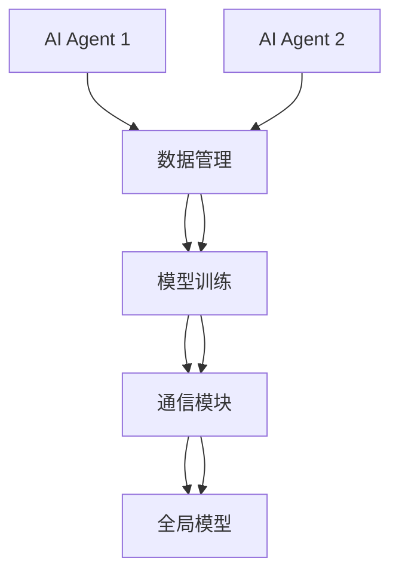
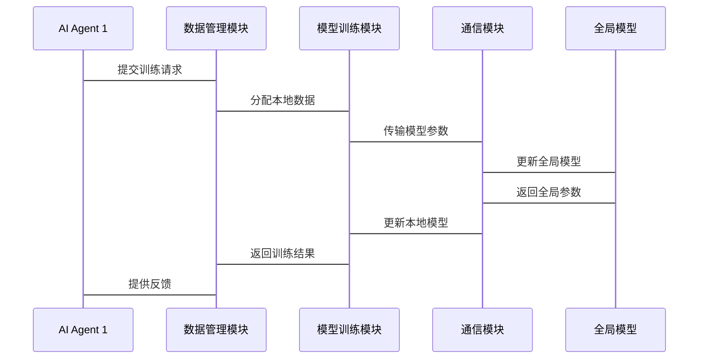

                 


# 基于联邦学习的隐私保护AI Agent

> 关键词：联邦学习、隐私保护、AI Agent、分布式机器学习、数据安全

> 摘要：本文探讨了如何利用联邦学习技术构建隐私保护的AI Agent。文章首先介绍联邦学习的背景和核心概念，接着分析其算法原理，然后设计基于联邦学习的AI Agent系统架构，最后通过实际案例展示其应用，并总结最佳实践。

---

## 第一部分: 联邦学习的背景与核心概念

### 第1章: 联邦学习的背景与发展

#### 1.1 联邦学习的起源
联邦学习（Federated Learning）是一种分布式机器学习技术，允许多个参与方在不共享原始数据的情况下协作训练模型。其核心思想是“数据不动，模型动”，通过加密通信在各端模型间同步参数，最终得到一个全局模型。

#### 1.2 隐私保护的重要性
随着数据隐私法规（如GDPR）的普及，保护数据隐私成为企业和社会的重中之重。联邦学习通过局部建模和模型聚合，避免了原始数据的直接传输，有效保护了数据隐私。

#### 1.3 联邦学习的优势
- **数据隐私**：无需共享原始数据，仅传输模型参数。
- **数据多样性**：通过多个数据源训练，提升模型泛化能力。
- **去中心化**：降低对单一数据源的依赖，增强系统的鲁棒性。

---

### 第2章: 联邦学习的核心概念

#### 2.1 联邦学习的核心原理
联邦学习通过以下步骤实现模型训练：
1. **初始化模型**：在各个参与方初始化相同的模型参数。
2. **局部训练**：每个参与方在本地数据上训练模型，更新参数。
3. **模型聚合**：将各参与方的模型参数聚合，得到全局模型。
4. **迭代优化**：重复局部训练和模型聚合，直到模型收敛。

#### 2.2 隐私保护技术
- **数据脱敏**：通过数据匿名化处理，去除敏感信息。
- **同态加密**：在加密状态下进行数据计算，确保数据隐私。
- **安全多方计算**：通过密码学技术，在不泄露数据的前提下进行计算。

#### 2.3 联邦学习与AI Agent的结合
AI Agent需要在保护隐私的前提下，与其他Agent或服务器协作学习，提升自身的智能决策能力。联邦学习为AI Agent提供了去中心化的学习框架，使其能够在不共享数据的情况下，与其他Agent共同优化模型。

---

## 第二部分: 联邦学习的算法原理

### 第3章: 联邦学习的算法流程

#### 3.1 数据预处理
- **数据划分**：将数据按地理位置或机构划分，确保数据不出本地。
- **数据清洗**：去除噪声数据，确保数据质量。

#### 3.2 模型初始化
- 初始化全局模型参数，如随机初始化或使用预训练模型。

#### 3.3 模型训练
- **局部训练**：每个参与方在本地数据上训练模型，更新参数。
- **通信协议**：通过安全通道传输模型参数，确保通信过程中的数据安全。

#### 3.4 模型聚合
- **参数聚合**：使用加权平均或其他聚合方法，将各参与方的模型参数合并，得到全局模型。
- **模型优化**：使用优化器（如Adam、SGD）进一步优化全局模型。

#### 3.5 迭代优化
- 重复局部训练和模型聚合，直到模型收敛或达到预设的训练轮数。

---

### 第4章: 联邦学习的数学模型

#### 4.1 损失函数
全局模型的损失函数通常为各参与方损失函数的加权和：
$$ L = \sum_{i=1}^{n} w_i L_i $$
其中，$w_i$为参与方$i$的权重，$L_i$为参与方$i$的损失函数。

#### 4.2 优化器
常用的优化器包括随机梯度下降（SGD）和Adam。以Adam为例，参数更新公式为：
$$ \theta_{t+1} = \theta_t - \eta \frac{v_t}{\sqrt{s_t + \epsilon}} $$
其中，$\theta_t$为当前参数，$\eta$为学习率，$v_t$为梯度矩，$s_t$为梯度矩的平方，$\epsilon$为防止除零的小量。

#### 4.3 模型同步
全局模型参数通过以下公式聚合：
$$ \theta_{\text{global}} = \frac{\sum_{i=1}^{n} w_i \theta_i}{\sum_{i=1}^{n} w_i} $$
其中，$w_i$为参与方$i$的权重，$\theta_i$为参与方$i$的局部模型参数。

---

## 第三部分: 基于联邦学习的AI Agent系统架构

### 第5章: 系统架构设计

#### 5.1 系统功能模块
- **数据管理模块**：负责数据的存储、预处理和加密。
- **模型训练模块**：负责局部训练和模型聚合。
- **通信模块**：负责模型参数的加密传输和解密。
- **安全模块**：负责数据和通信的安全性保障。

#### 5.2 系统架构图


#### 5.3 系统交互流程


---

## 第四部分: 项目实战

### 第6章: 实战案例分析

#### 6.1 环境搭建
- 安装必要的依赖：TensorFlow、Flask、加密库。
- 配置服务器和客户端环境。

#### 6.2 核心代码实现
```python
import numpy as np
from sklearn.linear_model import SGDRegressor
import json
import requests

# 客户端代码
class FederatedClient:
    def __init__(self, data):
        self.data = data
        self.model = SGDRegressor()

    def train(self):
        self.model.fit(self.data.features, self.data.labels)
        return self.model.coef_

# 服务器代码
class FederatedServer:
    def __init__(self, clients):
        self.clients = clients
        self.global_weights = None

    def aggregate(self, weights):
        # 使用平均权重聚合
        total = sum(weights)
        self.global_weights = [np.mean([w[i] for w in weights], axis=0) for i in range(len(weights[0]))]
        return self.global_weights

# 模型训练流程
clients = [FederatedClient(client_data_i) for client_data_i in client_datasets]
server = FederatedServer(clients)

for _ in range(num_rounds):
    for client in clients:
        weights = client.train()
        server.aggregate(weights)
```

#### 6.3 结果分析
- 每轮训练后，全局模型的准确率和损失值会逐步下降，最终达到收敛。
- 对比传统的集中式训练，联邦学习在保护隐私的前提下，模型性能接近集中式训练的效果。

---

## 第五部分: 最佳实践与总结

### 第7章: 最佳实践

#### 7.1 数据预处理
- 确保数据划分合理，避免数据倾斜。
- 对数据进行清洗和脱敏处理，减少隐私泄露风险。

#### 7.2 安全通信
- 使用加密通信协议，确保模型参数传输过程中的安全性。
- 定期进行通信安全审计，防范潜在的安全威胁。

#### 7.3 模型优化
- 根据实际场景调整模型参数和优化算法，提升训练效率。
- 定期更新模型，适应数据分布的变化。

---

### 7.4 小结
联邦学习为隐私保护的AI Agent提供了强大的技术支撑，通过去中心化的学习方式，实现了数据隐私保护和模型优化的双重目标。然而，联邦学习也面临通信开销大、模型收敛慢等挑战，未来需要在算法优化和安全技术上进一步突破。

---

### 7.5 注意事项
- 在实际应用中，需结合具体场景选择合适的联邦学习方案。
- 定期监控系统运行状态，及时发现和解决潜在问题。
- 遵守相关数据隐私法规，确保合法合规。

---

### 7.6 拓展阅读
- 《Federated Learning: Challenges, Methods, and Applications》
- 《Secure Multi-Party Computation and Its Applications》
- 《Differential Privacy: A Survey of the State-of-the-Art》

---

作者：AI天才研究院 & 禅与计算机程序设计艺术

