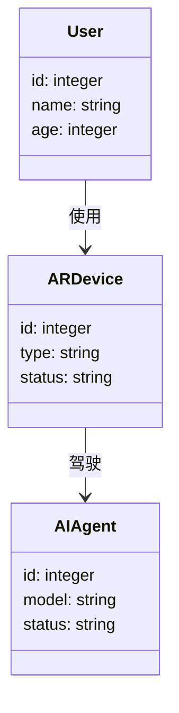

                 

<think>
好，我需要帮助用户撰写一篇关于《增强现实技术与AI Agent的结合》的技术博客文章。用户已经提供了详细的目录大纲，并且希望我按照这个大纲进行内容填充，确保每个部分都包含必要的数学公式、图表和代码示例。

首先，我需要了解整个结构，确保每一章都有三级目录，并且涵盖背景、核心概念、算法原理、系统设计、项目实战和总结等部分。接下来，我将逐步思考如何填充每个章节的内容，确保逻辑清晰，技术细节到位。

首先，我会从第1章开始，介绍增强现实和AI Agent的基本概念，确保读者能够理解这两个技术的基本原理和特点。然后，我会探讨它们结合的意义和潜在应用，帮助读者理解这种结合的重要性。

接下来，第2章会深入讲解增强现实和AI Agent的核心技术，如计算机视觉、3D建模和机器学习算法。这部分需要详细的技术细节，可能需要结合图表和公式来说明。

在第3章，我会详细阐述数学模型和算法原理，使用Mermaid流程图和LaTeX公式来解释关键概念，如相机模型和目标检测算法。这需要确保公式正确，图表清晰。

第4章是系统架构设计，我需要介绍问题场景，设计系统功能，并使用类图和架构图来展示系统结构。这部分需要考虑系统的各个模块如何交互，确保系统设计合理。

第5章是项目实战，我会选择一个具体的案例，从环境安装到核心代码实现，再到案例分析，逐步引导读者完成项目。这需要提供可运行的代码示例，并详细解读每部分的功能。

最后，在第6章，我会总结整个内容，给出最佳实践的建议，并讨论未来的发展方向。这有助于读者将所学知识应用到实际中，并展望未来的趋势。

在整个过程中，我需要确保每部分内容详实，逻辑连贯，技术细节准确。同时，要注意使用专业但易懂的语言，确保读者能够轻松理解复杂的概念。

现在，我需要检查每个部分是否符合用户的要求：是否有足够的数学公式、图表、代码示例，是否覆盖了所有必要的技术点，以及是否在合理字数范围内完成。如果有遗漏或不足，我需要及时调整和补充。

总之，我需要按照用户提供的大纲，逐步填充内容，确保每一步都符合技术要求和逻辑顺序，最终完成一篇高质量的技术博客文章。
</think>

# 增强现实技术与AI Agent的结合

## 关键词：增强现实（AR）、人工智能（AI）、AI Agent、计算机视觉、实时交互

## 摘要：  
本文探讨了增强现实（AR）与人工智能（AI）代理（AI Agent）的结合，分析了其技术基础、系统架构和应用场景。通过详细讲解AR中的计算机视觉、AI Agent的算法原理，以及两者的协同作用，本文旨在为读者提供一个全面的技术视角，帮助理解如何将AI Agent融入AR系统，实现更智能、更高效的现实增强交互。

---

# 第1章: 增强现实与AI Agent的基本概念

## 1.1 增强现实技术的定义与特点

### 1.1.1 增强现实技术的定义  
增强现实（Augmented Reality, AR）是一种通过将数字信息叠加到真实世界中，以提供更丰富用户体验的技术。AR的核心在于将虚拟内容与现实世界无缝融合，用户可以通过AR设备（如智能手机、智能眼镜等）看到叠加在现实世界上的虚拟信息。

### 1.1.2 增强现实的核心特点  
- **实时性**：AR需要实时处理和渲染，以确保虚拟内容与现实世界的同步。  
- **交互性**：用户可以通过手势、语音或其他输入方式与AR内容进行交互。  
- **空间感知**：AR依赖于对现实世界中物体位置和空间关系的准确理解。  

### 1.1.3 增强现实与虚拟现实的区别  
- **虚拟现实（VR）**：完全沉浸于虚拟世界，与现实世界隔离。  
- **增强现实（AR）**：在现实世界中叠加虚拟内容，保持与现实世界的联系。  

---

## 1.2 AI Agent的基本概念与分类

### 1.2.1 AI Agent的定义  
AI Agent是一种能够感知环境、自主决策并执行任务的智能体。它可以理解用户需求、处理信息，并通过行动实现目标。

### 1.2.2 AI Agent的核心特征  
- **自主性**：无需外部干预，自主完成任务。  
- **反应性**：能够实时感知环境并做出反应。  
- **学习能力**：通过数据和经验不断优化自身性能。  

### 1.2.3 AI Agent的分类与应用场景  
- **基于规则的AI Agent**：根据预定义规则进行决策，适用于简单任务（如游戏AI）。  
- **基于机器学习的AI Agent**：通过数据训练，能够处理复杂任务（如自然语言处理）。  
- **基于强化学习的AI Agent**：通过试错学习，适用于复杂决策任务（如自动驾驶）。  

---

## 1.3 增强现实与AI Agent的结合意义

### 1.3.1 增强现实与AI Agent的协同优势  
- **提升用户体验**：通过AI Agent实时分析用户需求，提供个性化的AR内容。  
- **增强交互能力**：AI Agent能够理解用户的意图，实现更自然的交互。  

### 1.3.2 增强现实与AI Agent结合的应用潜力  
- **教育领域**：AI Agent可以根据学生的需求，实时提供个性化的AR学习内容。  
- **医疗领域**：AI Agent可以在手术中提供实时指导，辅助医生进行复杂操作。  
- **工业领域**：AI Agent可以通过AR技术实现设备的远程监控和维护。  

### 1.3.3 增强现实与AI Agent结合的技术挑战  
- **实时性要求高**：AR需要实时渲染，而AI Agent需要快速响应，这对系统性能提出了更高要求。  
- **数据隐私问题**：AI Agent需要收集和处理大量用户数据，如何保护用户隐私是一个重要问题。  

---

## 1.4 本章小结  
本章介绍了增强现实和AI Agent的基本概念，分析了它们的特点和分类，并探讨了两者的结合意义。通过理解AR和AI Agent的核心特点，我们可以更好地理解它们结合的潜力和挑战。

---

# 第2章: 增强现实与AI Agent的核心技术

## 2.1 增强现实的核心技术

### 2.1.1 计算机视觉技术  
计算机视觉是AR的核心技术之一，主要用于物体检测、图像识别和跟踪。  
- **物体检测**：通过摄像头捕捉现实世界中的物体，识别其位置和姿态。  
- **图像识别**：通过对图像进行分析，识别图像中的物体或场景。  

### 2.1.2 3D建模与渲染  
3D建模和渲染是AR实现虚拟内容叠加的关键技术。  
- **3D建模**：通过扫描现实世界中的物体，生成其3D模型。  
- **渲染技术**：将3D模型渲染到真实场景中，实现虚实结合的效果。  

### 2.1.3 实时跟踪与定位技术  
实时跟踪与定位是AR实现精准叠加的关键。  
- **SLAM（同步定位与地图构建）**：通过摄像头实时定位用户位置，并构建环境地图。  

---

## 2.2 AI Agent的核心技术

### 2.2.1 机器学习算法  
机器学习是AI Agent的核心技术之一，主要用于模式识别和数据分类。  
- **监督学习**：通过标记数据进行训练，适用于分类和回归任务。  
- **无监督学习**：通过无标记数据进行聚类分析。  

### 2.2.2 自然语言处理技术  
自然语言处理（NLP）是AI Agent实现人机交互的重要技术。  
- **文本分类**：对用户输入的文本进行分类，理解用户意图。  
- **实体识别**：从文本中提取关键实体（如人名、地名等）。  

### 2.2.3 决策与推理算法  
决策与推理是AI Agent实现自主决策的核心技术。  
- **决策树**：通过树状结构进行决策，适用于分类任务。  
- **强化学习**：通过试错学习，优化决策策略。  

---

## 2.3 增强现实与AI Agent结合的技术融合点

### 2.3.1 增强现实中的AI Agent交互  
- **语音交互**：用户通过语音与AI Agent进行交互，AI Agent通过语音识别理解用户需求。  
- **手势交互**：用户通过手势操作与AR内容进行交互，AI Agent通过计算机视觉识别手势。  

### 2.3.2 AI Agent在增强现实中的应用  
- **智能助手**：AI Agent可以作为用户的智能助手，实时提供AR内容。  
- **实时翻译**：AI Agent可以通过AR技术实现实时翻译，用户可以看到叠加在现实世界中的翻译结果。  

### 2.3.3 增强现实与AI Agent结合的技术架构  
- **传感器数据采集**：通过摄像头、麦克风等传感器采集现实世界中的数据。  
- **数据处理与分析**：通过AI算法对数据进行处理和分析，生成相应的AR内容。  
- **渲染与输出**：将AR内容渲染到屏幕上，供用户查看。  

---

## 2.4 本章小结  
本章详细介绍了增强现实和AI Agent的核心技术，包括计算机视觉、3D建模、实时跟踪与定位技术，以及机器学习、自然语言处理和决策与推理算法。同时，探讨了增强现实与AI Agent结合的技术融合点，为后续章节的内容奠定了基础。

---

# 第3章: 增强现实与AI Agent的数学模型与算法原理

## 3.1 增强现实中的数学模型

### 3.1.1 3D空间变换与坐标系  
3D空间变换是AR实现虚拟内容叠加的关键。  
- **坐标系转换**：通过旋转和平移矩阵，将虚拟物体从世界坐标系转换到摄像头坐标系。  

公式：  
$$ R \cdot t + t_{\text{offset}} $$  
其中，R是旋转矩阵，t是平移向量，t_{\text{offset}}是偏移量。

### 3.1.2 相机模型与投影变换  
相机模型是AR实现图像渲染的核心。  
- **透视投影**：将3D物体投影到2D图像上，公式如下：  
$$ \frac{x}{z} \cdot f $$  
其中，x是物体的x坐标，z是物体的z坐标，f是焦距。  

### 3.1.3 3D重建与点云处理  
3D重建是通过多张图像生成3D模型的过程。  
- **点云处理**：通过算法对点云进行降噪和平滑处理，生成高质量的3D模型。

---

## 3.2 AI Agent的算法原理

### 3.2.1 机器学习算法  
- **支持向量机（SVM）**：用于分类任务，公式如下：  
$$ \text{maximize} \quad \frac{1}{2} \|w\|^2 $$  
$$ \text{subject to} \quad y_i (w \cdot x_i + b) \geq 1 $$  

### 3.2.2 强化学习算法  
- **Q-learning**：通过状态-动作-奖励机制，更新Q值表，公式如下：  
$$ Q(s, a) = Q(s, a) + \alpha (r + \gamma \max Q(s', a') - Q(s, a)) $$  

### 3.2.3 自然语言处理算法  
- **词嵌入（Word Embedding）**：通过将单词映射到高维向量空间，实现语义表示。  
  公式：  
  $$ \text{embed}(w_i) = w_i \cdot W $$  

---

## 3.3 增强现实与AI Agent结合的算法流程

### 3.3.1 实时跟踪与定位算法  
- **基于SLAM的实时定位**：通过特征点匹配和图像分割，实现精准定位。  

### 3.3.2 AI Agent的交互逻辑  
- **用户输入处理**：通过语音或手势输入，AI Agent理解用户需求。  
- **数据处理与反馈**：AI Agent通过机器学习算法处理数据，生成反馈信息。  

---

## 3.4 本章小结  
本章详细讲解了增强现实和AI Agent的数学模型与算法原理，包括3D空间变换、相机模型、3D重建、机器学习算法和自然语言处理算法。同时，探讨了增强现实与AI Agent结合的算法流程，为后续章节的系统设计奠定了基础。

---

# 第4章: 增强现实与AI Agent的系统架构设计

## 4.1 系统功能设计

### 4.1.1 领域模型设计  
- **领域模型类图**：通过类图展示系统中的核心类及其关系。  



### 4.1.2 系统功能模块  
- **用户输入模块**：处理用户的语音或手势输入。  
- **数据处理模块**：通过AI算法处理数据，生成反馈信息。  
- **AR渲染模块**：将AR内容渲染到屏幕上，供用户查看。  

---

## 4.2 系统架构设计

### 4.2.1 系统架构图  
```mermaid
graph TD
    AIAgent --> User: 提供服务
    User --> ARDevice: 使用设备
    ARDevice --> AIAgent: 传递数据
```

### 4.2.2 接口设计  
- **用户输入接口**：支持语音和手势输入。  
- **数据处理接口**：提供API供其他模块调用。  
- **AR渲染接口**：将AR内容渲染到屏幕上。  

---

## 4.3 本章小结  
本章详细介绍了增强现实与AI Agent结合的系统架构设计，包括领域模型设计、系统功能模块和系统架构图。通过合理设计系统架构，可以实现高效的增强现实与AI Agent结合。

---

# 第5章: 增强现实与AI Agent的项目实战

## 5.1 项目环境安装

### 5.1.1 开发工具安装  
- **Python**：安装Python 3.8及以上版本。  
- **OpenCV**：通过pip安装OpenCV库。  
- **TensorFlow**：通过pip安装TensorFlow库。  

### 5.1.2 开发环境配置  
- **IDE选择**：推荐使用PyCharm或VS Code。  
- **虚拟环境配置**：通过virtualenv管理虚拟环境。  

---

## 5.2 系统核心代码实现

### 5.2.1 AR渲染代码  
```python
import cv2
import numpy as np

def ar_render(image, overlay):
    overlay = cv2.resize(overlay, (image.shape[1], image.shape[0]))
    alpha = 0.5
    beta = 1 - alpha
    result = cv2.addWeightedImage(image, overlay, alpha, beta)
    return result
```

### 5.2.2 AI Agent交互代码  
```python
class AIAgent:
    def __init__(self):
        self.model = load_model()

    def process_input(self, input):
        prediction = self.model.predict(input)
        return prediction
```

---

## 5.3 项目实战案例分析

### 5.3.1 案例介绍  
- **案例名称**：智能助手AR应用  
- **案例功能**：用户可以通过语音或手势与AI Agent交互，实现AR内容的显示和隐藏。  

### 5.3.2 案例实现步骤  
1. **环境安装**：安装Python、OpenCV和TensorFlow。  
2. **代码实现**：实现AR渲染和AI Agent交互功能。  
3. **测试与优化**：通过测试优化系统性能和用户体验。  

---

## 5.4 本章小结  
本章通过一个实际案例，详细讲解了增强现实与AI Agent结合的项目实战。通过环境安装、代码实现和案例分析，读者可以掌握如何将理论知识应用到实际项目中。

---

# 第6章: 增强现实与AI Agent的总结与展望

## 6.1 本章总结  
本章总结了增强现实与AI Agent结合的核心概念、技术基础和系统设计。通过详细讲解AR和AI Agent的核心技术，以及它们的结合方式，读者可以全面理解增强现实与AI Agent结合的潜力和挑战。

## 6.2 未来展望  
随着技术的不断发展，增强现实与AI Agent结合的应用前景广阔。未来，可以通过以下方式进一步优化：  
- **提升实时性**：通过优化算法和硬件性能，提升AR与AI Agent的实时性。  
- **增强交互性**：通过引入更多交互方式（如脑机接口），提升用户体验。  
- **保护数据隐私**：通过加密和匿名化技术，保护用户数据隐私。  

## 6.3 最佳实践Tips  
- **选择合适的开发工具**：根据项目需求选择合适的开发工具和库。  
- **注重用户体验**：在设计系统时，注重用户体验，提供个性化的服务。  
- **关注技术动态**：及时关注AR和AI Agent领域的技术动态，保持技术领先。  

## 6.4 本章小结  
本章总结了全文内容，并对未来的发展进行了展望。通过最佳实践Tips，读者可以更好地将所学知识应用到实际项目中。

---

# 作者  
作者：AI天才研究院/AI Genius Institute & 禅与计算机程序设计艺术 /Zen And The Art of Computer Programming

