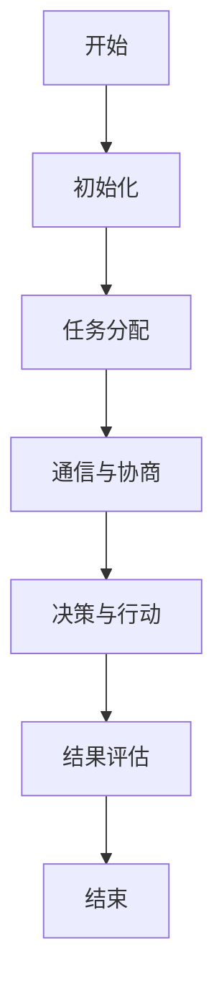
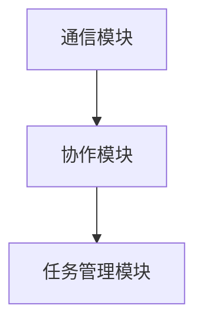
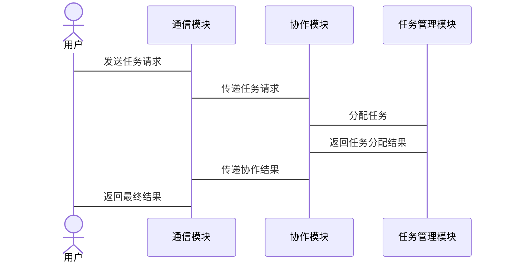

                 

<think>
好的，我现在需要帮用户撰写一篇关于《多Agent协作：构建复杂的智能系统》的技术博客文章。用户已经提供了详细的目录大纲，并希望我按照这个结构来完成文章。首先，我需要仔细阅读用户的查询，理解他的需求和期望。

用户明确要求文章结构要逻辑清晰、专业，使用技术语言，同时要包含详细的分析和例子。他还提到了关键词和摘要，以及各章节的具体内容，包括背景、核心概念、算法、系统分析、项目实战等部分。因此，我需要确保每个部分都涵盖到位，并且按照用户的要求使用Mermaid图表和数学公式。

接下来，我需要确定文章的结构。用户已经提供了目录，我需要按照顺序逐步完成每一部分。首先，我会从摘要开始，简明扼要地总结文章的核心内容。然后，按照各个章节的顺序，逐一撰写，确保每个小节都详细且符合逻辑。

在撰写过程中，我要注意使用专业术语，同时保持语言的清晰易懂。对于算法部分，我会用Mermaid流程图来展示步骤，并附上Python代码示例，帮助读者更好地理解。数学公式需要用Latex表示，确保格式正确。系统架构部分，我会使用类图和架构图来展示结构，使读者能够直观理解。

在项目实战部分，我需要选择一个具体的案例，比如智能交通系统，详细讲解环境配置、代码实现和实际应用，让读者能够动手实践。最后，我会总结最佳实践、注意事项和拓展阅读，帮助读者巩固知识。

我还需要确保文章整体流畅，各部分之间有良好的衔接，避免重复或遗漏重要信息。此外，文章末尾需要添加作者信息，符合用户的要求。

在写作过程中，我可能会遇到一些挑战，比如如何将复杂的概念解释得通俗易懂，或者如何选择合适的例子来说明问题。这时，我会查阅相关资料，确保信息的准确性和实用性。同时，我会反复检查，确保格式和语法正确，避免错误影响阅读体验。

总的来说，我需要按照用户提供的大纲，逐步完成每个部分，确保内容详实、结构清晰、语言专业，同时加入丰富的实例和图表，帮助读者全面理解多Agent协作在智能系统中的应用。
</think>

# 多Agent协作：构建复杂的智能系统

> 关键词：多Agent协作、智能系统、分布式系统、协作算法、系统架构、数学模型

> 摘要：多Agent协作是构建复杂智能系统的核心技术之一。本文从多Agent协作的基本概念出发，详细探讨了其在复杂智能系统中的应用，重点分析了多Agent协作的算法原理、系统架构设计以及实际案例。通过本文的讲解，读者可以全面理解多Agent协作的理论基础和实际应用，掌握构建复杂智能系统的关键方法。

---

## 第1章: 多Agent协作概述

### 1.1 多Agent协作的基本概念

#### 1.1.1 多Agent系统的定义与特点
多Agent系统是由多个智能体（Agent）组成的分布式系统，这些智能体能够通过协作完成复杂的任务。多Agent系统的特点包括：
- **分布式**：多个Agent独立运行，协作完成任务。
- **自主性**：每个Agent具有自主决策的能力。
- **协作性**：Agent之间通过通信和协商完成协作。
- **动态性**：系统环境和任务需求可能动态变化。

#### 1.1.2 多Agent协作的背景与重要性
随着智能系统复杂性的增加，单个智能体难以完成所有任务。多Agent协作通过多个智能体的分工合作，能够更高效地解决复杂问题。例如，在自动驾驶系统中，多个Agent可以分别负责路径规划、障碍物检测和决策-making。

#### 1.1.3 多Agent协作的核心要素
多Agent协作的核心要素包括：
- **通信机制**：Agent之间通过通信信道进行信息交换。
- **协作协议**：规范Agent之间的协作流程和规则。
- **任务分配**：根据系统需求动态分配任务。

### 1.2 多Agent协作的问题背景

#### 1.2.1 复杂系统的挑战
复杂系统通常具有高度的动态性和不确定性，单个智能体难以应对所有挑战。例如，在智能交通系统中，多个车辆需要协调行驶，避免碰撞。

#### 1.2.2 多Agent协作在智能系统中的应用场景
多Agent协作广泛应用于智能交通、分布式计算、机器人协作等领域。例如，在智能交通系统中，多个Agent可以分别负责交通信号控制、车辆调度和路径规划。

#### 1.2.3 多Agent协作的主要问题与挑战
多Agent协作的主要挑战包括：
- **通信延迟**：Agent之间的通信可能存在延迟，影响协作效率。
- **任务分配**：如何动态分配任务，确保系统高效运行。
- **协作冲突**：Agent之间的协作可能产生冲突，需要协调解决。

## 第2章: 多Agent协作的核心概念

### 2.1 多Agent协作的原理

#### 2.1.1 Agent的定义与分类
Agent是具有感知、决策和行动能力的智能体。Agent可以分为：
- **反应式Agent**：基于当前感知做出决策。
- **认知式Agent**：具有推理和规划能力。

#### 2.1.2 多Agent协作的基本原理
多Agent协作通过通信和协商，将任务分解为多个子任务，分别由不同的Agent完成。协作过程包括任务分配、信息共享和结果整合。

#### 2.1.3 多Agent协作的数学模型
多Agent协作的数学模型可以表示为：
$$
f(x) = \sum_{i=1}^{n} f_i(x_i)
$$
其中，$x_i$表示第i个Agent的任务，$f_i(x_i)$表示该任务的目标函数。

### 2.2 多Agent协作的核心要素

#### 2.2.1 通信机制
通信机制是多Agent协作的基础，常用的通信方式包括：
- **同步通信**：Agent之间同步进行通信。
- **异步通信**：Agent之间异步进行通信。

#### 2.2.2 协作协议
协作协议规范了Agent之间的协作流程，常用的协议包括：
- **协商协议**：用于任务分配和资源分配。
- **协调协议**：用于解决协作冲突。

#### 2.2.3 任务分配与协调
任务分配是多Agent协作的关键步骤，常用的方法包括：
- **基于规则的任务分配**：根据预定义规则分配任务。
- **基于优化的任务分配**：通过优化算法动态分配任务。

### 2.3 多Agent协作的ER实体关系图
```mermaid
er
actor: 多Agent协作系统
role: Agent
role: 任务
role: 通信信道
```

## 第3章: 多Agent协作算法概述

### 3.1 分布式协作算法

#### 3.1.1 分布式协作的基本原理
分布式协作算法通过局部决策完成全局任务，常用算法包括：
- **分布式协商算法**：通过局部协商完成任务分配。
- **分布式优化算法**：通过局部优化完成全局目标。

#### 3.1.2 分布式协作的实现步骤
1. **任务分解**：将全局任务分解为多个子任务。
2. **任务分配**：将子任务分配给不同的Agent。
3. **局部协作**：每个Agent完成分配的子任务。
4. **结果整合**：将子任务结果整合为全局结果。

#### 3.1.3 分布式协作的数学模型
分布式协作的数学模型可以表示为：
$$
f(x) = \sum_{i=1}^{n} f_i(x_i)
$$
其中，$x_i$表示第i个Agent的任务，$f_i(x_i)$表示该任务的目标函数。

### 3.2 基于博弈论的协作算法

#### 3.2.1 博弈论的基本概念
博弈论是研究多个决策者在竞争环境中的行为的理论，常用的概念包括：
- **纳什均衡**：所有决策者都采取最优策略，无法通过单方面改变策略而提高自身收益。
- **占优策略**：无论其他决策者如何选择，最优策略始终不变。

#### 3.2.2 博弈论在多Agent协作中的应用
博弈论可以用于多Agent协作中的任务分配和资源分配问题。例如，在资源分配问题中，Agent可以通过博弈论找到纳什均衡，实现资源的公平分配。

#### 3.2.3 基于博弈论的协作算法实现
基于博弈论的协作算法实现步骤如下：
1. **定义博弈规则**：定义博弈的收益矩阵和策略空间。
2. **计算纳什均衡**：通过计算纳什均衡确定任务分配。
3. **实施协作**：根据任务分配结果进行协作。

### 3.3 多Agent协作算法的流程图


## 第4章: 多Agent协作系统的分析

### 4.1 系统问题场景介绍

#### 4.1.1 复杂智能系统的协作需求
复杂智能系统通常具有高度的动态性和不确定性，需要多个智能体协作完成任务。

#### 4.1.2 多Agent协作系统的应用场景
多Agent协作系统广泛应用于智能交通、分布式计算、机器人协作等领域。

#### 4.1.3 系统目标与约束条件
系统目标包括高效完成任务、降低协作成本、提高系统可靠性。约束条件包括通信延迟、任务分配复杂性、协作冲突。

### 4.2 系统功能设计

#### 4.2.1 系统功能需求
系统功能需求包括任务分配、通信协作、结果整合。

#### 4.2.2 系统功能实现
系统功能实现包括通信机制设计、协作协议设计、任务分配算法设计。

### 4.3 系统架构设计

#### 4.3.1 系统架构设计
系统架构设计包括通信模块、协作模块、任务管理模块。

#### 4.3.2 系统架构图


### 4.4 系统接口设计

#### 4.4.1 系统接口需求
系统接口需求包括通信接口、协作接口、任务管理接口。

#### 4.4.2 系统接口实现
系统接口实现包括通信协议设计、协作协议设计、任务管理接口设计。

### 4.5 系统交互流程图



---

## 第5章: 多Agent协作的项目实战

### 5.1 项目介绍

#### 5.1.1 项目背景
本项目旨在设计一个基于多Agent协作的智能交通系统，实现车辆路径规划和交通信号控制。

#### 5.1.2 项目目标
项目目标包括实现车辆路径规划、交通信号控制、车辆调度。

### 5.2 环境配置

#### 5.2.1 环境需求
需要安装Python、多线程编程库、通信库。

#### 5.2.2 环境安装
安装Python和必要的库：
```bash
pip install python-multiprocessing
pip install python-socket
```

### 5.3 系统核心实现

#### 5.3.1 核心代码实现
```python
import multiprocessing
import socket

class Agent:
    def __init__(self, id):
        self.id = id
        self.socket = socket.socket(socket.AF_INET, socket.SOCK_STREAM)
        self.socket.connect(('localhost', 5000))
    
    def send_message(self, message):
        self.socket.send(message.encode())
    
    def receive_message(self):
        return self.socket.recv(1024).decode()
```

#### 5.3.2 代码解读
- **Agent类**：定义了Agent的基本功能，包括通信功能。
- **通信模块**：通过socket实现Agent之间的通信。

### 5.4 项目小结

## 第6章: 多Agent协作的最佳实践与注意事项

### 6.1 最佳实践

#### 6.1.1 通信机制设计
建议使用可靠的通信机制，确保协作过程中的信息准确传递。

#### 6.1.2 任务分配策略
建议使用基于博弈论的任务分配策略，确保任务分配的公平性和高效性。

#### 6.1.3 系统架构设计
建议采用分层架构，将系统划分为通信层、协作层和任务管理层。

### 6.2 注意事项

#### 6.2.1 通信延迟问题
需要注意通信延迟对协作效率的影响，可以通过优化通信协议和增加缓存机制来缓解。

#### 6.2.2 协作冲突问题
需要注意协作冲突问题，可以通过协商机制和优先级机制来解决。

#### 6.2.3 系统扩展性问题
需要注意系统扩展性问题，可以通过模块化设计和分布式架构来提高系统的可扩展性。

### 6.3 拓展阅读

#### 6.3.1 多Agent协作的经典论文
建议阅读Distributed Computing的经典论文，了解多Agent协作的理论基础。

#### 6.3.2 多Agent协作的最新研究
建议关注多Agent协作的最新研究，了解新的算法和应用。

---

## 作者：AI天才研究院/AI Genius Institute & 禅与计算机程序设计艺术 /Zen And The Art of Computer Programming

---

以上是《多Agent协作：构建复杂的智能系统》的技术博客文章的完整内容。

