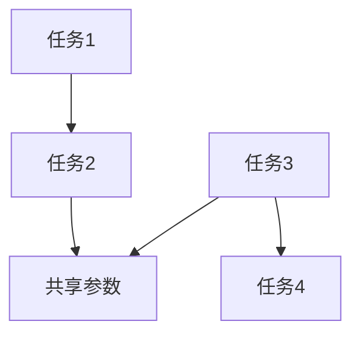
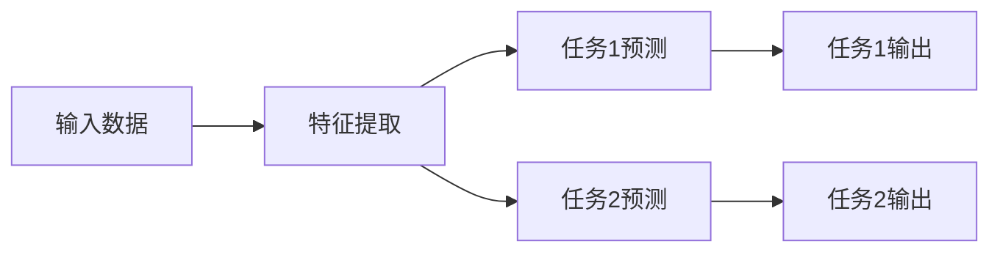
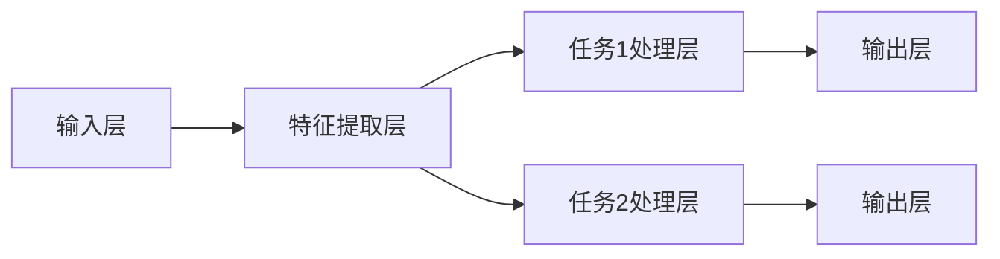
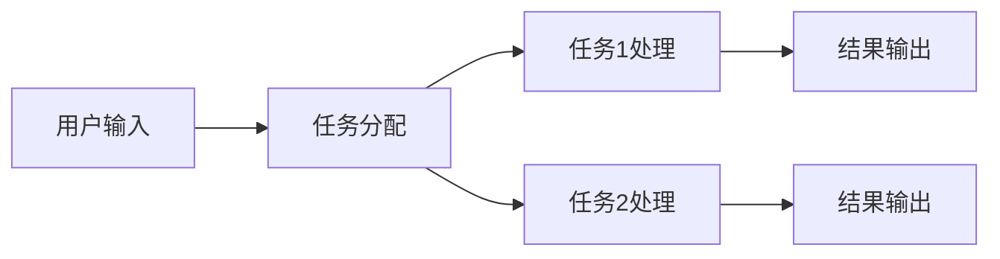

                 


# 多任务学习：构建全能型AI Agent

## 关键词：
多任务学习，AI Agent，机器学习，深度学习，模型优化

## 摘要：
多任务学习（Multi-Task Learning, MTL）是一种先进的机器学习技术，旨在通过同时学习多个相关任务来提升模型的性能和泛化能力。本文将从多任务学习的基本概念、核心原理、系统架构设计、算法实现以及实际应用案例等方面，全面解析如何利用多任务学习构建全能型AI Agent。通过详细的技术分析和代码示例，帮助读者深入理解多任务学习的优势和应用场景，从而在实际项目中有效应用这一技术。

---

# 第一部分: 多任务学习概述

## 第1章: 多任务学习的背景与意义

### 1.1 多任务学习的背景与意义
#### 1.1.1 从单任务学习到多任务学习的演进
在传统的单任务学习中，AI模型通常专注于解决单一任务，例如图像分类或语音识别。然而，随着AI技术的不断发展，单一任务的局限性逐渐显现：模型需要在不同任务之间频繁切换，导致资源浪费和效率低下。多任务学习的出现，正是为了解决这一问题，通过同时学习多个任务，共享模型参数，从而提升模型的效率和性能。

#### 1.1.2 多任务学习的核心价值
多任务学习的核心价值在于：
- **参数共享**：通过共享模型参数，减少训练数据的需求，提升模型的泛化能力。
- **任务协同优化**：多个任务的协同优化可以互补信息，提高整体性能。
- **提升效率**：减少模型训练和推理的时间，降低计算成本。

#### 1.1.3 多任务学习在AI Agent中的应用前景
AI Agent需要同时处理多种任务，例如视觉识别、语音交互和决策推理。多任务学习能够帮助AI Agent在多种任务之间实现无缝切换，提升其综合能力。

### 1.2 多任务学习的定义与特点
#### 1.2.1 多任务学习的定义
多任务学习是一种机器学习范式，旨在通过同时学习多个相关任务，共享模型参数，以提升模型的性能和效率。

#### 1.2.2 多任务学习的核心特点
- **任务相关性**：任务之间存在一定的关联性，可以共享部分参数。
- **权重共享**：通过共享参数，多个任务可以协同优化。
- **联合训练**：多任务学习通常采用端到端的联合训练方法。

#### 1.2.3 多任务学习与传统单任务学习的差异
| 特性 | 单任务学习 | 多任务学习 |
|------|------------|------------|
| 参数共享 | 无         | 有         |
| 任务数量 | 单一任务   | 多个任务   |
| 训练效率 | 较低       | 较高       |

### 1.3 多任务学习的典型应用场景
#### 1.3.1 自然语言处理中的多任务学习
- **任务组合**：文本分类、实体识别、情感分析。
- **优势**：通过共享语言模型参数，提升各个任务的性能。

#### 1.3.2 计算机视觉中的多任务学习
- **任务组合**：图像分类、目标检测、图像分割。
- **优势**：通过共享特征提取器，降低模型复杂度。

#### 1.3.3 强化学习中的多任务学习
- **任务组合**：游戏AI、机器人控制。
- **优势**：通过多任务学习，提升AI Agent的适应性和灵活性。

---

## 第2章: 多任务学习的核心概念与联系

### 2.1 多任务学习的原理
#### 2.1.1 多任务学习的数学模型
多任务学习的数学模型可以表示为：
$$ y_i = f(x_i; \theta) $$
其中，$\theta$是共享的参数，$x_i$是输入数据，$y_i$是输出结果。

#### 2.1.2 多任务学习的权重共享机制
通过共享权重，多个任务可以协同优化。例如，在神经网络中，共享的权重可以是某些层的参数。

#### 2.1.3 多任务学习的正则化方法
正则化方法用于平衡不同任务的重要性，例如：
$$ L = \sum_{i=1}^n L_i + \lambda \Omega(\theta) $$
其中，$L_i$是任务$i$的损失函数，$\Omega(\theta)$是正则化项。

### 2.2 多任务学习的核心要素对比
#### 2.2.1 任务之间的关系
任务之间的关系可以是：
- **完全独立**：任务之间没有关联。
- **部分相关**：任务之间存在一定的关联性。
- **完全相关**：任务之间高度相关。

#### 2.2.2 任务的独立性与相关性
任务的独立性与相关性直接影响多任务学习的效果。相关性越高，参数共享的效果越好。

#### 2.2.3 任务的权重分配策略
任务的权重分配策略可以是：
- **固定权重**：任务权重固定。
- **动态权重**：任务权重动态调整。

### 2.3 多任务学习的ER实体关系图


---

## 第3章: 多任务学习的算法原理

### 3.1 多任务学习的算法框架
#### 3.1.1 基于权重共享的MTL框架
- **实现方式**：共享部分层的参数。
- **优势**：简单易实现，效果显著。

#### 3.1.2 基于任务相关性的MTL框架
- **实现方式**：通过任务相关性矩阵进行参数共享。
- **优势**：适用于任务之间高度相关的情况。

#### 3.1.3 基于任务分解的MTL框架
- **实现方式**：将任务分解为子任务，分别优化。
- **优势**：适用于任务之间差异较大的情况。

### 3.2 多任务学习的算法流程


### 3.3 多任务学习的数学模型
#### 3.3.1 基于权重共享的MTL模型
$$ y_i = f(x_i; \theta) $$
#### 3.3.2 基于任务相关性的MTL模型
$$ y_i = f(x_i; \theta, \phi) $$

---

## 第4章: 多任务学习的系统分析与架构设计

### 4.1 多任务学习的系统架构
#### 4.1.1 系统功能设计
- **输入层**：接收多任务输入数据。
- **特征提取层**：提取特征。
- **任务处理层**：处理各个任务。
- **输出层**：输出各个任务的结果。

#### 4.1.2 系统架构图


### 4.2 多任务学习的接口设计
#### 4.2.1 输入接口设计
- **输入格式**：统一输入格式。
- **输入数据**：支持多任务输入。

#### 4.2.2 输出接口设计
- **输出格式**：统一输出格式。
- **输出结果**：支持多任务输出。

#### 4.2.3 任务间交互接口设计
- **任务分配**：任务分配接口。
- **任务协同**：任务协同接口。

### 4.3 多任务学习的交互流程


---

## 第5章: 多任务学习的项目实战

### 5.1 环境安装与配置
#### 5.1.1 安装Python环境
```bash
python --version
pip install --upgrade pip
```

#### 5.1.2 安装依赖库
```bash
pip install numpy
pip install pandas
pip install matplotlib
pip install pytorch
pip install transformers
```

### 5.2 系统核心实现源代码
#### 5.2.1 定义多任务学习模型
```python
import torch
import torch.nn as nn

class MultiTaskModel(nn.Module):
    def __init__(self, input_size, hidden_size, output_size1, output_size2):
        super(MultiTaskModel, self).__init__()
        self.shared_layer = nn.Linear(input_size, hidden_size)
        self.task1_layer = nn.Linear(hidden_size, output_size1)
        self.task2_layer = nn.Linear(hidden_size, output_size2)
    
    def forward(self, x):
        x = self.shared_layer(x)
        output1 = self.task1_layer(x)
        output2 = self.task2_layer(x)
        return output1, output2
```

#### 5.2.2 定义损失函数和优化器
```python
criterion1 = nn.MSELoss()
criterion2 = nn.CrossEntropyLoss()
optimizer = torch.optim.Adam(model.parameters(), lr=0.001)
```

#### 5.2.3 训练循环
```python
for epoch in range(num_epochs):
    model.train()
    for batch_input, (batch_target1, batch_target2) in dataloader:
        optimizer.zero_grad()
        output1, output2 = model(batch_input)
        loss1 = criterion1(output1, batch_target1)
        loss2 = criterion2(output2, batch_target2)
        total_loss = loss1 + loss2
        total_loss.backward()
        optimizer.step()
```

### 5.3 实际案例分析和详细解读
#### 5.3.1 案例背景
假设我们有两个任务：图像分类和目标检测。

#### 5.3.2 模型训练
使用上面的代码进行模型训练，共享特征提取层，分别优化任务1和任务2。

#### 5.3.3 模型推理
```python
model.eval()
with torch.no_grad():
    input = torch.randn(1, input_size)
    output1, output2 = model(input)
```

### 5.4 项目小结
- **优势**：通过多任务学习，模型性能提升，训练效率提高。
- **挑战**：任务之间的干扰，参数共享的难度。

---

## 第6章: 总结与展望

### 6.1 总结
多任务学习是一种高效的机器学习方法，能够通过共享参数，提升模型的性能和效率。

### 6.2 展望
未来，多任务学习将更加广泛应用于AI Agent、自动驾驶等领域。

---

## 作者：AI天才研究院/AI Genius Institute & 禅与计算机程序设计艺术 /Zen And The Art of Computer Programming

---

通过以上内容，我们全面解析了多任务学习的核心概念、算法原理和实际应用。希望读者能够通过本文，深入理解多任务学习，并在实际项目中加以应用。

