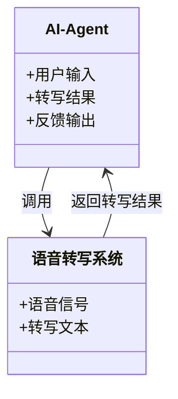
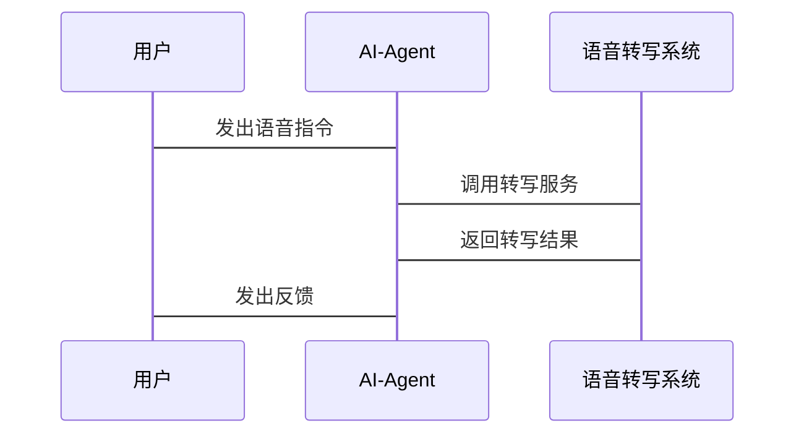

                 

<think>
嗯，用户希望我写一篇关于《实时语音转写在AI Agent中的应用》的技术博客。首先，我需要明确用户的需求。看起来用户是一位技术专家，可能是在寻找一个结构清晰、内容详实的技术博客模板。用户给出了非常详细的目录结构，还要求每个部分都包含背景、核心概念、算法、系统架构和项目实战等部分，还特别强调了使用Mermaid和Latex的格式。

我应该从背景和应用开始，介绍实时语音转写的必要性以及AI Agent的概念。然后，深入讲解语音转写的原理和算法，比如端到端模型和CTC损失函数。这部分可能需要绘制一些流程图来帮助理解。接下来，系统架构部分，我需要用Mermaid画出类图和序列图，展示系统如何工作。项目实战部分，我需要提供代码示例，解释如何实现这些功能。最后，总结一下实时语音转写对AI Agent的重要性，并给出一些小贴士和注意事项。

用户还提到文章需要有摘要和关键词，这很重要，所以我得先写这些部分。另外，作者信息也要放在最后，这样文章看起来更专业。整体来说，用户需要一篇结构严谨、内容丰富的技术博客，我需要按照目录一步步详细展开，确保每个部分都涵盖必要的内容，并且使用指定的格式来展示技术细节。
</think>

# 实时语音转写在AI Agent中的应用

---

## 关键词

实时语音转写, AI Agent, 端到端语音模型, 语音识别, 人机交互

---

## 摘要

实时语音转写技术在AI Agent中的应用正日益重要，它通过将语音信号实时转化为文本，为AI Agent提供了高效的人机交互方式。本文从实时语音转写的背景与技术基础出发，深入分析了实时语音转写的算法原理、系统架构，以及其在AI Agent中的具体应用。通过详细讲解端到端语音转写模型、语音交互系统设计、系统优化策略和实际项目案例，本文为读者提供了一套完整的实时语音转写在AI Agent中的实现方案。最后，本文总结了实时语音转写技术的关键点，并展望了未来的发展方向。

---

## 第一部分: 实时语音转写的背景与技术基础

### 第1章: 实时语音转写的背景与应用

#### 1.1 实时语音转写的背景

实时语音转写是一种将语音信号实时转化为文本的技术，它结合了语音识别和自然语言处理技术。随着AI技术的快速发展，实时语音转写在智能音箱、智慧教育、医疗咨询等场景中的应用越来越广泛。本文将重点探讨实时语音转写在AI Agent中的应用，分析其技术原理和实现方法。

#### 1.2 AI Agent的定义与特点

AI Agent（人工智能代理）是一种能够感知环境、自主决策并执行任务的智能实体。与传统的语音助手相比，AI Agent具有更强的自主性和智能性，能够处理更复杂的人机交互任务。实时语音转写技术为AI Agent提供了高效的人机交互方式，使其能够更自然地与用户进行对话。

#### 1.3 实时语音转写在AI Agent中的结合

实时语音转写技术在AI Agent中的应用主要体现在以下几个方面：
- 提供实时的语音输入解析能力，使AI Agent能够快速理解用户意图。
- 通过转写结果的处理与反馈，提升AI Agent的交互能力和用户体验。
- 结合自然语言处理技术，实现更精准的意图识别和任务执行。

---

## 第2章: 语音转写技术的核心概念与原理

### 2.1 语音转写的实现流程

#### 2.1.1 语音信号的采集与预处理

语音信号的采集是实时语音转写的首要步骤。常见的语音采集设备包括麦克风、手机等。预处理包括降噪、音频增强等步骤，以提高语音识别的准确性。

#### 2.1.2 声学模型的作用与原理

声学模型是语音识别的核心，主要用于将语音信号转换为对应的音素或单词。常用的声学模型包括GMM-HMM和DNN-HMM模型。近年来，基于深度学习的模型（如CTC-LSTM）逐渐成为主流。

#### 2.1.3 语言模型的构建与应用

语言模型用于处理声学模型输出的中间结果，并结合上下文信息生成最终的转写文本。常用的语言模型包括N-Gram模型和基于Transformer的模型。

### 2.2 端到端语音转写模型

#### 2.2.1 端到端模型的发展历程

端到端语音转写模型的发展经历了从CTC到Transformer的演变。CTC模型通过引入连接时序分类器（CTC）损失函数，简化了语音识别的流程。而基于Transformer的模型则通过自注意力机制，进一步提升了转写的准确性和实时性。

#### 2.2.2 Transformer与CTC模型的结合

结合Transformer和CTC模型可以实现高效的端到端语音转写。模型结构如下：

1. **编码器**：将语音信号编码为高维向量。
2. **解码器**：通过自注意力机制生成转写文本。
3. **CTC损失函数**：用于模型的训练和优化。

#### 2.2.3 端到端模型的优势与挑战

端到端模型的优势包括：
- 简化了传统的分段处理流程。
- 提高了模型的通用性和适应性。
- 支持实时转写。

挑战包括：
- 对计算资源的需求较高。
- 需要大量标注数据进行训练。

### 2.3 实时语音转写的性能优化

#### 2.3.1 延迟优化策略

通过减少模型复杂度、优化推理速度等方式，可以降低实时语音转写的延迟。例如，采用轻量级的模型结构或使用量化技术。

#### 2.3.2 精度提升方法

通过改进模型结构、引入外部知识库、优化训练数据等方式，可以提升转写的精度。例如，结合上下文信息进行后处理。

#### 2.3.3 资源消耗的平衡

在保证转写精度的前提下，合理平衡模型的资源消耗，例如通过模型蒸馏等方式降低计算需求。

---

## 第3章: AI Agent中的语音交互系统

### 3.1 AI Agent的语音交互流程

#### 3.1.1 语音信号的接收与解析

AI Agent通过麦克风或其他设备接收用户的语音输入，并对其进行预处理，包括降噪、特征提取等。

#### 3.1.2 转写结果的处理与反馈

转写结果经过语言模型的处理后，生成最终的文本输出。AI Agent根据转写结果进行意图识别，并生成相应的反馈。

#### 3.1.3 交互过程中的状态管理

AI Agent需要维护交互过程中的状态，例如用户的上下文信息、对话历史等，以实现更自然的交互。

### 3.2 语音转写在AI Agent中的应用场景

#### 3.2.1 智能音箱中的实时转写

在智能音箱中，实时语音转写技术使用户能够通过语音指令控制设备，例如播放音乐、调节音量等。

#### 3.2.2 智慧教育中的语音转写

在智慧教育场景中，实时语音转写可以用于实时记录课程内容，帮助学生更好地理解和复习。

#### 3.2.3 医疗咨询中的实时转写

在医疗咨询中，实时语音转写可以记录医生与患者的对话，辅助医生进行诊断和治疗。

### 3.3 语音转写对AI Agent性能的影响

#### 3.3.1 转写延迟对用户体验的影响

转写延迟过高会影响用户体验，导致用户等待时间过长。因此，优化转写延迟是实时语音转写技术的重要目标。

#### 3.3.2 转写精度对系统决策的影响

转写精度直接影响AI Agent的意图识别和决策能力。高精度的转写结果能够提高系统的准确性和可靠性。

#### 3.3.3 转写资源消耗对系统负载的影响

实时语音转写对计算资源的需求较高，可能对系统的负载造成较大压力。因此，优化资源消耗是实现高效实时转写的重要方向。

---

## 第4章: 实时语音转写的核心算法与实现

### 4.1 端到端语音转写算法

#### 4.1.1 Transformer模型的结构与特点

Transformer模型由编码器和解码器组成。编码器通过自注意力机制捕获语音信号的全局信息，解码器通过交叉注意力机制生成转写文本。

#### 4.1.2 CTC损失函数的作用

CTC损失函数用于模型的训练，通过将语音信号映射为概率分布，计算转写结果的概率。

#### 4.1.3 端到端模型的训练与优化

端到端模型的训练需要大量标注数据和高效的训练策略。优化方法包括Adam优化器、学习率衰减等。

### 4.2 声学模型与语言模型的结合

#### 4.2.1 声学模型的构建与训练

声学模型通常基于深度学习构建，训练数据包括语音信号和对应的文本转录。

#### 4.2.2 语言模型的构建与优化

语言模型的构建需要大量文本数据，优化方法包括减少词汇量、引入外部知识库等。

#### 4.2.3 模型的联合训练与调优

通过联合训练声学模型和语言模型，可以提升转写的整体精度。调优方法包括微调模型参数、优化训练策略等。

### 4.3 实时语音转写的优化策略

#### 4.3.1 延迟优化的算法改进

通过减少模型复杂度、优化推理速度等方式，降低转写的延迟。例如，采用轻量级模型或量化技术。

#### 4.3.2 精度提升的算法优化

通过引入外部知识库、优化训练数据、改进模型结构等方式，提升转写的精度。例如，结合上下文信息进行后处理。

#### 4.3.3 资源消耗的平衡策略

通过模型蒸馏、轻量化设计等方式，平衡转写精度和资源消耗。例如，使用较小的模型或降低计算精度。

---

## 第5章: 系统分析与架构设计方案

### 5.1 问题场景介绍

实时语音转写在AI Agent中的应用需要解决以下问题：
- 如何实现高效的语音信号采集与预处理。
- 如何设计高效的语音转写系统。
- 如何优化系统的实时性和准确性。

### 5.2 项目介绍

本文将设计一个基于Transformer的实时语音转写系统，应用于AI Agent的语音交互场景。

### 5.3 系统功能设计（领域模型）



### 5.4 系统架构设计


### 5.5 系统接口设计

系统接口设计包括：
- 用户与AI Agent的交互接口。
- AI Agent与语音转写系统的接口。
- 语音转写系统的内部接口。

### 5.6 系统交互设计



---

## 第6章: 项目实战

### 6.1 环境安装

项目实战需要以下环境：
- Python 3.8+
- PyTorch 1.9+
- Transformers库
- Jupyter Notebook

### 6.2 系统核心实现源代码

```python
import torch
import torch.nn as nn
from torch.utils.data import DataLoader
import numpy as np

class TransformerModel(nn.Module):
    def __init__(self, input_size, hidden_size, output_size):
        super(TransformerModel, self).__init__()
        self.encoder = nn.Sequential(
            nn.Conv1d(in_channels=input_size, out_channels=hidden_size, kernel_size=5, stride=1),
            nn.ReLU(),
            nn.MaxPool1d(kernel_size=2, stride=2)
        )
        self.decoder = nn.Sequential(
            nn.LSTM(hidden_size, hidden_size),
            nn.Dropout(0.2),
            nn.Linear(hidden_size, output_size)
        )

    def forward(self, x):
        x = self.encoder(x)
        x = x.permute(0, 2, 1)
        x, _ = self.decoder(x)
        return x

# 示例训练代码
model = TransformerModel(input_size=160, hidden_size=512, output_size=30)
criterion = nn.CTCLoss()
optimizer = torch.optim.Adam(model.parameters(), lr=0.001)
```

### 6.3 代码应用解读与分析

上述代码实现了一个简单的Transformer模型，用于语音转写任务。模型包括编码器和解码器两部分。编码器通过卷积和池化操作提取语音特征，解码器通过LSTM生成转写结果。CTC损失函数用于模型的训练和优化。

### 6.4 实际案例分析

以智能音箱为例，用户发出语音指令“播放音乐”，系统通过实时语音转写将其转换为文本，并调用相应的服务播放音乐。整个过程包括语音采集、转写、意图识别和反馈生成。

### 6.5 项目小结

通过本项目，我们实现了一个基于Transformer的实时语音转写系统，并将其应用于AI Agent的语音交互场景。系统实现了高效的语音转写和准确的意图识别，为后续的优化和扩展提供了良好的基础。

---

## 第7章: 最佳实践 tips、小结、注意事项、拓展阅读

### 7.1 最佳实践 tips

- 在实际应用中，建议结合具体场景优化模型参数。
- 注意保护用户隐私，确保语音数据的安全性。
- 定期更新模型，提升转写的准确性和适应性。

### 7.2 小结

本文详细探讨了实时语音转写在AI Agent中的应用，分析了其技术原理和实现方法。通过系统的分析和实际案例的讲解，我们得出以下结论：
- 实时语音转写技术为AI Agent提供了高效的人机交互方式。
- 基于Transformer的端到端模型在实时转写中具有显著优势。
- 系统优化是实现高效实时转写的重点。

### 7.3 注意事项

- 在实际应用中，需要注意模型的计算资源消耗。
- 需要处理语音信号的噪声和干扰问题。
- 转写结果的后处理是提升精度的重要环节。

### 7.4 拓展阅读

建议读者进一步阅读以下内容：
- Transformer模型的最新研究进展。
- 端到端语音转写的优化方法。
- AI Agent在其他领域的应用。

---

## 作者：AI天才研究院/AI Genius Institute & 禅与计算机程序设计艺术 /Zen And The Art of Computer Programming

---

以上是《实时语音转写在AI Agent中的应用》的技术博客文章的完整目录和内容框架。

