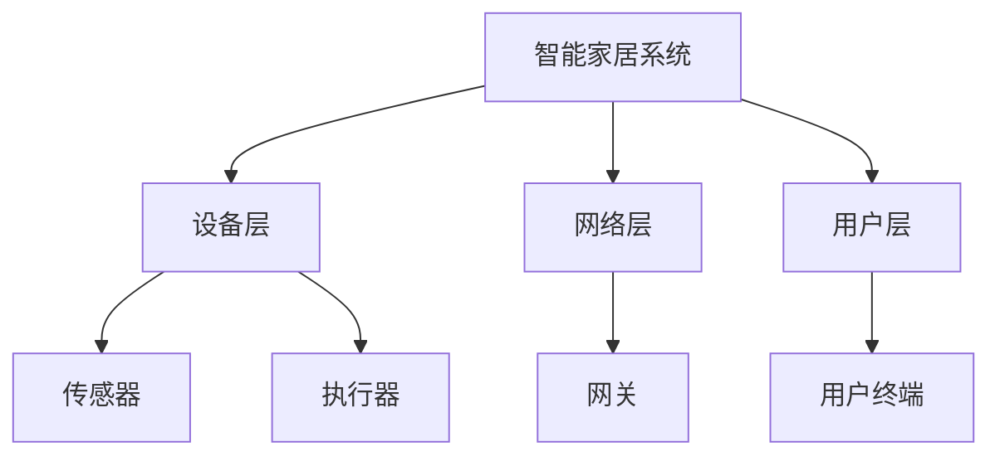
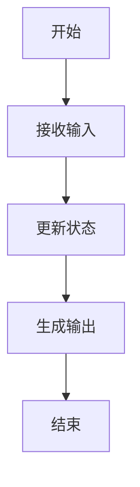
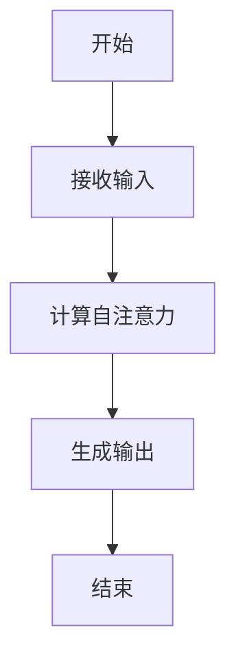
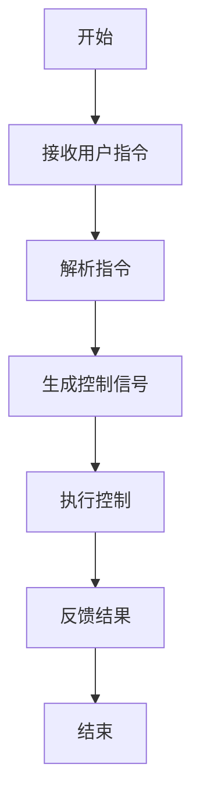
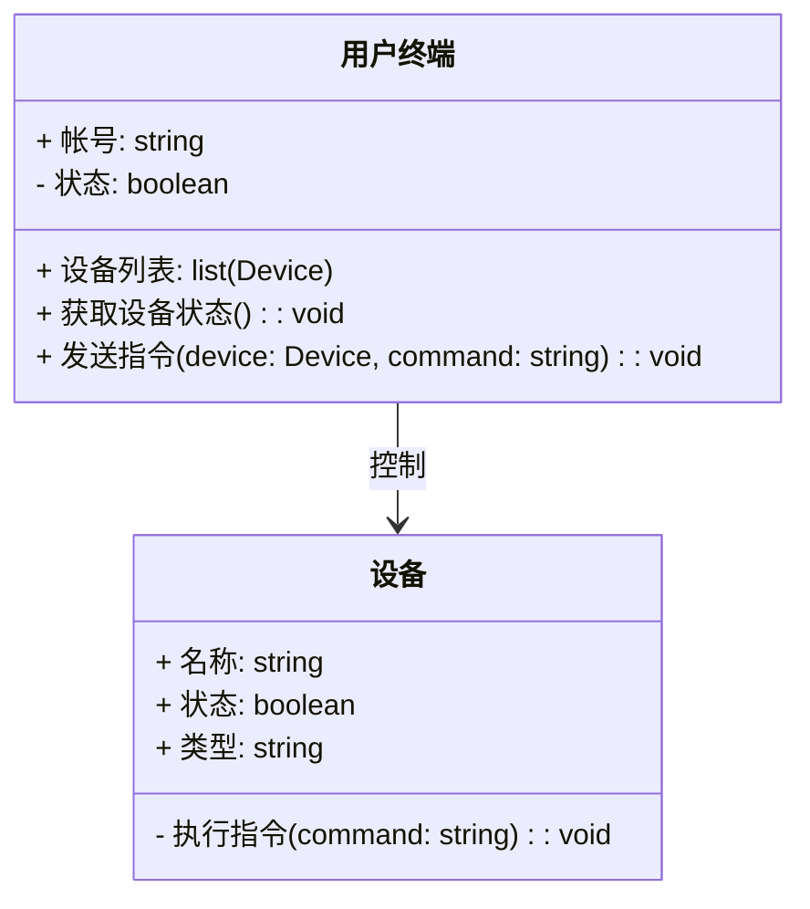
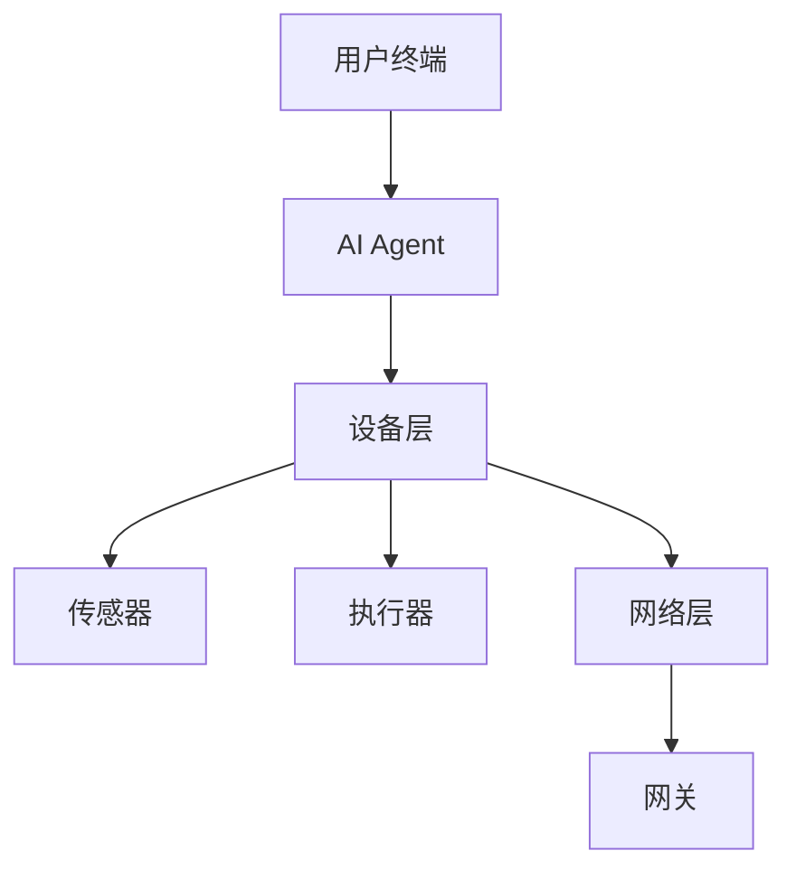
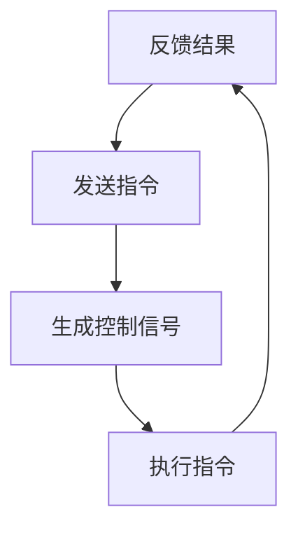

                 

<think>
好，用户希望我撰写一篇关于《实现基于AI Agent的智能家居控制系统》的技术博客文章。首先，我需要理解用户的具体需求。用户希望文章结构清晰，逻辑严密，适合技术博客，面向专业读者。我需要按照用户提供的目录大纲来组织内容，每个部分都要详细展开。

首先，我应该先完成文章的摘要和关键词部分。摘要需要简洁明了地概括文章的核心内容，关键词需要涵盖文章的主要主题。接下来，按照目录大纲逐步撰写每个章节的内容。

在撰写过程中，我需要确保每个章节都有足够的深度，同时使用专业但易懂的语言。例如，在核心概念部分，我需要用表格和图表来帮助读者理解AI Agent的类型和应用场景。在算法原理部分，我需要详细解释RNN和Transformer模型，并附上流程图和代码示例。

系统架构设计部分，我会用Mermaid图来展示系统的各个模块及其关系，确保读者能够直观理解。项目实战部分，我会分步骤指导读者如何实现系统，并提供详细的代码示例和分析。

最后，最佳实践部分需要给出实用的建议和注意事项，帮助读者在实际项目中避免常见错误。整个过程中，我需要确保内容符合用户的格式要求，字数控制在10000到12000字之间，并在结尾注明作者信息。

总之，我会按照用户提供的大纲，一步步详细撰写每个部分，确保文章结构合理，内容丰富，满足专业读者的需求。
</think>

# 实现基于AI Agent的智能家居控制系统

## 关键词：
智能家居, AI Agent, 智能控制, 物联网, 人工智能, 系统架构

## 摘要：
本文详细探讨了基于AI Agent的智能家居控制系统的实现方法。首先，从智能家居的发展背景出发，分析了AI Agent技术在智能家居中的应用优势。接着，深入阐述了AI Agent的基本原理、核心算法及其在智能家居中的具体应用场景。通过构建系统架构图和流程图，详细展示了系统的组成模块和工作流程。最后，通过项目实战和最佳实践，为读者提供了完整的实现方案和开发建议。

---

# 第一部分: 基于AI Agent的智能家居控制系统概述

## 第1章: 智能家居控制系统的发展与现状

### 1.1 智能家居的发展历程

#### 1.1.1 从传统家居到智能家居的演变
智能家居的概念起源于20世纪90年代，随着物联网技术的发展，智能家居逐步从概念走向现实。早期的智能家居系统主要集中在灯光、空调、安防等单一设备的自动化控制，而现代的智能家居系统则更加注重设备之间的联动和智能化决策。

#### 1.1.2 智能家居的定义与特征
智能家居是指通过物联网技术将家中的设备连接到一起，通过中央控制平台实现设备的智能化管理和联动控制。其主要特征包括：
- **智能化**：设备能够自主感知环境并做出决策。
- **互联性**：设备之间能够通过网络进行通信和协作。
- **便捷性**：用户可以通过手机、语音助手等终端实现远程控制。

#### 1.1.3 当前智能家居市场的现状与趋势
目前，智能家居市场呈现出快速发展的趋势。根据市场研究机构的数据显示，智能家居市场规模年均增长率达到20%以上。主要发展趋势包括：
- **AI技术的深度融合**：AI Agent技术在智能家居中的应用越来越广泛。
- **设备的互联互通**：不同品牌和类型的设备逐渐实现互操作性。
- **用户体验的提升**：智能家居系统更加注重用户的使用体验。

---

### 1.2 AI Agent技术在智能家居中的应用

#### 1.2.1 AI Agent的基本概念与特点
AI Agent（人工智能代理）是指能够感知环境、自主决策并执行任务的智能实体。其主要特点包括：
- **自主性**：能够自主完成任务，无需人工干预。
- **反应性**：能够实时感知环境并做出响应。
- **学习能力**：能够通过数据学习和优化自身的决策能力。

#### 1.2.2 AI Agent在智能家居中的优势
AI Agent在智能家居中的应用具有以下优势：
- **智能化决策**：能够根据环境和用户需求自动调整设备状态。
- **高效性**：通过AI算法优化设备控制流程，提高效率。
- **个性化服务**：能够根据用户习惯提供个性化的服务。

#### 1.2.3 当前智能家居系统中的AI Agent应用案例
目前，AI Agent在智能家居中的应用案例包括：
- **智能音箱**：通过语音交互实现设备控制。
- **智能门锁**：通过人脸识别和指纹识别实现门禁控制。
- **智能空调**：根据室内环境和用户习惯自动调节温度。

---

### 1.3 基于AI Agent的智能家居控制系统的核心问题

#### 1.3.1 问题背景与问题描述
智能家居系统的核心问题是设备之间的互联互通和智能化控制。传统的智能家居系统主要依赖于手动操作或简单的自动化控制，难以满足用户对智能化、个性化服务的需求。

#### 1.3.2 问题解决的思路与方法
为了解决上述问题，我们可以采用基于AI Agent的智能家居控制系统。该系统通过AI Agent实现设备的智能化控制，具体思路包括：
1. **设备感知**：通过传感器感知设备状态和环境信息。
2. **决策控制**：通过AI算法生成控制信号。
3. **执行反馈**：通过执行器执行控制信号并反馈执行结果。

#### 1.3.3 系统的边界与外延
基于AI Agent的智能家居控制系统主要关注设备的智能化控制，其边界包括：
- **输入边界**：用户指令、环境传感器数据。
- **输出边界**：设备控制信号、系统反馈信息。
- **外部依赖**：智能家居设备、网络通信模块。

#### 1.3.4 核心概念与核心要素组成
系统的核心概念包括：
- **AI Agent**：系统的核心决策模块。
- **设备层**：包括传感器和执行器。
- **网络层**：包括网关和通信模块。
- **用户层**：包括用户终端和交互界面。

---

## 第2章: AI Agent与智能家居控制系统的联系

### 2.1 AI Agent的基本原理与核心概念

#### 2.1.1 AI Agent的感知、决策与执行机制
AI Agent的感知、决策与执行机制可以分为以下几个步骤：
1. **感知环境**：通过传感器获取环境信息。
2. **决策控制**：基于感知信息生成控制信号。
3. **执行反馈**：通过执行器执行控制信号并反馈执行结果。

#### 2.1.2 AI Agent的智能特性与能力
AI Agent的智能特性包括：
- **学习能力**：能够通过数据优化自身的决策能力。
- **推理能力**：能够根据环境信息进行推理和决策。
- **自适应能力**：能够根据环境变化自动调整自身的行为。

#### 2.1.3 AI Agent在智能家居中的分类与应用场景
AI Agent在智能家居中的分类如下：
- **基于规则的AI Agent**：通过预设规则实现设备控制。
- **基于学习的AI Agent**：通过机器学习算法优化设备控制策略。
- **混合型AI Agent**：结合规则和学习的AI Agent。

---

### 2.2 智能家居控制系统的核心要素与系统架构

#### 2.2.1 智能家居系统的组成与功能模块
智能家居系统主要由以下功能模块组成：
- **设备层**：包括传感器和执行器。
- **网络层**：包括网关和通信模块。
- **用户层**：包括用户终端和交互界面。
- **控制层**：包括AI Agent和控制逻辑。

#### 2.2.2 AI Agent在智能家居系统中的角色与作用
AI Agent在智能家居系统中的角色是系统的决策核心。其主要作用包括：
- **设备控制**：根据用户指令或环境信息生成控制信号。
- **智能决策**：通过AI算法优化设备控制策略。
- **状态反馈**：将设备状态反馈给用户或系统。

#### 2.2.3 系统的核心要素与实体关系图
以下是系统的核心要素与实体关系图：



---

## 第3章: 基于AI Agent的智能家居控制系统的算法原理

### 3.1 算法原理概述

#### 3.1.1 AI Agent的核心算法与技术
AI Agent的核心算法包括：
- **规则引擎**：基于预设规则实现设备控制。
- **机器学习算法**：包括RNN和Transformer等深度学习算法。

#### 3.1.2 常见的智能家居控制算法
常见的智能家居控制算法包括：
- **基于时间的控制算法**：根据时间表实现设备控制。
- **基于环境的控制算法**：根据环境传感器数据实现设备控制。
- **基于用户的控制算法**：根据用户指令实现设备控制。

#### 3.1.3 基于AI的决策算法
基于AI的决策算法包括：
- **RNN算法**：用于序列数据的处理和预测。
- **Transformer算法**：用于自然语言处理和序列建模。

---

### 3.2 算法实现与流程图

#### 3.2.1 基于RNN的智能家居控制算法

##### 3.2.1.1 RNN算法的原理
RNN（循环神经网络）是一种用于处理序列数据的神经网络算法。其主要特点包括：
- **时间依赖性**：能够处理序列数据中的时间依赖关系。
- **状态记忆**：能够记忆序列数据中的历史信息。

##### 3.2.1.2 RNN算法的实现步骤
RNN算法的实现步骤如下：
1. **输入数据**：接收用户指令或环境传感器数据。
2. **状态更新**：更新RNN网络的状态。
3. **输出决策**：生成设备控制信号。

##### 3.2.1.3 RNN算法的流程图



#### 3.2.2 基于Transformer的智能家居控制算法

##### 3.2.2.1 Transformer算法的原理
Transformer是一种基于注意力机制的深度学习算法。其主要特点包括：
- **自注意力机制**：能够捕捉序列数据中的全局依赖关系。
- **多头注意力机制**：能够同时关注多个不同的特征。

##### 3.2.2.2 Transformer算法的实现步骤
Transformer算法的实现步骤如下：
1. **输入数据**：接收用户指令或环境传感器数据。
2. **计算自注意力**：计算输入数据的自注意力权重。
3. **生成输出**：基于自注意力权重生成设备控制信号。

##### 3.2.2.3 Transformer算法的流程图



#### 3.2.3 算法流程图



---

## 第4章: 基于AI Agent的智能家居控制系统的设计与实现

### 4.1 系统分析与架构设计

#### 4.1.1 问题场景介绍
智能家居系统的应用场景包括：
- **家庭环境控制**：如灯光、空调、安防等设备的控制。
- **用户交互**：用户可以通过手机、语音助手等终端实现远程控制。

#### 4.1.2 系统功能设计

##### 4.1.2.1 领域模型类图



##### 4.1.2.2 系统架构图



##### 4.1.2.3 系统交互图



#### 4.1.3 系统实现细节

##### 4.1.3.1 环境安装与配置
智能家居系统的环境安装与配置步骤如下：
1. **安装硬件设备**：安装传感器、执行器、网关等硬件设备。
2. **配置网络环境**：配置家庭网络环境，确保设备之间的互联互通。
3. **安装软件系统**：安装智能家居控制系统的软件平台。

##### 4.1.3.2 系统核心代码实现
以下是系统核心代码实现示例：

```python
class AI_Agent:
    def __init__(self):
        self.sensors = []
        self.actuators = []
        self.rules = {}

    def add_sensor(self, sensor):
        self.sensors.append(sensor)

    def add_actuator(self, actuator):
        self.actuators.append(actuator)

    def set_rule(self, condition, action):
        self.rules[condition] = action

    def process(self, input):
        for condition, action in self.rules.items():
            if condition(input):
                action()

class SmartHomeSystem:
    def __init__(self):
        self.agent = AI_Agent()
        self.devices = {}

    def register_device(self, device_name, device_type):
        self.devices[device_name] = device_type

    def send_command(self, device_name, command):
        device_type = self.devices[device_name]
        self.agent.process(command)
```

##### 4.1.3.3 代码应用解读与分析
上述代码实现了一个简单的基于AI Agent的智能家居控制系统。AI_Agent类负责接收传感器数据并根据预设规则生成控制信号，SmartHomeSystem类负责管理设备并实现设备之间的通信。

---

### 4.2 项目实战与案例分析

#### 4.2.1 项目实战
以下是基于AI Agent的智能家居控制系统项目的实战步骤：
1. **环境搭建**：安装智能家居硬件设备和软件平台。
2. **系统设计**：设计系统的功能模块和交互流程。
3. **代码实现**：实现系统的核心功能模块。
4. **系统测试**：对系统进行功能测试和性能优化。

#### 4.2.2 案例分析
以智能灯光控制为例，系统实现步骤如下：
1. **需求分析**：用户可以通过语音指令或手机App控制灯光。
2. **系统设计**：设计灯光控制模块的功能和交互流程。
3. **代码实现**：实现灯光控制模块的代码。
4. **系统测试**：测试灯光控制模块的功能和性能。

---

## 第5章: 基于AI Agent的智能家居控制系统的最佳实践

### 5.1 最佳实践

#### 5.1.1 开发建议
在开发基于AI Agent的智能家居控制系统时，建议如下：
- **选择合适的AI算法**：根据具体需求选择合适的AI算法。
- **确保设备的互联互通**：确保设备之间的互操作性。
- **注重用户体验**：设计友好的用户界面和交互流程。

#### 5.1.2 注意事项
在实际开发过程中，需要注意以下几点：
- **数据安全**：确保系统的数据安全和用户隐私。
- **系统稳定性**：确保系统的稳定性和可靠性。
- **性能优化**：优化系统的性能和响应速度。

#### 5.1.3 拓展阅读
推荐阅读以下资料：
- **《深度学习实战》**：了解深度学习算法的实现细节。
- **《物联网技术与应用》**：了解物联网技术在智能家居中的应用。
- **《AI Agent与智能系统》**：深入理解AI Agent的基本原理与应用。

---

## 结语

通过本文的详细讲解，我们了解了基于AI Agent的智能家居控制系统的实现方法。从系统架构到算法实现，从项目实战到最佳实践，我们为读者提供了一套完整的实现方案。希望本文能够为智能家居系统的开发和研究提供有价值的参考。

---

## 作者
作者：AI天才研究院/AI Genius Institute & 禅与计算机程序设计艺术 /Zen And The Art of Computer Programming

