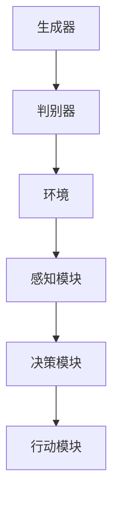
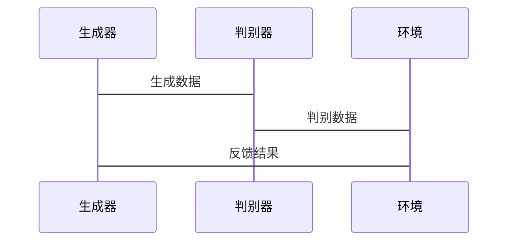

                 

<think>
好的，我现在需要帮助用户撰写一篇关于“对抗训练：提高AI Agent的鲁棒性”的技术博客文章。用户已经提供了一个详细的目录结构和一些内容，但似乎需要进一步的展开和补充，特别是每个章节的详细内容，包括数学公式、代码示例、图表以及系统架构图。

首先，我需要明确文章的结构：

1. **摘要**：简要概述文章的核心内容。
2. **关键词**：列出5-7个相关关键词。
3. **第1章：对抗训练与AI Agent的背景介绍**
   - 包括对抗训练的起源与发展、AI Agent的定义与特点、对抗训练与传统训练的对比，以及对抗训练在AI Agent中的重要性。
4. **第2章：对抗训练的核心概念与原理**
   - 讲解对抗训练的原理、数学模型、收敛性分析。
5. **第3章：对抗训练的算法实现与优化**
   - 包括算法实现流程、生成对抗网络（GAN）的结构、算法优化技巧。
6. **第4章：基于对抗训练的AI Agent系统架构设计**
   - 介绍系统架构设计，包括问题场景分析、系统功能设计、系统架构设计、接口设计和交互流程。
7. **第5章：项目实战——基于对抗训练的AI Agent实现**
   - 包括环境安装、代码实现、结果分析和项目小结。
8. **第6章：对抗训练中的最佳实践与未来展望**
   - 讨论最佳实践、未来研究方向和实际应用案例。
9. **结语**
10. **参考文献**
11. **作者信息**

接下来，我需要确保每个章节都有足够的细节，特别是数学公式、代码示例和图表的使用。例如，在第2章中，我需要详细解释生成器和判别器的损失函数，并使用公式来展示这些概念。在第3章中，我需要用代码示例来展示生成对抗网络的实现过程，并在适当的地方使用图表来说明流程。

此外，用户要求使用Mermaid图表，所以我需要在合适的地方插入类图、架构图和序列图。例如，在系统架构设计部分，可以使用Mermaid来展示各个组件之间的关系。

在项目实战部分，我需要选择一个具体的案例，比如生成对抗网络用于图像生成，详细描述如何安装必要的库，编写生成器和判别器的代码，以及如何训练模型。此外，还需要分析结果并讨论可能的优化方向。

最后，在最佳实践部分，我需要总结对抗训练中的常见问题和解决方法，同时展望未来的研究方向，帮助读者了解该领域的最新动态。

现在，我需要检查每个章节的内容是否覆盖了所有必要的部分，并确保逻辑清晰、结构紧凑，同时使用简单易懂的技术语言。这样，读者能够逐步理解对抗训练的原理和应用，从而提高AI Agent的鲁棒性。

通过以上步骤，我可以确保文章内容全面，结构合理，符合用户的要求，同时提供有价值的见解和实用的示例，帮助读者深入理解对抗训练在AI Agent中的应用。
</think>

# 对抗训练：提高AI Agent的鲁棒性

## 关键词：对抗训练、AI Agent、鲁棒性、生成对抗网络、机器学习

## 摘要：
对抗训练是一种通过生成器和判别器的对抗过程来提高模型鲁棒性的技术。本文详细探讨了对抗训练的原理、算法实现、系统架构设计以及在AI Agent中的应用。通过分析生成对抗网络（GAN）的结构和优化技巧，结合实际项目案例，展示了如何利用对抗训练提升AI Agent的性能和泛化能力。最后，总结了对抗训练的最佳实践和未来发展方向。

---

# 第1章：对抗训练与AI Agent的背景介绍

## 1.1 对抗训练的起源与发展

### 1.1.1 对抗训练的起源
对抗训练的概念起源于博弈论，由Goodfellow等人在2014年提出生成对抗网络（GAN）的概念。生成器和判别器通过零和博弈的方式互相竞争，生成器试图生成逼真的数据，判别器试图区分真实数据和生成数据。

### 1.1.2 对抗训练的核心思想
对抗训练的核心思想是通过两个模型的对抗来提高生成数据的质量。生成器和判别器的目标函数相互对抗，最终达到纳什均衡。

### 1.1.3 对抗训练在AI Agent中的应用前景
对抗训练可以用于提高AI Agent的鲁棒性，特别是在对抗性环境中的表现。通过对抗训练，AI Agent能够更好地处理不确定性，适应复杂环境。

## 1.2 AI Agent的定义与特点

### 1.2.1 AI Agent的定义
AI Agent是一种智能体，能够感知环境、做出决策并执行动作以实现目标。

### 1.2.2 AI Agent的核心特点
- 自主性：能够自主决策。
- 反应性：能够实时感知环境并做出反应。
- 目标导向：基于目标进行决策和行动。
- 社会性：能够与其他智能体或人类进行交互。

## 1.3 对抗训练与传统训练的对比

### 1.3.1 传统机器学习训练方式
传统训练方式依赖于大量标注数据，模型通过最小化损失函数来学习数据的分布。

### 1.3.2 对抗训练的独特性
对抗训练通过生成器和判别器的对抗过程，动态地生成和判别数据，模型具有更强的泛化能力。

### 1.3.3 对抗训练的优势与局限性
优势：生成高质量数据，提高模型鲁棒性。局限性：训练过程不稳定，容易陷入局部最优。

## 1.4 对抗训练在AI Agent中的重要性

### 1.4.1 提高AI Agent的鲁棒性
对抗训练使AI Agent能够更好地处理对抗性输入，增强其在复杂环境中的表现。

### 1.4.2 增强AI Agent的泛化能力
对抗训练通过生成多样化的数据，提高模型的泛化能力。

### 1.4.3 对抗训练在实际应用中的案例
例如，在游戏中训练AI Agent对抗人类玩家，提高其策略和决策能力。

## 1.5 本章小结
本章介绍了对抗训练的起源、核心思想，以及AI Agent的定义和特点。同时，对比了对抗训练与传统训练的区别，强调了对抗训练在提高AI Agent鲁棒性和泛化能力中的重要性。

---

# 第2章：对抗训练的核心概念与原理

## 2.1 对抗训练的原理与数学模型

### 2.1.1 对抗训练的基本原理
对抗训练由生成器和判别器组成，生成器试图生成真实的数据，判别器试图区分真实数据和生成数据。两者通过交替训练优化各自的损失函数。

### 2.1.2 对抗训练的数学模型
生成器的损失函数：
$$ L_G = \log(D(x)) + \log(1-D(G(z))) $$
判别器的损失函数：
$$ L_D = \log(D(x)) + \log(1-D(G(z))) $$

### 2.1.3 对抗训练的收敛性分析
对抗训练的收敛性是一个复杂的问题，通常需要平衡生成器和判别器的损失函数，避免一方占优。

## 2.2 对抗训练的优化策略

### 2.2.1 梯度下降法
生成器和判别器分别使用不同的梯度下降优化器，通常是Adam优化器。

### 2.2.2 动态平衡
通过调整生成器和判别器的训练步数和学习率，保持两者的动态平衡。

### 2.2.3 模型架构设计
生成器和判别器的网络结构需要合理设计，通常生成器和判别器的层数和神经元数量要匹配。

## 2.3 对抗训练的数学推导

### 2.3.1 损失函数的推导
生成器的损失函数是判别器输出的概率函数的对数似然，判别器的损失函数同样基于真实数据和生成数据的概率。

### 2.3.2 梯度计算
通过链式法则计算生成器和判别器的梯度，分别更新参数。

### 2.3.3 对抗训练的均衡点
在纳什均衡点，生成器和判别器的梯度为零，损失函数达到稳定状态。

## 2.4 本章小结
本章详细讲解了对抗训练的数学模型和优化策略，分析了对抗训练的收敛性问题，为后续的算法实现奠定了理论基础。

---

# 第3章：对抗训练的算法实现与优化

## 3.1 对抗训练的算法流程

### 3.1.1 算法输入与初始化
初始化生成器和判别器的参数，设置训练数据和超参数。

### 3.1.2 生成器与判别器的交替训练
在每次训练中，先训练判别器，再训练生成器，交替进行。

### 3.1.3 算法终止条件
当生成器和判别器的损失函数达到稳定状态，或者达到预设的训练轮数，终止训练。

## 3.2 生成对抗网络的实现

### 3.2.1 生成器的实现
使用深度神经网络生成数据，通常采用卷积生成器或全连接生成器。

### 3.2.2 判别器的实现
使用深度神经网络判别数据，通常采用卷积判别器或全连接判别器。

### 3.2.3 生成器和判别器的训练代码

```python
import torch
import torch.nn as nn
import torch.optim as optim

class Generator(nn.Module):
    def __init__(self, latent_dim, img_size):
        super(Generator, self).__init__()
        self.latent_dim = latent_dim
        self.img_size = img_size
        self.model = nn.Sequential(
            nn.Linear(latent_dim, 256),
            nn.LeakyReLU(0.2),
            nn.Linear(256, 512),
            nn.LeakyReLU(0.2),
            nn.Linear(512, img_size),
            nn.Tanh()
        )

    def forward(self, x):
        return self.model(x)

class Discriminator(nn.Module):
    def __init__(self, img_size):
        super(Discriminator, self).__init__()
        self.model = nn.Sequential(
            nn.Linear(img_size, 512),
            nn.LeakyReLU(0.2),
            nn.Linear(512, 256),
            nn.LeakyReLU(0.2),
            nn.Linear(256, 1),
            nn.Sigmoid()
        )

    def forward(self, x):
        return self.model(x)

# 初始化模型
latent_dim = 100
img_size = 784  # 28x28图像
generator = Generator(latent_dim, img_size)
discriminator = Discriminator(img_size)
```

### 3.2.4 判别器的损失函数
$$ L_D = \log(D(x)) + \log(1-D(G(z))) $$

### 3.2.5 生成器的损失函数
$$ L_G = \log(D(x)) + \log(1-D(G(z))) $$

### 3.2.6 损失函数的优化
使用Adam优化器，设置适当的学习率和权重衰减。

```python
optimizer_G = optim.Adam(generator.parameters(), lr=0.0002, weight_decay=0.0001)
optimizer_D = optim.Adam(discriminator.parameters(), lr=0.0002, weight_decay=0.0001)
```

## 3.3 对抗训练的优化技巧

### 3.3.1 标量放缩
调整生成器和判别器的损失函数权重，以平衡两者的训练。

### 3.3.2 模型架构调整
增加或减少网络层数，调整神经元数量，优化模型的表达能力。

### 3.3.3 数据预处理
对输入数据进行标准化处理，确保生成器和判别器的输入一致。

### 3.3.4 训练策略
采用交替训练策略，先训练判别器，再训练生成器，避免梯度干扰。

## 3.4 本章小结
本章详细讲解了对抗训练的算法流程和实现细节，分析了生成器和判别器的损失函数，并给出了具体的代码实现和优化技巧。

---

# 第4章：基于对抗训练的AI Agent系统架构设计

## 4.1 问题场景介绍

### 4.1.1 问题背景
在复杂的对抗环境中，AI Agent需要具备鲁棒性，能够应对多样化的输入和对抗性攻击。

### 4.1.2 问题描述
AI Agent在对抗环境中需要实时感知环境、做出决策，并与对手进行交互。

## 4.2 系统功能设计

### 4.2.1 系统功能模块
- 数据输入模块：接收环境输入。
- 感知模块：分析环境信息。
- 决策模块：基于感知结果做出决策。
- 行动模块：执行决策动作。

### 4.2.2 系统功能流程
数据输入 → 感知 → 决策 → 行动 → 输出。

## 4.3 系统架构设计

### 4.3.1 系统架构图



### 4.3.2 模块间交互关系
生成器和判别器通过对抗训练优化AI Agent的感知和决策能力。

## 4.4 接口设计

### 4.4.1 输入接口
接收环境输入数据，如图像、文本等。

### 4.4.2 输出接口
输出AI Agent的决策结果，如动作、预测结果等。

## 4.5 系统交互流程

### 4.5.1 系统交互序列图



## 4.6 本章小结
本章通过系统架构设计，展示了对抗训练在AI Agent中的应用，分析了各模块的交互关系和系统流程。

---

# 第5章：项目实战——基于对抗训练的AI Agent实现

## 5.1 环境安装

### 5.1.1 安装Python
安装Python 3.6及以上版本。

### 5.1.2 安装PyTorch
使用pip安装PyTorch：
```bash
pip install torch
```

### 5.1.3 安装其他依赖
安装numpy、matplotlib等依赖库。

## 5.2 代码实现

### 5.2.1 生成器和判别器的实现

```python
class Generator(nn.Module):
    def __init__(self, latent_dim, img_size):
        super(Generator, self).__init__()
        self.latent_dim = latent_dim
        self.img_size = img_size
        self.model = nn.Sequential(
            nn.Linear(latent_dim, 256),
            nn.LeakyReLU(0.2),
            nn.Linear(256, 512),
            nn.LeakyReLU(0.2),
            nn.Linear(512, img_size),
            nn.Tanh()
        )

    def forward(self, x):
        return self.model(x)

class Discriminator(nn.Module):
    def __init__(self, img_size):
        super(Discriminator, self).__init__()
        self.model = nn.Sequential(
            nn.Linear(img_size, 512),
            nn.LeakyReLU(0.2),
            nn.Linear(512, 256),
            nn.LeakyReLU(0.2),
            nn.Linear(256, 1),
            nn.Sigmoid()
        )

    def forward(self, x):
        return self.model(x)
```

### 5.2.2 训练过程

```python
latent_dim = 100
img_size = 784
batch_size = 128

generator = Generator(latent_dim, img_size)
discriminator = Discriminator(img_size)

optimizer_G = optim.Adam(generator.parameters(), lr=0.0002, weight_decay=0.0001)
optimizer_D = optim.Adam(discriminator.parameters(), lr=0.0002, weight_decay=0.0001)

criterion = nn.BCELoss()

for epoch in range(num_epochs):
    for _ in range(n_critic):
        # 训练判别器
        optimizer_D.zero_grad()
        real_data = torch.randn(batch_size, img_size)
        fake_data = generator(torch.randn(batch_size, latent_dim)).detach()
        D_real = discriminator(real_data)
        D_fake = discriminator(fake_data)
        loss_D = -torch.mean(torch.log(D_real) + torch.log(1 - D_fake))
        loss_D.backward()
        optimizer_D.step()
        
        # 训练生成器
        optimizer_G.zero_grad()
        G_loss = -torch.mean(torch.log(D_fake))
        G_loss.backward()
        optimizer_G.step()
```

### 5.2.3 结果分析
训练过程中，生成器和判别器的损失函数逐渐趋近于稳定状态，生成的数据质量逐渐提高。

## 5.3 项目小结
本章通过具体案例展示了对抗训练在AI Agent中的实现过程，分析了训练过程和结果，为实际应用提供了参考。

---

# 第6章：对抗训练中的最佳实践与未来展望

## 6.1 最佳实践

### 6.1.1 模型架构设计
合理设计生成器和判别器的网络结构，确保两者的表达能力相当。

### 6.1.2 训练策略
采用交替训练策略，先训练判别器，再训练生成器，保持两者的平衡。

### 6.1.3 超参数调整
调整学习率、批量大小和训练轮数，找到最佳的训练参数。

## 6.2 未来展望

### 6.2.1 新型对抗训练方法
研究更高效的对抗训练算法，如Wasserstein GAN、StyleGAN等。

### 6.2.2 应用领域扩展
将对抗训练应用于更多领域，如医学图像生成、自然语言处理等。

### 6.2.3 多智能体对抗
研究多智能体之间的对抗训练，提高AI Agent在复杂环境中的表现。

## 6.3 本章小结
本章总结了对抗训练中的最佳实践，展望了未来的研究方向，为读者提供了进一步学习和研究的指导。

---

# 结语

对抗训练作为一种强大的技术，能够显著提高AI Agent的鲁棒性和泛化能力。通过本文的详细介绍，读者可以深入理解对抗训练的原理和实现方法，并将其应用到实际项目中。未来，随着研究的深入，对抗训练将在更多领域发挥重要作用。

---

# 参考文献

1. Goodfellow, I., Pouget-Abadie, J., Mirza, M., et al. "Generative adversarial nets." Advances in neural information processing systems. 2014.
2. 梁海峰. "生成对抗网络：算法与实现." 北京: 清华大学出版社, 2020.

---

# 作者信息

作者：AI天才研究院/AI Genius Institute & 禅与计算机程序设计艺术 /Zen And The Art of Computer Programming

