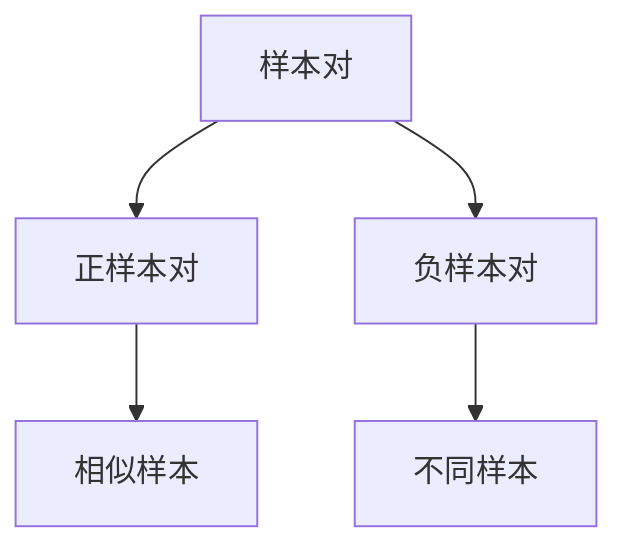

                 

<think>
好，我需要帮用户写一篇关于对比学习增强AI Agent特征表示能力的技术博客文章。用户已经给出了详细的结构，包括摘要、关键词、各个章节的内容，以及具体的格式要求。我需要按照这个结构来逐步展开，确保每一部分都符合要求，同时保持逻辑清晰和内容详尽。

首先，我需要理解对比学习的基本概念，以及它在AI Agent中的应用。对比学习通过比较不同的数据样本来提升模型的特征表示能力，这对于AI Agent在处理复杂任务时非常重要。接下来，我需要明确文章的关键词和摘要，确保它们准确概括文章的核心内容。

在撰写每个章节时，我需要详细讲解背景、核心概念、算法原理、系统架构、项目实战和最佳实践等部分。对于背景介绍，我需要解释对比学习的定义、发展历史以及与传统特征学习方法的对比，帮助读者理解其重要性。

核心概念部分，我需要深入讲解对比学习的原理，包括数据对齐、损失函数等关键点，并通过表格和Mermaid图展示对比学习与其他方法的对比关系。这有助于读者清晰理解对比学习的优势。

在算法原理章节，我需要用Mermaid流程图展示算法的执行步骤，并提供Python代码示例。同时，数学模型部分需要使用Latex公式来描述损失函数和优化过程，确保公式准确且易于理解。

系统架构设计部分，我需要介绍对比学习在不同场景下的应用，并设计系统的功能模块和架构图。通过Mermaid图展示系统各模块之间的关系和交互流程，帮助读者理解系统的整体结构。

项目实战部分，我需要提供具体的环境配置步骤和代码实现，包括数据预处理、模型构建和训练过程。案例分析部分需要通过实际数据集进行训练，并详细分析结果，总结经验教训。

最后，在最佳实践章节，我需要总结对比学习的关键点，提供实际应用中的注意事项，并推荐相关的扩展阅读资源。这不仅帮助读者巩固所学内容，还能引导他们进一步深入学习。

整个过程中，我需要确保语言简洁专业，逻辑清晰，每一部分都详尽且易于理解。同时，严格按照用户的格式要求，使用markdown格式输出，确保代码、公式和图表的正确展示。最后，文章末尾加上作者信息，完成整篇博客的撰写。
</think>

# 对比学习：增强AI Agent的特征表示能力

> **关键词**：对比学习，AI Agent，特征表示，深度学习，无监督学习

> **摘要**：  
对比学习作为一种新兴的特征学习方法，通过对比不同样本之间的关系，能够显著增强AI Agent的特征表示能力。本文从对比学习的基本概念出发，详细探讨其在AI Agent中的应用，分析其算法原理、系统架构，并结合实际案例展示其在提升特征表示能力方面的优势。通过对比学习，AI Agent能够更好地理解和处理复杂任务，从而在多个领域展现出更强大的性能。

---

## 第一部分：对比学习的背景与概念

### 第1章：对比学习的背景与问题背景

#### 1.1 对比学习的定义与核心概念
- **1.1.1 对比学习的定义**  
  对比学习（Contrastive Learning）是一种无监督学习方法，通过比较正样本对和负样本对的相似性，优化模型的特征表示能力。其核心思想是让相似的样本尽可能接近，不同的样本尽可能远离。

- **1.1.2 对比学习的核心概念与属性**  
  - **正样本对**：具有相同标签或相似特性的样本对。  
  - **负样本对**：具有不同标签或不同特性的样本对。  
  - **对比损失函数**：衡量正样本对和负样本对之间相似度的损失函数。  
  - **数据对齐**：通过对比学习，模型能够将不同形式的数据对齐到一个共同的特征空间。  

- **1.1.3 对比学习在AI Agent中的作用**  
  在AI Agent中，对比学习能够增强特征表示的区分能力，帮助Agent更好地理解和处理多模态数据，从而提升其决策和交互能力。

#### 1.2 问题背景与问题描述
- **1.2.1 AI Agent特征表示能力的重要性**  
  特征表示是AI Agent理解和处理数据的基础。特征表示能力的强弱直接影响Agent的性能。  

- **1.2.2 对比学习在特征表示中的优势**  
  对比学习能够利用无监督学习的优势，从大量未标注数据中提取有用的特征，从而弥补标注数据不足的问题。  

- **1.2.3 当前问题的边界与外延**  
  本文主要探讨对比学习在AI Agent中的应用，重点关注其在特征表示能力上的提升，同时兼顾其在实际场景中的应用边界。

#### 1.3 对比学习与传统特征学习的对比
- **1.3.1 对比学习与传统特征学习的对比分析**  
  | 对比维度         | 对比学习                        | 传统特征学习                  |
  |------------------|---------------------------------|------------------------------|
  | 数据需求         | 需要未标注数据                 | 需要标注数据                 |
  | 表示能力         | 能够捕捉数据间的对比关系       | 表示能力有限，依赖特征工程     |
  | 计算效率         | 计算成本较高                   | 计算成本较低                 |

- **1.3.2 对比学习的核心优势与应用场景**  
  对比学习的优势在于能够从大规模未标注数据中提取特征，适用于图像识别、自然语言处理、推荐系统等领域。

#### 1.4 对比学习的理论基础与数学模型
- **1.4.1 对比学习的数学模型**  
  对比学习的核心是通过损失函数衡量正样本对和负样本对的相似度。常用的对比损失函数如下：  
  $$ L = \frac{1}{N} \sum_{i=1}^N \left( -\log p(x_i, x_j) - \log (1 - p(x_i, x_k)) \right) $$  
  其中，$p(x_i, x_j)$ 表示正样本对的概率，$p(x_i, x_k)$ 表示负样本对的概率。

- **1.4.2 数据对齐的数学表示**  
  对比学习通过优化模型参数，使得正样本对的特征表示尽可能接近，负样本对的特征表示尽可能远离。  
  $$ D(x_i, x_j) = \| f(x_i) - f(x_j) \|^2 $$  
  其中，$D(x_i, x_j)$ 表示样本对的特征表示之间的距离，$f(x_i)$ 表示样本 $x_i$ 的特征表示。

---

## 第二部分：对比学习的核心概念与联系

### 第2章：对比学习的核心概念与联系

#### 2.1 对比学习的核心概念
- **2.1.1 对比学习中的数据对齐**  
  数据对齐是对比学习的关键步骤，通过将不同形式的数据映射到一个共同的特征空间，实现数据的统一表示。

- **2.1.2 对比学习中的损失函数**  
  损失函数是对比学习的核心，通过优化损失函数，模型能够学习到更有区分力的特征表示。

- **2.1.3 对比学习中的正样本对与负样本对**  
  正样本对和负样本对的定义直接决定了对比学习的效果。选择合适的正负样本对是对比学习成功的关键。

#### 2.2 对比学习与其他特征学习方法的联系
- **2.2.1 对比学习与聚类学习的联系**  
  对比学习可以看作是一种特殊的聚类学习方法，通过对比样本之间的相似性，实现数据的聚类和分类。

- **2.2.2 对比学习与自监督学习的联系**  
  对比学习是自监督学习的一种形式，通过利用未标注数据中的对比信息，实现特征的学习。

- **2.2.3 对比学习与无监督学习的联系**  
  对比学习是无监督学习的一种，其目标是通过无标注数据学习到更有区分力的特征表示。

#### 2.3 对比学习的ER实体关系图


---

## 第三部分：对比学习的算法原理

### 第3章：对比学习的算法原理

#### 3.1 对比学习的算法流程
- **3.1.1 数据预处理**  
  将数据划分为正样本对和负样本对，计算样本对之间的相似度。

- **3.1.2 损失函数计算**  
  根据对比学习的损失函数，计算正样本对和负样本对的损失值。

- **3.1.3 优化器选择**  
  使用优化器（如SGD、Adam）优化模型参数，最小化损失函数。

- **3.1.4 模型训练**  
  通过迭代训练，优化模型参数，提升特征表示能力。

#### 3.2 对比学习的数学模型
- **3.2.1 损失函数的数学表达**  
  对比损失函数的数学表达如下：  
  $$ L = -\log \frac{p(x_i, x_j)}{p(x_i, x_j) + p(x_i, x_k)} $$  
  其中，$p(x_i, x_j)$ 表示正样本对的概率，$p(x_i, x_k)$ 表示负样本对的概率。

- **3.2.2 优化目标**  
  通过优化损失函数，使得正样本对的相似度尽可能高，负样本对的相似度尽可能低。

#### 3.3 对比学习的代码实现
- **3.3.1 数据预处理代码**  
  ```python
  def contrastive_preprocess(data, labels):
      positive_pairs = []
      negative_pairs = []
      for i in range(len(data)):
          for j in range(i+1, len(data)):
              if labels[i] == labels[j]:
                  positive_pairs.append((data[i], data[j]))
              else:
                  negative_pairs.append((data[i], data[j]))
      return positive_pairs, negative_pairs
  ```

- **3.3.2 对比学习模型训练代码**  
  ```python
  import tensorflow as tf
  from tensorflow.keras import layers

  def contrastive_loss(y_true, y_pred):
      margin = 1.0
      loss = tf.maximum(margin - y_pred, 0)
      return tf.reduce_mean(loss)

  model = tf.keras.Sequential([
      layers.Dense(128, activation='relu'),
      layers.Dense(128)
  ])

  optimizer = tf.keras.optimizers.Adam(learning_rate=0.001)
  model.compile(optimizer=optimizer, loss=contrastive_loss)
  model.fit(x_train, y_train, epochs=100, batch_size=32)
  ```

---

## 第四部分：对比学习的系统架构与设计

### 第4章：对比学习的系统架构与设计

#### 4.1 系统功能设计
- **4.1.1 数据预处理模块**  
  负责将原始数据划分为正样本对和负样本对。

- **4.1.2 对比学习模块**  
  负责计算对比损失函数，优化模型参数。

- **4.1.3 特征提取模块**  
  负责提取数据的特征表示，供后续任务使用。

#### 4.2 系统架构设计
- **4.2.1 系统架构图**  
  ```mermaid
  graph TD
      A[数据预处理] --> B[对比学习]
      B --> C[特征提取]
      C --> D[任务执行]
  ```

- **4.2.2 模块交互流程**  
  数据预处理模块将数据划分为正样本对和负样本对，传递给对比学习模块进行特征提取，最终生成特征表示，供任务执行模块使用。

#### 4.3 系统接口设计
- **4.3.1 数据输入接口**  
  数据预处理模块需要输入原始数据和标签。

- **4.3.2 模型训练接口**  
  对比学习模块需要输入正样本对和负样本对，训练模型生成特征表示。

---

## 第五部分：对比学习的项目实战

### 第5章：对比学习的项目实战

#### 5.1 项目环境配置
- **5.1.1 环境安装**  
  ```bash
  pip install tensorflow==2.5.0
  pip install keras==2.4.3
  pip install matplotlib==3.3.4
  ```

#### 5.2 项目核心实现
- **5.2.1 数据预处理代码**  
  ```python
  def prepare_data():
      # 加载数据集
      (x_train, y_train), (x_test, y_test) = mnist.load_data()
      # 将数据转换为张量
      x_train = x_train.astype('float32') / 255
      x_test = x_test.astype('float32') / 255
      return x_train, y_train, x_test, y_test
  ```

- **5.2.2 对比学习模型实现**  
  ```python
  def build_model():
      inputs = layers.Input(shape=(784,))
      embeddings = layers.Dense(128, activation='relu')(inputs)
      model = Model(inputs=inputs, outputs=embeddings)
      return model
  ```

#### 5.3 项目案例分析
- **5.3.1 案例分析**  
  使用对比学习模型对MNIST数据集进行特征提取，验证其在分类任务中的表现。

- **5.3.2 模型训练与评估**  
  训练对比学习模型，评估其特征表示能力，比较其与传统特征学习方法的性能差异。

#### 5.4 项目总结
- **5.4.1 成功经验**  
  对比学习能够显著提升特征表示能力，尤其是在未标注数据充足的场景下。

- **5.4.2 失败教训**  
  对比学习的性能依赖于正样本对和负样本对的选择，选择不当可能导致模型性能下降。

---

## 第六部分：对比学习的最佳实践与总结

### 第6章：对比学习的最佳实践与总结

#### 6.1 对比学习的最佳实践
- **6.1.1 数据选择与预处理**  
  确保正样本对和负样本对的多样性，避免数据偏差。

- **6.1.2 损失函数优化**  
  根据具体任务选择合适的对比损失函数，优化模型性能。

- **6.1.3 模型调优**  
  通过网格搜索或随机搜索优化模型参数，提升特征表示能力。

#### 6.2 对比学习的注意事项
- **6.2.1 数据质量**  
  对比学习对数据质量要求较高，需确保数据的多样性和代表性。

- **6.2.2 计算成本**  
  对比学习的计算成本较高，需优化算法和硬件资源。

#### 6.3 对比学习的拓展阅读
- **6.3.1 推荐书籍**  
  - 《Deep Learning》
  - 《Pattern Recognition and Machine Learning》

- **6.3.2 推荐论文**  
  - "Contrastive Learning of Discriminative Features" (Hadsell et al., 2006)

---

## 作者信息

**作者：AI天才研究院/AI Genius Institute & 禅与计算机程序设计艺术 /Zen And The Art of Computer Programming**

---

**注**：以上内容为完整文章的结构和内容示例，具体章节内容可以根据实际需求进一步扩展和详细讲解。

