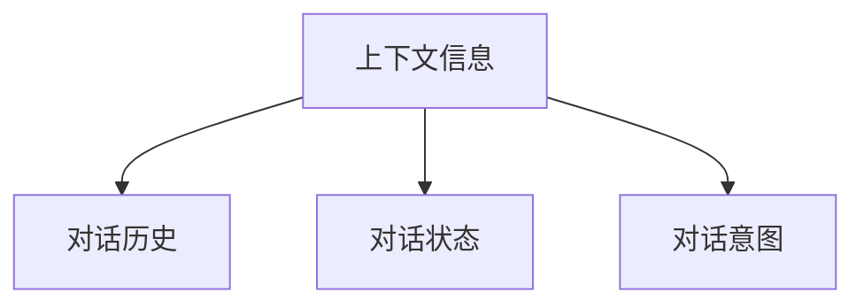

                 


# 对话式AI Agent的上下文管理技巧

> 关键词：对话式AI Agent、上下文管理、自然语言处理、知识图谱、机器学习

> 摘要：本文深入探讨对话式AI Agent的上下文管理技巧，涵盖上下文管理的核心概念、算法原理、系统架构设计、项目实战及最佳实践。通过分析对话式AI Agent的上下文管理问题，提出解决方案，并结合实际案例，详细讲解如何实现高效的上下文管理，帮助读者掌握对话式AI Agent的核心技术。

---

## 第一部分：对话式AI Agent的上下文管理背景与概念

### 第1章：上下文管理的定义与问题背景

#### 1.1 上下文管理的核心概念
- **上下文管理的定义**：上下文管理是指在对话过程中，对对话历史、当前状态、用户意图等信息进行收集、存储、关联和推理的过程，以确保对话的连贯性和准确性。
- **问题背景与挑战**：
  - 对话历史信息的动态变化。
  - 上下文信息的有效性和准确性。
  - 多轮对话中的信息关联与一致性。
- **上下文管理的目标与意义**：通过有效的上下文管理，提升对话式AI Agent的理解能力和响应准确性，增强用户体验。

#### 1.2 对话式AI Agent的基本概念
- **对话式AI Agent的定义**：对话式AI Agent是一种能够通过自然语言与用户进行交互的智能系统，能够理解和生成人类语言，并根据上下文信息提供相应的服务或反馈。
- **对话式AI Agent的核心功能**：
  - 语义理解：理解用户输入的意图和情感。
  - 上下文管理：维护对话过程中的相关信息。
  - 自然语言生成：生成符合上下文的回复。
- **对话式AI Agent的应用场景**：
  - 智能客服：解决用户问题，提供咨询服务。
  - 智能助手：帮助用户完成日常任务。
  - 智能对话机器人：提供娱乐、教育等服务。

### 第2章：上下文管理的关键问题与解决方案

#### 2.1 上下文管理的主要问题
- **上下文信息的获取与存储**：
  - 如何高效地收集对话历史信息。
  - 如何存储和检索上下文信息。
- **上下文信息的有效性与准确性**：
  - 如何避免信息冗余或不准确。
  - 如何处理歧义信息。
- **上下文信息的关联性与一致性**：
  - 如何建立信息之间的关联关系。
  - 如何保证信息的一致性。

#### 2.2 上下文管理的解决方案
- **上下文信息的结构化表示**：
  - 使用知识图谱或语义网络表示上下文信息。
- **上下文信息的动态更新与维护**：
  - 基于规则或机器学习模型动态更新上下文信息。
- **上下文信息的安全与隐私保护**：
  - 确保上下文信息的安全存储和传输。

---

## 第二部分：对话式AI Agent的上下文管理核心概念与联系

### 第3章：上下文管理的原理与机制

#### 3.1 上下文管理的原理
- **上下文信息的收集与解析**：
  - 通过自然语言处理技术提取对话中的实体、关系和意图。
- **上下文信息的存储与检索**：
  - 使用数据库或知识图谱存储上下文信息。
  - 基于关键词或语义检索上下文信息。
- **上下文信息的关联与推理**：
  - 建立上下文信息之间的关联关系。
  - 使用推理算法推断隐含信息。

#### 3.2 上下文管理的机制
- **基于规则的上下文管理**：
  - 使用预定义的规则处理上下文信息。
- **基于知识图谱的上下文管理**：
  - 使用知识图谱表示上下文信息，并进行语义推理。
- **基于机器学习的上下文管理**：
  - 使用深度学习模型（如Transformer）学习上下文信息。

### 第4章：核心概念与联系

#### 4.1 上下文管理的核心概念对比
| 概念       | 定义                                   | 特点                                   |
|------------|--------------------------------------|--------------------------------------|
| 对话历史   | 对话过程中所有交互的记录             | 时间序列，包含对话内容和用户行为     |
| 对话状态   | 当前对话的上下文信息                 | 包括当前任务、用户意图和系统状态       |
| 对话意图   | 用户在当前对话中期望实现的目标       | 明确或隐含的意图，需要上下文推理       |

#### 4.2 实体关系图架构（ER图）


### 第5章：算法原理与数学模型

#### 5.1 上下文管理的算法原理
- **基于规则的上下文管理算法**：
  ```python
  def rule_based_context_management(context):
      if context['intent'] == 'book_hotel':
          return 'need_room_type' in context
      else:
          return None
  ```
- **基于机器学习的上下文管理算法**：
  ```python
  import torch
  class ContextModel(torch.nn.Module):
      def __init__(self):
          super().__init__()
          self.embedding = torch.nn.Embedding(100, 50)
          self.lstm = torch.nn.LSTM(50, 50, 1)
      def forward(self, input):
          embedded = self.embedding(input)
          output, _ = self.lstm(embedded)
          return output
  ```
- **数学模型**：
  - 语义相似度计算：$similarity = \frac{向量点积}{向量长度}$
  - 概率计算：$P(A|B) = \frac{P(B|A)P(A)}{P(B)}$

---

## 第三部分：对话式AI Agent的上下文管理系统分析与架构设计

### 第6章：系统分析与架构设计方案

#### 6.1 问题场景介绍
- **问题场景**：在多轮对话中，如何高效地管理上下文信息，确保对话的连贯性和准确性。
- **项目介绍**：设计一个基于知识图谱的对话式AI Agent上下文管理系统，支持上下文信息的动态更新和推理。

#### 6.2 系统功能设计
- **领域模型类图**：
  ```mermaid
  classDiagram
      class ContextManager {
          +context: dict
          +knowledge_graph: KnowledgeGraph
          -current_state: dict
          +update_context(data: dict): void
          +get_context(): dict
          +infer_intent(): str
      }
      class KnowledgeGraph {
          +entities: list
          +relations: list
          +query_entity(entity: str): Entity
          +query_relation(entity1: str, relation: str): list
      }
  ```

- **系统架构设计**：
  ```mermaid
  diagram
      API Gateway --> ContextManager
      ContextManager --> KnowledgeGraph
      ContextManager --> NLU
      NLU --> NLG
  ```

- **系统接口设计**：
  - `update_context(data: dict)`: 更新上下文信息。
  - `get_context()`: 获取当前上下文信息。
  - `infer_intent()`: 推理用户意图。

- **系统交互流程图**：
  ```mermaid
  sequenceDiagram
      User -> API Gateway: 发送对话请求
      API Gateway -> ContextManager: 获取上下文信息
      ContextManager -> KnowledgeGraph: 查询相关知识
      ContextManager -> NLU: 解析用户意图
      NLU -> NLG: 生成回复
      NLG -> User: 返回回复
  ```

---

## 第四部分：对话式AI Agent的上下文管理项目实战

### 第7章：项目实战与案例分析

#### 7.1 环境安装
- **Python环境**：安装Python 3.8及以上版本。
- **依赖库安装**：
  ```bash
  pip install numpy torch networkx
  ```

#### 7.2 系统核心实现源代码
- **上下文管理模块**：
  ```python
  import networkx as nx

  class ContextManager:
      def __init__(self):
          self.context = {}
          self.graph = nx.Graph()

      def update_context(self, data):
          self.context.update(data)
          self._update_graph()

      def _update_graph(self):
          for key, value in self.context.items():
              self.graph.add_node(key)
              self.graph.add_edge(key, value)

      def get_context(self):
          return self.context

      def infer_intent(self):
          # 基于图的推理算法，此处简化实现
          return max(self.context.keys(), key=lambda x: len(self.graph[x]))
  ```

- **知识图谱构建模块**：
  ```python
  import networkx as nx

  class KnowledgeGraph:
      def __init__(self):
          self.graph = nx.Graph()

      def add_entity(self, entity):
          self.graph.add_node(entity)

      def add_relation(self, entity1, entity2):
          self.graph.add_edge(entity1, entity2)

      def query_entity(self, entity):
          return [n for n in self.graph.neighbors(entity)]
  ```

#### 7.3 代码应用解读与分析
- **上下文管理模块解读**：
  - `update_context`方法：更新上下文信息并维护知识图谱。
  - `_update_graph`方法：根据上下文信息构建知识图谱。
  - `infer_intent`方法：基于知识图谱推理用户意图。

- **知识图谱构建模块解读**：
  - `add_entity`方法：添加实体节点。
  - `add_relation`方法：添加实体之间的关系边。
  - `query_entity`方法：查询实体的邻居节点。

#### 7.4 实际案例分析
- **案例场景**：用户与AI Agent讨论预订酒店。
- **对话流程**：
  1. 用户：我需要预订一间酒店。
  2. AI Agent：请提供您的入住日期和离店日期。
  3. 用户：入住日期是2023年10月1日，离店日期是2023年10月5日。
  4. AI Agent：您需要什么类型的房间？
  5. 用户：需要双人间。
  6. AI Agent：以下是符合您要求的酒店列表。

#### 7.5 项目小结
- 通过代码实现了一个基于知识图谱的上下文管理系统。
- 系统能够动态更新上下文信息，并通过推理算法推断用户意图。
- 该系统可以应用于智能客服、智能助手等多种场景。

---

## 第五部分：对话式AI Agent的上下文管理最佳实践

### 第8章：最佳实践与注意事项

#### 8.1 最佳实践
- **上下文信息的结构化存储**：使用知识图谱或数据库结构化存储上下文信息。
- **上下文信息的安全性**：确保上下文信息的安全存储和传输。
- **上下文信息的动态更新**：根据对话进展动态更新上下文信息。
- **上下文信息的关联推理**：结合规则和机器学习模型进行上下文推理。

#### 8.2 小结
- 对话式AI Agent的上下文管理是实现高效对话交互的核心技术。
- 通过结构化存储、动态更新和关联推理，可以提升对话的连贯性和准确性。
- 结合知识图谱和机器学习模型，可以进一步提升上下文管理的能力。

#### 8.3 注意事项
- **避免信息冗余**：合理设计上下文信息的存储和检索机制。
- **处理歧义信息**：通过上下文推理消除歧义。
- **保护用户隐私**：确保上下文信息的安全性和隐私性。

#### 8.4 拓展阅读
- 《自然语言处理实战：基于深度学习的对话系统》
- 《知识图谱构建与应用》
- 《对话式AI Agent的设计与实现》

---

## 作者：AI天才研究院/AI Genius Institute & 禅与计算机程序设计艺术/Zen And The Art of Computer Programming

---

通过本文的详细讲解，读者可以全面了解对话式AI Agent的上下文管理技巧，从核心概念到算法实现，再到系统架构和项目实战，为实际应用提供了丰富的理论和实践指导。

