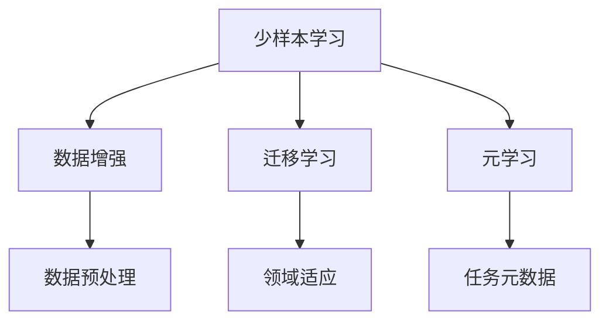
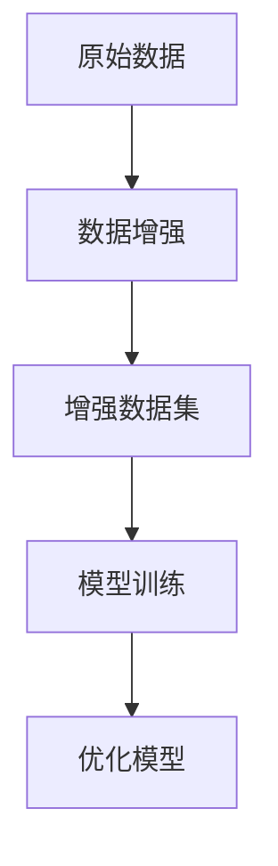
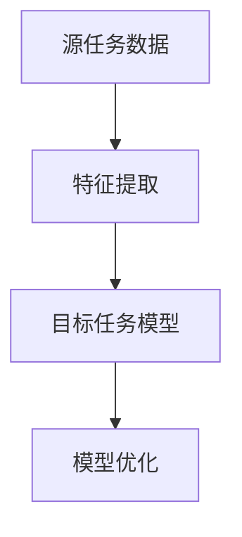
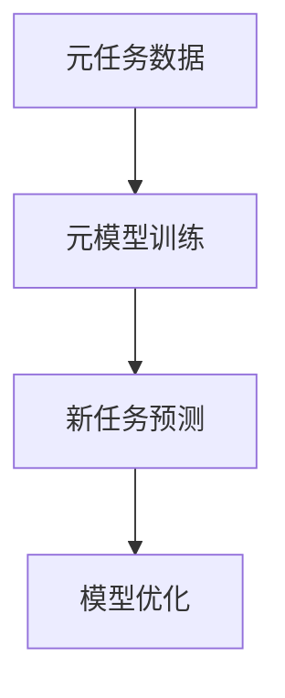
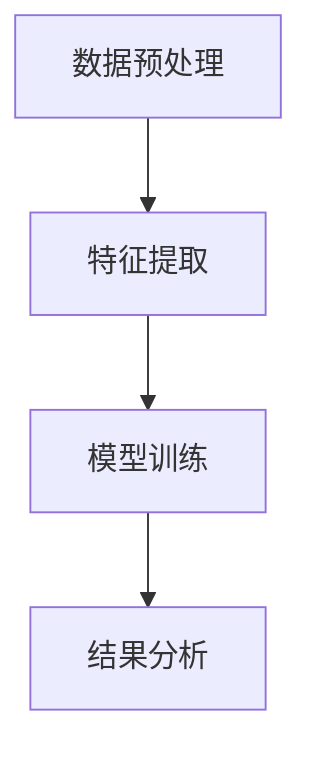

                 


# 少样本学习：在有限数据下快速适应

> 关键词：少样本学习，数据增强，迁移学习，元学习，小样本数据，模型优化，深度学习

> 摘要：在深度学习领域，数据量的大小往往决定了模型的性能。然而，在许多实际场景中，获取大量数据往往是困难的。少样本学习（Few-shot Learning）正是为了解决这一问题而提出的，它能够在有限的数据下快速适应新任务。本文将从少样本学习的背景、核心概念、算法原理、系统架构到项目实战，全面解析这一技术，帮助读者理解其本质和应用。

---

# 第一部分: 少样本学习的背景与核心概念

## 第1章: 少样本学习的背景与问题描述

### 1.1 少样本学习的定义与背景

#### 1.1.1 数据驱动时代的挑战
在深度学习领域，数据是训练模型的基石。传统深度学习方法通常需要成千上万的标注数据来训练模型。然而，在许多实际场景中，获取大量标注数据往往面临以下挑战：

- **成本高昂**：数据标注需要大量的人力和时间，尤其是在医学、法律等领域。
- **数据获取困难**：某些领域（如小众语言、特定场景）可能难以获取足够的数据。
- **数据隐私问题**：在医疗和金融领域，数据隐私限制了数据的获取和共享。

#### 1.1.2 少样本学习的提出与意义
少样本学习（Few-shot Learning）是一种新兴的机器学习方法，旨在在仅使用少量标注数据的情况下，快速适应新任务。其意义在于：

- **降低数据获取成本**：通过利用未标注数据和已有知识，减少对标注数据的依赖。
- **提高模型泛化能力**：在数据有限的情况下，模型需要更好地利用数据中的信息，从而提高泛化能力。
- **扩展应用场景**：在数据稀有的领域（如小语种、小众领域）中，少样本学习能够帮助模型快速学习和适应。

#### 1.1.3 少样本学习的应用场景
少样本学习适用于以下场景：

- **医学影像分析**：在某些疾病案例中，标注的样本可能非常有限。
- **小语种自然语言处理**：在数据稀缺的小语种中，快速构建语言模型。
- **个性化推荐系统**：针对特定用户的个性化推荐，数据量通常有限。

---

### 1.2 少样本学习的核心问题

#### 1.2.1 数据不足的挑战
在数据量有限的情况下，模型训练面临以下挑战：

- **过拟合风险**：模型可能过于依赖训练数据，导致泛化能力不足。
- **特征提取能力受限**：数据量不足可能导致模型无法充分提取有用的特征。

#### 1.2.2 模型泛化的局限性
传统深度学习模型通常依赖大量数据来学习特征。在数据有限的情况下，模型的泛化能力受到限制，具体表现为：

- **特征提取不足**：模型可能无法充分学习到数据的深层特征。
- **类别区分能力有限**：在类别较少的情况下，模型可能难以有效区分不同类别。

#### 1.2.3 少样本学习的目标与边界
少样本学习的目标是在有限数据下，快速适应新任务。其边界包括：

- **数据量的下限**：通常指仅有几个或几十个标注样本。
- **任务适应性**：能够在不同任务之间快速迁移和适应。
- **模型泛化能力**：在新数据上具有较好的预测能力。

---

## 第2章: 少样本学习的核心概念与联系

### 2.1 核心概念原理

#### 2.1.1 数据增强的原理
数据增强是通过人为增加训练数据的多样性，以提高模型的泛化能力。常见的数据增强方法包括：

- **图像数据增强**：旋转、翻转、裁剪、添加噪声等。
- **文本数据增强**：同义词替换、句式变换等。

#### 2.1.2 迁移学习的原理
迁移学习是将一个任务上学到的知识迁移到另一个任务上。其核心思想是利用源任务的数据来增强目标任务的学习能力。

- **特征提取**：在源任务上预训练一个模型，提取特征后用于目标任务。
- **参数共享**：共享部分网络参数，减少目标任务的训练数据需求。

#### 2.1.3 元学习的原理
元学习是一种通过学习如何快速学习新任务的方法。其核心思想是通过“学习如何学习”，从而在新任务上快速适应。

- **元模型**：元模型用于指导新任务的学习过程。
- **任务元数据**：记录不同任务的特征和关系，用于快速迁移。

---

### 2.2 核心概念对比表

| 方法类型 | 核心思想 | 优缺点 | 适用场景 |
|----------|----------|--------|----------|
| 数据增强 | 增加数据多样性 | 计算开销低，但可能引入噪声 | 数据量极小的情况 |
| 迁移学习 | 利用已有任务数据 | 适用于跨任务学习，但需要相关任务数据 | 数据量有限但可迁移的任务 |
| 元学习 | 学会快速学习新任务 | 适用于多种任务，但计算开销较高 | 多任务学习场景 |

---

### 2.3 实体关系图



---

## 第3章: 基于数据增强的少样本学习算法

### 3.1 数据增强算法流程



---

### 3.2 数据增强的Python实现

```python
import numpy as np
from tensorflow.keras.preprocessing.image import ImageDataGenerator

# 示例数据增强生成器
datagen = ImageDataGenerator(
    rotation_range=20,
    width_shift_range=0.2,
    height_shift_range=0.2,
    shear_range=0.2,
    zoom_range=0.2,
    horizontal_flip=True,
    vertical_flip=False,
    fill_mode='nearest'
)

# 生成增强数据
for batch in datagen.flow(x_train, y_train, batch_size=32, epochs=1):
    images, labels = batch[0], batch[1]
    # 进一步处理 images 和 labels
    break
```

---

### 3.3 数据增强的数学模型

数据增强可以通过仿射变换表示：

$$
\begin{cases}
x' = x \cos \theta - y \sin \theta \\
y' = x \sin \theta + y \cos \theta
\end{cases}
$$

其中，$\theta$ 是旋转角度。

---

## 第4章: 基于迁移学习的少样本学习算法

### 4.1 迁移学习的算法流程



---

### 4.2 迁移学习的Python实现

```python
import tensorflow as tf
from tensorflow.keras.applications import VGG16
from tensorflow.keras.layers import Dense, GlobalAveragePooling2D
from tensorflow.keras.models import Model

# 加载预训练模型
base_model = VGG16(weights='imagenet', include_top=False)

# 构建迁移学习模型
x = base_model.output
x = GlobalAveragePooling2D()(x)
x = Dense(1024, activation='relu')(x)
predictions = Dense(num_classes, activation='softmax')(x)

model = Model(inputs=base_model.input, outputs=predictions)

# 冻结预训练层
for layer in base_model.layers:
    layer.trainable = False

model.compile(optimizer='adam', loss='categorical_crossentropy', metrics=['accuracy'])
```

---

### 4.3 迁移学习的数学模型

特征提取层的输出可以表示为：

$$
f(x) = \text{ReLU}(Wx + b)
$$

目标任务模型的输出为：

$$
g(f(x)) = \text{softmax}(W'f(x) + b')
$$

---

## 第5章: 基于元学习的少样本学习算法

### 5.1 元学习的算法流程



---

### 5.2 元学习的Python实现

```python
import tensorflow as tf
from tensorflow.keras import Model, Input, Dense, Embedding, Concatenate

# 元模型输入
input_support = Input(shape=(None, input_dim))
input_query = Input(shape=(None, input_dim))

# 支持集嵌入
support_embeddings = Embedding(num_classes, embedding_dim)(input_support)
support_embeddings = Dense(embedding_dim, activation='relu')(support_embeddings)

# 查询集嵌入
query_embeddings = Embedding(num_classes, embedding_dim)(input_query)
query_embeddings = Dense(embedding_dim, activation='relu')(query_embeddings)

# 元模型输出
merged = Concatenate()([support_embeddings, query_embeddings])
output = Dense(num_classes, activation='softmax')(merged)

model = Model(inputs=[input_support, input_query], outputs=output)
model.compile(optimizer='adam', loss='categorical_crossentropy', metrics=['accuracy'])
```

---

### 5.3 元学习的数学模型

元模型的输出可以表示为：

$$
p(y|X) = \text{softmax}(W y + b)
$$

其中，$y$ 是元模型的输入特征，$W$ 和 $b$ 是元模型的参数。

---

## 第6章: 系统分析与架构设计

### 6.1 问题场景介绍

假设我们有一个医疗影像分类任务，目标是基于少量的标注影像数据，快速训练一个能够识别罕见疾病的分类器。

---

### 6.2 系统功能设计

#### 6.2.1 数据预处理模块
- 数据清洗：去除噪声数据。
- 数据增强：增加数据多样性。

#### 6.2.2 模型训练模块
- 特征提取：使用预训练模型提取特征。
- 模型优化：调整模型参数，提高准确率。

#### 6.2.3 结果分析模块
- 准确率计算：评估模型性能。
- 可视化分析：分析模型预测结果。

---

### 6.3 系统架构设计



---

### 6.4 系统接口设计

- 数据输入接口：接收原始影像数据。
- 模型训练接口：启动模型训练过程。
- 结果输出接口：输出模型预测结果。

---

### 6.5 系统交互流程

```mermaid
sequenceDiagram
    participant A as 用户
    participant B as 数据预处理模块
    participant C as 模型训练模块
    participant D as 结果分析模块

    A -> B: 提交影像数据
    B -> C: 启动模型训练
    C -> D: 输出训练结果
    A <- D: 显示分析结果
```

---

## 第7章: 项目实战

### 7.1 环境安装

- 安装Python和必要的库：
  ```bash
  pip install tensorflow keras matplotlib numpy
  ```

---

### 7.2 系统核心实现源代码

```python
import tensorflow as tf
from tensorflow.keras.applications import VGG16
from tensorflow.keras.layers import Dense, GlobalAveragePooling2D
from tensorflow.keras.models import Model
from tensorflow.keras.preprocessing.image import ImageDataGenerator

# 数据增强生成器
datagen = ImageDataGenerator(
    rotation_range=20,
    width_shift_range=0.2,
    height_shift_range=0.2,
    shear_range=0.2,
    zoom_range=0.2,
    horizontal_flip=True,
    vertical_flip=False,
    fill_mode='nearest'
)

# 加载预训练模型
base_model = VGG16(weights='imagenet', include_top=False)

# 构建迁移学习模型
x = base_model.output
x = GlobalAveragePooling2D()(x)
x = Dense(1024, activation='relu')(x)
predictions = Dense(num_classes, activation='softmax')(x)

model = Model(inputs=base_model.input, outputs=predictions)

# 冻结预训练层
for layer in base_model.layers:
    layer.trainable = False

model.compile(optimizer='adam', loss='categorical_crossentropy', metrics=['accuracy'])

# 训练模型
model.fit_generator(datagen.flow(x_train, y_train, batch_size=32), epochs=10, verbose=1)
```

---

### 7.3 代码应用解读与分析

- 数据增强生成器用于增加训练数据的多样性。
- 预训练模型（如VGG16）用于提取特征。
- 迁移学习模型在目标任务上进行微调，以适应少量数据。

---

### 7.4 实际案例分析

以医疗影像分类为例，假设我们有少量的标注数据，通过数据增强和迁移学习，可以显著提高模型的性能。

---

### 7.5 项目小结

通过数据增强和迁移学习，我们可以在有限的数据下，快速训练出高性能的模型。然而，实际应用中还需要考虑模型的泛化能力和过拟合问题。

---

## 第8章: 总结与展望

### 8.1 总结

少样本学习是一种能够在有限数据下快速适应新任务的技术。通过数据增强、迁移学习和元学习等方法，可以在数据稀缺的情况下，提高模型的泛化能力和预测性能。

---

### 8.2 当前研究热点

- **小样本学习（Few-shot Learning）**：研究如何在极少量数据下训练模型。
- **零样本学习（Zero-shot Learning）**：研究在无标注数据的情况下，利用外部知识进行学习。
- **多任务学习（Multi-task Learning）**：研究如何在多个任务之间共享知识，提高数据利用率。

---

### 8.3 未来研究方向

- **更高效的数据增强方法**：减少数据增强带来的噪声，提高数据质量。
- **更强大的迁移学习框架**：设计能够更好适应不同任务的迁移学习模型。
- **结合元学习的少样本学习**：探索元学习与少样本学习的结合，提高模型的泛化能力。

---

## 第9章: 最佳实践 Tips

### 9.1 小结

少样本学习是一种重要的技术，能够在数据稀缺的情况下，提高模型的性能。

---

### 9.2 注意事项

- 数据增强可能会引入噪声，需要谨慎处理。
- 迁移学习需要选择合适的预训练模型和任务。
- 元学习需要更多的计算资源，可能不适合小规模项目。

---

### 9.3 拓展阅读

- [《Deep Learning》—— Ian Goodfellow](https://www.deeplearningbook.org/)
- [《Pattern Recognition and Machine Learning》—— Christopher M. Bishop](https://www.springer.com/gp/book/9781846281658)

---

作者：AI天才研究院/AI Genius Institute & 禅与计算机程序设计艺术/Zen And The Art of Computer Programming

