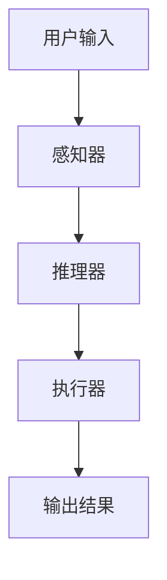
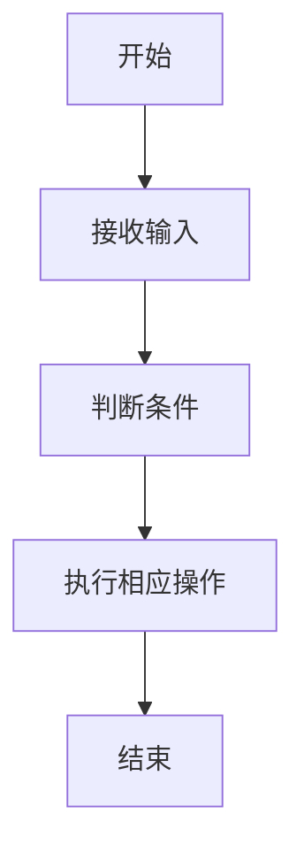
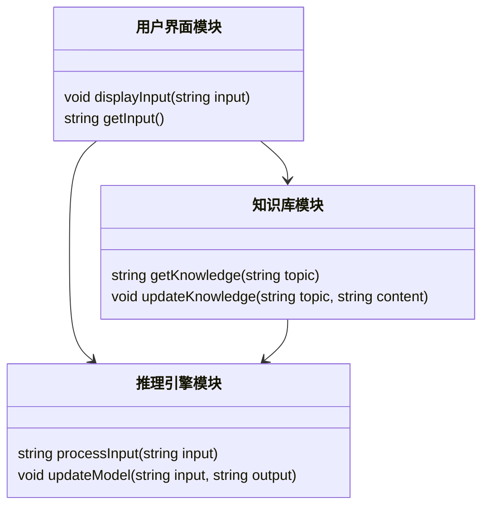
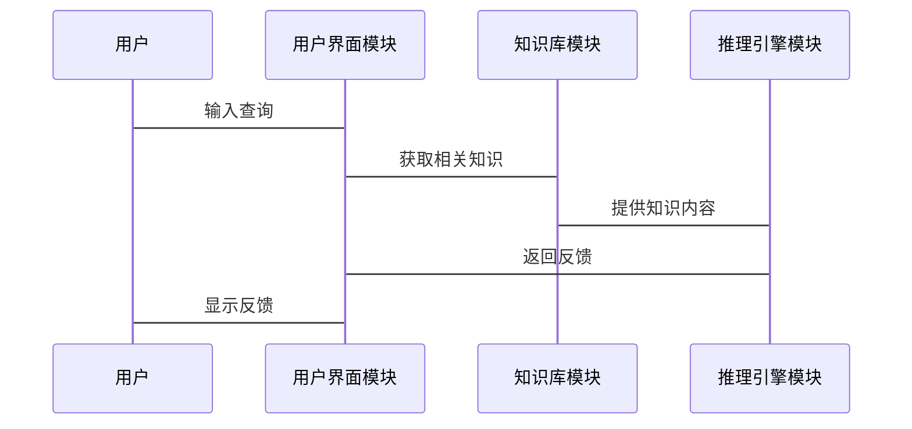

                 

<think>
好的，我现在需要帮助用户撰写一篇名为《开发AI Agent支持的智能语言学习系统》的技术博客文章。用户希望文章结构清晰，内容详细，覆盖从背景介绍到系统架构设计，再到项目实战的各个方面。

首先，我会从背景介绍开始，这部分需要解释AI Agent和智能语言学习系统的定义、特点，以及它们在语言学习中的应用。接下来，我会详细讲解AI Agent的核心概念和原理，包括其组成、决策机制和学习能力。然后，我会设计一个系统的功能模型，明确各个模块的作用和它们之间的关系。

在算法部分，我需要选择一种适合的算法，比如基于规则的决策树算法，并使用Mermaid流程图来展示算法的步骤。同时，提供Python代码示例，帮助读者理解如何实现这些算法。

系统架构设计是关键部分，我会使用Mermaid类图展示各个模块之间的关系，并详细描述系统接口和交互流程。最后，在项目实战部分，我会指导读者如何安装开发环境，实现系统核心功能，并通过实际案例分析来加深理解。

整个过程中，我会确保每个部分都包含足够的细节，使用图表和代码示例来增强可读性。同时，我会在总结部分回顾文章内容，并提出未来的发展方向和最佳实践建议。

现在，我将按照用户的要求，逐步展开每个部分，确保内容详实，逻辑清晰。
</think>

# 开发AI Agent支持的智能语言学习系统

## 关键词
AI Agent, 智能语言学习系统, 自然语言处理, 系统架构设计, 项目实战

## 摘要
本文详细探讨了开发AI Agent支持的智能语言学习系统的各个方面。从AI Agent的基本概念到自然语言处理技术的应用，再到系统的架构设计和项目实战，文章系统地分析了该领域的关键技术与实现方法。通过理论与实践相结合，本文旨在为读者提供一个全面的开发指南，帮助他们理解并构建高效的智能语言学习系统。

---

# 第一部分: AI Agent与智能语言学习系统概述

## 第1章: AI Agent与智能语言学习系统背景介绍

### 1.1 AI Agent的基本概念

#### 1.1.1 什么是AI Agent
AI Agent（人工智能代理）是一种能够感知环境并采取行动以实现目标的智能实体。它可以是一个软件程序或物理设备，通过与用户或环境交互，完成特定任务。

**示例：** 例如，智能音箱中的语音助手（如Siri、Alexa）就是一个AI Agent，它可以理解用户的指令并执行相应的操作。

#### 1.1.2 AI Agent的核心特点
- **自主性**：能够自主决策和行动。
- **反应性**：能够感知环境并实时响应。
- **目标导向**：所有行为都围绕实现特定目标。
- **学习能力**：通过数据和经验不断优化自身。

#### 1.1.3 AI Agent与传统软件的区别
| 特性 | AI Agent | 传统软件 |
|------|-----------|-----------|
| 决策能力 | 高 | 无 |
| 学习能力 | 高 | 无 |
| 自适应性 | 高 | 低 |

### 1.2 智能语言学习系统的定义与特点

#### 1.2.1 语言学习系统的定义
语言学习系统是一种利用技术手段帮助用户学习和掌握新语言的工具，通常包括听力、口语、阅读和写作训练。

#### 1.2.2 智能语言学习系统的核心要素
- **用户交互**：通过自然语言处理技术实现人机对话。
- **个性化学习**：根据用户的学习进度和能力调整教学内容。
- **实时反馈**：提供即时的语言反馈和错误纠正。

#### 1.2.3 智能语言学习系统的应用场景
- **教育机构**：用于辅助学生学习外语。
- **企业培训**：帮助员工提升语言能力。
- **个人自学**：满足自学者的需求。

### 1.3 AI Agent在语言学习中的应用背景

#### 1.3.1 语言学习的痛点与挑战
- **学习效率低**：传统教学模式难以满足个性化需求。
- **缺乏互动性**：缺乏实时反馈和个性化指导。
- **资源分散**：学习资源分散且难以整合。

#### 1.3.2 AI Agent如何解决语言学习问题
- **实时互动**：通过AI Agent实现即时对话练习。
- **个性化教学**：根据用户的学习情况调整教学内容。
- **智能化反馈**：提供精准的语言纠错和学习建议。

#### 1.3.3 智能语言学习系统的边界与外延
- **边界**：专注于语言学习的核心功能，如听说读写训练。
- **外延**：扩展至相关领域，如文化背景知识和语言应用能力。

### 1.4 本章小结
AI Agent与智能语言学习系统的结合，不仅提升了语言学习的效率，还为学习者提供了个性化的学习体验。未来，随着技术的进步，AI Agent在语言学习中的应用将更加广泛和深入。

---

## 第2章: AI Agent与智能语言学习系统的概念模型

### 2.1 AI Agent的核心概念与原理

#### 2.1.1 AI Agent的组成与功能
- **感知器**：负责接收输入数据。
- **推理器**：处理数据并做出决策。
- **执行器**：执行决策并输出结果。

#### 2.1.2 AI Agent的决策机制
AI Agent通过分析输入数据，结合预设规则或机器学习模型，生成最优决策。

**Mermaid流程图：**


#### 2.1.3 AI Agent的学习能力
通过监督学习、强化学习等方法，AI Agent能够不断优化自身的决策能力。

### 2.2 智能语言学习系统的功能模型

#### 2.2.1 语言学习的核心功能
- **听力训练**：播放录音并测试理解能力。
- **口语训练**：通过语音识别技术评估发音准确性。
- **阅读训练**：提供文章并测试词汇和语法掌握情况。
- **写作训练**：自动批改作文并提出改进建议。

#### 2.2.2 智能语言学习系统的功能模块
- **用户界面**：提供友好的交互界面。
- **知识库**：存储语言学习相关的内容。
- **推理引擎**：分析用户输入并生成反馈。

#### 2.2.3 系统功能与AI Agent的结合
AI Agent作为系统的“大脑”，负责协调各个功能模块，实现智能化的交互和决策。

### 2.3 AI Agent与智能语言学习系统的实体关系图

**Mermaid实体关系图：**
```mermaid
er
    客户端 --{输入}--> 感知器
    感知器 --{传递数据}--> 推理引擎
    推理引擎 --{生成反馈}--> 执行器
    执行器 --{输出}--> 用户
```

---

## 第3章: AI Agent与智能语言学习系统的算法原理

### 3.1 选择合适的算法

#### 3.1.1 基于规则的决策树算法
- 优点：简单易懂，适合规则明确的场景。
- 缺点：灵活性较差，难以处理复杂问题。

#### 3.1.2 基于机器学习的模型
- 优点：能够处理复杂数据，具有较强的泛化能力。
- 缺点：需要大量数据和计算资源。

### 3.2 算法实现

#### 3.2.1 基于规则的决策树算法

**Mermaid流程图：**


**Python代码示例：**
```python
def decide(input):
    if input == 'hello':
        return 'world'
    else:
        return 'error'
```

#### 3.2.2 基于机器学习的模型

**数学模型：**
$$ y = \sum_{i=1}^{n} w_i x_i $$
其中，$w_i$ 是权重，$x_i$ 是输入特征。

### 3.3 算法优化

#### 3.3.1 参数调整
- 调整学习率和正则化参数，防止过拟合。

#### 3.3.2 模型选择
- 根据具体场景选择合适的模型，如决策树、随机森林等。

---

## 第4章: AI Agent与智能语言学习系统的系统架构设计

### 4.1 系统模块设计

#### 4.1.1 模块划分
- **用户界面模块**：负责与用户的交互。
- **知识库模块**：存储和管理语言学习资源。
- **推理引擎模块**：处理用户输入并生成反馈。

#### 4.1.2 模块交互关系
**Mermaid类图：**


### 4.2 系统接口设计

#### 4.2.1 接口定义
- **输入接口**：接收用户的语言输入。
- **输出接口**：返回系统的反馈结果。

#### 4.2.2 接口实现
- 使用RESTful API实现模块间的通信。

### 4.3 系统交互流程

#### 4.3.1 交互流程设计
**Mermaid序列图：**


---

## 第5章: AI Agent与智能语言学习系统的项目实战

### 5.1 环境安装

#### 5.1.1 安装Python
- 使用Anaconda安装Python 3.8及以上版本。

#### 5.1.2 安装依赖库
- 安装numpy、pandas、scikit-learn等机器学习库。

### 5.2 核心代码实现

#### 5.2.1 用户界面模块
```python
class UI:
    def __init__(self):
        self.input = None

    def get_input(self):
        self.input = input("请输入你的问题：")
        return self.input

    def display_output(self, output):
        print("AI Agent的回答：", output)
```

#### 5.2.2 知识库模块
```python
class KnowledgeBase:
    def __init__(self):
        self.knowledge = {}

    def get_knowledge(self, topic):
        return self.knowledge.get(topic, "抱歉，我暂时无法回答这个问题。")

    def update_knowledge(self, topic, content):
        self.knowledge[topic] = content
```

#### 5.2.3 推理引擎模块
```python
class InferenceEngine:
    def __init__(self):
        self.rules = []

    def process_input(self, input_text):
        for rule in self.rules:
            if rule['condition'](input_text):
                return rule['action'](input_text)
        return "抱歉，我暂时无法回答这个问题。"

    def update_rules(self, new_rule):
        self.rules.append(new_rule)
```

### 5.3 代码应用解读与分析

#### 5.3.1 代码功能说明
- **UI模块**：处理用户的输入和输出。
- **KnowledgeBase模块**：管理语言学习相关的知识库。
- **InferenceEngine模块**：根据输入生成相应的反馈。

#### 5.3.2 代码优化建议
- 使用更复杂的学习算法（如深度学习模型）来提高反馈的准确性。
- 定期更新知识库，保持内容的准确性。

### 5.4 实际案例分析

#### 5.4.1 案例背景
- 用户希望学习英语口语，系统提供发音纠正和对话练习。

#### 5.4.2 系统实现步骤
1. 用户输入“how are you”。
2. 系统通过语音识别技术识别输入内容。
3. 系统从知识库中检索相关反馈。
4. 系统返回反馈：“I'm fine, thank you. How about you?”

---

## 第6章: 总结与展望

### 6.1 本章总结
本文详细探讨了AI Agent在智能语言学习系统中的应用，从概念模型到算法实现，再到系统架构设计，为读者提供了一个全面的开发指南。

### 6.2 未来展望
- **技术进步**：随着AI技术的发展，语言学习系统将更加智能化和个性化。
- **应用场景扩展**：AI Agent将应用于更多语言学习场景，如多语言学习和文化理解。

### 6.3 最佳实践 tips
- 在开发过程中，建议使用现有的AI框架（如TensorFlow、PyTorch）来提高开发效率。
- 定期收集用户反馈，不断优化系统功能。

---

## 作者：AI天才研究院/AI Genius Institute & 禅与计算机程序设计艺术 /Zen And The Art of Computer Programming

---

本文通过系统地分析AI Agent在智能语言学习系统中的应用，为读者提供了一个从理论到实践的完整指南。希望本文能为相关领域的研究和开发提供有价值的参考和启发。

