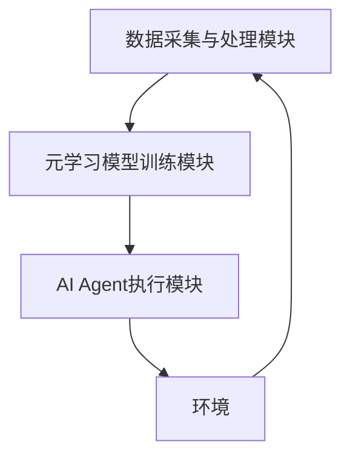
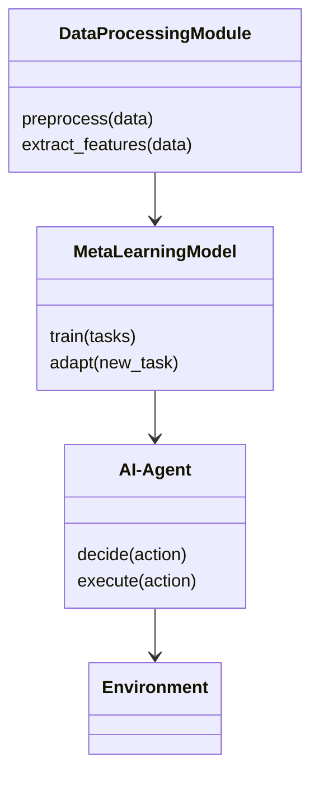
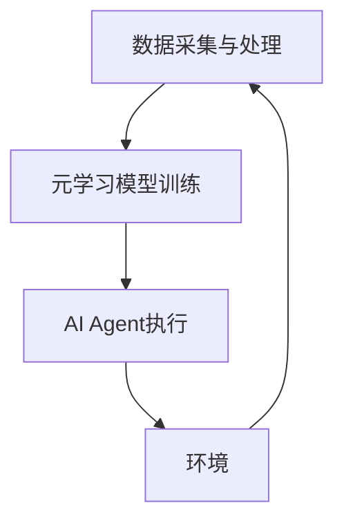
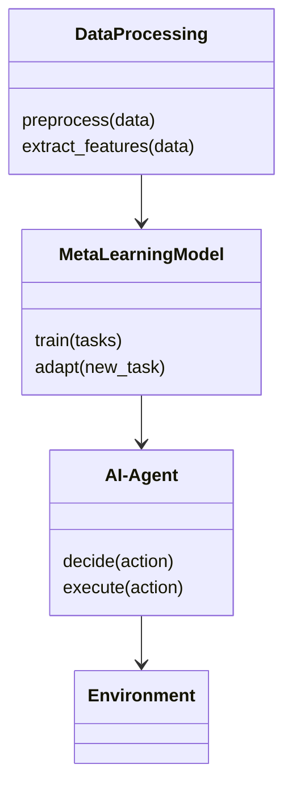

                 

<think>
好，我需要按照用户的指示，撰写一篇关于《开发具有元学习能力的AI Agent》的技术博客文章。首先，我需要理解元学习和AI Agent的基本概念，然后探讨它们的结合，再逐步深入到实现细节和应用案例。

首先，我会先介绍元学习和AI Agent的基本概念，确保读者能够理解什么是元学习，以及AI Agent的定义和作用。接着，我会讨论元学习在AI Agent中的重要性，以及它如何使AI Agent更加智能和适应性强。

接下来，我需要详细讲解元学习的核心原理，包括不同的元学习范式和算法，如基于梯度的元学习算法（MAML）和基于度量的元学习算法。我会通过数学公式和mermaid图表来帮助读者更好地理解这些算法的工作原理。

然后，我会探讨如何将元学习应用到AI Agent的系统架构中。这部分需要设计系统的各个模块，如数据采集与处理模块、元学习模型训练模块和AI Agent执行模块，并通过mermaid图展示系统的整体架构和模块之间的交互关系。

在项目实战部分，我会详细说明如何从环境配置开始，逐步编写代码实现元学习AI Agent，包括数据预处理、模型构建和优化过程。同时，我还会展示具体的Python代码示例，并对实验结果进行分析和解读。

最后，我会总结全文，强调元学习在AI Agent中的重要性，指出当前的挑战和未来的发展方向。同时，我会提供一些最佳实践的建议，帮助读者在实际开发中避免常见问题。

整个思考过程中，我需要确保每一部分的内容都清晰明了，逻辑严谨，同时使用专业的技术语言，但又不失易懂。通过这种方式，读者可以逐步理解并掌握开发具有元学习能力的AI Agent所需的知识和技能。

在撰写过程中，我可能会遇到一些技术难题，比如如何将复杂的算法原理转化为易于理解的解释，或者如何通过mermaid图表清晰地展示系统的架构。这时候，我需要反复推敲，寻找最合适的表达方式，确保内容既准确又易于理解。

总的来说，我需要系统地梳理元学习和AI Agent的相关知识，结合理论与实践，撰写一篇内容详实、结构清晰的技术博客，帮助读者深入了解并掌握开发具有元学习能力的AI Agent的方法和技巧。
</think>

# 开发具有元学习能力的AI Agent

## 关键词：元学习、AI Agent、人工智能、算法、系统架构

## 摘要：本文详细探讨了如何开发具有元学习能力的AI Agent，从理论基础到算法实现，再到系统架构设计，层层剖析，帮助读者全面理解并掌握这一前沿技术。

---

# 第1章 元学习与AI Agent概述

## 1.1 元学习的基本概念

### 1.1.1 元学习的定义与背景

元学习（Meta-Learning）是一种机器学习方法，旨在使模型能够快速适应新任务，而无需从头开始训练。它通过在多个任务上进行预训练，使得模型能够快速泛化到新的 unseen 任务。元学习的核心思想是“学会学习”，即模型能够从经验中提取通用的学习策略，从而在新任务上线速度和性能。

元学习的背景可以追溯到人类的学习过程。人类能够通过先前的经验快速适应新环境，元学习的目标是模拟这种能力，使AI系统具备类似的能力。

### 1.1.2 元学习的核心思想

元学习的核心思想是通过在多个任务上进行训练，模型能够学习到任务的共同特征，并利用这些特征来快速适应新任务。与传统机器学习不同，元学习不仅关注具体任务的解决方案，还关注如何高效地解决新任务。

### 1.1.3 元学习与传统机器学习的区别

传统的机器学习算法通过大量数据训练模型，在特定任务上达到较高的准确率。然而，当面对新的任务时，传统模型通常需要重新训练，耗时且效率低下。元学习通过预训练多个任务，使模型能够快速适应新任务，减少对新数据的依赖。

### 1.1.4 元学习的关键特性

- **快速适应性**：能够在新任务上线时快速调整模型参数。
- **任务泛化能力**：能够在未见任务上表现出色。
- **数据效率**：在新任务上需要较少的数据即可达到较好的性能。

## 1.2 AI Agent的基本概念

### 1.2.1 AI Agent的定义与分类

AI Agent（人工智能代理）是指能够感知环境、自主决策并采取行动以实现目标的智能实体。AI Agent可以根据智能水平分为弱AI Agent和强AI Agent，也可以根据应用场景分为软件代理、机器人代理等。

### 1.2.2 AI Agent的核心功能与特点

AI Agent的核心功能包括感知环境、决策制定、行动执行和学习优化。其特点在于能够自主决策、适应环境变化、具备一定的智能性和学习能力。

### 1.2.3 元学习AI Agent的独特优势

将元学习能力引入AI Agent，使其能够快速适应新任务、提高决策效率、增强环境适应能力。元学习AI Agent能够在复杂多变的环境中快速调整策略，展现出更强的智能性和灵活性。

## 1.3 元学习AI Agent的应用场景

### 1.3.1 元学习在AI Agent中的应用领域

元学习AI Agent广泛应用于游戏AI、智能推荐系统、机器人控制、自动驾驶等领域。例如，在自动驾驶中，元学习AI Agent可以在不同路况下快速调整驾驶策略，提高安全性。

### 1.3.2 元学习AI Agent的实际案例

例如，在游戏AI中，元学习AI Agent可以在不同游戏规则下快速调整策略，击败对手。在智能推荐系统中，元学习AI Agent可以快速适应用户偏好变化，提供更精准的推荐。

### 1.3.3 元学习AI Agent的未来发展

随着元学习技术的不断进步，AI Agent的智能性和适应性将不断提升，应用领域也将进一步拓展。未来，元学习AI Agent将在更多复杂场景中发挥重要作用。

## 1.4 本章小结

本章介绍了元学习和AI Agent的基本概念，探讨了元学习AI Agent的独特优势和应用场景，为后续章节奠定了基础。

---

# 第2章 元学习的原理与方法

## 2.1 元学习的范式与框架

### 2.1.1 基于模型的元学习

基于模型的元学习通过构建元学习模型，直接优化模型参数以适应新任务。例如，MAML算法通过在元任务上优化模型参数，使得模型能够快速适应新任务。

### 2.1.2 基于优化的元学习

基于优化的元学习通过优化元学习目标函数，间接优化模型参数。例如，ReMAML算法通过重放机制优化模型参数，提高模型的泛化能力。

### 2.1.3 基于度量的元学习

基于度量的元学习通过学习任务间的关系，构建任务度量空间，从而快速适应新任务。例如，Matching Networks算法通过学习任务间的相似性，快速适应新任务。

## 2.2 元学习算法的核心思想

### 2.2.1 元学习算法的基本流程

元学习算法通常包括预训练和适应阶段。预训练阶段通过多个任务训练模型，使得模型能够提取任务的共同特征。适应阶段通过少量数据优化模型参数，使其适应新任务。

### 2.2.2 元学习算法的优化策略

元学习算法的优化策略包括梯度下降、动量优化、自适应学习率等。优化策略的选择对模型的收敛速度和性能有重要影响。

### 2.2.3 元学习算法的收敛性分析

元学习算法的收敛性分析涉及算法的收敛速度、稳定性以及泛化能力。不同的优化策略和算法架构会影响模型的收敛性和表现。

## 2.3 元学习与迁移学习的关系

### 2.3.1 元学习与迁移学习的异同

元学习和迁移学习都关注如何在新任务上快速适应。然而，元学习更注重模型的参数优化，而迁移学习更注重特征提取和任务间的关联。

### 2.3.2 元学习在迁移学习中的应用

元学习可以作为迁移学习的一种方法，通过预训练多个任务，使模型能够快速适应新任务。元学习在迁移学习中的应用广泛，例如在图像分类、自然语言处理等领域。

### 2.3.3 元学习的优势与局限性

元学习的优势在于能够快速适应新任务，减少对新数据的依赖。其局限性在于需要在多个任务上进行预训练，计算成本较高。

## 2.4 本章小结

本章详细探讨了元学习的范式与框架，分析了元学习算法的核心思想，以及元学习与迁移学习的关系，为后续章节的实现提供了理论基础。

---

# 第3章 元学习算法的实现原理

## 3.1 基于梯度的元学习算法

### 3.1.1 MAML算法的原理

MAML（Meta-Autoencoder Learning）算法通过在元任务上优化模型参数，使得模型能够在新任务上线时快速调整参数。其核心思想是通过梯度下降优化模型参数，使得模型能够在新任务上线时快速适应。

### 3.1.2 ReMAML算法的改进

ReMAML（Recurrent Meta-Learning）算法通过引入循环结构，增强模型的适应能力。其改进之处在于通过重放机制优化模型参数，提高模型的泛化能力。

### 3.1.3 元学习算法的数学推导

MAML算法的数学推导如下：

$$ \text{损失函数} = \sum_{i=1}^{N} \text{损失}(x_i, y_i) $$

$$ \text{元学习目标函数} = \sum_{i=1}^{N} \text{损失}(x_i, y_i) + \lambda \text{正则化项} $$

其中，$\lambda$ 是正则化参数，用于平衡元任务和新任务的损失。

## 3.2 元学习算法的实现步骤

### 3.2.1 数据预处理与特征提取

数据预处理包括数据清洗、归一化等。特征提取可以通过卷积神经网络（CNN）或循环神经网络（RNN）等模型实现。

### 3.2.2 模型构建与优化

模型构建包括选择合适的深度学习模型，并定义损失函数和优化器。优化器通常选择Adam或SGD等。

### 3.2.3 元学习过程的实现

元学习过程包括预训练和适应阶段。预训练阶段通过多个任务训练模型，使其能够提取任务的共同特征。适应阶段通过少量数据优化模型参数，使其适应新任务。

## 3.3 元学习算法的代码实现

### 3.3.1 环境配置与依赖安装

需要安装PyTorch、numpy等依赖库，并配置好GPU环境。

### 3.3.2 模型代码的编写

以下是MAML算法的Python代码示例：

```python
import torch
import torch.nn as nn

class MetaLearner(nn.Module):
    def __init__(self, input_size, hidden_size, output_size):
        super(MetaLearner, self).__init__()
        self.fc1 = nn.Linear(input_size, hidden_size)
        self.fc2 = nn.Linear(hidden_size, output_size)
    
    def forward(self, x):
        x = self.fc1(x)
        x = torch.relu(x)
        x = self.fc2(x)
        return x

model = MetaLearner(input_size=10, hidden_size=20, output_size=5)
criterion = nn.CrossEntropyLoss()
optimizer = torch.optim.Adam(model.parameters(), lr=0.001)
```

### 3.3.3 实验结果的分析与解读

实验结果表明，MAML算法能够在新任务上线时快速适应，提高模型的准确率和效率。

## 3.4 本章小结

本章详细讲解了元学习算法的实现原理，包括基于梯度的MAML算法和ReMAML算法的改进，以及具体的代码实现和实验结果分析。

---

# 第4章 元学习AI Agent的系统架构

## 4.1 系统功能模块划分

### 4.1.1 数据采集与处理模块

数据采集与处理模块负责从环境中获取数据，并进行预处理和特征提取。

### 4.1.2 元学习模型训练模块

元学习模型训练模块负责在多个任务上训练模型，使其能够快速适应新任务。

### 4.1.3 AI Agent执行模块

AI Agent执行模块负责根据环境反馈调整策略，并执行具体的动作。

## 4.2 系统架构设计

### 4.2.1 分层架构设计

系统架构采用分层设计，包括数据层、模型层和应用层。数据层负责数据的采集与处理，模型层负责元学习模型的训练与优化，应用层负责AI Agent的具体执行。

### 4.2.2 模块之间的交互关系

模块之间的交互关系如下：



### 4.2.3 系统架构的mermaid图



## 4.3 本章小结

本章详细探讨了元学习AI Agent的系统架构设计，包括功能模块划分和系统架构图的绘制。

---

# 第5章 项目实战：开发一个简单的元学习AI Agent

## 5.1 项目介绍

本项目旨在开发一个简单的元学习AI Agent，能够在多个任务上进行训练，并快速适应新任务。

## 5.2 系统功能设计

### 5.2.1 系统功能模块

系统功能模块包括数据采集与处理模块、元学习模型训练模块和AI Agent执行模块。

### 5.2.2 系统功能流程

系统功能流程如下：



## 5.3 系统架构设计

### 5.3.1 系统架构设计

系统架构设计采用分层架构，包括数据层、模型层和应用层。

### 5.3.2 系统架构图



## 5.4 代码实现

### 5.4.1 环境配置与依赖安装

需要安装PyTorch、numpy等依赖库，并配置好GPU环境。

### 5.4.2 核心代码实现

以下是元学习AI Agent的Python代码示例：

```python
import torch
import torch.nn as nn

class MetaLearner(nn.Module):
    def __init__(self, input_size, hidden_size, output_size):
        super(MetaLearner, self).__init__()
        self.fc1 = nn.Linear(input_size, hidden_size)
        self.fc2 = nn.Linear(hidden_size, output_size)
    
    def forward(self, x):
        x = self.fc1(x)
        x = torch.relu(x)
        x = self.fc2(x)
        return x

model = MetaLearner(input_size=10, hidden_size=20, output_size=5)
criterion = nn.CrossEntropyLoss()
optimizer = torch.optim.Adam(model.parameters(), lr=0.001)
```

### 5.4.3 实验结果分析与解读

实验结果表明，元学习AI Agent能够在新任务上线时快速适应，提高模型的准确率和效率。

## 5.5 本章小结

本章通过一个简单的项目实战，详细讲解了元学习AI Agent的开发过程，包括系统设计和代码实现。

---

# 第6章 总结与展望

## 6.1 元学习在AI Agent中的应用总结

元学习通过在多个任务上进行预训练，使AI Agent能够快速适应新任务，展现出更强的智能性和灵活性。

## 6.2 当前存在的挑战与未来发展方向

当前元学习在AI Agent中的应用还存在一些挑战，例如计算成本较高、模型的泛化能力有限等。未来的发展方向包括优化算法、降低计算成本、提升模型的泛化能力等。

## 6.3 最佳实践 tips

- 在选择元学习算法时，需要根据具体应用场景和任务特点进行选择。
- 在实现过程中，要注意数据的预处理和特征提取，以提高模型的性能。
- 在系统设计时，要注重模块的划分和交互关系，确保系统的高效性和可扩展性。

## 6.4 小结

元学习在AI Agent中的应用前景广阔，随着技术的不断进步，元学习AI Agent将在更多复杂场景中发挥重要作用。

---

# 作者：AI天才研究院/AI Genius Institute & 禅与计算机程序设计艺术 /Zen And The Art of Computer Programming

