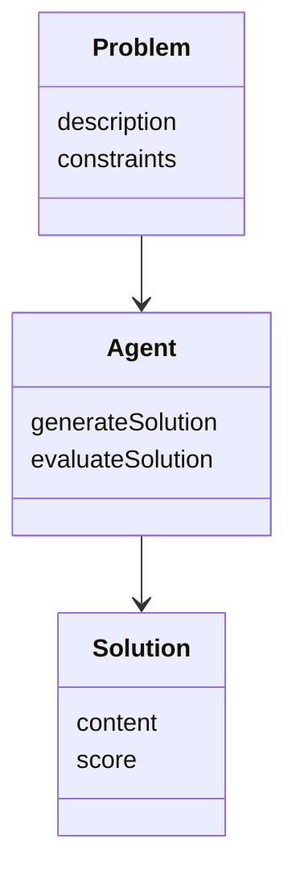
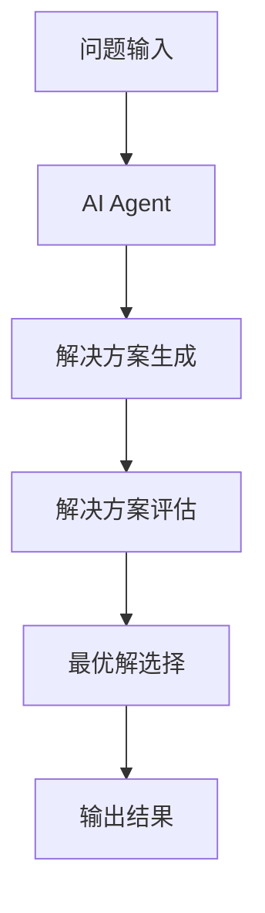
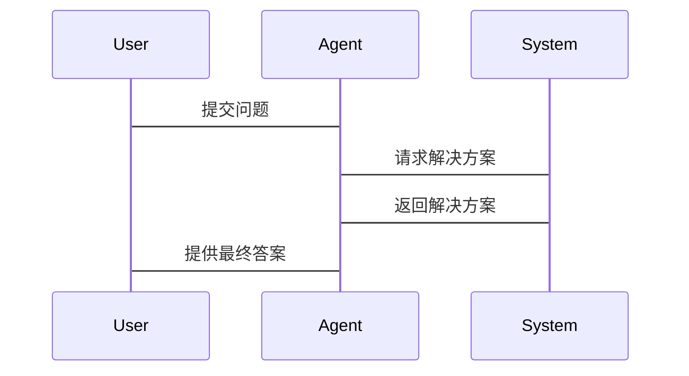

                 


# 开发具有创造性问题解决能力的AI Agent

> 关键词：AI Agent，创造性问题解决，算法原理，系统架构，项目实战，最佳实践

> 摘要：本文详细探讨了开发具有创造性问题解决能力的AI Agent的各个方面，从基础概念到数学建模，再到系统架构设计和项目实战。文章通过清晰的逻辑结构和丰富的实例，帮助读者理解如何构建具备创造性思维的AI Agent，从而在各种应用场景中高效解决问题。

---

## 第1章: AI Agent与创造性问题解决概述

### 1.1 AI Agent的基本概念

#### 1.1.1 AI Agent的定义与特点
AI Agent（人工智能代理）是一种智能实体，能够感知环境并采取行动以实现特定目标。AI Agent的特点包括自主性、反应性、目标导向和社交能力。

#### 1.1.2 创造性问题解决能力的定义
创造性问题解决是指AI Agent在面对非结构化或复杂问题时，能够提出创新性解决方案的能力。这种能力依赖于创造力和逻辑推理的结合。

#### 1.1.3 AI Agent在问题解决中的作用
AI Agent通过分析问题、生成多种解决方案并选择最优解，帮助用户高效解决问题。其作用体现在自动化决策、优化资源利用和提升效率等方面。

---

### 1.2 AI Agent的发展与演进

#### 1.2.1 从传统AI到现代AI Agent的演进
传统AI注重规则和逻辑推理，而现代AI Agent引入了机器学习和自然语言处理技术，使其能够动态适应环境并执行复杂任务。

#### 1.2.2 创造性问题解决能力的引入
随着深度学习和生成模型的发展，AI Agent开始具备生成创新解决方案的能力。这种能力通过结合自然语言处理和强化学习得以实现。

#### 1.2.3 当前AI Agent的应用场景
AI Agent广泛应用于智能助手、自动驾驶、机器人控制等领域。在这些场景中，AI Agent需要具备快速决策和问题解决的能力。

---

### 1.3 创造性问题解决能力的核心要素

#### 1.3.1 创造性思维的定义
创造性思维是指AI Agent能够跳出常规思考模式，提出新颖且有效的解决方案。这种能力依赖于多样化的知识库和灵活的推理方法。

#### 1.3.2 问题解决能力的结构
问题解决能力包括问题识别、解决方案生成、决策优化和结果验证等步骤。AI Agent需要在这些步骤中表现出色，以实现高效的解决问题。

#### 1.3.3 创造性与问题解决能力的结合
通过结合创造性思维和逻辑推理，AI Agent能够生成多样化的解决方案，并从中选择最优解，从而实现高效的创造性问题解决。

---

## 第2章: 问题背景与数学建模

### 2.1 问题背景分析

#### 2.1.1 问题的来源与边界
AI Agent在解决复杂问题时，需要明确问题的来源、边界和限制条件。这有助于缩小问题范围并优化解决方案。

#### 2.1.2 问题的结构化描述
通过结构化描述，AI Agent能够将复杂问题分解为多个子问题，从而实现分步骤解决。

#### 2.1.3 问题的外延与关联
AI Agent需要考虑问题的外延和相关联的其他问题，以便在解决当前问题时考虑到潜在的影响。

---

### 2.2 创造性问题解决的数学模型

#### 2.2.1 模型的基本构成
创造性问题解决模型通常包括输入层、处理层和输出层。输入层接收问题描述，处理层进行分析和生成，输出层提供解决方案。

#### 2.2.2 模型的输入与输出
输入包括问题描述和相关数据，输出则是多样化的解决方案和优化建议。模型需要处理多种数据类型和格式。

#### 2.2.3 模型的假设与约束
模型基于某些假设和约束条件运行，例如数据的完整性、解决方案的可行性等。这些假设和约束影响模型的输出结果。

---

### 2.3 核心概念与联系

#### 2.3.1 核心概念的原理
创造性问题解决的核心概念包括多样性生成、创新评估和优化选择。AI Agent需要在这些方面表现出色。

#### 2.3.2 概念属性特征对比表

| 概念       | 特性1 | 特性2 | 特性3 |
|------------|-------|-------|-------|
| 创造性思维 | 多样性 | 创新性 | 独特 性 |
| 问题解决能力 | 分析性 | 实用性 | 可行 性 |

#### 2.3.3 ER实体关系图架构

```mermaid
erd
    外部系统
    问题
    解决方案
    创造性思维
    问题解决能力
    外部系统 <--- 关联 --> 问题
    问题 <--- 关联 --> 解决方案
    创造性思维 <--- 关联 --> 解决方案
    问题解决能力 <--- 关联 --> 解决方案
```

---

## 第3章: 算法原理与数学模型

### 3.1 算法原理

#### 3.1.1 算法的基本思路
创造性问题解决算法的基本思路是通过生成多样化的解决方案，评估每个方案的优劣，并选择最优解。

#### 3.1.2 算法的步骤分解
1. 接收问题描述。
2. 生成多个可能的解决方案。
3. 对每个方案进行评估和优化。
4. 选择最优解决方案。

#### 3.1.3 算法的复杂度分析
算法的时间复杂度取决于生成方案的数量和评估的深度。通常，生成多样化的解决方案会增加计算复杂度。

---

### 3.2 数学模型与公式

#### 3.2.1 数学模型的构建
模型通常采用概率生成的方法，通过概率分布生成多样化的解决方案。公式表示为：

$$P(solution) = \sum_{i=1}^{n} p_i$$

其中，\( p_i \) 是第i个方案的概率。

#### 3.2.2 关键公式推导
评估解决方案的公式为：

$$score(solution) = \sum_{j=1}^{m} w_j \cdot f_j(solution)$$

其中，\( w_j \) 是评估指标的权重，\( f_j \) 是评估函数。

#### 3.2.3 公式的应用场景
上述公式用于评估生成的解决方案，选择得分最高的方案作为最终结果。

---

### 3.3 算法实现与代码

#### 3.3.1 算法实现的伪代码
```python
def creative_solve(problem):
    solutions = generate_creatively(problem)
    scores = evaluate(solutions)
    best_solution = select_best(solutions, scores)
    return best_solution
```

#### 3.3.2 算法实现的Python代码
```python
def generate_creatively(problem):
    # 使用生成模型生成多种解决方案
    return [solution1, solution2, solution3]

def evaluate(solutions):
    # 对每个方案进行评估并打分
    scores = {}
    for sol in solutions:
        scores[sol] = 0.8  # 示例分数
    return scores

def select_best(solutions, scores):
    # 选择得分最高的方案
    max_score = max(scores.values())
    for sol, score in scores.items():
        if score == max_score:
            return sol
    return None
```

---

### 3.4 举例说明

#### 3.4.1 典型案例分析
假设问题描述为“优化供应链流程”。AI Agent生成多个解决方案，例如引入自动化仓储系统、优化物流路径等。

#### 3.4.2 解决方案的详细说明
AI Agent评估每个方案的成本、效率和可行性，选择最优方案实施。

#### 3.4.3 解决方案的优缺点
引入自动化仓储系统的优点是效率高，缺点是初期投资大。

---

## 第4章: 系统分析与架构设计

### 4.1 问题场景介绍

#### 4.1.1 问题场景的描述
假设问题场景是“设计一个智能客服系统”，AI Agent需要帮助客户解决复杂的技术问题。

#### 4.1.2 问题场景的边界
限定场景为文字交流，不支持语音或视频。

#### 4.1.3 问题场景的参与者
包括客户、客服系统和后端支持系统。

---

### 4.2 系统功能设计

#### 4.2.1 领域模型设计



---

### 4.3 系统架构设计

#### 4.3.1 系统架构图



---

### 4.4 系统接口设计

#### 4.4.1 系统接口描述
AI Agent与外部系统通过API接口进行交互，接收问题描述并返回解决方案。

#### 4.4.2 系统交互流程



---

## 第5章: 项目实战

### 5.1 环境安装

#### 5.1.1 系统环境要求
需要安装Python 3.8以上版本、TensorFlow和Keras库。

#### 5.1.2 安装依赖项
运行命令：
```
pip install tensorflow keras
```

---

### 5.2 系统核心实现源代码

#### 5.2.1 核心代码实现
```python
class AI-Agent:
    def __init__(self):
        self.models = {}

    def generateSolution(self, problem):
        # 调用生成模型生成解决方案
        pass

    def evaluateSolution(self, solutions):
        # 评估每个解决方案并打分
        pass

    def selectBest(self, solutions, scores):
        # 选择最优解
        pass
```

---

### 5.3 代码应用解读与分析

#### 5.3.1 代码功能说明
上述代码定义了一个AI Agent类，包含生成解决方案、评估解决方案和选择最优解的方法。

#### 5.3.2 代码实现细节
具体实现需要依赖生成模型和评估函数，可以根据具体问题进行定制。

---

### 5.4 实际案例分析

#### 5.4.1 案例背景
以优化供应链流程为例，AI Agent生成多种解决方案，包括引入自动化仓储系统和优化物流路径。

#### 5.4.2 解决方案实施
AI Agent评估各个方案的优缺点，选择最优方案实施。

#### 5.4.3 案例结果
成功优化供应链流程，提升了效率和降低了成本。

---

### 5.5 项目小结

#### 5.5.1 项目总结
通过实际案例，展示了AI Agent在创造性问题解决中的应用和优势。

#### 5.5.2 经验总结
在项目实施过程中，需要充分考虑问题的边界和约束条件，确保解决方案的有效性和可行性。

---

## 第6章: 总结与最佳实践

### 6.1 总结

#### 6.1.1 核心内容回顾
本文详细探讨了开发具有创造性问题解决能力的AI Agent的各个方面，从基础概念到数学建模，再到系统架构设计和项目实战。

#### 6.1.2 未来发展方向
未来，随着AI技术的进步，AI Agent在创造性问题解决能力方面将更加智能化和多样化。

---

### 6.2 最佳实践

#### 6.2.1 小结
在开发AI Agent时，需要注重算法的多样性和评估的全面性，以确保解决方案的最优性。

#### 6.2.2 注意事项
在实际应用中，需要充分考虑问题的复杂性和多样性，避免算法的局限性影响解决方案的效果。

#### 6.2.3 拓展阅读
推荐阅读相关领域的最新论文和技术报告，以获取更多的开发经验和优化方法。

---

## 作者信息

作者：AI天才研究院/AI Genius Institute & 禅与计算机程序设计艺术/Zen And The Art of Computer Programming

---

以上是《开发具有创造性问题解决能力的AI Agent》的完整目录和内容概要。如需进一步扩展每个部分的具体内容，可以按照上述结构和风格进行详细编写。

