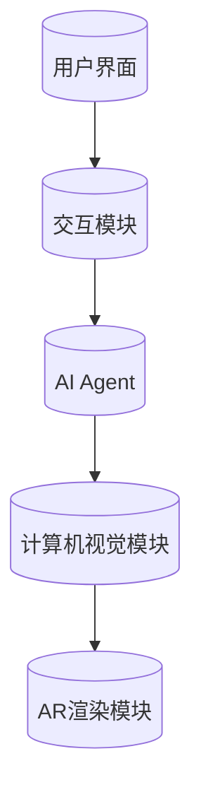

                 


# 开发具有增强现实能力的AI Agent

> 关键词：增强现实，AI Agent，计算机视觉，深度学习，系统架构，项目实战

> 摘要：本文将详细探讨如何开发具有增强现实能力的AI Agent。从背景介绍、核心概念、算法原理到系统架构设计、项目实战和最佳实践，本文将全面解析这一复杂而前沿的技术。通过结合增强现实与人工智能代理，我们能够创造出更加智能化和交互式的用户体验。本文将帮助读者从理论到实践，逐步掌握开发具有增强现实能力的AI Agent的全过程。

---

## 第1章：引言

### 1.1 什么是AI Agent？
- AI Agent（人工智能代理）是一种能够感知环境、自主决策并执行任务的智能实体。
- 其核心特征包括自主性、反应性、目标导向性和社交能力。

### 1.2 增强现实（AR）的基本概念
- AR是一种将虚拟信息叠加到真实世界中的技术，能够为用户提供更加丰富的视觉体验。

### 1.3 AR与AI Agent的结合
- 通过结合AR和AI Agent，我们可以实现更加智能化和交互式的增强现实体验。
- 例如，在AR游戏中，AI Agent可以作为虚拟角色与用户进行实时互动。

---

## 第2章：AI Agent的核心概念

### 2.1 AI Agent的分类
- 单Agent系统：独立完成任务的Agent。
- 多Agent系统：多个Agent协作完成复杂任务。

### 2.2 AI Agent的决策机制
- 基于规则的决策：通过预定义的规则进行判断和执行。
- 基于学习的决策：通过机器学习模型进行预测和决策。

### 2.3 AI Agent的交互方式
- 图形化界面交互：通过AR界面与用户互动。
- 自然语言交互：通过语音或文本进行对话。

---

## 第3章：增强现实（AR）的核心技术

### 3.1 AR的关键技术
- 计算机视觉：用于识别和跟踪现实世界中的物体。
- 3D建模与渲染：用于生成和叠加虚拟物体。
- 传感器融合：结合摄像头、陀螺仪等传感器数据，实现精准的AR效果。

### 3.2 AR的实现流程
1. 摄像头捕捉现实场景。
2. 计算机视觉算法检测并跟踪目标物体。
3. 生成虚拟物体并叠加到现实场景中。
4. 渲染并显示最终的AR效果。

---

## 第4章：开发AR AI Agent的算法原理

### 4.1 计算机视觉算法
- 目标检测：用于检测现实场景中的目标物体。
  $$ \text{目标检测算法（如YOLO）} $$

```python
# 示例代码：使用YOLO进行目标检测
import cv2
model = cv2.dnn.Net()
model.loadFromDisk("yolo_model")
image = cv2.imread("input.jpg")
result = model.detect(image)
```

### 4.2 深度学习在AR中的应用
- 使用神经网络进行图像分割和语义理解。
  $$ \text{图像分割模型（如U-Net）} $$

### 4.3 AR中的实时跟踪算法
- 使用ARKit或ARCore进行实时跟踪。
- 示例代码：使用Python的OpenCV库进行实时跟踪。

---

## 第5章：系统架构设计

### 5.1 系统功能设计
- 用户界面：AR界面显示虚拟物体。
- 交互模块：处理用户的输入和反馈。
- 后台处理：运行AI Agent的核心算法。

### 5.2 系统架构图


### 5.3 接口设计
- 用户输入接口：处理用户的触摸和语音输入。
- 数据接口：与AR引擎（如ARKit）通信。

---

## 第6章：项目实战

### 6.1 环境搭建
- 安装Python、OpenCV、TensorFlow等开发工具。

### 6.2 核心代码实现
```python
# 示例代码：AI Agent的核心算法
class AI-Agent:
    def __init__(self):
        self.model = load_model("ai_model.h5")
    
    def detect_object(self, image):
        return self.model.predict(image)
```

### 6.3 案例分析
- 实现一个简单的AR游戏，用户通过手势与虚拟角色互动。

---

## 第7章：最佳实践与小结

### 7.1 小结
- 开发AR AI Agent需要结合计算机视觉、深度学习和系统架构设计。

### 7.2 注意事项
- 确保算法的实时性和稳定性。
- 注意用户体验，优化交互设计。

### 7.3 拓展阅读
- 推荐阅读《深度学习入门》和《增强现实技术详解》。

---

## 作者信息

作者：AI天才研究院/AI Genius Institute & 禅与计算机程序设计艺术 /Zen And The Art of Computer Programming

