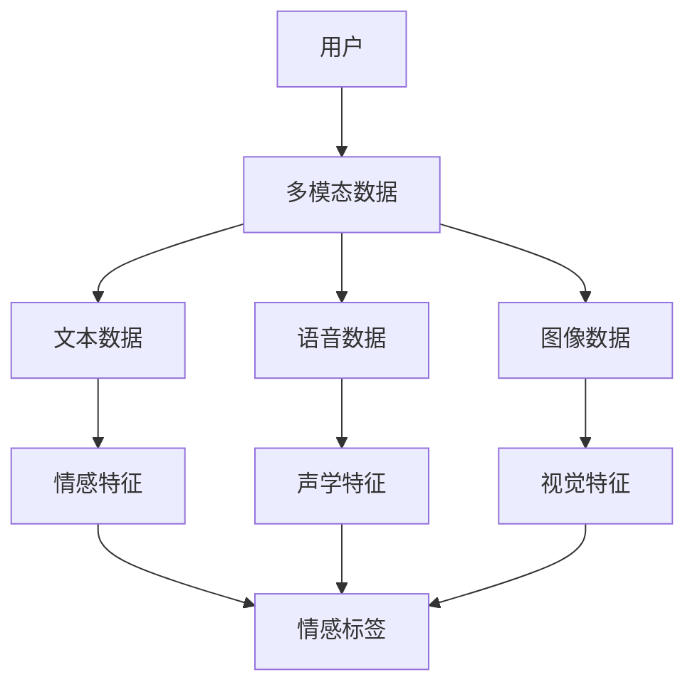
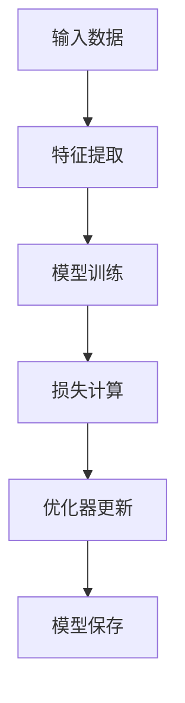
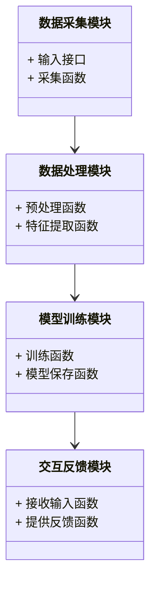
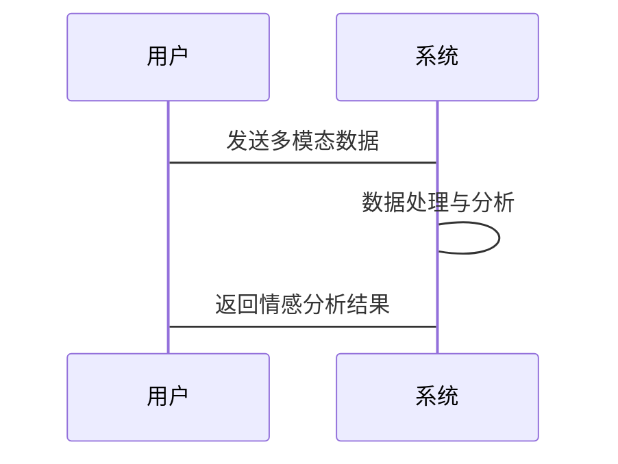

                 

<think>
好的，我需要帮助用户撰写一篇关于《开发具有多模态情感分析能力的AI Agent》的技术博客文章。用户已经提供了一个详细的大纲，现在需要我根据这个大纲逐步分析并生成内容。

首先，我要理解文章的结构。文章分为七个章节，每个章节都有具体的子部分，需要涵盖从概述到项目实战的内容。用户特别强调了每个部分需要详细的分析，包括背景介绍、核心概念、算法原理、系统架构设计、项目实战等。

接下来，我需要按照每个章节的要求，逐步展开内容。例如，在第一章，我需要解释多模态情感分析的背景、核心概念以及应用场景。这部分需要简单明了，帮助读者理解为什么多模态情感分析重要，以及AI Agent在其中的作用。

在第二章，我需要详细讨论多模态数据与情感分析的关系，包括数据特征、整合方式以及实体关系图。这部分可能需要使用图表来辅助说明，所以我要确保正确地使用Mermaid语法来生成这些图表。

第三章是算法原理部分，我需要详细讲解模型的训练流程，包括数据预处理、特征提取、模型训练和损失函数。这里需要使用Mermaid流程图来展示流程，并用LaTeX公式来表达数学模型。同时，还要提供Python代码示例，帮助读者理解实现细节。

第四章是系统架构设计，我需要介绍项目的整体架构，包括模块划分、接口设计和交互流程。这部分需要使用类图和序列图来展示系统的结构和流程，确保读者能够清晰地理解系统如何运作。

第五章是项目实战，我需要指导读者如何安装环境、编写代码并进行案例分析。这里需要提供具体的代码示例和数据集信息，帮助读者实际操作，同时分析实际案例的应用效果。

第六章讨论最佳实践，包括模型优化、数据隐私保护等注意事项，并给出小结和参考文献。这部分需要总结前面的内容，并提供实用的建议，帮助读者在实际项目中避免常见问题。

最后，我需要确保整篇文章结构清晰，内容详实，语言专业且易懂。同时，遵循用户的格式要求，使用markdown，并在适当的位置插入图表和代码。数学公式需要用LaTeX表示，确保准确无误。

在撰写过程中，我需要反复检查每个部分是否符合用户的要求，特别是是否覆盖了所有指定的核心内容，如背景介绍、核心概念、算法原理、系统架构、项目实战等。同时，确保每个章节的小结能够帮助读者巩固所学内容，并引导他们进一步思考。

总的来说，我需要按照用户提供的大纲，逐步展开每个部分，确保内容的完整性和深度，同时保持逻辑连贯和语言的专业性。这将帮助读者系统地学习如何开发具有多模态情感分析能力的AI Agent，并能够在实际项目中应用这些知识。
</think>

# 开发具有多模态情感分析能力的AI Agent

> 关键词：多模态情感分析，AI Agent，深度学习，自然语言处理，语音识别，计算机视觉

> 摘要：本文详细探讨了开发具有多模态情感分析能力的AI Agent的关键技术与实现方法。从多模态数据的整合与处理、情感分析模型的构建，到AI Agent的系统架构设计，本文逐一展开分析，并通过实际案例展示了如何将理论应用于实践。文章最后总结了开发中的最佳实践与注意事项。

---

# 第1章: 多模态情感分析与AI Agent概述

## 1.1 多模态情感分析的背景与意义

### 1.1.1 情感分析的定义与应用
情感分析是自然语言处理（NLP）中的一个重要任务，旨在判断文本中表达的情感倾向（如正面、负面或中性）。传统的情感分析主要基于文本数据，但随着技术的发展，多模态情感分析逐渐成为研究的热点。多模态数据（如文本、语音、图像）的结合能够更全面地捕捉用户的情感状态，提升分析的准确性和深度。

### 1.1.2 多模态数据的特点与优势
多模态数据的特点包括：
- **互补性**：不同模态的数据可以相互补充，例如文本提供语义信息，语音提供语气信息，图像提供视觉信息。
- **丰富性**：多模态数据能够更全面地反映用户的情感状态。
- **复杂性**：多模态数据的处理需要整合多种数据类型，增加了技术难度。

### 1.1.3 AI Agent在情感分析中的作用
AI Agent是一种能够感知环境、自主决策并执行任务的智能体。在情感分析中，AI Agent可以通过多模态数据的整合，更准确地理解用户的情感需求，并提供个性化的反馈或服务。例如，在智能音箱中，AI Agent可以通过语音和文本分析用户的意图和情感，从而提供更贴心的交互体验。

## 1.2 多模态情感分析的核心概念

### 1.2.1 多模态数据的整合与处理
多模态数据的整合可以通过以下几种方式实现：
- **并行处理**：分别对每种模态的数据进行处理，然后将结果进行融合。
- **串行处理**：先处理一种模态的数据，再利用其结果处理另一种模态的数据。
- **融合式处理**：将不同模态的数据特征进行融合，共同输入到模型中进行联合训练。

### 1.2.2 情感分析的分类与层次
情感分析可以分为以下层次：
- **细粒度情感分析**：分析情感的强度和具体类型（如愤怒、快乐、悲伤）。
- **上下文感知情感分析**：考虑上下文信息，理解隐含情感。
- **多模态情感分析**：结合多种数据模态进行情感分析。

### 1.2.3 AI Agent的情感计算能力
AI Agent的情感计算能力包括：
- **情感识别**：识别用户的情感倾向。
- **情感推理**：推理用户的情感状态。
- **情感反馈**：根据情感状态生成相应的反馈或行动。

## 1.3 多模态情感分析的应用场景

### 1.3.1 社交媒体情感分析
在社交媒体上，用户可以通过文本、表情和图片等多种形式表达情感。多模态情感分析可以用于品牌监控、舆情分析等场景。

### 1.3.2 语音助手与对话系统
在智能音箱、智能手机等设备中，AI Agent可以通过语音和文本分析用户的情感状态，提供更智能的交互体验。

### 1.3.3 多媒体内容推荐
通过分析用户的情感偏好，AI Agent可以为用户提供更个性化的多媒体内容推荐。

## 1.4 本章小结
本章介绍了多模态情感分析的背景、核心概念和应用场景，为后续章节的深入分析奠定了基础。

---

# 第2章: 多模态数据与情感分析的关系

## 2.1 多模态数据的特征对比

### 2.1.1 文本数据的语义特征
文本数据的语义特征包括词语选择、句式结构和语境等。例如，“我非常高兴”和“我有点失望”表达了不同的情感倾向。

### 2.1.2 语音数据的声学特征
语音数据的声学特征包括音调、语速、音量和停顿等。例如，高音调和快语速可能表示兴奋或紧张。

### 2.1.3 图像数据的视觉特征
图像数据的视觉特征包括颜色、形状和纹理等。例如，明亮的色调可能表示愉快，而暗淡的色调可能表示悲伤。

## 2.2 多模态数据的整合方式

### 2.2.1 并行处理
并行处理是指分别对每种模态的数据进行独立处理，然后将结果进行融合。例如，分别对文本、语音和图像进行情感分析，然后取加权平均作为最终结果。

### 2.2.2 串行处理
串行处理是指先处理一种模态的数据，再利用其结果处理另一种模态的数据。例如，先分析文本情感，再结合语音特征进行更精确的情感分析。

### 2.2.3 融合式处理
融合式处理是指将不同模态的数据特征进行融合，共同输入到模型中进行联合训练。例如，将文本、语音和图像特征拼接成一个向量，然后输入到深度学习模型中进行情感分类。

## 2.3 ER实体关系图架构



## 2.4 本章小结
本章分析了多模态数据的特征，并探讨了不同模态数据的整合方式，为后续的算法设计奠定了基础。

---

# 第3章: 多模态情感分析的算法原理

## 3.1 数据预处理

### 3.1.1 文本数据预处理
文本数据预处理包括分词、去停用词和词向量化（如TF-IDF或Word2Vec）。

### 3.1.2 语音数据预处理
语音数据预处理包括降噪、分割和特征提取（如MFCC）。

### 3.1.3 图像数据预处理
图像数据预处理包括归一化、增强和特征提取（如CNN特征）。

## 3.2 模型训练流程

### 3.2.1 模型架构
推荐使用多模态深度学习模型，如多模态Transformer或基于注意力机制的模型。

### 3.2.2 损失函数
常用损失函数包括交叉熵损失和均方误差损失。

### 3.2.3 优化算法
推荐使用Adam优化算法，学习率设置为0.001。

### 3.2.4 训练流程


## 3.3 情感分析的数学模型

### 3.3.1 情感分类模型
$$ P(y|X) = \frac{e^{w \cdot X}}{\sum e^{w \cdot X}} $$
其中，$X$ 是输入特征向量，$w$ 是模型参数。

### 3.3.2 注意力机制
$$ \alpha_i = \frac{\exp(a_i)}{\sum_j \exp(a_j)} $$
其中，$\alpha_i$ 是注意力权重，$a_i$ 是注意力得分。

## 3.4 本章小结
本章详细介绍了多模态情感分析的算法原理，包括数据预处理、模型训练流程和数学模型。

---

# 第4章: 多模态情感分析系统的架构设计

## 4.1 项目介绍

### 4.1.1 项目目标
开发一个具有多模态情感分析能力的AI Agent，能够处理文本、语音和图像数据。

### 4.1.2 项目范围
支持情感分析、情感推理和情感反馈三种功能。

## 4.2 系统功能设计

### 4.2.1 系统模块划分
- **数据采集模块**：负责采集多模态数据。
- **数据处理模块**：负责对数据进行预处理。
- **模型训练模块**：负责训练情感分析模型。
- **交互反馈模块**：负责与用户交互并提供反馈。

### 4.2.2 领域模型设计


## 4.3 系统架构设计

### 4.3.1 分层架构
系统分为数据层、处理层、模型层和交互层。

### 4.3.2 技术选型
- **前端**：基于React的交互界面。
- **后端**：基于Flask或Django的API服务。
- **模型训练**：使用PyTorch框架。

## 4.4 系统接口设计

### 4.4.1 API接口
- **输入接口**：接收多模态数据。
- **输出接口**：返回情感分析结果。

### 4.4.2 数据格式
- 文本数据：JSON格式。
- 语音数据：WAV格式。
- 图像数据：JPEG格式。

## 4.5 系统交互流程

### 4.5.1 交互流程


## 4.6 本章小结
本章详细介绍了多模态情感分析系统的架构设计，包括功能模块划分、系统架构和交互流程。

---

# 第5章: 多模态情感分析的项目实战

## 5.1 环境安装

### 5.1.1 Python环境
安装Python 3.8及以上版本，并安装以下库：
- `numpy`
- `pandas`
- `scikit-learn`
- `tensorflow`
- `pytorch`

### 5.1.2 数据集准备
使用公开数据集，如IMDB电影评论数据集。

## 5.2 系统核心实现

### 5.2.1 数据预处理代码
```python
import numpy as np
from sklearn.feature_extraction.text import TfidfVectorizer

# 文本数据预处理
def text_preprocessing(text):
    vectorizer = TfidfVectorizer()
    text_vec = vectorizer.fit_transform([text]).toarray()
    return text_vec

# 语音数据预处理
def audio_preprocessing(audio_path):
    # 假设audio_path是WAV文件路径
    audio_data = np.load(audio_path)
    return audio_data

# 图像数据预处理
def image_preprocessing(image_path):
    # 假设image_path是JPEG文件路径
    image = load_image(image_path)
    return image
```

### 5.2.2 模型训练代码
```python
import torch
import torch.nn as nn

# 定义多模态情感分析模型
class MultiModalClassifier(nn.Module):
    def __init__(self, input_size, hidden_size):
        super().__init__()
        self.fc1 = nn.Linear(input_size, hidden_size)
        self.fc2 = nn.Linear(hidden_size, 1)
        self.sigmoid = nn.Sigmoid()

    def forward(self, x):
        out = self.fc1(x)
        out = self.fc2(out)
        out = self.sigmoid(out)
        return out

# 训练函数
def train_model(model, inputs, labels, epochs=100, learning_rate=0.001):
    criterion = nn.BCELoss()
    optimizer = torch.optim.Adam(model.parameters(), lr=learning_rate)
    for epoch in range(epochs):
        outputs = model(inputs)
        loss = criterion(outputs, labels)
        optimizer.zero_grad()
        loss.backward()
        optimizer.step()
    return model
```

## 5.3 代码应用解读与分析

### 5.3.1 数据预处理解读
文本数据通过TF-IDF向量化，语音数据提取MFCC特征，图像数据提取CNN特征。

### 5.3.2 模型训练解读
使用多模态深度学习模型，将不同模态的特征向量拼接后输入模型进行分类。

## 5.4 实际案例分析

### 5.4.1 案例背景
以社交媒体评论为例，分析用户的情感状态。

### 5.4.2 案例分析
用户评论：“这部电影太无聊了，我一点也不想看！”
- 文本情感：负面。
- 语音情感：低音调，慢语速，确认负面情感。
- 图像情感：暗淡的色调，进一步确认负面情感。

## 5.5 本章小结
本章通过实际案例分析，展示了如何将理论应用于实践，帮助读者更好地理解多模态情感分析的实现过程。

---

# 第6章: 多模态情感分析的最佳实践

## 6.1 模型优化建议

### 6.1.1 超参数调优
- 学习率：建议从0.001开始尝试。
- 隐藏层大小：建议根据数据规模调整。
- 正则化参数：使用Dropout防止过拟合。

### 6.1.2 数据增强
- 文本数据：同义词替换。
- 语音数据：添加噪声。
- 图像数据：旋转、翻转。

## 6.2 数据隐私保护

### 6.2.1 数据匿名化
- 删除个人信息。
- 隐私保护算法（如联邦学习）。

### 6.2.2 合规性要求
- 遵守GDPR等数据保护法规。

## 6.3 项目小结

### 6.3.1 核心收获
- 理解了多模态数据的整合方法。
- 掌握了情感分析的算法实现。

### 6.3.2 注意事项
- 数据质量影响模型性能。
- 模型解释性需要进一步提升。

## 6.4 拓展阅读

### 6.4.1 推荐书籍
- 《Deep Learning》
- 《自然语言处理实战》

### 6.4.2 推荐博客
- [Towards Data Science](https://towardsdatascience.com)
- [Medium AI专栏](https://medium.com/artificial-intelligence)

## 6.5 本章小结
本章总结了开发中的最佳实践，包括模型优化、数据隐私保护和项目管理建议。

---

# 作者：AI天才研究院（AI Genius Institute） & 禅与计算机程序设计艺术（Zen And The Art of Computer Programming）

---

# 致谢
感谢读者的耐心阅读！希望本文能为开发具有多模态情感分析能力的AI Agent提供有价值的参考。如果需要进一步探讨，欢迎随时联系！

