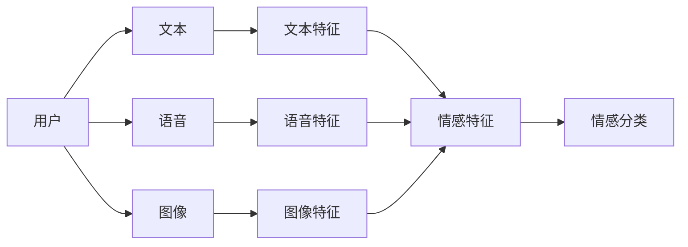
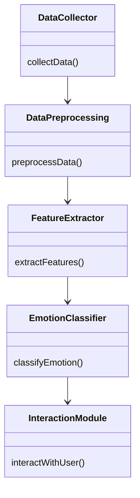

                 


# 开发具有多模态情感识别能力的AI Agent

> 关键词：多模态情感识别，AI Agent，文本情感分析，语音情感分析，图像情感分析，深度学习，多模态数据融合

> 摘要：本文深入探讨了开发具有多模态情感识别能力的AI Agent的核心理论、算法实现和系统架构设计。文章首先介绍了多模态情感识别的背景、核心概念与实体关系，然后详细讲解了文本、语音和图像情感识别的算法原理及其数学模型，接着分析了多模态数据融合的原理与方法，并通过系统架构设计展示了AI Agent的实现框架。最后，通过实际案例分析，详细解读了项目的实现过程与应用价值。

---

## 第一部分：多模态情感识别AI Agent开发背景与核心概念

### 第1章：多模态情感识别概述

#### 1.1 情感识别的背景与意义

##### 1.1.1 情感识别的定义与核心问题
情感识别是通过分析人类的表达（如文本、语音、图像）来判断其情感状态的技术。核心问题包括：  
1. 如何从多模态数据中提取情感特征？  
2. 如何在复杂场景下准确识别情感？  
3. 如何将情感识别结果应用于实际场景？

##### 1.1.2 多模态数据的定义与特点
多模态数据指的是结合多种数据形式（如文本、语音、图像）来描述同一事物。其特点包括：  
- **互补性**：不同数据形式可以相互补充，提高识别准确率。  
- **复杂性**：多模态数据的处理需要跨领域知识。  
- **实用性**：多模态数据能够更全面地反映用户情感。

##### 1.1.3 多模态情感识别的必要性与优势
在单一模态（如文本或语音）下，情感识别的准确率有限。引入多模态数据可以显著提升识别的准确性和鲁棒性，尤其是在复杂场景下。

---

#### 1.2 多模态情感识别的核心概念

##### 1.2.1 多模态数据的整合与处理
多模态数据的整合需要考虑数据的对齐与融合。例如，文本和语音数据可以按时间对齐，图像数据可以与文本内容相关联。

##### 1.2.2 情感识别的分类与层次
情感识别可以分为以下层次：  
1. **基本情感**：如快乐、悲伤、愤怒。  
2. **复杂情感**：如讽刺、怀疑。  
3. **混合情感**：如部分快乐带有一点悲伤。

##### 1.2.3 AI Agent在情感识别中的角色
AI Agent作为情感识别的主体，需要具备以下能力：  
1. **数据采集**：通过多种传感器或API获取多模态数据。  
2. **特征提取**：从多模态数据中提取情感相关特征。  
3. **情感分类**：基于特征进行情感分类并输出结果。

---

#### 1.3 多模态情感识别的边界与外延

##### 1.3.1 情感识别的适用场景与限制
情感识别主要应用于以下场景：  
- 智能客服  
- 智能教育  
- 智能音箱  
- 虚拟助手  

其限制包括：  
- 数据质量：低质量数据可能影响识别准确率。  
- 稀有情感：某些情感类别可能缺乏足够的训练数据。  

##### 1.3.2 多模态数据的采集与处理边界
多模态数据的采集需要考虑隐私保护和数据格式的标准化。处理边界包括数据对齐、特征提取和数据融合。

##### 1.3.3 AI Agent情感识别能力的扩展性
AI Agent的情感识别能力可以扩展到更多场景，例如跨语言情感识别或多模态情感分析。

---

#### 1.4 多模态情感识别的核心要素组成

##### 1.4.1 数据输入层
- **文本**：如用户输入的句子。  
- **语音**：如用户的语音片段。  
- **图像**：如用户的面部表情。

##### 1.4.2 情感特征提取层
- **文本特征**：如词袋模型、词嵌入。  
- **语音特征**：如Mel-Frequency Cepstral Coefficients (MFCCs)。  
- **图像特征**：如面部表情的几何特征。

##### 1.4.3 情感分类与决策层
- **分类器**：如支持向量机（SVM）、随机森林（RF）、深度学习模型（CNN、RNN）。  
- **决策层**：将分类结果转化为可解释的输出。

---

### 第2章：多模态情感识别的核心概念与联系

#### 2.1 情感识别的核心原理

##### 2.1.1 文本情感识别的原理与方法
- **词袋模型**：基于单词的出现频率进行分类。  
- **词嵌入**：如Word2Vec、GloVe，将单词映射为低维向量。  
- **深度学习**：如CNN、RNN，用于捕捉文本的语义信息。

##### 2.1.2 语音情感识别的原理与方法
- **语音特征提取**：如MFCCs、谱质、韵律特征。  
- **基于GMM的语音情感识别**：将语音特征与情感类别进行匹配。  
- **深度学习方法**：如CNN、LSTM，用于语音情感分类。

##### 2.1.3 图像情感识别的原理与方法
- **面部表情识别**：基于几何特征（如眼形、嘴角）和图像特征（如纹理、颜色）。  
- **基于CNN的图像情感识别**：直接将图像输入到深度神经网络中进行分类。  
- **基于注意力机制的图像情感识别**：关注图像中与情感相关的重要区域。

#### 2.2 多模态数据处理的原理

##### 2.2.1 多模态数据融合的原理
多模态数据融合的目标是将不同数据源的信息整合到一个统一的表示中。常见的融合方法包括：  
- **早期融合**：在特征提取阶段进行融合。  
- **晚期融合**：在分类器阶段进行融合。  

##### 2.2.2 多模态数据对齐的原理
数据对齐的目标是将不同数据源的时间或空间信息对齐。例如，将文本和语音数据对齐到相同的时间轴。

##### 2.2.3 多模态数据特征提取的原理
多模态特征提取需要考虑不同数据的特征空间。例如，将文本特征和语音特征映射到相同的低维空间。

#### 2.3 多模态情感识别的实体关系图



---

### 第3章：多模态情感识别算法原理

#### 3.1 文本情感识别算法

##### 3.1.1 基于词袋模型的文本情感识别
词袋模型将文本表示为单词的频率向量。例如，句子“我今天很高兴”可以表示为一个词袋向量，其中“高兴”对应的权重较高。

##### 3.1.2 基于词嵌入的文本情感识别
词嵌入（如Word2Vec）将单词映射为低维向量，捕捉单词的语义信息。

##### 3.1.3 基于深度学习的文本情感识别
深度学习模型（如CNN、RNN）可以捕捉文本的语义信息，用于情感分类。

#### 3.2 语音情感识别算法

##### 3.2.1 基于语音特征提取的语音情感识别
MFCCs（Mel-Frequency Cepstral Coefficients）是一种常用的语音特征提取方法。

##### 3.2.2 基于深度学习的语音情感识别
深度学习模型（如CNN、LSTM）可以用于语音情感分类。

##### 3.2.3 基于端到端的语音情感识别
端到端模型可以直接将语音信号输入到深度神经网络中进行情感分类。

#### 3.3 图像情感识别算法

##### 3.3.1 基于图像特征提取的情感识别
基于图像的特征提取方法包括HOG、SIFT等。

##### 3.3.2 基于深度学习的图像情感识别
深度学习模型（如CNN）可以直接将图像输入到网络中进行情感分类。

##### 3.3.3 基于注意力机制的图像情感识别
注意力机制可以帮助模型关注图像中与情感相关的重要区域。

#### 3.4 多模态情感识别算法

##### 3.4.1 多模态数据融合的算法
多模态数据融合可以通过将不同模态的特征向量拼接或加权融合来实现。

##### 3.4.2 多模态数据对齐的算法
数据对齐可以通过时间同步或空间映射来实现。

##### 3.4.3 多模态情感分类的算法
多模态情感分类可以使用基于融合特征的分类器（如SVM、随机森林）或深度学习模型（如多模态CNN）。

---

### 第4章：多模态情感识别的数学模型与公式

#### 4.1 文本情感识别的数学模型

##### 4.1.1 词袋模型的数学表达
词袋模型将文本表示为一个单词频率向量。例如：
$$
P(w_1, w_2, ..., w_n) = \prod_{i=1}^{n} P(w_i)
$$

##### 4.1.2 词嵌入的数学表达
词嵌入模型（如Word2Vec）通过训练得到单词的向量表示。例如，对于单词“happy”，其向量表示为：
$$
v_{happy} = [0.2, 0.5, 0.1, ..., 0.3]
$$

##### 4.1.3 基于CNN的文本情感分类
CNN用于文本情感分类的模型结构如下：
$$
\text{Input} \rightarrow \text{Embedding Layer} \rightarrow \text{CNN Layer} \rightarrow \text{MaxPooling} \rightarrow \text{Dense Layer} \rightarrow \text{Output}
$$

---

#### 4.2 语音情感识别的数学模型

##### 4.2.1 MFCCs的计算公式
MFCCs是将语音信号从时域变换到频域，再计算对数能量和倒谱系数。其计算公式为：
$$
\text{MFCCs} = \log\left(\sum_{k=0}^{N} |F_k|^2\right)
$$

##### 4.2.2 基于GMM的语音情感分类
GMM是一种概率模型，用于将语音特征与情感类别进行匹配。其概率计算公式为：
$$
P(c|f) = \frac{P(f|c)P(c)}{\sum_{c'} P(f|c')P(c')}
$$

##### 4.2.3 基于LSTM的语音情感分类
LSTM用于语音情感分类的模型结构如下：
$$
\text{Input} \rightarrow \text{LSTM Layer} \rightarrow \text{Dense Layer} \rightarrow \text{Output}
$$

---

#### 4.3 图像情感识别的数学模型

##### 4.3.1 基于HOG的图像特征提取
HOG（Histogram of Oriented Gradients）是一种图像特征提取方法，用于检测图像中的边缘和纹理信息。其计算公式为：
$$
\text{HOG} = \sum_{i=1}^{n} \sum_{j=1}^{m} \text{gradient}_{i,j}
$$

##### 4.3.2 基于CNN的图像情感分类
CNN用于图像情感分类的模型结构如下：
$$
\text{Input} \rightarrow \text{Convolution Layer} \rightarrow \text{MaxPooling} \rightarrow \text{Dense Layer} \rightarrow \text{Output}
$$

##### 4.3.3 基于注意力机制的图像情感分类
注意力机制用于关注图像中与情感相关的重要区域。其注意力权重计算公式为：
$$
\alpha_i = \frac{\exp(w_i)}{\sum_{j=1}^{n} \exp(w_j)}
$$

---

## 第二部分：多模态情感识别AI Agent的系统架构设计

### 第5章：多模态情感识别AI Agent的系统架构

#### 5.1 系统功能设计

##### 5.1.1 数据采集模块
数据采集模块负责从多种数据源获取多模态数据，包括文本、语音和图像。

##### 5.1.2 数据预处理模块
数据预处理模块对采集到的数据进行清洗和标准化处理。

##### 5.1.3 特征提取模块
特征提取模块从多模态数据中提取情感相关的特征，如文本特征、语音特征和图像特征。

##### 5.1.4 情感分类模块
情感分类模块基于提取的特征进行情感分类，输出情感类别。

##### 5.1.5 交互模块
交互模块负责与用户进行实时交互，输出情感识别结果。

#### 5.2 系统架构设计

##### 5.2.1 系统架构图


##### 5.2.2 模块间交互流程图
```mermaid
graph LR
    start --> DataCollector
    DataCollector --> DataPreprocessing
    DataPreprocessing --> FeatureExtractor
    FeatureExtractor --> EmotionClassifier
    EmotionClassifier --> InteractionModule
    InteractionModule --> end
```

##### 5.2.3 系统功能模块的类图


---

## 第三部分：多模态情感识别AI Agent的项目实战

### 第6章：多模态情感识别AI Agent的实现

#### 6.1 项目环境与工具安装

##### 6.1.1 开发环境
- **操作系统**：Linux/Windows/MacOS  
- **编程语言**：Python  
- **深度学习框架**：TensorFlow/PyTorch  
- **语音处理库**：Librosa  
- **图像处理库**：OpenCV  
- **NLP库**：spaCy  

##### 6.1.2 依赖库安装
```bash
pip install tensorflow==2.5.0
pip install librosa
pip install cv2
pip install spacy
```

---

#### 6.2 系统核心实现

##### 6.2.1 数据采集模块的实现
```python
import librosa
import cv2
import numpy as np

def collect_audio_data():
    # 采集语音数据
    pass

def collect_image_data():
    # 采集图像数据
    pass

def collect_text_data():
    # 采集文本数据
    pass
```

##### 6.2.2 数据预处理模块的实现
```python
def preprocess_audio_data(audio_data):
    # 语音数据预处理
    pass

def preprocess_image_data(image_data):
    # 图像数据预处理
    pass

def preprocess_text_data(text_data):
    # 文本数据预处理
    pass
```

##### 6.2.3 特征提取模块的实现
```python
def extract_audio_features(audio_data):
    # 提取语音特征
    mfccs = librosa.feature.mfcc(y=audio_data, sr=16000, n_mfcc=13)
    return mfccs

def extract_image_features(image_data):
    # 提取图像特征
    features = cv2.describe(image_data)
    return features

def extract_text_features(text_data):
    # 提取文本特征
    embeddings = spacy.embeddings(text_data)
    return embeddings
```

##### 6.2.4 情感分类模块的实现
```python
def classify_emotion(features):
    # 情感分类
    model = load_model('emotion_classifier.h5')
    prediction = model.predict(features)
    return prediction
```

##### 6.2.5 交互模块的实现
```python
def interact_with_user():
    # 与用户交互
    while True:
        input_data = input("请输入文本、语音或图像数据：")
        # 根据输入类型进行处理
        if input_data is text:
            emotion = classify_emotion(extract_text_features(input_data))
        elif input_data is audio:
            emotion = classify_emotion(extract_audio_features(input_data))
        elif input_data is image:
            emotion = classify_emotion(extract_image_features(input_data))
        print(f"识别到的情感为：{emotion}")
```

---

### 第7章：多模态情感识别AI Agent的实际案例分析

#### 7.1 案例背景介绍
假设我们开发了一个智能音箱，用户可以通过语音与音箱交互。音箱需要能够识别用户的语音情感，以提供更个性化的服务。

#### 7.2 数据采集与处理
我们从用户语音中提取MFCCs特征，并将其输入到预训练的情感分类模型中。

#### 7.3 情感分类与输出
模型输出用户的情感类别，例如“快乐”、“悲伤”或“愤怒”。

#### 7.4 应用场景分析
根据用户的情感类别，智能音箱可以调整其回应方式，例如：
- 如果用户感到“悲伤”，音箱可以播放舒缓的音乐。  
- 如果用户感到“愤怒”，音箱可以提供冷静建议。

---

## 第四部分：总结与展望

### 第8章：总结与展望

#### 8.1 本章总结
本文详细介绍了多模态情感识别AI Agent的开发背景、核心概念、算法原理和系统架构设计。通过实际案例分析，展示了如何将理论应用于实践。

#### 8.2 未来展望
多模态情感识别技术仍有以下改进空间：  
- 更高效的数据处理方法。  
- 更准确的情感分类算法。  
- 更自然的交互方式。  
- 更广泛的应用场景。

---

## 作者：AI天才研究院/AI Genius Institute & 禅与计算机程序设计艺术 /Zen And The Art of Computer Programming

