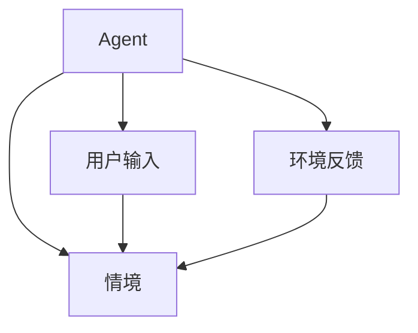
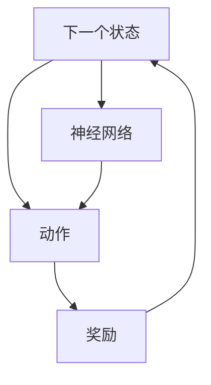
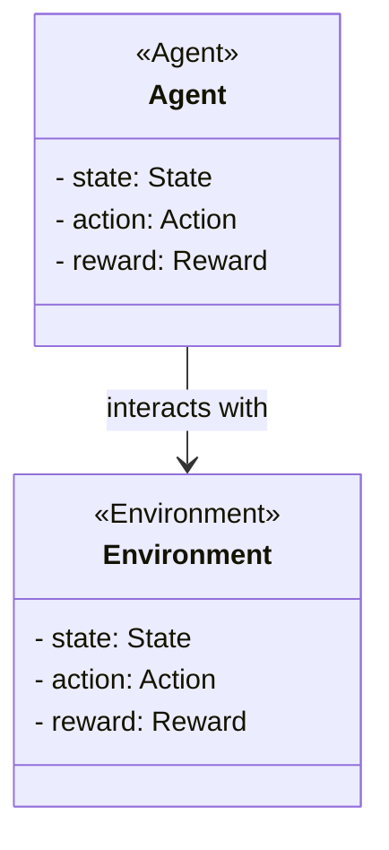
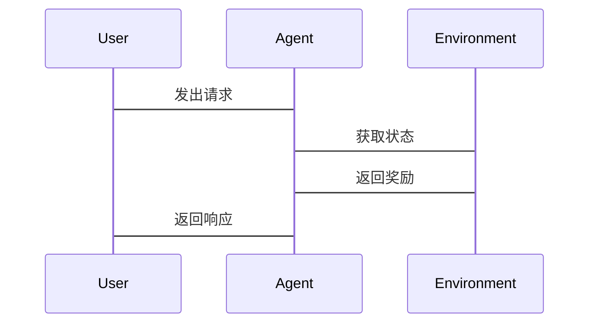

                 


# 开发具有情境模拟能力的AI Agent

## 关键词：AI Agent, 情境模拟, 强化学习, 生成模型, 系统设计

## 摘要：  
本文详细探讨了开发具有情境模拟能力的AI Agent的核心概念、算法原理、系统设计与实现。文章从AI Agent的基本概念出发，逐步深入分析情境模拟的原理、算法实现及实际应用。通过强化学习和生成模型的详细讲解，结合系统架构设计和项目实战，帮助读者全面理解如何构建具备情境模拟能力的AI Agent。文章最后总结了开发过程中的最佳实践和注意事项，为读者提供实用的指导。

---

# 第1章: AI Agent与情境模拟的背景介绍

## 1.1 AI Agent的基本概念

### 1.1.1 AI Agent的定义  
AI Agent（人工智能代理）是指能够感知环境、自主决策并执行任务的智能实体。它可以是一个软件程序、机器人或其他智能系统，具备以下核心特征：  
1. **自主性**：能够在没有外部干预的情况下独立运行。  
2. **反应性**：能够实时感知环境并做出响应。  
3. **目标导向**：通过设定目标来驱动行为。  

### 1.1.2 情境模拟的定义与作用  
情境模拟是指通过构建虚拟环境或模型，模拟真实场景中的行为、交互和结果。其作用包括：  
1. **降低风险**：在模拟环境中测试AI Agent的行为，避免实际操作中的潜在风险。  
2. **提升效率**：通过模拟加速实验和优化过程。  
3. **增强理解**：帮助开发人员更好地理解AI Agent在复杂场景中的表现。  

### 1.1.3 情境模拟在AI Agent中的重要性  
情境模拟是AI Agent实现复杂任务的关键技术，它能够：  
1. 提供多样化的训练场景。  
2. 优化AI Agent的决策能力。  
3. 支持多领域应用的开发与测试。  

## 1.2 情境模拟的背景与技术背景

### 1.2.1 当前AI Agent的发展现状  
AI Agent技术近年来取得了显著进展，特别是在自然语言处理、计算机视觉和强化学习领域。然而，大多数AI Agent仍缺乏对复杂情境的深度理解，无法在动态变化的环境中有效适应。  

### 1.2.2 情境模拟技术的演进历程  
情境模拟技术从简单的规则模拟发展到基于机器学习的复杂模型，经历了以下几个阶段：  
1. **规则驱动阶段**：基于预定义规则进行模拟。  
2. **数据驱动阶段**：利用大数据和统计学习方法构建模拟模型。  
3. **模型驱动阶段**：通过深度学习和生成对抗网络（GAN）构建高度逼真的模拟环境。  

### 1.2.3 情境模拟与传统AI的区别  
与传统AI相比，情境模拟具有以下特点：  
| 特性 | 传统AI | 情境模拟 |
|------|--------|----------|
| 数据需求 | 依赖规则和少量数据 | 依赖大量数据和模型 |
| 表现形式 | 静态规则输出 | 动态环境交互 |
| 应用场景 | 简单任务 | 复杂场景 |

## 1.3 开发具有情境模拟能力的AI Agent的意义

### 1.3.1 提升AI Agent的智能水平  
通过情境模拟，AI Agent可以更好地理解复杂场景，提升其推理和决策能力。  

### 1.3.2 满足复杂场景的应用需求  
在自动驾驶、智能客服等领域，AI Agent需要在动态环境中实时做出决策，情境模拟为其提供了有效的训练和测试环境。  

### 1.3.3 推动AI技术的创新与进步  
情境模拟技术的进步推动了AI Agent在算法、模型和系统架构上的创新，为人工智能的发展注入了新的活力。  

## 1.4 本章小结  
本章从AI Agent的基本概念出发，详细介绍了情境模拟的定义、作用及其在AI Agent中的重要性。通过分析情境模拟技术的演进历程和与传统AI的区别，揭示了开发具有情境模拟能力的AI Agent的现实意义和技术创新价值。

---

# 第2章: 情境模拟的核心概念与原理

## 2.1 情境模拟的核心概念

### 2.1.1 情境模拟的核心要素  
情境模拟的核心要素包括：  
1. **环境模型**：描述模拟环境的物理或逻辑规则。  
2. **行为模型**：定义AI Agent在模拟环境中的行为方式。  
3. **交互模型**：定义AI Agent与环境或其他实体的交互方式。  

### 2.1.2 情境模拟的实现机制  
情境模拟的实现通常包括以下步骤：  
1. **环境构建**：定义模拟环境的规则和参数。  
2. **行为生成**：根据环境信息生成AI Agent的行为。  
3. **结果反馈**：将行为结果反馈到模拟环境中，用于优化和调整。  

### 2.1.3 情境模拟与AI Agent的结合  
情境模拟为AI Agent提供了一个虚拟试验场，AI Agent在模拟环境中进行学习、训练和优化，从而提升其在实际场景中的表现。  

## 2.2 情境模拟的属性特征对比

### 2.2.1 不同情境模拟技术的对比分析  
| 技术 | 基于规则的模拟 | 基于数据的模拟 | 基于模型的模拟 |
|------|----------------|----------------|----------------|
| 优缺点 | 简单易实现，但灵活性差 | 数据驱动，结果更真实，但需要大量数据 | 模型复杂度高，结果更逼真，但需要高性能计算 |
| 适用场景 | 简单场景 | 数据丰富的场景 | 复杂场景 |

### 2.2.2 情境模拟的性能指标  
情境模拟的性能指标包括：  
1. **模拟速度**：单位时间内能够处理的模拟场景数量。  
2. **准确性**：模拟结果与真实场景的接近程度。  
3. **可扩展性**：支持大规模场景的能力。  

## 2.3 情境模拟的ER实体关系图  
以下是一个简单的ER图，描述了情境模拟的核心实体关系：  


## 2.4 本章小结  
本章详细探讨了情境模拟的核心概念与实现机制，并通过对比分析和ER图展示了情境模拟的结构与关系。

---

# 第3章: 情境模拟的核心算法

## 3.1 强化学习算法

### 3.1.1 Q-learning算法  
Q-learning是一种经典的强化学习算法，适用于离散动作空间的决策问题。其核心公式为：  
$$ Q(s,a) = Q(s,a) + \alpha \left[r + \max_{a'} Q(s',a') - Q(s,a)\right] $$  
其中，$s$表示当前状态，$a$表示动作，$r$表示奖励，$\alpha$表示学习率。

### 3.1.2 Deep Q-Network (DQN) 算法  
DQN算法通过深度神经网络近似Q值函数，适用于高维状态空间。其核心流程如下：  


## 3.2 情境生成模型

### 3.2.1 变量分解模型  
变量分解是一种将复杂问题分解为多个子问题的方法。例如，在贝叶斯网络中，联合概率可以分解为条件概率的乘积：  
$$ P(A,B,C) = P(A|B,C)P(B|C)P(C) $$  

### 3.2.2 生成对抗网络（GAN）  
生成对抗网络由生成器和判别器组成，通过对抗训练生成逼真的样本。其损失函数为：  
$$ \mathcal{L} = \mathbb{E}_{x\sim P_{\text{真实}}}\left[\log D(x)\right] + \mathbb{E}_{z\sim P_{z}}\left[\log (1 - D(G(z)))\right] $$  

## 3.3 本章小结  
本章详细介绍了强化学习和生成对抗网络在情境模拟中的应用，并通过公式和流程图展示了算法的核心思想。

---

# 第4章: 情境模拟的系统分析与架构设计

## 4.1 系统功能设计

### 4.1.1 功能模块划分  
情境模拟系统的功能模块包括：  
1. **环境构建模块**：定义模拟环境的规则和参数。  
2. **行为生成模块**：根据环境信息生成AI Agent的行为。  
3. **结果反馈模块**：将行为结果反馈到模拟环境中。  

### 4.1.2 领域模型设计  
以下是一个领域模型的类图：  


## 4.2 系统架构设计

### 4.2.1 分层架构设计  
情境模拟系统的分层架构包括：  
1. **数据层**：存储模拟数据。  
2. **算法层**：实现强化学习和生成模型。  
3. **应用层**：提供用户交互界面。  

### 4.2.2 并行架构设计  
通过分布式计算优化情境模拟的性能，例如使用GPU加速训练过程。  

## 4.3 系统交互设计

### 4.3.1 序列图  
以下是一个系统的交互序列图：  


## 4.4 本章小结  
本章详细分析了情境模拟系统的功能、架构和交互设计，并通过类图和序列图展示了系统的整体结构。

---

# 第5章: 情境模拟的项目实战

## 5.1 环境安装与配置

### 5.1.1 环境要求  
1. 安装Python 3.8及以上版本。  
2. 安装TensorFlow、Keras和OpenAI库。  

### 5.1.2 安装步骤  
```bash
pip install tensorflow keras openai
```

## 5.2 核心代码实现

### 5.2.1 强化学习代码  
```python
import numpy as np

class QLearning:
    def __init__(self, state_space_size, action_space_size):
        self.q_table = np.zeros((state_space_size, action_space_size))
    
    def choose_action(self, state, epsilon=0.1):
        if np.random.random() < epsilon:
            return np.random.randint(0, action_space_size)
        return np.argmax(self.q_table[state])
    
    def update_q_table(self, state, action, reward, next_state, learning_rate=0.1):
        self.q_table[state, action] += learning_rate * (reward + np.max(self.q_table[next_state]) - self.q_table[state, action])
```

### 5.2.2 生成模型代码  
```python
import tensorflow as tf
from tensorflow.keras import layers

def build_generator(input_dim):
    model = tf.keras.Sequential()
    model.add(layers.Dense(256, activation='relu', input_dim=input_dim))
    model.add(layers.Dense(128, activation='relu'))
    model.add(layers.Dense(input_dim))
    return model

def build_discriminator(input_dim):
    model = tf.keras.Sequential()
    model.add(layers.Dense(128, activation='relu', input_dim=input_dim))
    model.add(layers.Dense(64, activation='relu'))
    model.add(layers.Dense(1, activation='sigmoid'))
    return model
```

## 5.3 案例分析与代码解读

### 5.3.1 案例背景  
以智能客服为例，构建一个基于强化学习的情境模拟系统，训练AI Agent在客服对话中的行为。  

### 5.3.2 代码实现  
```python
# 训练过程
agent = QLearning(state_space_size=10, action_space_size=5)
for episode in range(1000):
    state = get_current_state()
    action = agent.choose_action(state)
    next_state, reward = step(action)
    agent.update_q_table(state, action, reward, next_state)
```

### 5.3.3 案例分析  
通过训练，AI Agent能够逐步掌握客服对话的策略，提升客户满意度。  

## 5.4 本章小结  
本章通过一个智能客服的案例，详细讲解了情境模拟项目的环境配置、核心代码实现和案例分析，帮助读者掌握实际开发技能。

---

# 第6章: 情境模拟的最佳实践与注意事项

## 6.1 开发中的注意事项

### 6.1.1 数据质量的重要性  
确保训练数据的多样性和代表性，避免过拟合。  

### 6.1.2 模型调参的技巧  
通过网格搜索或随机搜索优化模型参数，例如调整学习率和批量大小。  

## 6.2 系统优化的建议

### 6.2.1 并行计算的优化  
利用多线程或分布式计算加速训练过程。  

### 6.2.2 模型压缩与部署  
通过模型剪枝和量化技术降低模型的计算需求，便于实际部署。  

## 6.3 未来研究方向

### 6.3.1 多模态情境模拟  
结合文本、图像和语音等多种模态信息，提升情境模拟的逼真度。  

### 6.3.2 智能体协作与博弈  
研究多个AI Agent之间的协作与博弈，提升复杂场景下的表现。  

## 6.4 本章小结  
本章总结了情境模拟开发中的注意事项，并提出了系统的优化建议和未来的研究方向。

---

# 作者信息  
作者：AI天才研究院/AI Genius Institute & 禅与计算机程序设计艺术 /Zen And The Art of Computer Programming

