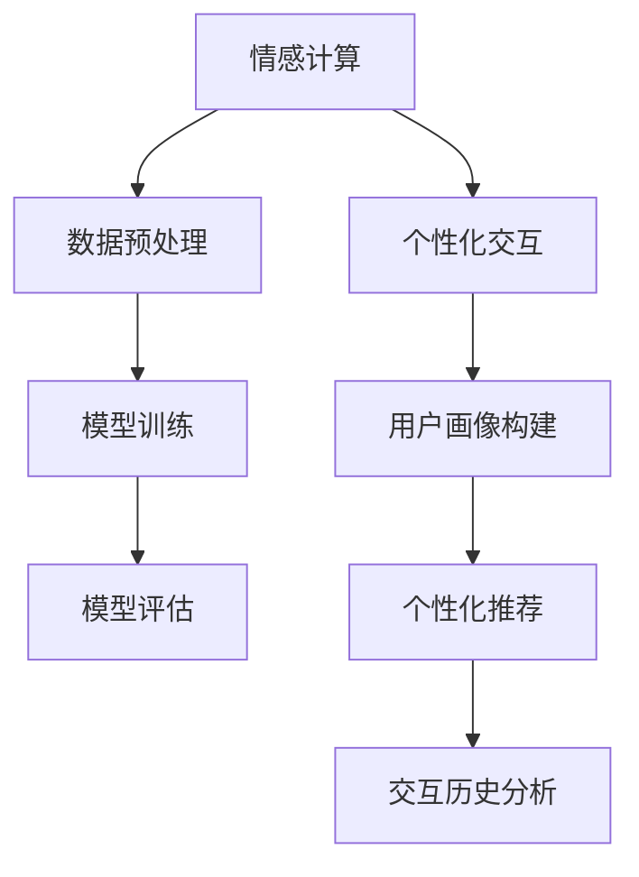
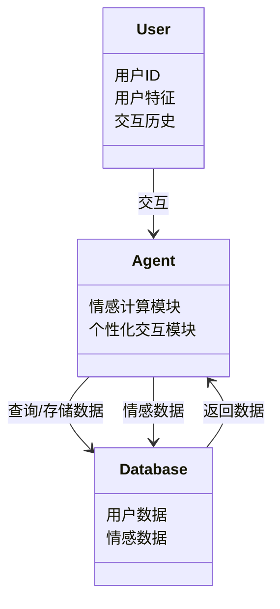
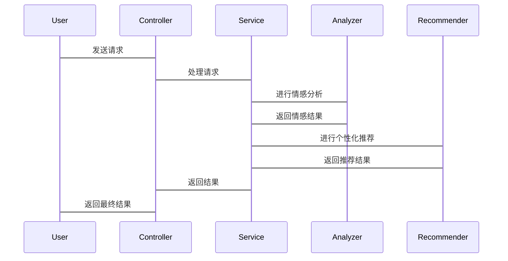

                 

<think>
好的，现在我要写一篇关于开发具有情感计算与个性化交互能力的AI Agent的技术博客。我需要从背景介绍开始，逐步深入到核心概念、算法实现、系统设计和项目实战。

首先，我会先理解什么是情感计算和个性化交互。情感计算指的是通过技术手段来识别、理解和响应人类的情感，而个性化交互则是根据用户的特定需求和偏好提供定制化的服务。

接下来，我需要解释AI Agent是什么，以及它如何与情感计算和个性化交互结合。AI Agent是一种智能体，能够在特定环境中执行任务，通过与用户的互动，它能够理解和回应用户的情感，从而提供更个性化的服务。

然后，我会讨论当前人机交互的痛点，比如传统AI Agent往往缺乏情感理解和个性化的能力，导致用户体验不佳。而情感计算和个性化交互的引入，可以显著提升用户体验，使其更加自然和贴心。

接下来，我需要详细讲解情感计算的核心原理，包括基于规则、机器学习和深度学习的情感分析方法。同时，还要介绍个性化交互的技术，如用户画像构建和个性化推荐算法。

在算法实现部分，我会选择一些常用的模型，如Transformer和BERT，来展示如何在情感分析中应用这些模型。同时，我会用Mermaid流程图来展示算法的流程，并附上Python代码示例，以便读者更好地理解和实现。

系统分析与架构设计是关键部分，我需要介绍项目背景、系统功能设计、系统架构设计等。这部分将使用Mermaid图来展示系统的结构和交互流程，确保读者能够清晰理解系统的设计。

最后，在项目实战部分，我会提供环境安装指南、核心代码实现以及案例分析，帮助读者实际操作和应用这些技术。同时，总结最佳实践、注意事项和拓展阅读内容，帮助读者巩固所学知识，并进一步深入研究。

总的来说，我会按照逻辑顺序，逐步展开每个部分，确保内容详实、结构清晰，帮助读者全面理解开发具有情感计算与个性化交互能力的AI Agent的全过程。
</think>

# 开发具有情感计算与个性化交互能力的AI Agent

> 关键词：情感计算，个性化交互，AI Agent，人机交互，深度学习

> 摘要：本文将深入探讨如何开发具有情感计算与个性化交互能力的AI Agent。通过分析情感计算的核心原理、个性化交互的技术实现，结合实际的算法设计和系统架构，展示如何构建一个能够理解和回应用户情感，并提供个性化服务的智能系统。从背景介绍到算法实现，再到系统设计和项目实战，本文将全面解析这一领域的关键技术与应用。

---

## 第一部分：情感计算与个性化交互概述

### 第1章：情感计算与个性化交互概述

#### 1.1 情感计算的基本概念

##### 1.1.1 情感计算的定义
情感计算（Affective Computing）是一种通过计算手段识别、理解和回应人类情感的技术。它不仅关注用户的语言内容，还关注用户的情感状态，如喜悦、愤怒、悲伤和惊讶等。情感计算的核心在于通过分析用户的输入（如文本、语音、图像）来推断其情感状态，并在此基础上提供相应的反馈或服务。

##### 1.1.2 情感计算的核心要素
- **情感识别**：通过自然语言处理（NLP）技术，识别用户文本中的情感倾向。
- **情感分析**：对用户的情感进行分类，确定其情感是积极、消极还是中性。
- **情感记忆**：记录用户在不同时间点的情感状态，以便后续的个性化服务。

##### 1.1.3 个性化交互的定义与特点
个性化交互是指根据用户的特定需求、偏好和情感状态，提供定制化的交互方式和服务。其特点包括：
- **动态适应性**：根据用户的实时需求和情感变化调整交互策略。
- **用户中心性**：以用户为中心，提供高度个性化的服务。
- **智能化**：利用机器学习和大数据分析技术，实现精准的个性化推荐。

#### 1.2 AI Agent的基本概念

##### 1.2.1 AI Agent的定义
AI Agent（人工智能代理）是一种智能实体，能够感知环境、理解用户需求，并通过自主决策执行任务。AI Agent可以是软件程序，也可以是硬件设备，其核心能力在于理解用户意图和环境信息。

##### 1.2.2 AI Agent的类型与分类
- **反应式AI Agent**：基于当前输入做出实时反应，不依赖历史信息。
- **认知式AI Agent**：具备推理和规划能力，能够根据历史信息做出决策。
- **混合式AI Agent**：结合反应式和认知式的特点，兼具实时反应和长期规划能力。

##### 1.2.3 情感计算在AI Agent中的作用
情感计算使AI Agent能够理解用户的情感状态，从而在交互中提供更具人性化和个性化的服务。例如，在用户表达不满时，AI Agent可以调整语气，提供更贴心的解决方案。

#### 1.3 问题背景与应用前景

##### 1.3.1 当前人机交互的痛点
传统的AI Agent往往缺乏对用户情感的理解，导致交互体验单一、僵硬。用户在与AI Agent互动时，常常感到缺乏真实感和个性化关怀。

##### 1.3.2 情感计算与个性化交互的需求
随着技术的进步，用户对智能化服务的需求日益增加。情感计算和个性化交互能够显著提升用户体验，使其更加自然、贴心和高效。

##### 1.3.3 AI Agent在不同领域的应用案例
- **客服领域**：通过情感计算识别用户情绪，提供更高效的解决方案。
- **教育领域**：根据学生的情绪状态，提供个性化的学习建议。
- **医疗领域**：通过情感分析，为患者提供情感支持和医疗建议。

#### 1.4 本章小结
本章介绍了情感计算和个性化交互的基本概念，分析了AI Agent的核心能力及其在不同领域的应用前景。情感计算和个性化交互的结合，为AI Agent的未来发展提供了重要方向。

---

## 第二部分：情感计算的核心原理

### 第2章：情感计算的核心原理

#### 2.1 情感计算的模型与算法

##### 2.1.1 基于规则的情感分析
基于规则的情感分析通过预定义的情感词汇表和规则，对文本中的情感进行分类。例如，识别文本中的积极词汇和消极词汇，并根据其数量和强度来判断整体情感倾向。

##### 2.1.2 基于机器学习的情感分析
基于机器学习的情感分析利用训练好的模型，对文本进行特征提取和分类。常用的算法包括支持向量机（SVM）和朴素贝叶斯（Naive Bayes）。

##### 2.1.3 基于深度学习的情感分析
基于深度学习的情感分析利用神经网络模型，如卷积神经网络（CNN）和循环神经网络（RNN），对文本进行特征提取和情感分类。近年来，Transformer架构（如BERT）在情感分析任务中表现出色。

#### 2.2 情感计算的关键技术

##### 2.2.1 情感特征提取
情感特征提取是从文本中提取与情感相关的特征，如情感词汇、句法结构和语义信息。常用的特征包括词袋模型（Bag-of-Words）和TF-IDF特征。

##### 2.2.2 情感分类算法
情感分类算法包括传统的机器学习算法（如SVM、Naive Bayes）和深度学习算法（如CNN、RNN）。选择哪种算法取决于数据量、任务复杂度和计算资源。

##### 2.2.3 情感强度计算
情感强度计算是对情感进行量化的过程，例如将情感强度分为1到5级，其中1表示非常消极，5表示非常积极。情感强度计算通常基于情感词汇的情感值和上下文信息。

#### 2.3 个性化交互的核心技术

##### 2.3.1 用户画像构建
用户画像是基于用户的行为数据、偏好和情感状态构建的用户模型。通过分析用户的交互历史和情感倾向，可以构建出一个详细的用户画像。

##### 2.3.2 个性化推荐算法
个性化推荐算法基于用户画像和历史行为，推荐与用户兴趣相符的内容或服务。常用的推荐算法包括协同过滤、基于内容的推荐和混合推荐。

##### 2.3.3 交互历史分析
交互历史分析通过对用户与AI Agent的交互记录进行分析，识别用户的偏好和情感变化，从而优化未来的交互策略。

#### 2.4 核心概念对比表

##### 表2.1 情感计算与个性化交互的核心要素对比

| 对比维度           | 情感计算                              | 个性化交互                              |
|--------------------|--------------------------------------|-----------------------------------------|
| 核心目标           | 理解和识别用户情感                    | 根据用户需求和情感提供个性化服务         |
| 技术手段           | 情感分析、情感分类                   | 用户画像、推荐算法、交互历史分析         |
| 数据来源           | 文本、语音、图像                      | 用户行为、偏好、交互记录                |
| 应用场景           | 客服、教育、医疗                     | 电商、娱乐、社交网络                    |

#### 2.5 本章小结
本章详细介绍了情感计算的核心原理和个性化交互的技术实现。通过对比情感计算与个性化交互的核心要素，帮助读者更好地理解两者之间的联系和区别。

---

## 第三部分：情感计算与个性化交互的算法实现

### 第3章：情感计算的算法实现

#### 3.1 基于深度学习的情感分析算法

##### 3.1.1 Transformer模型简介
Transformer是一种基于自注意力机制的深度学习模型，广泛应用于自然语言处理任务。其核心思想是通过计算输入序列中每个词与其他词的相关性，生成自适应的表示。

##### 3.1.2 BERT模型在情感分析中的应用
BERT（Bidirectional Encoder Representations from Transformers）是一种预训练语言模型，通过双向上下文信息生成词向量。BERT在情感分析任务中表现出色，能够捕捉到文本中的深层语义信息。

##### 3.1.3 情感分类的模型训练流程
1. 数据预处理：将文本数据转换为数字向量，常用词嵌入技术（如Word2Vec、GloVe）。
2. 模型训练：使用预训练好的BERT模型，在特定的情感分类任务上进行微调。
3. 模型评估：通过准确率、精确率、召回率和F1值评估模型性能。

#### 3.2 情感计算的算法实现步骤

##### 3.2.1 数据预处理
- 分词：将文本分割成词语或短语。
- 去停用词：去除对情感分析无意义的词汇，如“的”、“了”等。
- 词性标注：对词语进行词性标注，如名词、动词、形容词等。

##### 3.2.2 模型训练
- 选择合适的算法：如SVM、Naive Bayes、CNN、RNN或BERT。
- 构建训练数据集：将文本数据标注为积极、消极或中性。
- 训练模型：使用训练数据对模型进行训练，调整模型参数以优化性能。

##### 3.2.3 模型评估与优化
- 评估指标：准确率（Accuracy）、精确率（Precision）、召回率（Recall）、F1值。
- 调参优化：通过交叉验证调整模型参数，如学习率、正则化系数等。

#### 3.3 个性化交互的算法实现

##### 3.3.1 用户画像构建算法
1. 数据收集：收集用户的交互记录、偏好和情感状态。
2. 特征提取：提取用户相关的特征，如用户的年龄、性别、兴趣爱好等。
3. 用户分群：根据用户特征进行聚类分析，将用户分为不同的群体。

##### 3.3.2 个性化推荐算法
1. 协同过滤：基于用户相似性推荐内容。
2. 基于内容的推荐：基于用户偏好和内容特征推荐内容。
3. 混合推荐：结合协同过滤和基于内容的推荐方法。

##### 3.3.3 交互历史分析算法
1. 数据挖掘：对用户的交互历史进行分析，识别用户的偏好和情感变化。
2. 模型训练：使用时间序列分析或机器学习模型预测用户的未来行为。

#### 3.4 情感计算与个性化交互的算法对比

##### 图3.1 情感计算与个性化交互的算法流程图（Mermaid）



#### 3.5 本章小结
本章详细讲解了情感计算和个性化交互的算法实现，包括基于深度学习的情感分析算法和个性化推荐算法。通过对比分析，帮助读者理解两种算法的核心思想和应用场景。

---

## 第四部分：系统分析与架构设计

### 第4章：系统分析与架构设计

#### 4.1 问题场景介绍
假设我们正在开发一个智能客服AI Agent，用户可以通过文本或语音与AI Agent进行交互。系统需要能够识别用户的情感状态，并根据用户的需求和情感提供个性化的服务。

#### 4.2 项目介绍
本项目旨在开发一个具有情感计算和个性化交互能力的AI Agent，能够理解用户情感，并根据用户需求提供定制化的服务。

#### 4.3 系统功能设计

##### 4.3.1 领域模型图（Mermaid）



#### 4.4 系统架构设计（Mermaid）


#### 4.5 系统接口设计
- **用户接口（UI）**：用户与AI Agent进行交互的界面，支持文本和语音输入。
- **控制器（Controller）**：接收用户的输入，并将请求传递给服务层。
- **服务层（Service）**：处理用户的请求，调用情感分析模块和个性化推荐模块。
- **存储层（Repository）**：负责数据的存储和检索。

#### 4.6 系统交互流程（Mermaid）



#### 4.7 本章小结
本章通过系统分析与架构设计，展示了如何将情感计算和个性化交互技术应用于实际项目中。从问题场景到系统架构，详细描述了系统的各个部分及其交互流程。

---

## 第五部分：项目实战

### 第5章：项目实战

#### 5.1 环境安装与配置

##### 5.1.1 安装Python环境
- 安装Python：从[Python官网](https://www.python.org/)下载并安装最新版本的Python。
- 安装虚拟环境：使用`virtualenv`或`venv`创建虚拟环境。

##### 5.1.2 安装依赖库
- 安装Numpy：`pip install numpy`
- 安装Pandas：`pip install pandas`
- 安装Scikit-learn：`pip install scikit-learn`
- 安装Transformers：`pip install transformers`

#### 5.2 系统核心实现源代码

##### 5.2.1 情感计算模块

```python
from transformers import pipeline

# 初始化情感分析管道
sentiment_analyzer = pipeline("sentiment-analysis")

# 情感分析函数
def analyze_sentiment(text):
    result = sentiment_analyzer(text)
    return result[0]['label']

# 示例
text = "I love this product!"
print(analyze_sentiment(text))  # 输出: 'POSITIVE'
```

##### 5.2.2 个性化推荐模块

```python
import pandas as pd
from sklearn.metrics.pairwise import cosine_similarity

# 加载数据集
df = pd.read_csv('user_data.csv')

# 特征提取
tfidf = TfidfVectorizer(max_features=5000)
tfidf_matrix = tfidf.fit_transform(df['text'])

# 计算余弦相似度
similarity_matrix = cosine_similarity(tfidf_matrix, tfidf_matrix)

# 推荐函数
def get_recommendations(user_id, similarity_matrix):
    # 获取用户索引
    user_index = df[df['user_id'] == user_id].index[0]
    # 找出相似度最高的用户
    similar_users = [i for i in range(len(similarity_matrix[user_index]))]
    similar_users.sort(key=lambda x: similarity_matrix[user_index][x], reverse=True)
    return similar_users[:5]
```

##### 5.2.3 交互历史分析模块

```python
import datetime

# 记录交互历史
def log_interaction(user_id, action, timestamp=None):
    if timestamp is None:
        timestamp = datetime.datetime.now()
    with open('interaction_log.txt', 'a') as f:
        f.write(f"{user_id}, {action}, {timestamp}\n")

# 示例
log_interaction(123, 'query product info')
```

#### 5.3 代码应用解读与分析

##### 5.3.1 情感计算模块
- 使用Hugging Face的Transformers库中的预训练模型进行情感分析，能够快速准确地识别文本的情感倾向。

##### 5.3.2 个性化推荐模块
- 基于TF-IDF和余弦相似度的推荐算法，能够根据用户的偏好和行为推荐相关内容。

##### 5.3.3 交互历史分析模块
- 通过记录用户的交互历史，分析用户的偏好和情感变化，优化未来的交互策略。

#### 5.4 实际案例分析

##### 5.4.1 情感计算案例
假设用户输入文本为“我非常不满意这个服务！”，情感计算模块将识别其情感为“NEGATIVE”。

##### 5.4.2 个性化推荐案例
假设用户喜欢科技类文章，个性化推荐模块将推荐其他科技类文章，同时根据用户的情感状态推荐相关内容。

#### 5.5 项目小结
本章通过实际的代码实现，展示了如何将情感计算和个性化交互技术应用于实际项目中。通过案例分析，帮助读者更好地理解代码的功能和应用场景。

---

## 第六部分：最佳实践与总结

### 第6章：最佳实践与总结

#### 6.1 最佳实践

##### 6.1.1 数据处理
- 数据清洗：去除噪音数据，确保数据质量。
- 数据增强：通过数据增强技术，增加数据的多样性。

##### 6.1.2 模型选择
- 根据任务需求选择合适的模型：对于情感分析，BERT模型表现优异；对于个性化推荐，协同过滤和深度学习模型各有优劣。

##### 6.1.3 系统优化
- 优化算法性能：通过并行计算和分布式训练提升模型训练效率。
- 优化系统架构：通过微服务架构和容器化技术提升系统的可扩展性和可维护性。

#### 6.2 小结
开发具有情感计算与个性化交互能力的AI Agent是一项复杂的系统工程。通过本文的讲解，读者可以全面了解情感计算和个性化交互的核心原理、算法实现和系统设计。

#### 6.3 注意事项
- 数据隐私：在处理用户数据时，必须遵守相关法律法规，保护用户隐私。
- 模型泛化能力：在训练模型时，要注意模型的泛化能力，避免过拟合。
- 系统稳定性：确保系统的稳定性和可维护性，避免因技术问题导致服务中断。

#### 6.4 拓展阅读
- 《Deep Learning for NLP》：了解深度学习在自然语言处理中的应用。
- 《Personalized Recommendations》：探索个性化推荐的最新技术与方法。

---

## 作者：AI天才研究院/AI Genius Institute & 禅与计算机程序设计艺术 /Zen And The Art of Computer Programming

---

**本文作者：AI天才研究院**  
**版权所有，未经授权不得转载。**

