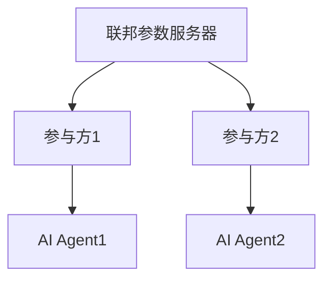
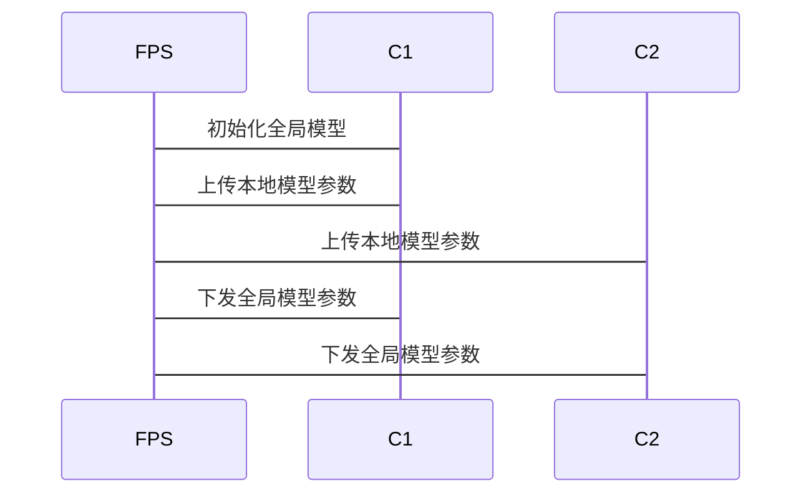

                 


# 开发具有联邦学习能力的AI Agent

## 关键词：联邦学习、AI Agent、数据隐私、多智能体协作、分布式系统

## 摘要：本文详细探讨了如何开发具有联邦学习能力的AI Agent。文章从联邦学习和AI Agent的基本概念出发，分析了它们的结合方式，详细讲解了相关的算法原理、系统架构设计，通过实际案例展示了如何实现这一系统，并总结了开发过程中的关键点和未来发展方向。

---

# 第一部分：背景介绍与核心概念

## 第1章：联邦学习与AI Agent概述

### 1.1 联邦学习的定义与背景

#### 1.1.1 数据孤岛与隐私保护问题
在当今数据驱动的时代，数据孤岛和隐私保护问题日益突出。企业或组织由于数据隐私和安全的限制，无法将数据集中共享，导致数据无法充分挖掘其潜力。联邦学习（Federated Learning）作为一种新兴的技术，能够在保护数据隐私的前提下，通过分布式计算让多个机构或设备协作训练模型，从而解决了这一难题。

#### 1.1.2 联邦学习的定义与特点
联邦学习是一种分布式机器学习技术，允许多个参与方在不共享原始数据的情况下，协作训练一个共同的模型。其特点包括：
- **数据隐私**：数据不出本地，仅传输模型参数。
- **分布式计算**：计算分布在多个节点上，减少数据传输量。
- **联邦参数服务器**：中央服务器协调各参与方的模型更新。

#### 1.1.3 联邦学习的核心目标与应用场景
联邦学习的核心目标是通过分布式协作提升模型性能，同时保护数据隐私。其应用场景包括：
- **医疗领域**：多个医院协作训练医学模型，保护患者隐私。
- **金融行业**：多家金融机构联合训练反欺诈模型。
- **物联网**：智能设备协作优化性能。

### 1.2 AI Agent的定义与特点

#### 1.2.1 AI Agent的基本概念
AI Agent（人工智能代理）是一种能够感知环境、自主决策并执行任务的智能体。它可以是一个软件程序或物理设备，通过与环境交互实现目标。

#### 1.2.2 AI Agent的核心能力与任务类型
AI Agent的核心能力包括：
- **感知能力**：通过传感器或数据接口获取环境信息。
- **决策能力**：基于感知信息进行推理和决策。
- **执行能力**：通过执行器或接口完成任务。

AI Agent的任务类型包括：
- **简单任务**：如智能音箱播放音乐。
- **复杂任务**：如自动驾驶汽车的环境识别与路径规划。

#### 1.2.3 AI Agent与传统AI的区别
AI Agent与传统AI的区别主要体现在自主性和动态性上。AI Agent能够在动态环境中自主决策，而传统AI通常是在静态环境中执行预定义任务。

### 1.3 联邦学习与AI Agent的结合

#### 1.3.1 联邦学习在AI Agent中的应用
联邦学习可以应用于AI Agent的模型训练阶段，多个AI Agent协作训练一个共同的模型，同时保护每个Agent的数据隐私。

#### 1.3.2 联邦学习如何增强AI Agent的能力
联邦学习使得AI Agent能够从更广泛的数据源中学习，提升模型的泛化能力和性能。

#### 1.3.3 联邦学习与AI Agent结合的潜在价值
- **数据隐私保护**：通过联邦学习，AI Agent可以在不共享数据的情况下协作训练。
- **分布式智能**：多个AI Agent协作，形成更强大的分布式智能系统。

---

## 第2章：联邦学习的核心概念与原理

### 2.1 联邦学习的核心概念

#### 2.1.1 联邦学习的参与方与角色
在联邦学习中，主要参与方包括：
- **联邦参数服务器（FPS）**：协调各个参与方的模型更新。
- **参与方（Client）**：拥有数据的终端设备或机构，负责本地模型训练。

#### 2.1.2 联邦学习的数据分布与模型更新
联邦学习假设数据分布在多个参与方的本地，每个参与方在本地训练模型，并将模型参数更新上传到联邦服务器。服务器将所有参与方的模型参数进行聚合，生成全局模型。

#### 2.1.3 联邦学习的通信机制与安全性
联邦学习通过安全的通信机制确保模型参数的传输安全，防止数据泄露。常用的安全措施包括加密传输和差分隐私技术。

### 2.2 AI Agent的核心概念

#### 2.2.1 AI Agent的感知与决策机制
AI Agent通过感知环境信息，利用决策算法选择最优动作。感知和决策过程通常基于概率模型或强化学习算法。

#### 2.2.2 AI Agent的自主性与协作性
AI Agent的自主性体现在其能够自主决策，而协作性则体现在多个AI Agent能够通过联邦学习协作训练模型。

#### 2.2.3 AI Agent的环境建模与任务规划
AI Agent需要对环境进行建模，并根据任务目标制定执行计划。任务规划通常涉及状态空间和动作空间的定义。

### 2.3 联邦学习与AI Agent的联系与区别

#### 2.3.1 联邦学习与AI Agent的联系
联邦学习可以应用于AI Agent的模型训练阶段，多个AI Agent协作训练一个共同的模型。

#### 2.3.2 联邦学习与AI Agent的区别
联邦学习主要关注模型训练的协作，而AI Agent关注任务执行的自主性。

#### 2.3.3 联邦学习与AI Agent的结合
通过结合联邦学习和AI Agent，可以实现多个AI Agent协作训练模型，同时保护数据隐私。

---

## 第3章：联邦学习与AI Agent的联系与区别

### 3.1 联邦学习与AI Agent的联系

#### 3.1.1 联邦学习为AI Agent提供协作训练能力
通过联邦学习，多个AI Agent可以协作训练一个共同的模型，提升整体性能。

#### 3.1.2 AI Agent为联邦学习提供分布式计算能力
AI Agent作为联邦学习的参与方，可以在本地进行模型训练，减少数据传输量。

### 3.2 联邦学习与AI Agent的区别

#### 3.2.1 联邦学习关注模型训练，AI Agent关注任务执行
联邦学习的核心是模型训练的协作，而AI Agent的核心是任务执行的自主性。

#### 3.2.2 联邦学习需要多个参与方，AI Agent可以是单个实体
联邦学习通常涉及多个参与方，而AI Agent可以是一个独立的实体。

### 3.3 联邦学习与AI Agent的结合

#### 3.3.1 联邦学习与AI Agent结合的意义
通过结合联邦学习和AI Agent，可以实现多个AI Agent协作训练模型，同时保护数据隐私。

#### 3.3.2 联邦学习与AI Agent结合的应用场景
- **智能家居**：多个智能家居设备协作训练能源优化模型。
- **自动驾驶**：多个自动驾驶汽车协作训练交通预测模型。

---

## 第4章：联邦学习与AI Agent的结合

### 4.1 联邦学习在AI Agent中的应用

#### 4.1.1 多智能体协作学习
通过联邦学习，多个AI Agent可以协作训练一个共同的模型，提升整体性能。

#### 4.1.2 联邦学习与多智能体协作的区别
联邦学习关注模型训练的协作，而多智能体协作关注任务执行的协作。

### 4.2 AI Agent的联邦学习实现

#### 4.2.1 AI Agent的本地模型训练
AI Agent在本地进行模型训练，并将模型参数更新上传到联邦服务器。

#### 4.2.2 联邦服务器的参数聚合
联邦服务器将所有参与方的模型参数进行聚合，生成全局模型。

### 4.3 联邦学习与AI Agent结合的优势

#### 4.3.1 数据隐私保护
通过联邦学习，AI Agent可以在不共享数据的情况下协作训练模型。

#### 4.3.2 分布式智能
多个AI Agent协作，形成更强大的分布式智能系统。

---

## 第5章：联邦学习与AI Agent的算法原理

### 5.1 联邦学习的核心算法

#### 5.1.1 联邦平均（FedAvg）算法
FedAvg算法是一种常用的联邦学习算法，通过在各个参与方本地训练模型，并将模型参数上传到中央服务器，服务器对所有参与方的模型参数进行平均，生成全局模型。

#### 5.1.2 联邦学习的数学模型
假设我们有多个参与方，每个参与方的数据集为$D_i$，全局模型参数为$\theta$。每个参与方在本地训练模型，更新参数$\theta_i$，然后将$\theta_i$上传到中央服务器。服务器将所有$\theta_i$进行平均，生成新的全局模型$\theta_{new}$。

$$
\theta_{new} = \frac{1}{K} \sum_{i=1}^{K} \theta_i
$$

其中，$K$是参与方的数量。

#### 5.1.3 联邦学习的通信流程
1. 中央服务器初始化全局模型参数$\theta$。
2. 每个参与方在本地数据集$D_i$上训练模型，得到本地参数$\theta_i$。
3. 参与方将$\theta_i$上传到中央服务器。
4. 中央服务器对所有$\theta_i$进行平均，生成新的全局模型$\theta_{new}$。
5. 重复上述过程，直到模型收敛。

### 5.2 AI Agent的决策算法

#### 5.2.1 基于强化学习的决策算法
AI Agent可以通过强化学习算法进行决策，例如Q-learning或深度强化学习。

#### 5.2.2 强化学习的数学模型
强化学习的目标是通过最大化累积奖励来学习最优策略。状态空间$S$，动作空间$A$，奖励函数$r(s, a)$，目标是找到最优策略$\pi(a|s)$，使得累积奖励最大。

$$
Q(s, a) = Q(s, a) + \alpha [r(s, a) + \gamma \max Q(s', a) - Q(s, a)]
$$

其中，$\alpha$是学习率，$\gamma$是折扣因子。

#### 5.2.3 强化学习的训练流程
1. AI Agent感知环境状态$s$。
2. 根据当前状态$s$选择动作$a$。
3. 执行动作$a$，获得奖励$r$，并转移到新的状态$s'$。
4. 更新Q值$Q(s, a)$，重复上述过程，直到收敛。

---

## 第6章：联邦学习与AI Agent的系统架构设计

### 6.1 系统架构概述

#### 6.1.1 联邦服务器（FPS）
- 职责：协调多个参与方的模型更新，聚合全局模型。
- 组件：通信接口、模型聚合模块。

#### 6.1.2 参与方（Client）
- 职责：在本地数据集上训练模型，上传模型参数到联邦服务器。
- 组件：本地模型训练模块、通信接口。

#### 6.1.3 AI Agent
- 职责：作为参与方，本地训练模型，并与联邦服务器协作。
- 组件：感知模块、决策模块、执行模块。

### 6.2 系统功能设计

#### 6.2.1 数据预处理模块
- 职责：对本地数据进行清洗、归一化等预处理，确保数据质量。

#### 6.2.2 模型训练模块
- 职责：在本地数据上训练模型，更新模型参数。

#### 6.2.3 模型聚合模块
- 职责：将所有参与方的模型参数进行聚合，生成全局模型。

### 6.3 系统架构图（Mermaid）



### 6.4 接口设计

#### 6.4.1 通信接口
- 接口功能：接收参与方上传的模型参数，发送全局模型参数到参与方。
- 数据格式：JSON格式，包含模型参数和版本信息。

#### 6.4.2 模型更新接口
- 接口功能：参与方调用该接口上传本地模型参数。
- 请求参数：模型参数、参与方ID、版本号。

### 6.5 交互流程（Mermaid）



---

## 第7章：项目实战

### 7.1 环境安装

#### 7.1.1 安装Python
```bash
python --version
```

#### 7.1.2 安装必要的库
```bash
pip install numpy matplotlib tensorflow
```

### 7.2 核心代码实现

#### 7.2.1 联邦服务器代码
```python
import numpy as np

class FederatedServer:
    def __init__(self, model):
        self.model = model
        self.clients = []
    
    def add_client(self, client):
        self.clients.append(client)
    
    def aggregate_models(self):
        weights = self.model.get_weights()
        for i, client in enumerate(self.clients):
            client_weights = client.get_weights()
            weights[i] += client_weights
        average_weights = [w / len(self.clients) for w in weights]
        self.model.set_weights(average_weights)
```

#### 7.2.2 参与方代码
```python
import numpy as np

class Client:
    def __init__(self, data, model):
        self.data = data
        self.model = model
    
    def train(self):
        # 在本地数据上训练模型
        pass
    
    def get_weights(self):
        return self.model.get_weights()
    
    def set_weights(self, weights):
        self.model.set_weights(weights)
```

#### 7.2.3 AI Agent代码
```python
import numpy as np

class AIAssistant:
    def __init__(self, model):
        self.model = model
        self.environment = None
    
    def perceive(self):
        # 获取环境信息
        pass
    
    def decide(self):
        # 基于感知信息进行决策
        pass
    
    def execute(self, action):
        # 执行动作
        pass
```

### 7.3 案例分析

#### 7.3.1 案例介绍
以医疗数据分析为例，多个医院协作训练医学诊断模型，保护患者隐私。

#### 7.3.2 数据预处理
```python
def preprocess(data):
    # 数据清洗、归一化等预处理
    return processed_data
```

#### 7.3.3 模型训练
```python
def train_model(data, model):
    # 在本地数据上训练模型
    pass
```

#### 7.3.4 模型评估
```python
def evaluate_model(model, test_data):
    # 在测试数据上评估模型性能
    pass
```

---

## 第8章：总结与展望

### 8.1 本章总结
本文详细探讨了如何开发具有联邦学习能力的AI Agent，从联邦学习和AI Agent的基本概念出发，分析了它们的结合方式，详细讲解了相关的算法原理、系统架构设计，通过实际案例展示了如何实现这一系统，并总结了开发过程中的关键点和未来发展方向。

### 8.2 开发过程中的关键点
- **数据隐私保护**：通过联邦学习确保数据不出本地。
- **模型聚合优化**：通过合理的算法设计提升模型性能。
- **系统架构设计**：确保系统的可扩展性和安全性。

### 8.3 未来展望
- **边缘计算结合**：将联邦学习与边缘计算结合，进一步提升性能。
- **区块链技术结合**：利用区块链技术确保联邦学习的透明性和不可篡改性。
- **多模态数据协作**：支持多种数据类型的协作学习，提升模型的综合能力。

---

## 作者：AI天才研究院/AI Genius Institute & 禅与计算机程序设计艺术 /Zen And The Art of Computer Programming

