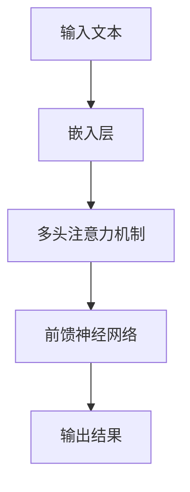
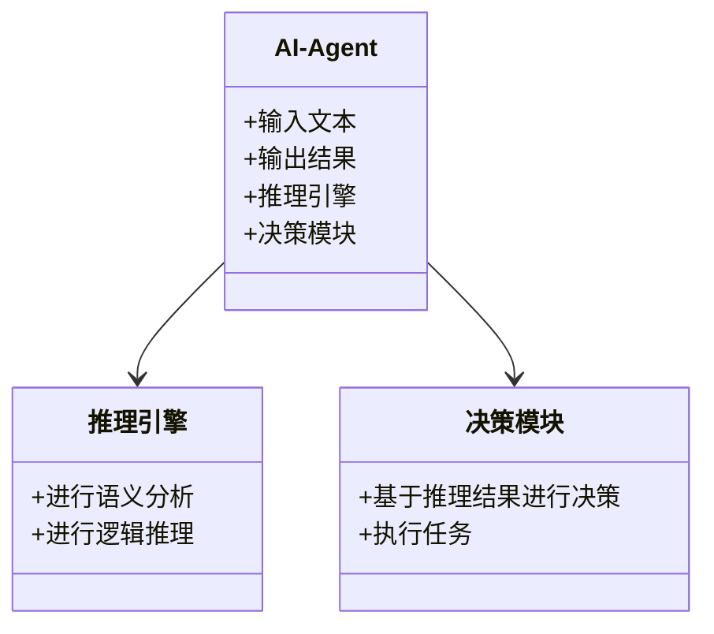
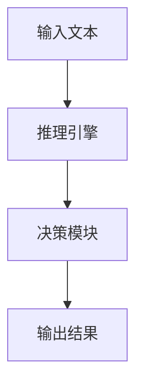

                 

<think>
好的，我现在需要帮用户撰写一篇关于“开发具有自然语言推理能力的AI Agent”的技术博客文章。用户希望文章结构清晰，逻辑严密，每个章节都包含详细的背景介绍、核心概念、算法原理、系统架构、项目实战等内容。同时，用户希望文章使用Markdown格式，包含图表、代码示例和数学公式，并且在末尾加上作者信息。

首先，我需要明确文章的结构。根据用户的指示，文章应包括以下几个部分：

1. **背景介绍**：解释什么是自然语言推理和AI Agent，以及它们的重要性和应用场景。
2. **核心概念与联系**：详细讲解自然语言推理和AI Agent的原理，比较它们的属性特征，并用图表展示。
3. **算法原理**：介绍基于深度学习的自然语言推理算法，包括模型结构、数学公式和代码实现。
4. **系统分析与架构设计**：分析问题场景，设计系统的功能、架构、接口和交互，并用图表展示。
5. **项目实战**：指导读者如何安装环境，实现核心功能，并进行案例分析。
6. **最佳实践和小结**：总结全书内容，提供注意事项和扩展阅读的建议。

接下来，我需要为每个部分细化内容，确保每个章节都详细且有条理。例如，在“背景介绍”部分，我需要解释自然语言推理的基本概念，AI Agent的特点，以及它们之间的联系。

在“核心概念与联系”部分，我需要比较自然语言推理和AI Agent的属性特征，并用表格和Mermaid图展示它们的关系。这样读者可以清晰地理解两者之间的联系。

在“算法原理”部分，我需要详细解释基于Transformer的自然语言推理模型，包括其数学公式和Python代码实现。同时，用Mermaid流程图展示算法的训练过程，帮助读者理解。

在“系统分析与架构设计”部分，我需要分析问题场景，设计系统的功能模块，并用Mermaid图展示领域模型、架构图和交互流程。这样读者可以了解系统的整体结构。

在“项目实战”部分，我需要提供详细的安装步骤、代码示例和案例分析，让读者能够实际操作，巩固所学知识。

最后，在“最佳实践和小结”部分，我需要总结全书内容，提供一些注意事项和扩展阅读的建议，帮助读者更好地应用所学知识。

在撰写过程中，我需要确保每个部分都包含足够的细节，并且逻辑清晰。同时，要避免冗余，保持简洁，控制总字数在10000到12000字之间。此外，文章需要包含作者信息，格式统一，图表和代码正确嵌入。

总的来说，我需要按照用户的要求，一步一步地构建文章的各个部分，确保内容全面且易于理解。这需要我对自然语言推理和AI Agent有深入的理解，并能够将复杂的概念以简单明了的方式呈现出来。通过这样的思考和规划，我相信可以写出一篇符合用户需求的高质量技术博客文章。
</think>

```markdown
# 开发具有自然语言推理能力的AI Agent

> 关键词：自然语言推理，AI Agent，深度学习，Transformer模型，系统架构设计

> 摘要：本文详细介绍了开发具有自然语言推理能力的AI Agent的全过程，从核心概念的理解到算法实现，再到系统架构设计和项目实战。文章首先阐述了自然语言推理和AI Agent的基本概念及其重要性，接着深入分析了自然语言推理的原理和算法实现，然后探讨了AI Agent的系统架构设计，最后通过项目实战展示了如何将理论应用于实际开发。本文旨在为开发者提供一套完整的开发指南，帮助他们构建具有自然语言推理能力的AI Agent。

---

## 第一部分：背景介绍

### 第1章：自然语言推理与AI Agent的基本概念

#### 1.1 自然语言推理的定义与核心概念
自然语言推理（Natural Language Inference, NLI）是人工智能领域中的一个重要分支，旨在让计算机能够理解并推理自然语言文本中的含义。它涉及对文本进行分析、理解和推理，从而得出合理的结论。NLI的核心在于理解文本中的语义关系，并能够基于这些关系进行推理和判断。

- **基本概念**：
  - **前提（Premise）**：输入文本中的前提部分，通常是一个句子或短语。
  - **假设（Hypothesis）**：需要验证的假设部分，通常也是一个句子或短语。
  - **结论（Conclusion）**：基于前提和假设推导出的结论，通常是一个判断（如“蕴含”、“矛盾”或“中立”）。

- **核心要素**：
  - **语义理解**：理解文本中词语、句子的含义。
  - **逻辑推理**：基于语义关系进行推理，得出合理的结论。
  - **上下文理解**：考虑文本的上下文信息，进行更准确的推理。

- **应用场景**：
  - **智能对话系统**：在对话中理解用户意图并进行推理。
  - **信息抽取**：从文本中提取有用的信息并进行推理。
  - **智能问答系统**：基于上下文进行推理并回答问题。

#### 1.2 AI Agent的定义与特点
AI Agent（人工智能代理）是一种能够感知环境、执行任务并做出决策的智能实体。它能够通过与环境的交互，完成特定的目标或任务。AI Agent的特点包括：

- **自主性**：能够自主决策，无需外部干预。
- **反应性**：能够感知环境并实时做出反应。
- **目标导向**：以完成特定目标为导向。
- **学习能力**：能够通过学习提升自身的智能水平。

- **核心功能**：
  - **感知环境**：通过传感器或接口感知外部环境。
  - **推理与决策**：基于感知的信息进行推理并做出决策。
  - **执行任务**：根据决策执行具体任务。

- **与传统程序的区别**：
  - **智能性**：AI Agent具有一定的智能性，能够进行推理和决策。
  - **自主性**：能够自主完成任务，无需外部干预。
  - **适应性**：能够根据环境的变化进行调整。

#### 1.3 自然语言推理在AI Agent中的作用
自然语言推理在AI Agent中扮演着至关重要的角色。通过自然语言推理，AI Agent能够理解并推理自然语言文本中的含义，从而做出更智能的决策和行动。

- **重要性**：
  - **提升智能性**：通过理解上下文和推理，AI Agent能够更好地理解用户的需求。
  - **增强交互能力**：通过自然语言推理，AI Agent能够与人类进行更自然的交互。
  - **提高任务执行效率**：通过推理和决策，AI Agent能够更高效地完成任务。

- **应用场景**：
  - **智能助手**：如Siri、Alexa等，能够理解用户的指令并执行任务。
  - **智能客服**：能够通过理解用户的问题并进行推理，提供更准确的解答。
  - **智能对话系统**：能够通过推理和理解，进行更自然的对话。

#### 1.4 本章小结
本章介绍了自然语言推理和AI Agent的基本概念及其重要性。通过理解自然语言推理的核心概念和AI Agent的特点，我们可以更好地理解它们在AI Agent开发中的作用。

---

## 第二部分：自然语言推理与AI Agent的核心概念与联系

### 第2章：自然语言推理的原理与实现

#### 2.1 自然语言推理的原理
自然语言推理的原理在于通过分析文本中的语义关系，进行推理并得出结论。其核心在于理解文本的含义，并能够基于这些含义进行推理。

- **基本原理**：
  - **语义分析**：通过对文本进行语义分析，理解其含义。
  - **逻辑推理**：基于语义关系进行逻辑推理，得出结论。
  - **上下文理解**：考虑文本的上下文信息，进行更准确的推理。

- **关键技术**：
  - **句法分析**：分析句子的语法结构。
  - **语义分析**：理解词语和句子的含义。
  - **逻辑推理**：基于语义关系进行推理。

#### 2.2 自然语言推理的核心算法
自然语言推理的核心算法主要基于深度学习，尤其是Transformer模型。以下是几种常见的算法：

- **基于规则的推理算法**：
  - **基于逻辑规则的推理**：通过预定义的逻辑规则进行推理。
  - **基于模板的推理**：通过预定义的模板进行推理。

- **基于统计的推理算法**：
  - **统计推理**：通过统计方法，如最大熵模型，进行推理。
  - **概率推理**：基于概率论进行推理。

- **基于深度学习的推理算法**：
  - **基于Transformer的推理模型**：如BERT、RoBERTa等模型。
  - **基于注意力机制的推理模型**：通过注意力机制进行推理。

#### 2.3 自然语言推理与AI Agent的结合
自然语言推理在AI Agent中的应用主要体现在以下几个方面：

- **理解用户意图**：通过自然语言推理，AI Agent能够理解用户的意图。
- **推理与决策**：通过自然语言推理，AI Agent能够基于用户的指令进行推理，并做出决策。
- **增强交互能力**：通过自然语言推理，AI Agent能够与用户进行更自然的交互。

#### 2.4 本章小结
本章详细介绍了自然语言推理的原理及其核心算法，并探讨了自然语言推理在AI Agent中的应用。通过理解自然语言推理的核心原理，我们可以更好地开发具有自然语言推理能力的AI Agent。

---

## 第三部分：自然语言推理与AI Agent的算法原理

### 第3章：基于深度学习的自然语言推理算法

#### 3.1 深度学习在自然语言推理中的应用
深度学习在自然语言推理中的应用主要体现在以下几个方面：

- **语义分析**：通过深度学习模型，如BERT、RoBERTa等，进行语义分析。
- **逻辑推理**：通过深度学习模型，如Transformer，进行逻辑推理。
- **上下文理解**：通过深度学习模型，理解文本的上下文信息。

#### 3.2 基于Transformer的自然语言推理模型
基于Transformer的自然语言推理模型是目前最为流行的模型之一。以下是其基本结构：



- **嵌入层**：将输入文本转换为词向量。
- **多头注意力机制**：通过注意力机制，关注文本中的重要部分。
- **前馈神经网络**：对注意力后的结果进行非线性变换，输出最终结果。

#### 3.3 自然语言推理算法的数学模型与公式
以下是基于Transformer的自然语言推理模型的数学公式：

```latex
$$
\text{输出} = f(f_{\text{ff}}(f_{\text{attn}}(\text{输入})))
$$

其中，$f_{\text{attn}}$ 表示多头注意力机制，$f_{\text{ff}}$ 表示前馈神经网络。

#### 3.4 本章小结
本章详细介绍了基于深度学习的自然语言推理算法，特别是基于Transformer的模型。通过理解其数学公式和实现原理，我们可以更好地开发具有自然语言推理能力的AI Agent。

---

## 第四部分：自然语言推理与AI Agent的系统架构设计

### 第4章：系统分析与架构设计

#### 4.1 问题场景介绍
本节将介绍开发具有自然语言推理能力的AI Agent所面临的问题场景。

- **问题描述**：
  - **语义理解**：如何准确理解用户的输入。
  - **逻辑推理**：如何基于语义关系进行推理。
  - **决策与执行**：如何基于推理结果进行决策并执行任务。

- **边界与外延**：
  - **输入边界**：输入文本的格式和长度限制。
  - **输出边界**：输出结果的格式和范围。
  - **系统能力边界**：系统能够处理的任务类型和复杂度。

#### 4.2 系统功能设计
以下是AI Agent的功能设计：



- **领域模型**：
  - **AI-Agent**：负责接收输入、执行推理和决策。
  - **推理引擎**：负责进行语义分析和逻辑推理。
  - **决策模块**：负责基于推理结果进行决策并执行任务。

#### 4.3 系统架构设计
以下是AI Agent的系统架构设计：



- **推理引擎**：负责进行语义分析和逻辑推理。
- **决策模块**：负责基于推理结果进行决策并执行任务。

#### 4.4 本章小结
本章详细介绍了AI Agent的系统架构设计，包括问题场景分析、系统功能设计和系统架构设计。通过理解系统的整体架构，我们可以更好地开发具有自然语言推理能力的AI Agent。

---

## 第五部分：项目实战

### 第5章：项目实战

#### 5.1 环境安装与配置
以下是开发环境的安装与配置步骤：

- **安装Python**：确保安装了Python 3.8或更高版本。
- **安装深度学习框架**：安装TensorFlow或PyTorch。
- **安装自然语言处理库**：安装Transformers库。
- **安装其他依赖**：安装所需的其他依赖库。

#### 5.2 系统核心功能实现

##### 5.2.1 推理引擎的实现
以下是推理引擎的实现代码：

```python
from transformers import AutoTokenizer, AutoModelForMaskedLM
import torch

class InferenceEngine:
    def __init__(self, model_name):
        self.tokenizer = AutoTokenizer.from_pretrained(model_name)
        self.model = AutoModelForMaskedLM.from_pretrained(model_name)
    
    def infer(self, input_text):
        inputs = self.tokenizer(input_text, return_tensors="pt")
        with torch.no_grad():
            outputs = self.model(**inputs)
        return outputs.logits
```

##### 5.2.2 决策模块的实现
以下是决策模块的实现代码：

```python
class DecisionModule:
    def make_decision(self, inference_results):
        # 假设inference_results是一个张量
        # 这里只是一个简单的决策逻辑示例
        if inference_results.max(1)[1].item() == 0:
            return "蕴含"
        elif inference_results.max(1)[1].item() == 1:
            return "矛盾"
        else:
            return "中立"
```

##### 5.2.3 整体系统实现
以下是整体系统的实现代码：

```python
class AIAgent:
    def __init__(self):
        self.inference_engine = InferenceEngine("bert-base-cased")
        self.decision_module = DecisionModule()
    
    def process_input(self, input_text):
        inference_results = self.inference_engine.infer(input_text)
        decision = self.decision_module.make_decision(inference_results)
        return decision

# 示例使用
agent = AIAgent()
input_text = "前提：所有狗都是动物。假设：狗是动物。结论："
result = agent.process_input(input_text)
print("推理结果：", result)
```

#### 5.3 案例分析与详细解读
以下是案例分析的详细解读：

- **案例描述**：
  - **输入文本**：前提：所有狗都是动物。假设：狗是动物。结论：？
  - **推理过程**：推理引擎分析前提和假设，得出结论为“蕴含”。
  - **决策结果**：决策模块基于推理结果，输出“蕴含”。

- **代码解读**：
  - **InferenceEngine类**：负责进行语义分析和逻辑推理。
  - **DecisionModule类**：负责基于推理结果进行决策。
  - **AIAgent类**：负责协调推理引擎和决策模块，处理输入并输出结果。

#### 5.4 本章小结
本章通过实际项目实战，展示了如何开发具有自然语言推理能力的AI Agent。通过环境安装、代码实现和案例分析，读者可以更好地理解如何将理论应用于实际开发。

---

## 第六部分：最佳实践与小结

### 第6章：总结与展望

#### 6.1 总结
本文详细介绍了开发具有自然语言推理能力的AI Agent的全过程，包括核心概念、算法原理、系统架构设计和项目实战。通过理解自然语言推理的核心原理和AI Agent的系统架构，我们可以更好地开发具有自然语言推理能力的AI Agent。

#### 6.2 最佳实践
- **数据预处理**：确保输入数据的准确性和完整性。
- **模型选择**：根据任务需求选择合适的模型。
- **系统优化**：优化系统的性能和效率。
- **持续学习**：通过持续学习提升系统的智能水平。

#### 6.3 注意事项
- **数据隐私**：注意保护用户数据的隐私和安全。
- **模型泛化能力**：确保模型具有良好的泛化能力。
- **系统稳定性**：确保系统的稳定性和可靠性。

#### 6.4 未来展望
随着深度学习技术的不断发展，自然语言推理在AI Agent中的应用将越来越广泛。未来，我们可以进一步研究如何提升自然语言推理的准确性和效率，并探索其在更多领域的应用。

#### 6.5 本章小结
本章总结了全文的主要内容，并提出了最佳实践和注意事项。通过本文的介绍，读者可以更好地开发具有自然语言推理能力的AI Agent。

---

## 作者信息

作者：AI天才研究院/AI Genius Institute & 禅与计算机程序设计艺术/Zen And The Art of Computer Programming

---

**感谢您的耐心阅读！希望本文对您开发具有自然语言推理能力的AI Agent有所帮助！**
```

