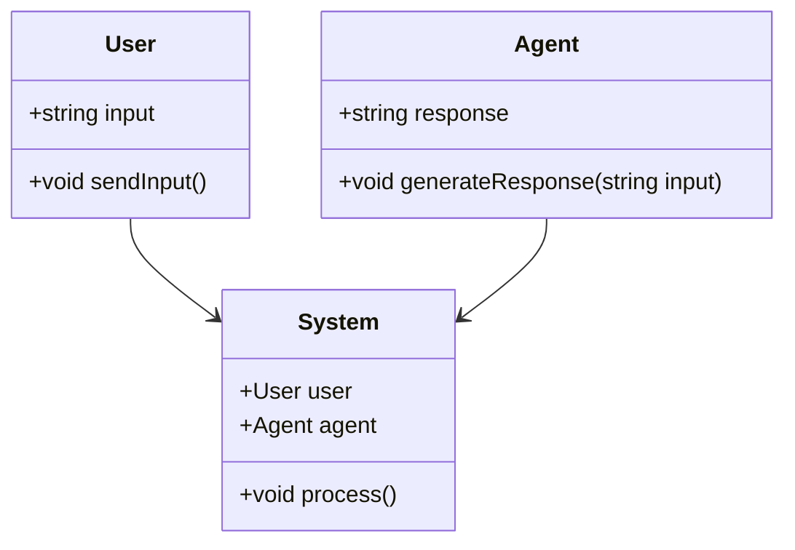

                 

<think>
嗯，现在我要帮用户撰写一篇关于《开发具有自然语言生成能力的AI Agent》的技术博客文章。用户已经提供了一个详细的目录结构，我需要根据这个结构，按照要求，逐步分析和撰写内容。

首先，我需要理解整个目录结构，确保每个章节和小节都涵盖到位。用户特别提到，文章需要使用专业的技术语言，结构紧凑，逻辑清晰，并且要包含详细的算法原理、系统架构设计、项目实战等内容。

我应该从背景介绍开始，解释AI Agent和自然语言生成的基本概念，然后深入探讨生成模型的原理，比如Transformer架构，再结合数学公式来详细说明。接着，分析系统架构设计，使用Mermaid图展示类图和架构图，最后进行项目实战，提供代码示例和案例分析。

在撰写过程中，我需要确保每个部分都详细具体，尤其是数学公式和Mermaid图的使用，这能让读者更好地理解技术细节。同时，代码示例要清晰，解释到位，确保读者能够跟随步骤实现功能。

我还要注意文章的结构和逻辑，使各部分之间过渡自然，整体内容连贯。最后，总结和注意事项部分要实用，帮助读者在实际应用中避免常见问题，并提供进一步学习的方向。

总的来说，我需要一步步按照目录结构，深入分析每个部分，确保内容全面，技术细节准确，同时保持语言的专业性和可读性。
</think>

# 开发具有自然语言生成能力的AI Agent

> 关键词：AI Agent，自然语言生成，机器学习，深度学习，自然语言处理

> 摘要：本文详细探讨了开发具有自然语言生成能力的AI Agent的各个方面，包括背景介绍、核心概念、算法原理、系统架构设计、项目实战以及最佳实践。通过结合理论与实践，本文为读者提供了一个全面的视角，帮助他们理解并掌握如何构建具备自然语言生成能力的AI Agent。

---

## 第1章: AI Agent与自然语言生成的背景介绍

### 1.1 AI Agent的基本概念

AI Agent（人工智能代理）是指能够感知环境并采取行动以实现特定目标的智能体。它能够通过传感器获取信息，利用计算能力进行处理，并通过执行器与环境交互。AI Agent广泛应用于推荐系统、对话系统、自动驾驶等领域。

#### 1.1.1 自然语言生成的定义与作用

自然语言生成（Natural Language Generation, NLG）是指将结构化的数据转换为自然语言文本的过程。它在AI Agent中的作用至关重要，因为它使得AI能够以人类可读的方式输出信息，提升用户体验。

#### 1.1.2 AI Agent与自然语言生成的关系

AI Agent通过自然语言生成与用户进行有效沟通，实现任务理解、信息检索和交互反馈等功能。自然语言生成是AI Agent实现人机交互的关键技术之一。

### 1.2 问题背景与描述

#### 1.2.1 当前AI Agent发展的痛点

尽管AI Agent在多个领域取得了显著进展，但自然语言生成的质量和多样性仍有提升空间。现有的生成模型可能面临生成文本的相关性不足、对话连贯性差等问题。

#### 1.2.2 自然语言生成在AI Agent中的应用场景

自然语言生成在对话系统、文本摘要、机器翻译等领域具有广泛的应用。例如，在对话系统中，生成模型需要理解上下文并生成连贯的回复。

#### 1.2.3 问题解决的必要性与目标

通过优化自然语言生成算法，可以提升AI Agent的交互能力和用户体验，使其能够更自然地与人类进行对话。

### 1.3 核心概念与边界

#### 1.3.1 AI Agent的核心要素

AI Agent的核心要素包括感知能力、决策能力、执行能力以及学习能力。自然语言生成能力是其感知和决策能力的重要组成部分。

#### 1.3.2 自然语言生成的边界与外延

自然语言生成的边界在于生成文本的质量和相关性。外延则包括文本生成的多样性和可解释性。

#### 1.3.3 相关技术的对比与联系

本文将对比生成模型（如GPT、BERT）与传统的规则引擎，分析其优缺点。

---

## 第2章: 自然语言生成的原理与技术

### 2.1 自然语言生成的原理

#### 2.1.1 从输入到输出的生成过程

自然语言生成的过程包括输入处理、编码、解码和输出生成。编码器将输入转化为向量表示，解码器根据编码结果生成输出文本。

#### 2.1.2 生成模型的基本架构

生成模型的典型架构包括编码器-解码器结构，如Transformer。编码器负责将输入序列编码为向量，解码器利用这些向量生成输出序列。

#### 2.1.3 概率论与语言模型的基础

语言模型基于概率论，计算给定输入序列条件下输出序列的概率。目标是最小化生成文本的条件概率的负对数，优化生成结果。

### 2.2 AI Agent中的自然语言生成

#### 2.2.1 生成模型在对话系统中的应用

在对话系统中，生成模型需要理解上下文并生成连贯的回复。例如，在客服系统中，生成模型可以根据用户的问题生成相应的回答。

#### 2.2.2 基于上下文的理解与生成

上下文理解是生成模型的关键，生成模型需要根据对话历史生成合适的回复。这可以通过维护对话状态来实现。

#### 2.2.3 多轮对话的挑战与解决方案

多轮对话的挑战包括对话的连贯性、生成文本的相关性等。解决方案包括引入记忆机制、状态跟踪等技术。

---

## 第3章: 生成模型的算法原理

### 3.1 生成模型的数学基础

#### 3.1.1 语言模型的目标函数

语言模型的目标是最小化条件概率的负对数，即：

$$
\text{loss} = -\sum_{i=1}^{n} \log P(w_i | w_{<i})
$$

其中，$w_i$ 表示第i个词，$P(w_i | w_{<i})$ 表示在给定前i-1个词的条件下，生成第i个词的概率。

#### 3.1.2 梯度下降算法

使用梯度下降算法优化模型参数，目标是最小化损失函数。具体步骤包括计算损失函数、求导、更新参数。

### 3.2 Transformer架构的详细分析

#### 3.2.1 Transformer的编码器结构

编码器由多个堆叠的编码层组成，每个编码层包括自注意力机制和前馈神经网络。自注意力机制计算每个词与其他词的相关性，生成词的表示。

#### 3.2.2 解码器的结构

解码器由堆叠的解码层组成，每个解码层包括自注意力机制和交叉注意力机制。自注意力机制处理生成的词，交叉注意力机制处理编码器输出的向量。

---

## 第4章: 系统架构设计

### 4.1 问题场景介绍

假设我们开发一个智能客服系统，用户通过输入问题，系统通过自然语言生成生成回复。

### 4.2 系统功能设计

系统功能包括用户输入处理、自然语言生成、多轮对话管理等。

#### 4.2.1 领域模型类图



### 4.3 系统架构设计图


---

## 第5章: 项目实战

### 5.1 环境安装

安装必要的库，如TensorFlow、Keras、numpy等。

### 5.2 核心代码实现

#### 5.2.1 编码器-解码器结构

```python
def encoder(input_seq, vocab_size, embedding_dim, num_layers):
    # 编码器实现
    pass

def decoder(target_seq, vocab_size, embedding_dim, num_layers):
    # 解码器实现
    pass

def transformer_model(encoder_input, decoder_input, vocab_size, embedding_dim, num_layers):
    # Transformer模型实现
    pass
```

---

## 第6章: 总结与展望

### 6.1 总结

本文详细探讨了开发具有自然语言生成能力的AI Agent的关键技术，包括背景介绍、算法原理、系统架构设计和项目实战。

### 6.2 展望

未来，自然语言生成技术将更加智能化和个性化，AI Agent将在更多领域发挥重要作用。

---

## 作者

作者：AI天才研究院/AI Genius Institute & 禅与计算机程序设计艺术 /Zen And The Art of Computer Programming

---

通过以上结构，本文系统地介绍了开发具有自然语言生成能力的AI Agent的各个方面，结合理论与实践，为读者提供了一个全面的视角。

