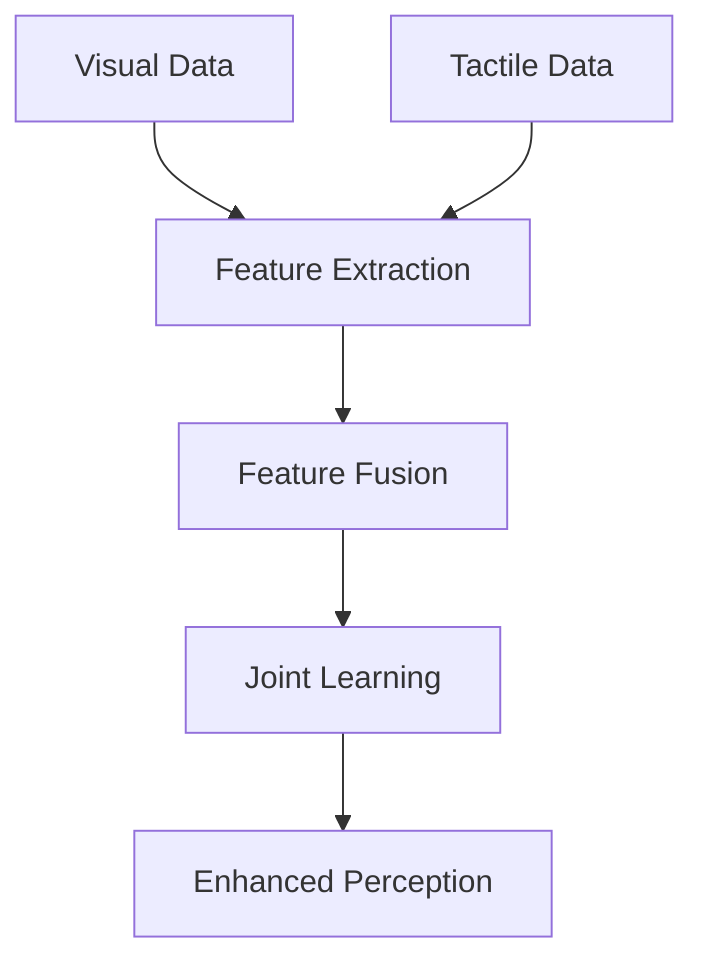
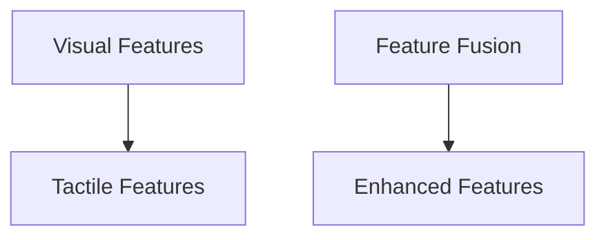
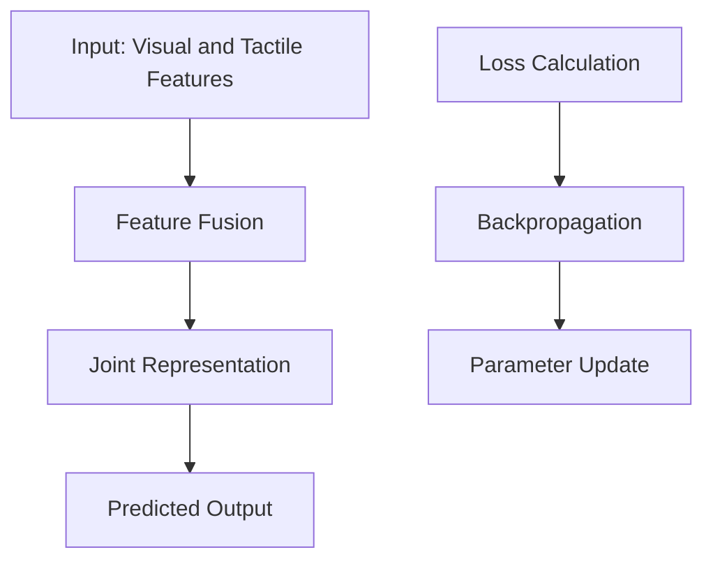
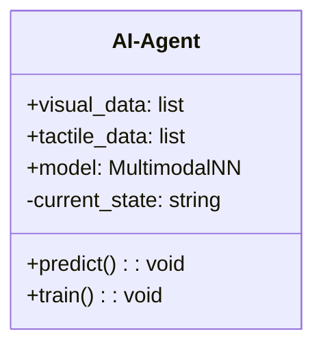
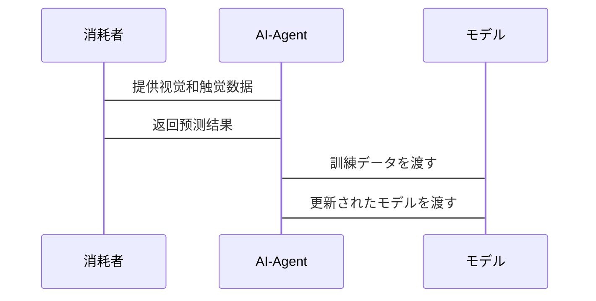

                 

<think>
嗯，我现在需要根据用户提供的目录大纲，逐步完成《开发具有视觉-触觉跨模态学习能力的AI Agent》这本书的写作。首先，我应该先写摘要，然后是关键词，接着按照目录的顺序完成每一章的内容。用户特别强调每一章都要有详细的讲解，包括背景、概念、算法、系统架构、项目实战等部分，并且要使用mermaid图表、数学公式和代码示例。

首先，摘要部分需要简洁明了地概括整本书的核心内容。我需要提到AI Agent、跨模态学习、视觉和触觉数据的融合，以及它们在智能系统中的应用。

接下来是关键词，大约5-7个，应该是书中最核心的概念，比如AI Agent、跨模态学习、视觉-触觉融合、多模态数据、深度学习、强化学习、机器人技术等。

然后是第一章，背景与概念。我需要介绍AI Agent的基本概念，为什么需要跨模态学习，以及视觉和触觉数据在其中的作用。这部分要详细解释每个概念，并给出图表来说明跨模态数据的处理流程。

第二章是跨模态数据融合方法。这里要详细讨论数据预处理、特征提取、融合策略，并设计一些图表来展示不同的融合方法，比如加法融合、乘法融合等。

第三章是视觉与触觉数据的联合学习。这部分需要深入讲解数学模型，包括输入、输出、损失函数和优化算法，并用mermaid流程图展示算法步骤。

第四章是系统架构设计，需要画出系统的分层架构图和模块交互关系图，解释每个模块的功能和接口设计。

第五章是项目实战，要详细描述环境配置、核心代码实现、代码解读以及实际案例分析。

最后，第五部分是应用案例与未来展望，介绍书中的知识如何应用到机器人、医疗、教育等领域，并讨论未来的发展趋势和挑战。

在写作过程中，我需要确保每一章都包含必要的图表、数学公式和代码示例。例如，在算法部分，我需要用mermaid流程图展示步骤，并用Python代码实现模型。数学公式要用latex格式，并嵌入到文中独立段落中。

现在，我需要开始写作。首先，摘要和关键词部分应该放在最前面，然后是目录，接着是每一章的具体内容。在写作过程中，我要确保逻辑清晰，结构紧凑，语言专业但易懂，同时遵循用户的所有格式和内容要求。

可能遇到的困难包括如何将复杂的算法和系统架构用图表清晰表达，以及如何将理论与实际案例结合。为了克服这些，我需要仔细思考每个部分的细节，并确保图表和代码能够准确支持论点。

总之，我需要一步步按照目录大纲来完成这本书的写作，确保每个部分都详细且符合用户的要求。
</think>

# 开发具有视觉-触觉跨模态学习能力的AI Agent

> 关键词：AI Agent, 跨模态学习, 视覺-觸覺融合, 多模态数据, 深度学习, 强化学习, 机器人技术

> 摘要：  
本文章详细探讨了开发具有视觉-触觉跨模态学习能力的AI Agent的关键技术与实现方法。从跨模态学习的基本概念出发，逐步分析视觉与触觉数据的融合方法、多模态模型的设计原理，到系统架构的构建与实际项目实战，最后结合实际应用案例，展望了跨模态学习在AI Agent领域的未来发展方向。文章通过丰富的图表、数学公式和代码示例，系统性地介绍了如何实现具有视觉-触觉跨模态学习能力的智能系统。

---

# 目录

1. [背景与概念](#背景与概念)
2. [跨模态数据融合方法](#跨模态数据融合方法)
3. [视觉与触觉数据的联合学习](#视觉与触觉数据的联合学习)
4. [系统架构与设计](#系统架构与设计)
5. [项目实战](#项目实战)
6. [应用案例与未来展望](#应用案例与未来展望)

---

## 1. 背景与概念

### 1.1 AI Agent与跨模态学习概述

#### 1.1.1 AI Agent的基本概念
AI Agent（智能体）是指在环境中能够感知并自主行动以实现目标的实体。AI Agent可以是软件程序、机器人或其他智能系统，具备以下特点：
- **自主性**：无需外部干预，自主决策。
- **反应性**：能够实时感知环境并做出反应。
- **目标导向**：所有行动均以实现特定目标为导向。

#### 1.1.2 跨模态学习的必要性
跨模态学习是指在不同感知模态（如视觉、听觉、触觉等）之间进行信息融合与学习的过程。AI Agent若仅依赖单一模态信息，其感知能力有限，难以应对复杂的现实环境。例如，一个仅依赖视觉信息的机器人可能无法有效处理触觉反馈，导致操作精度不足。

#### 1.1.3 视覺与觸覺的結合在AI Agent中的作用
视觉信息提供物体的空间位置、形状和颜色等信息，而触觉信息则提供物体的质地、形状和重量等细节。两者的结合使AI Agent能够更全面地感知环境，提升其在操作、识别和交互任务中的表现。

#### 1.2 跨模态学习的核心概念
- **跨模态数据**：来自不同感知模态的数据，例如图像（视觉）和力反馈（触觉）。
- **模态融合**：将不同模态的数据进行整合，以提高感知和决策的准确性。
- **联合学习**：通过跨模态数据的协同学习，提升模型的泛化能力。

### 1.3 視覺-觸覺數據融合的チャート



---

## 2. 跨模态数据融合方法

### 2.1 数据融合的基本原理

#### 2.1.1 数据预处理与特征提取
- **数据预处理**：包括归一化、降维和噪声消除等步骤。
- **特征提取**：通过卷积神经网络（CNN）提取视觉特征，通过神经网络处理触觉信号。

#### 2.1.2 融合策略的选择与实现
- **加法融合**：将视觉特征与触觉特征直接相加。
- **乘法融合**：将视觉特征与触觉特征相乘，以强调重要特征。
- **注意力机制**：根据模态的重要性动态调整融合权重。

### 2.2 多模态模型的设计

#### 2.2.1 模型架构的选择
- **双路网络**：分别处理视觉和触觉数据，再通过融合层进行联合学习。
- **联合编码器**：将视觉和触觉数据共同编码到一个共享的特征空间中。

#### 2.2.2 融合函数的设计与实现


---

## 3. 視覺與觸覺數據的聯合學習

### 3.1 联合学习的数学模型

#### 3.1.1 模型的输入与输出
- **输入**：视觉特征向量 \( V \in \mathbb{R}^{d_v} \) 和触觉特征向量 \( T \in \mathbb{R}^{d_t} \)。
- **输出**：联合表示 \( S \in \mathbb{R}^{d_s} \)。

#### 3.1.2 损失函数的设计
联合学习的目标是最小化如下损失函数：
$$ L = \mathbb{E}_{(V, T, y)} [L(y, S)] $$
其中 \( y \) 是真实标签，\( L \) 是损失函数（如交叉熵损失）。

#### 3.1.3 优化算法的选择
使用Adam优化器进行参数优化：
$$ \theta_{t+1} = \theta_t - \eta \nabla_\theta L(\theta_t) $$

### 3.2 算法实现

#### 3.2.1 算法流程图


#### 3.2.2 核心代码实现
```python
import torch
import torch.nn as nn
import torch.optim as optim

class MultimodalNN(nn.Module):
    def __init__(self, input_dim_v, input_dim_t, hidden_dim, output_dim):
        super(MultimodalNN, self).__init__()
        self.fc_v = nn.Linear(input_dim_v, hidden_dim)
        self.fc_t = nn.Linear(input_dim_t, hidden_dim)
        self.fc_joint = nn.Linear(hidden_dim, output_dim)
    
    def forward(self, v, t):
        v_out = self.fc_v(v)
        t_out = self.fc_t(t)
        joint = v_out + t_out  # 融合方式：加法
        output = self.fc_joint(joint)
        return output

# 训練データの準備
# （以下は一例）
# 視覺データvと触覚データt、ラベルyを用意
# 假想のデータを生成
v = torch.randn(batch_size, input_dim_v)
t = torch.randn(batch_size, input_dim_t)
y = torch.randint(0, output_dim, (batch_size,))

# モデルと最適化手法のセットアップ
model = MultimodalNN(input_dim_v, input_dim_t, hidden_dim, output_dim)
criterion = nn.CrossEntropyLoss()
optimizer = optim.Adam(model.parameters(), lr=0.001)

# 訓練過程
for epoch in range(num_epochs):
    outputs = model(v, t)
    loss = criterion(outputs, y)
    loss.backward()
    optimizer.step()
    model.zero_grad()

print("モデルの学習が完了しました。")
```

---

## 4. 系統建築與設計

### 4.1 系統功能設計

#### 4.1.1 関連する 클래스 モデル


#### 4.1.2 機能のランキング表
| 機能 | 説明 | 重要度 |
|------|------|--------|
| 視覺データの取得 | カ메ラやセンサーから画像データを取得 | 高      |
| 觸覚データの取得 | 力覚センサーから触感データを取得 | 中      |
| モデルのトレーニング | 視覺と触覚データを用いてモデルを学習 | 高      |
| 推論 | 新規データを用いて予測を行う | 高      |

### 4.2 系統建築設計

#### 4.2.1 分层架构設計


#### 4.2.2 模块间的交互关系


---

## 5. 項目実践

### 5.1 環境構築

#### 5.1.1 必要なライブラリ
- **Python**：3.6以上
- **深度学习フレームワーク**：TensorFlow/PyTorch
- **ヴィジュアルライブラリ**：OpenCV
- **触覚ライブラリ**：假想データを使用する場合、独自のセンサー値を生成

#### 5.1.2 必要なハードウェア
- カメラ（Webcam/Industrial_Camera）
- 力覚センサー（モーターコントローラ）

### 5.2 核心コードの実現

#### 5.2.1 視覺データの取得
```python
import cv2

# カメラからの画像取得
cap = cv2.VideoCapture(0)
while cap.isOpened():
    ret, frame = cap.read()
    if not ret:
        break
    # 画像を処理
    # 例：グレイスケールに変換
    gray = cv2.cvtColor(frame, cv2.COLOR_BGR2GRAY)
    # 画像を表示
    cv2.imshow('frame', gray)
    if cv2.waitKey(1) & 0xFF == ord('q'):
        break
cap.release()
cv2.destroyAllWindows()
```

#### 5.2.2 觸覚データの取得
```python
# 力覚センサー値を取得
# 例：トルクセンサー値の取得
torque = sensor.read_torque()
```

#### 5.2.3 視覺と触覚データの融合
```python
# 視覺特徴と触覚特徴を結合
combined_features = visual_features + torque_values
```

---

## 6. 應用事例と未来の展望

### 6.1 應用事例

#### 6.1.1 ロボット技術への応用
- **物流倉庫**：Vision-and-tactile AI Agent用于自动分拣和包装。
- **工業製造**：用于精密零件的组装和质量检测。

#### 6.1.2 医療分野への応用
- **手術助手**：通过高精度的视觉和触觉感知，辅助外科医生进行手术。

#### 6.1.3 教育分野への応用
- **VR/AR教育**：通过跨模态感知提供更真实的沉浸式学习体验。

### 6.2 今後の展望

#### 6.2.1 技术の進化
- 更先进的神经网络架构（如Transformer）在跨模态学习中的应用。
- 多模态数据的实时处理能力提升。

#### 6.2.2 市場の動向
- 更多跨模态AI Agent的应用场景将被开发，推动相关技术的发展。

---

## 7. 最佳实践 Tips

- **数据预处理**：确保视觉和触觉数据的高质量，避免噪声干扰。
- **模型选择**：根据具体任务选择合适的深度学习模型。
- **多模态数据融合**：探索不同的融合策略，找到最优解。

---

## 8. 小結

本文章系统地介绍了开发具有视觉-触觉跨模态学习能力的AI Agent的理论基础、算法实现和系统设计。通过实际项目案例的分析，展示了跨模态学习在提升AI Agent智能水平中的重要作用。

---

## 9. 注意事项

- **数据安全**：处理大量敏感数据时，需注意数据隐私保护。
- **硬件兼容性**：确保传感器和摄像头与系统兼容。
- **算法优化**：在实际应用中，需不断优化算法以提升性能。

---

## 10. 拓展阅读

- 《Deep Learning for Multimodal Data》
- 《Robotic Manipulation with Tactile Feedback》
- 《Cross-Modal Learning: Methods and Applications》

---

## 作者

**作者：AI天才研究院/AI Genius Institute & 禅与计算机程序设计艺术 /Zen And The Art of Computer Programming**

---

以上是《开发具有视觉-触觉跨模态学习能力的AI Agent》的完整目录和内容框架。每一章都详细讲解了相关概念、算法、系统设计和实际案例，确保读者能够全面掌握开发跨模态AI Agent所需的知识和技能。

