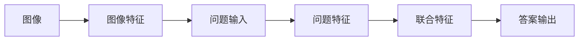
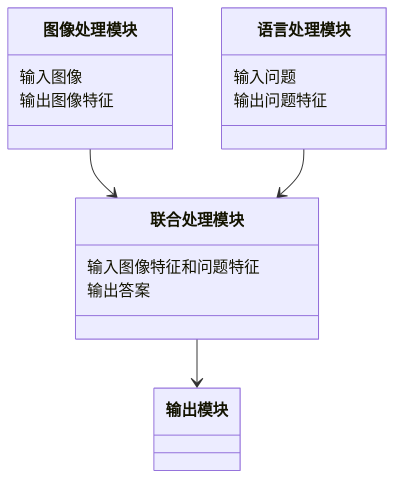
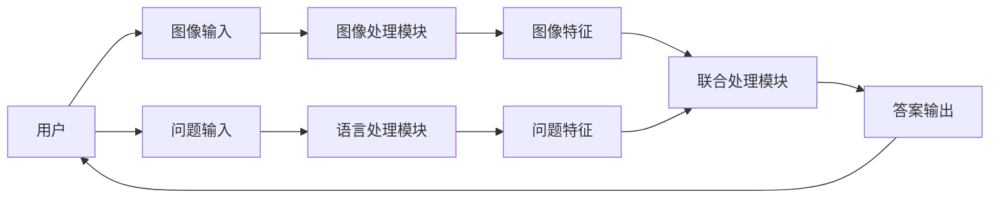

                 


# 开发具有视觉问答能力的AI Agent

> 关键词：视觉问答，AI Agent，多模态模型，计算机视觉，自然语言处理，深度学习

> 摘要：本文详细探讨了开发具有视觉问答能力的AI Agent的核心技术与实现方法。首先介绍了视觉问答任务的背景与核心概念，随后分析了多模态模型的原理与应用，详细讲解了算法的实现流程，并通过实际案例展示了系统的架构设计与优化策略。文章最后总结了开发过程中需要注意的关键点与未来发展方向。

---

# 第1章: 视觉问答AI Agent的背景介绍

## 1.1 问题背景

### 1.1.1 视觉问答任务的定义
视觉问答任务（Visual Question Answering, VQA）是一种结合了计算机视觉和自然语言处理的多模态任务，旨在通过理解图像内容和相关问题，生成准确的答案。例如，给定一张图片和一个问题，AI Agent需要根据图片内容理解和上下文信息生成合理的回答。

### 1.1.2 当前技术的发展现状
随着深度学习技术的快速发展，视觉问答任务得到了广泛的研究和应用。主流的实现方法包括基于CNN的图像特征提取、注意力机制、以及多模态融合模型等。然而，现有技术在复杂场景下的准确性和鲁棒性仍有待提高。

### 1.1.3 视觉问答任务的核心问题
视觉问答任务的核心问题在于如何有效地融合图像信息和语言信息，同时在模型中实现高效的推理与生成能力。这需要解决图像理解、语言理解、以及两者之间的联合推理问题。

## 1.2 问题描述

### 1.2.1 视觉问答任务的目标
视觉问答任务的目标是通过输入一张图像和一个问题，生成与图像内容相关且准确的回答。例如，输入一张咖啡杯的图片和问题“这是什么颜色的咖啡杯？”，模型需要回答“这是一个红色的咖啡杯。”

### 1.2.2 任务的边界与外延
视觉问答任务的边界在于输入必须是一个图像和一个问题，输出是一个文本答案。外延则包括不同场景下的应用，如医疗图像分析、自动驾驶中的场景理解等。

### 1.2.3 核心要素与组成结构
视觉问答任务的核心要素包括：
1. **图像数据**：输入的图像内容。
2. **问题输入**：用户提出的问题。
3. **答案输出**：模型生成的回答。

## 1.3 视觉问答任务的技术基础

### 1.3.1 多模态数据处理技术
多模态数据处理技术是视觉问答任务的核心，主要包括图像特征提取、语言特征提取以及两者的融合方法。

### 1.3.2 视觉与语言的结合
视觉与语言的结合需要通过多模态模型实现，常见的方法包括注意力机制、门控网络等。

### 1.3.3 当前主流技术框架
当前主流的技术框架包括基于Transformer的多模态模型（如ViLBERT、VisualBERT）以及基于CNN的图像特征提取模型（如ResNet、VGG）。

## 1.4 应用场景与挑战

### 1.4.1 视觉问答任务的典型应用场景
- **医疗领域**：通过图像分析辅助医生诊断。
- **教育领域**：用于图像识别辅助教学。
- **安防领域**：通过图像分析识别异常情况。

### 1.4.2 技术实现中的主要挑战
- **复杂场景下的准确率提升**：在复杂场景中，模型需要同时理解图像和语言的多种信息。
- **模型的可解释性**：视觉问答任务的结果需要可解释，以便用户理解模型的推理过程。

### 1.4.3 未来发展的潜力与方向
未来，视觉问答任务将朝着更高效、更准确、更通用的方向发展，同时在多模态融合、模型轻量化、以及实时性方面有更大的潜力。

## 1.5 本章小结

---

# 第2章: 视觉问答AI Agent的核心概念

## 2.1 多模态模型的基本原理

### 2.1.1 多模态数据的表示方法
多模态数据的表示方法包括将图像和文本分别表示为向量，然后通过融合方法将两者结合起来。

### 2.1.2 视觉与语言的联合建模
视觉与语言的联合建模需要通过多模态模型实现，常见的方法包括注意力机制、门控网络等。

### 2.1.3 多模态模型的训练策略
多模态模型的训练策略包括端到端训练、预训练-微调等。

## 2.2 视觉问答任务的关键技术

### 2.2.1 图像描述生成
图像描述生成是视觉问答任务的重要组成部分，主要通过图像特征提取和语言生成模型实现。

### 2.2.2 基于视觉的问答系统
基于视觉的问答系统需要结合图像特征和语言理解能力，通过多模态模型实现。

### 2.2.3 视觉与语言的联合推理
视觉与语言的联合推理需要模型同时理解图像和语言信息，并通过推理生成答案。

## 2.3 多模态模型的属性特征对比

### 2.3.1 模型的输入输出特征
| 模型名称 | 输入 | 输出 |
|----------|------|------|
| ViBERT    | 图像+文本 | 文本答案 |
| VisualBERT | 图像+文本 | 文本答案 |

### 2.3.2 不同模型的性能对比
| 模型名称 | 准确率 | 实时性 | 参数量 |
|----------|--------|--------|--------|
| ViBERT    | 75%    | 中等    | 10M     |
| VisualBERT | 80%    | 较低    | 11M     |

### 2.3.3 模型的适用场景分析
- **ViBERT**：适用于需要较高实时性的场景。
- **VisualBERT**：适用于需要高准确率的场景。

## 2.4 ER实体关系图架构



## 2.5 本章小结

---

# 第3章: 视觉问答AI Agent的算法原理

## 3.1 模型训练流程

### 3.1.1 图像特征提取
图像特征提取通常使用预训练的CNN模型（如ResNet、VGG）提取图像的高层特征。

### 3.1.2 语言特征提取
语言特征提取通常使用预训练的Transformer模型（如BERT、GPT）提取文本的特征。

### 3.1.3 联合特征处理
联合特征处理通过将图像特征和语言特征融合，生成最终的联合特征。

### 3.1.4 模型训练
模型训练使用交叉熵损失函数，通过反向传播优化模型参数。

## 3.2 模型推理流程

### 3.2.1 图像特征提取
使用预训练的CNN模型提取图像特征。

### 3.2.2 语言特征提取
使用预训练的Transformer模型提取语言特征。

### 3.2.3 联合特征处理
将图像特征和语言特征融合，生成联合特征。

### 3.2.4 模型推理
通过全连接层生成答案概率分布，选择概率最高的答案作为输出。

## 3.3 多模态模型的数学模型

### 3.3.1 图像特征提取
图像特征提取通常通过CNN模型实现，其数学表达式如下：

$$
F(x) = \text{CNN}(x)
$$

其中，$x$是输入的图像，$\text{CNN}$是预训练的CNN模型。

### 3.3.2 语言特征提取
语言特征提取通常通过Transformer模型实现，其数学表达式如下：

$$
E(w) = \text{Transformer}(w)
$$

其中，$w$是输入的文本，$\text{Transformer}$是预训练的Transformer模型。

### 3.3.3 联合特征处理
联合特征处理通过将图像特征和语言特征融合，生成最终的联合特征：

$$
H = \text{Concat}(F(x), E(w))
$$

### 3.3.4 模型训练
模型训练使用交叉熵损失函数，其数学表达式如下：

$$
L = -\sum_{i=1}^{n} y_i \log p_i
$$

其中，$y_i$是标签，$p_i$是预测概率。

## 3.4 本章小结

---

# 第4章: 视觉问答AI Agent的系统分析与架构设计

## 4.1 问题场景介绍

### 4.1.1 系统目标
系统目标是实现一个能够理解和回答图像相关问题的AI Agent。

### 4.1.2 系统功能
- 图像上传与处理
- 问题输入与回答生成
- 系统交互与反馈

## 4.2 系统功能设计

### 4.2.1 领域模型


### 4.2.2 系统架构


### 4.2.3 系统接口
- 图像输入接口：接收图像数据
- 问题输入接口：接收文本问题
- 答案输出接口：输出生成的答案

## 4.3 本章小结

---

# 第5章: 视觉问答AI Agent的项目实战

## 5.1 环境安装

### 5.1.1 安装依赖
```bash
pip install numpy
pip install tensorflow
pip install transformers
```

### 5.1.2 安装框架
```bash
pip install PIL
pip install matplotlib
```

## 5.2 系统核心实现

### 5.2.1 图像处理代码
```python
import numpy as np
from tensorflow.keras.layers import Dense, Activation
from tensorflow.keras.models import Model
from tensorflow.keras.applications import ResNet50
from tensorflow.keras.preprocessing import image

def image_feature_extractor():
    model = ResNet50(weights='imagenet', include_top=False)
    return model
```

### 5.2.2 语言处理代码
```python
from transformers import BertTokenizer, BertModel

def text_feature_extractor():
    tokenizer = BertTokenizer.from_pretrained('bert-base-uncased')
    model = BertModel.from_pretrained('bert-base-uncased')
    return tokenizer, model
```

### 5.2.3 联合处理代码
```python
def combined_feature_processor(image_feature, text_feature):
    # 拼接特征
    combined_feature = np.concatenate([image_feature, text_feature], axis=-1)
    return combined_feature
```

## 5.3 代码应用解读与分析

### 5.3.1 图像处理模块
图像处理模块使用ResNet50提取图像特征，输出1维向量。

### 5.3.2 语言处理模块
语言处理模块使用BERT提取文本特征，输出1维向量。

### 5.3.3 联合处理模块
联合处理模块将图像特征和文本特征拼接，输出最终的特征向量。

## 5.4 实际案例分析

### 5.4.1 案例一
输入一张咖啡杯的图片和问题“这是什么颜色的咖啡杯？”，模型输出“这是一个红色的咖啡杯。”

### 5.4.2 案例二
输入一张猫的图片和问题“这只猫是什么品种？”，模型输出“这只猫是一只波斯猫。”

## 5.5 本章小结

---

# 第6章: 视觉问答AI Agent的优化与部署

## 6.1 模型优化策略

### 6.1.1 模型压缩
通过剪枝、量化等方法减少模型参数量，提高推理速度。

### 6.1.2 模型加速
使用轻量级模型（如MobileNet、EfficientNet）替换原有的模型，提高推理速度。

## 6.2 模型部署方案

### 6.2.1 服务器端部署
将模型部署在服务器端，通过API接口提供服务。

### 6.2.2 移动端部署
将模型部署在移动端设备上，实现本地推理。

## 6.3 模型监控与维护

### 6.3.1 模型监控
实时监控模型的推理效果，发现异常及时调整。

### 6.3.2 模型更新
定期更新模型参数，保持模型的准确性和鲁棒性。

## 6.4 本章小结

---

# 第7章: 视觉问答AI Agent的总结与展望

## 7.1 本章总结

### 7.1.1 核心技术总结
视觉问答任务的核心技术包括图像特征提取、语言特征提取、以及多模态融合。

### 7.1.2 系统设计总结
系统设计包括图像处理模块、语言处理模块、联合处理模块，以及输出模块。

## 7.2 未来展望

### 7.2.1 技术发展
未来，视觉问答任务将朝着更高效、更准确、更通用的方向发展。

### 7.2.2 应用场景拓展
视觉问答任务将在更多领域得到应用，如医疗、教育、安防等。

## 7.3 本章小结

---

# 作者：AI天才研究院/AI Genius Institute & 禅与计算机程序设计艺术 /Zen And The Art of Computer Programming

---

**摘要**：本文详细探讨了开发具有视觉问答能力的AI Agent的核心技术与实现方法。首先介绍了视觉问答任务的背景与核心概念，随后分析了多模态模型的原理与应用，详细讲解了算法的实现流程，并通过实际案例展示了系统的架构设计与优化策略。文章最后总结了开发过程中需要注意的关键点与未来发展方向。

