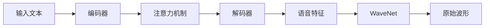
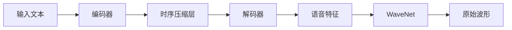
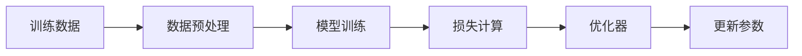
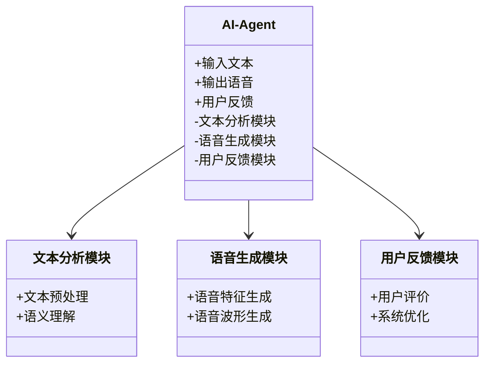
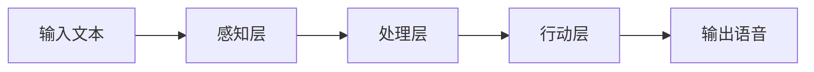
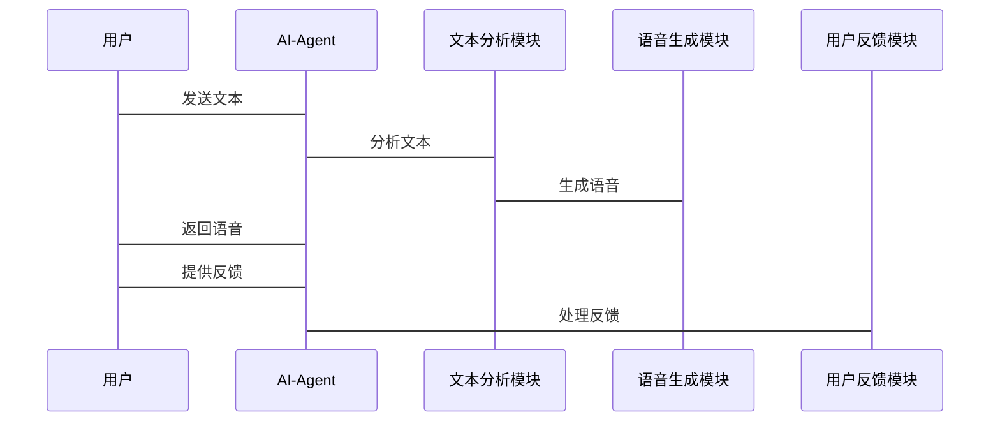

                 


# 开发具有语音合成能力的AI Agent

> 关键词：AI Agent, 语音合成, 深度学习, 语音生成, 自然语言处理

> 摘要：本文详细探讨了开发具有语音合成能力的AI Agent的核心概念、算法原理、系统架构和项目实战。通过分析AI Agent与语音合成的结合，讲解了从理论到实践的完整开发流程，包括模型训练、系统设计和实际应用案例。

---

# 第一部分: 开发具有语音合成能力的AI Agent背景介绍

## 第1章: AI Agent与语音合成概述

### 1.1 AI Agent的基本概念
AI Agent（人工智能代理）是指能够感知环境、自主决策并执行任务的智能实体。它通过与环境交互，实现特定目标，如信息检索、用户交互或自动化操作。

#### 1.1.1 AI Agent的定义
AI Agent是一种能够感知环境、处理信息并采取行动以实现目标的智能系统。它可以是软件程序或物理设备，具备自主决策能力。

#### 1.1.2 AI Agent的核心特点
- **自主性**：能够在无外部干预的情况下独立运作。
- **反应性**：能实时感知环境并做出反应。
- **目标导向**：所有行为都围绕实现特定目标展开。
- **学习能力**：通过经验改进性能。

#### 1.1.3 AI Agent与传统程序的区别
AI Agent的核心区别在于其自主性和适应性。传统程序依赖于预定义的规则，而AI Agent能够通过学习和推理动态调整行为。

### 1.2 语音合成技术的基本概念
语音合成是将文本转换为人类可听语音的过程，涉及多个技术环节，如文本分析、特征提取和语音生成。

#### 1.2.1 语音合成的定义
语音合成是将文本或符号表示转换为人类语音的过程，广泛应用于语音助手、教育工具和娱乐设备。

#### 1.2.2 语音合成的核心技术
- **文本分析**：处理输入文本，提取语义和音调信息。
- **特征提取**：提取语音特征，如音调、音速和停顿。
- **语音生成**：基于特征生成自然流畅的语音。

#### 1.2.3 语音合成的应用场景
- **语音助手**：如Siri和Alexa，提供交互式语音服务。
- **教育工具**：为学习者提供发音指导。
- **娱乐应用**：生成个性化语音内容。

### 1.3 AI Agent与语音合成的结合
AI Agent通过集成语音合成技术，能够以自然流畅的语音与用户交互，显著提升了用户体验和交互效率。

#### 1.3.1 AI Agent中集成语音合成的意义
- **提升用户体验**：通过语音交互，用户可以更方便地与AI Agent互动。
- **增强交互能力**：语音合成使AI Agent能够输出多样化的语音内容，如回答问题、提供反馈和执行指令。

#### 1.3.2 语音合成在AI Agent中的应用场景
- **智能家居控制**：通过语音指令控制家电。
- **客户服务**：为用户提供电话支持。
- **教育辅助**：为学习者提供语音指导。

#### 1.3.3 语音合成对AI Agent交互能力的提升
语音合成使AI Agent能够以自然、流畅的方式与用户交流，增强了其交互能力和用户体验。

### 1.4 本章小结
本章介绍了AI Agent和语音合成的基本概念，分析了它们的结合方式及其在AI Agent中的应用场景，为后续章节奠定了基础。

---

# 第二部分: AI Agent与语音合成的核心概念与联系

## 第2章: AI Agent的核心原理

### 2.1 AI Agent的内部结构
AI Agent通常由感知层、处理层和行动层组成，分别负责信息获取、处理和执行。

#### 2.1.1 感知层
感知层负责获取环境信息，如通过麦克风采集用户语音。

#### 2.1.2 处理层
处理层负责解析感知层获取的信息，如通过自然语言处理技术理解用户意图。

#### 2.1.3 行动层
行动层负责根据处理层的结果执行相应动作，如生成语音回复。

### 2.2 AI Agent的决策机制
决策机制是AI Agent的核心，负责根据当前状态和环境信息做出最优决策。

#### 2.2.1 基于规则的决策
基于预定义的规则进行决策，适用于规则明确的场景。

#### 2.2.2 基于机器学习的决策
通过机器学习模型进行决策，能够处理复杂和模糊的情况。

#### 2.2.3 基于深度学习的决策
深度学习模型（如神经网络）能够处理非线性关系，适用于复杂任务。

### 2.3 AI Agent的通信机制
通信机制负责AI Agent与环境或其他智能体之间的信息交换。

#### 2.3.1 语音识别与自然语言理解
通过语音识别技术将用户语音转换为文本，再通过自然语言处理技术理解用户意图。

#### 2.3.2 语音合成与输出
通过语音合成技术将处理后的文本转换为语音，输出给用户。

#### 2.3.3 多模态交互
支持多种交互方式，如语音、文本和手势，提升用户体验。

### 2.4 本章小结
本章详细讲解了AI Agent的内部结构、决策机制和通信机制，分析了语音合成在其通信机制中的重要性。

---

## 第3章: 语音合成的核心原理

### 3.1 语音合成的基本流程
语音合成通常包括文本预处理、声学模型训练和语音生成三个步骤。

#### 3.1.1 文本预处理
对输入文本进行清洗、分词和语调标注，确保生成的语音自然流畅。

#### 3.1.2 文本到语音的转换
通过声学模型将预处理后的文本转换为语音特征，如音调和音速。

#### 3.1.3 语音的生成与优化
根据语音特征生成原始波形，通过优化算法提升语音质量。

### 3.2 语音合成的关键技术
语音合成的关键技术包括文本分析、声学模型和语音生成模型。

#### 3.2.1 文本分析与特征提取
通过分析文本内容提取语义和音调信息，为语音生成提供依据。

#### 3.2.2 声学模型
声学模型负责将文本特征转换为语音特征，常用循环神经网络（RNN）实现。

#### 3.2.3 语音生成模型
语音生成模型负责将语音特征转换为原始波形，常用生成对抗网络（GAN）实现。

### 3.3 语音合成的优化方法
优化方法包括声学模型优化、语音生成的流畅度优化和多语种支持。

#### 3.3.1 声学模型优化
通过调整模型参数和优化训练数据提升声学模型的准确性。

#### 3.3.2 语音生成的流畅度优化
通过引入平滑技术和优化生成过程提升语音的流畅度。

#### 3.3.3 多语种支持
通过多任务学习和数据增强技术实现多语种语音合成。

### 3.4 本章小结
本章详细讲解了语音合成的核心原理和关键技术，分析了优化方法及其对语音质量的提升。

---

# 第三部分: AI Agent语音合成的算法原理讲解

## 第4章: 基于深度学习的语音合成算法

### 4.1 Tacotron模型
Tacotron是一种基于注意力机制的端到端语音合成模型。

#### 4.1.1 模型结构
- **编码器**：将输入文本转换为序列向量。
- **解码器**：基于编码器输出生成语音特征。
- **注意力机制**：帮助模型关注输入文本的不同部分。

#### 4.1.2 注意力机制
注意力机制通过计算输入文本中每个词与当前生成位置的相关性，指导模型生成更连贯的语音。

#### 4.1.3 语音生成过程
通过Tacotron模型生成语音特征后，使用WaveNet等模型生成原始波形。

#### 4.1.4 Tacotron的Mermaid图


#### 4.1.5 Tacotron的Python代码实现
```python
import tensorflow as tf
from tensorflow import keras

class Tacotron(keras.Model):
    def __init__(self):
        super(Tacotron, self).__init__()
        self.embedding = keras.layers.Embedding(...)
        self.encoder = keras.layers.RNN(...)
        self.decoder = keras.layers.RNN(...)
        self.attention = AttentionLayer()

    def call(self, inputs):
        embed = self.embedding(inputs)
        encoder_out = self.encoder(embed)
        attention_out = self.attention(encoder_out)
        decoder_out = self.decoder(attention_out)
        return decoder_out
```

### 4.2 FastSpeech模型
FastSpeech是一种基于时序压缩的语音合成模型。

#### 4.2.1 模型结构
- **编码器**：将输入文本转换为中间表示。
- **时序压缩层**：将编码器输出压缩为低维表示。
- **解码器**：基于压缩表示生成语音特征。

#### 4.2.2 时序压缩
时序压缩通过减少时间维度，降低计算复杂度，提升生成效率。

#### 4.2.3 语音生成优化
FastSpeech通过优化生成过程，提升语音的自然度和流畅度。

#### 4.2.4 FastSpeech的Mermaid图


#### 4.2.5 FastSpeech的Python代码实现
```python
import tensorflow as tf
from tensorflow import keras

class FastSpeech(keras.Model):
    def __init__(self):
        super(FastSpeech, self).__init__()
        self.embedding = keras.layers.Embedding(...)
        self.encoder = keras.layers.RNN(...)
        self.compression = CompressionLayer()
        self.decoder = keras.layers.RNN(...)
        self.postnet = PostNet()

    def call(self, inputs):
        embed = self.embedding(inputs)
        encoder_out = self.encoder(embed)
        compressed = self.compression(encoder_out)
        decoder_out = self.decoder(compressed)
        postnet_out = self.postnet(decoder_out)
        return postnet_out
```

### 4.3 模型训练与优化
模型训练包括数据预处理、损失函数定义和优化策略。

#### 4.3.1 数据预处理
将训练数据分为训练集和验证集，进行归一化和对齐处理。

#### 4.3.2 损失函数
使用MSE（均方误差）和KL散度等损失函数，衡量生成语音与真实语音的差距。

#### 4.3.3 优化策略
采用Adam优化器，设置合适的学习率和批量大小，进行模型训练。

#### 4.3.4 模型训练的Mermaid图


#### 4.3.5 模型训练的Python代码实现
```python
import tensorflow as tf
from tensorflow import keras

def loss_function(y_true, y_pred):
    mse = tf.reduce_mean(tf.square(y_true - y_pred))
    kl_div = tf.keras.losses.KLDivergence()(y_true, y_pred)
    total_loss = mse + kl_div
    return total_loss

optimizer = tf.keras.optimizers.Adam(learning_rate=0.001)
model = Tacotron()
model.compile(optimizer=optimizer, loss=loss_function)
model.fit(train_dataset, epochs=100, validation_data=valid_dataset)
```

### 4.4 本章小结
本章详细讲解了Tacotron和FastSpeech两种主流的语音合成算法，分析了它们的模型结构和训练过程，为后续章节的系统设计和项目实现奠定了基础。

---

## 第5章: 语音合成的数学模型与公式

### 5.1 声学模型的数学表示
声学模型通常使用循环神经网络（RNN）或Transformer模型进行建模。

#### 5.1.1 声学模型的输入
声学模型的输入通常包括文本特征，如字符嵌入和语调信息。

#### 5.1.2 声学模型的输出
声学模型的输出包括语音特征，如梅尔频谱和音调信息。

#### 5.1.3 声学模型的数学公式
声学模型的输出可以表示为：
$$
y = f(x)
$$
其中，\(x\) 是输入文本特征，\(y\) 是输出语音特征，\(f\) 是声学模型。

### 5.2 语音生成模型的数学表示
语音生成模型通常使用生成对抗网络（GAN）或变分自编码器（VAE）进行建模。

#### 5.2.1 生成对抗网络（GAN）
GAN由生成器和判别器组成，生成器负责生成语音波形，判别器负责判别生成语音的真实性。

#### 5.2.2 变分自编码器（VAE）
VAE通过编码器将语音波形编码为潜在向量，再通过解码器将其解码为语音波形。

#### 5.2.3 GAN和VAE的数学公式
- GAN：
$$
G(z) = \text{生成器}(z) \quad \text{其中} z \sim \mathcal{N}(0,1)
$$
$$
D(x) = \text{判别器}(x) \quad \text{其中} x \sim \text{真实语音分布}
$$
- VAE：
$$
q(z|x) = \text{编码器}(x)
$$
$$
p(x|z) = \text{解码器}(z)
$$

### 5.3 本章小结
本章详细讲解了声学模型和语音生成模型的数学表示，分析了GAN和VAE在语音合成中的应用，为后续章节的系统设计和项目实现提供了数学基础。

---

# 第四部分: 系统分析与架构设计方案

## 第6章: AI Agent语音合成的系统架构设计

### 6.1 问题场景介绍
本章将从实际应用场景出发，分析AI Agent语音合成系统的需求和挑战。

### 6.2 项目介绍
本项目旨在开发一个具有语音合成能力的AI Agent，能够以自然流畅的语音与用户交互。

### 6.3 系统功能设计
系统功能包括文本分析、语音生成和用户反馈三个模块。

#### 6.3.1 领域模型Mermaid类图


### 6.4 系统架构设计
系统架构包括感知层、处理层和行动层，分别负责信息获取、处理和执行。

#### 6.4.1 系统架构Mermaid架构图


### 6.5 系统接口设计
系统接口包括文本输入接口、语音输出接口和用户反馈接口。

#### 6.5.1 系统接口Mermaid序列图


### 6.6 本章小结
本章详细讲解了AI Agent语音合成系统的架构设计和接口设计，分析了系统各模块的功能和交互流程。

---

## 第7章: 项目实战

### 7.1 环境安装与配置
本项目需要安装Python、TensorFlow和Keras等依赖库。

#### 7.1.1 安装依赖
```bash
pip install tensorflow==2.5.0
pip install keras==2.5.0
pip install numpy==1.21.0
```

### 7.2 系统核心实现
本节将详细实现AI Agent的语音合成功能，包括文本分析、语音生成和用户反馈模块。

#### 7.2.1 文本分析模块
文本分析模块负责对输入文本进行预处理和语义理解。

#### 7.2.2 语音生成模块
语音生成模块基于Tacotron模型生成语音波形。

#### 7.2.3 用户反馈模块
用户反馈模块负责收集用户反馈并优化系统性能。

#### 7.2.4 核心代码实现
```python
import tensorflow as tf
from tensorflow import keras

class TextAnalyzer:
    def __init__(self):
        self.embedding = keras.layers.Embedding(...)
        self.rnn = keras.layers.RNN(...)
    
    def analyze(self, text):
        embed = self.embedding(text)
        output = self.rnn(embed)
        return output

class VoiceSynthesizer:
    def __init__(self):
        self.tacotron = Tacotron()
    
    def synthesize(self, text):
        features = TextAnalyzer().analyze(text)
       语音波形 = self.tacotron.generate( features )
        return 语音波形

class UserFeedback:
    def __init__(self):
        pass
    
    def collect_feedback(self, user_input):
        # 收集用户反馈
        pass
    
    def optimize_system(self, feedback):
        # 优化系统性能
        pass
```

### 7.3 代码应用解读与分析
本节将详细解读上述代码，分析各模块的功能和交互流程。

#### 7.3.1 文本分析模块解读
文本分析模块通过嵌入层和循环神经网络对输入文本进行分析，生成语义表示。

#### 7.3.2 语音生成模块解读
语音生成模块基于Tacotron模型，将语义表示转换为语音波形。

#### 7.3.3 用户反馈模块解读
用户反馈模块通过收集用户反馈，优化系统的生成策略，提升用户体验。

### 7.4 实际案例分析
本节将通过具体案例，分析AI Agent语音合成系统的实际应用和优化过程。

#### 7.4.1 案例背景
假设用户输入“今天天气怎么样？”，AI Agent需要生成自然流畅的语音回答。

#### 7.4.2 案例分析
1. 文本分析模块对输入文本进行预处理和语义理解。
2. 语音生成模块基于语义表示生成语音波形。
3. 用户反馈模块收集用户反馈并优化系统性能。

### 7.5 项目小结
本章通过实际案例，详细讲解了AI Agent语音合成系统的开发流程，从环境配置到代码实现，再到实际应用，为读者提供了完整的开发指导。

---

# 第五部分: 总结与展望

## 第8章: 总结与展望

### 8.1 总结
本文详细讲解了开发具有语音合成能力的AI Agent的核心概念、算法原理、系统架构和项目实战。通过分析AI Agent与语音合成的结合，为读者提供了从理论到实践的完整开发流程。

### 8.2 未来展望
随着深度学习和自然语言处理技术的不断发展，AI Agent的语音合成能力将更加智能化和个性化。未来的研究方向包括多语种支持、情感语音合成和实时交互优化。

---

# 附录

## 附录A: 参考文献
1. Tacotron论文：https://arxiv.org/abs/1703.10121
2. FastSpeech论文：https://arxiv.org/abs/1905.02062
3. WaveNet论文：https://arxiv.org/abs/1609.04499

## 附录B: 工具与库
- TensorFlow: https://tensorflow.org
- Keras: https://keras.io
- Mermaid: https://mermaid-js.github.io

---

作者：AI天才研究院/AI Genius Institute & 禅与计算机程序设计艺术 /Zen And The Art of Computer Programming

