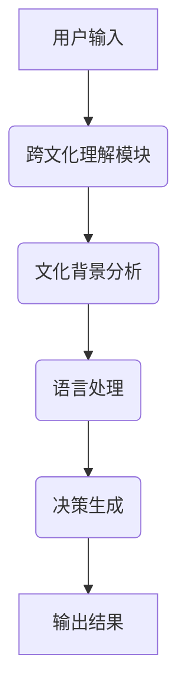
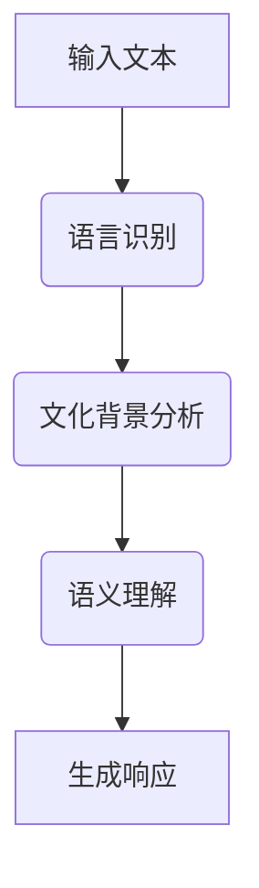

                 


# 开发具有跨文化理解能力的AI Agent

> 关键词：跨文化理解，AI Agent，多语言处理，文化知识库，语义理解，决策生成，系统架构

> 摘要：  
本文探讨了开发具有跨文化理解能力的AI Agent的核心技术与方法。首先，介绍了跨文化理解在AI Agent中的重要性，分析了跨文化理解的核心概念与AI Agent的基本原理。接着，详细讲解了跨文化理解的算法实现，包括多语言模型和文化背景分析的数学模型。随后，设计了系统的架构，包括功能模块、接口设计和交互流程。最后，通过实际案例展示了项目的实现，并总结了开发经验和最佳实践。

---

# 第一部分: 背景介绍与核心概念

## 第1章: 跨文化理解与AI Agent的背景介绍

### 1.1 背景与问题背景

#### 1.1.1 全球化背景下的跨文化挑战  
在当前全球化背景下，跨文化交流日益频繁。AI Agent需要在不同文化背景下与用户交互，准确理解用户意图并提供恰当的回应。然而，现有的AI Agent在跨文化场景中常常表现出理解偏差，例如在语言处理和决策中忽视文化差异。

#### 1.1.2 AI Agent在跨文化场景中的应用需求  
AI Agent广泛应用于客服、教育、医疗等领域。在这些领域中，跨文化理解能力是提升用户体验的关键。例如，在多语言客服场景中，AI Agent需要能够识别用户的文化背景，并根据文化差异调整回应方式。

#### 1.1.3 当前技术的局限性与改进方向  
现有的AI Agent多依赖于单一语言模型，难以处理跨文化语境下的复杂问题。主要问题包括：  
- **语言理解的局限性**：无法准确处理多语言和文化相关的语义。  
- **文化知识的缺乏**：缺乏对不同文化背景下的知识库支持。  
- **决策偏差**：在跨文化场景中，决策可能不符合目标文化背景下的规范。

改进方向包括构建多语言模型、整合文化知识库、优化跨文化语境下的决策算法。

---

### 1.2 跨文化理解的核心概念

#### 1.2.1 跨文化理解的定义与内涵  
跨文化理解是指在不同文化背景下，准确理解用户意图、语言习惯和文化习俗的能力。它不仅涉及语言的翻译，还包括对文化背景、习俗和社会规范的理解。

#### 1.2.2 AI Agent的基本概念与功能  
AI Agent是一种智能代理，能够感知环境、理解用户需求，并通过执行任务来满足这些需求。AI Agent的功能包括：  
- **感知与理解**：通过多模态输入（如文本、语音）感知用户需求。  
- **推理与决策**：基于感知信息进行推理，生成最优决策。  
- **执行与反馈**：执行任务并提供反馈。

#### 1.2.3 跨文化理解能力对AI Agent的重要性  
跨文化理解能力是AI Agent在多语言、多文化场景中提供高效服务的基础。它能够提升用户体验，增强AI Agent的适应性和智能性。

---

## 第2章: 跨文化理解与AI Agent的核心概念

### 2.1 跨文化理解的属性特征对比

#### 2.1.1 不同文化背景下的语言差异  
不同语言中的表达方式可能存在差异。例如，“yes”在英语中表示同意，但在某些文化中可能表示礼貌的拒绝。

#### 2.1.2 文化背景对决策的影响  
文化背景会影响用户的决策偏好。例如，在集体主义文化中，决策更注重团队合作，而在个人主义文化中，决策更注重个人意愿。

#### 2.1.3 不同文化中的社交礼仪与习惯  
不同文化中的社交礼仪差异显著。例如，某些文化中避免直接拒绝，而另一些文化中则更直接。

### 2.2 跨文化理解的ER实体关系图

```mermaid
er
    actor
    culture
    knowledge_base
    interaction
    actor -[1:N]-> interaction
    interaction -[1:1]-> knowledge_base
    knowledge_base -[1:N]-> culture
```

### 2.3 AI Agent的核心算法原理



---

# 第二部分: 算法原理与系统架构

## 第4章: 跨文化理解的算法实现

### 4.1 跨文化理解的算法原理

#### 4.1.1 多语言模型的训练方法  
多语言模型需要同时处理多种语言，并能够捕捉到不同语言之间的语义关联。常用方法包括：  
- **多语言预训练**：使用多种语言数据进行预训练，提取跨语言的特征。  
- **语言特定微调**：针对每种语言进行微调，优化语言特定的参数。

#### 4.1.2 跨文化知识库的构建与应用  
跨文化知识库需要包含不同文化背景下的知识，例如文化习俗、语言习惯等。知识库的构建方法包括：  
- **数据收集**：从多语言文本中提取文化相关信息。  
- **知识图谱构建**：将文化知识组织成结构化的知识图谱。

#### 4.1.3 跨文化语境下的意图识别  
意图识别需要结合文化背景信息。例如，在某些文化中，用户可能通过间接的方式表达需求。

---

### 4.2 跨文化理解的算法流程图



---

## 第5章: AI Agent的系统架构设计

### 5.1 系统功能设计

#### 5.1.1 多语言处理模块  
负责对输入文本进行语言识别和翻译。

#### 5.1.2 跨文化知识库模块  
存储和管理不同文化背景下的知识。

#### 5.1.3 语义理解与决策模块  
基于文化背景和语义理解生成决策。

### 5.2 系统架构图


---

## 第6章: 项目实战

### 6.1 环境安装与代码实现

#### 6.1.1 环境安装  
需要安装Python、TensorFlow、Hugging Face库等。

#### 6.1.2 核心代码实现

```python
from transformers import AutoTokenizer, AutoModelForSeq2Seq
import requests

class CrossCulturalAI:
    def __init__(self):
        self.tokenizer = AutoTokenizer.from_pretrained("facebook/m2m-100")
        self.model = AutoModelForSeq2Seq.from_pretrained("facebook/m2m-100")

    def language_detection(self, text):
        # 使用语言检测模型
        pass

    def cultural_analysis(self, language):
        # 根据语言获取文化背景信息
        pass

    def semantic_understanding(self, text, language):
        # 使用多语言模型进行语义理解
        pass

    def decision_making(self, semantics, language):
        # 基于语义和语言文化背景进行决策
        pass

    def generate_response(self, decision):
        # 生成回应
        pass

# 示例用法
ai = CrossCulturalAI()
response = ai.generate_response("提供技术支持")
print(response)
```

---

## 第7章: 总结与展望

### 7.1 总结

开发具有跨文化理解能力的AI Agent是一项具有挑战性的任务，但其应用前景广阔。通过多语言模型、文化知识库和语义理解模块的结合，可以显著提升AI Agent在跨文化场景中的表现。

### 7.2 小结与注意事项

- **小结**：本文详细介绍了跨文化理解在AI Agent中的重要性，并提出了系统的实现方案。  
- **注意事项**：在实际应用中，需要不断优化模型和知识库，以应对复杂多变的跨文化场景。

### 7.3 拓展阅读

- 推荐阅读《多语言NLP模型开发与应用》  
- 推荐阅读《跨文化交际学》

---

# 作者：AI天才研究院 & 禅与计算机程序设计艺术

---

以上是《开发具有跨文化理解能力的AI Agent》的技术博客文章的完整目录和内容框架。通过系统化的分析和详细的代码实现，本文为读者提供了开发跨文化AI Agent的全面指导。

