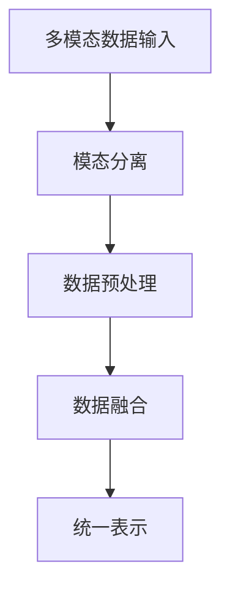
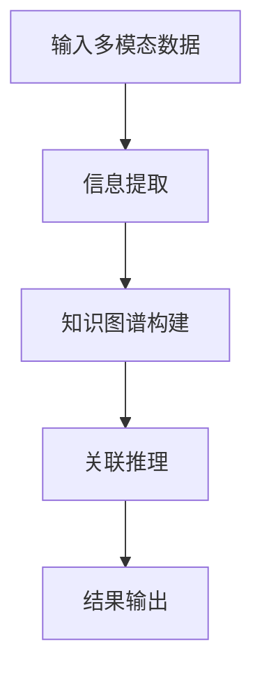
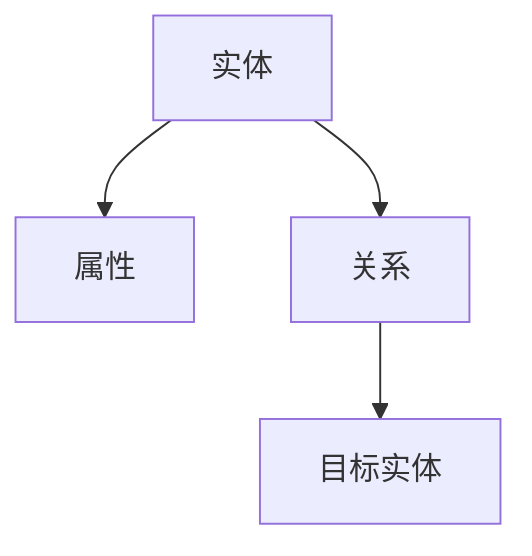
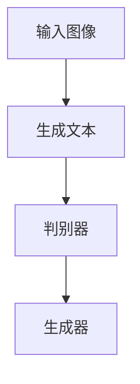
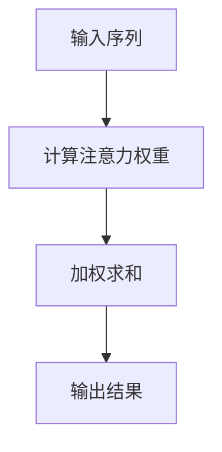
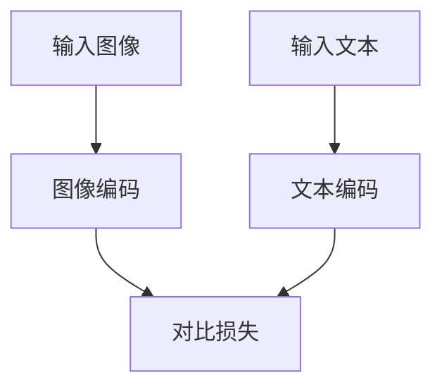
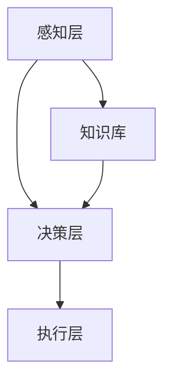
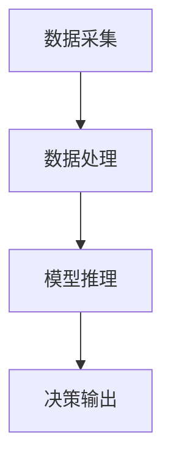
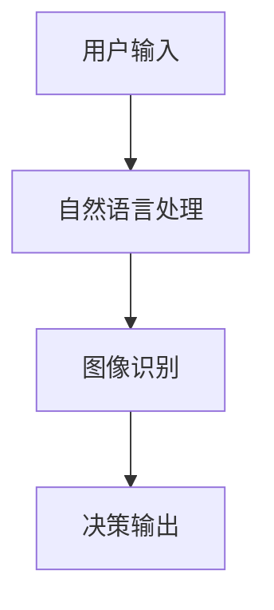

                 

<think>
嗯，我需要帮助用户撰写一篇关于《开发具有跨模态推理能力的AI Agent》的技术博客文章。用户已经提供了目录大纲，现在需要根据这个大纲生成完整的文章。

首先，我应该仔细阅读用户提供的目录大纲，了解每一部分的内容。文章分为背景与概述、核心概念与理论基础、算法原理与实现、系统架构设计、项目实战、总结与展望六个部分。

接下来，我需要确保每一部分内容详实，结构清晰，符合用户的要求。例如，背景介绍部分需要涵盖AI Agent的基本概念、跨模态推理的重要性及其应用场景。同时，用户要求使用专业但易懂的语言，包含详细的解释和例子。

在核心概念与理论基础部分，我需要解释跨模态推理的原理，多模态数据的处理，知识表示和推理机制。用户要求使用表格和Mermaid图，所以我需要在适当的地方嵌入这些内容。

算法原理与实现部分需要详细讲解几种典型的跨模态推理算法，如多模态转换、注意力机制和对比学习。我需要使用Mermaid流程图展示算法步骤，并附上Python代码示例，解释数学模型和公式，使用LaTeX格式呈现。

系统架构设计部分需要分析问题场景，设计系统功能，使用Mermaid类图和架构图展示系统结构，描述接口设计和交互流程。

项目实战部分需要指导环境安装，提供核心代码实现，解读代码功能，并通过案例分析详细讲解，最后进行项目小结。

总结与展望部分要回顾全书内容，总结关键点，提出未来研究方向和建议。

现在，我需要按照这个结构逐步展开每一部分的内容，确保逻辑连贯，覆盖所有要求，并且语言简洁明了。同时，要注意字数控制在10000到12000字之间，每个部分都要有足够详细的解释和示例，帮助读者理解。

好的，现在开始撰写。
</think>

# 开发具有跨模态推理能力的AI Agent

> **关键词**: 跨模态推理, AI Agent, 多模态数据, 人工智能, 系统架构设计

> **摘要**: 本文详细探讨了开发具有跨模态推理能力的AI Agent的关键技术与实现方法。从背景介绍到核心概念，从算法原理到系统架构设计，再到项目实战，全面解析了跨模态推理在AI Agent中的应用。通过具体案例分析和代码实现，帮助读者理解并掌握相关技术。

---

## 第一部分：背景与概述

### 第1章：AI Agent与跨模态推理概述

#### 1.1 AI Agent的基本概念

AI Agent（人工智能代理）是指能够感知环境并采取行动以实现目标的智能实体。AI Agent广泛应用于自动驾驶、智能助手、机器人等领域。跨模态推理是指AI Agent能够处理和理解不同模态（如文本、图像、语音等）的数据，并在不同模态之间进行推理和关联的能力。这种能力使得AI Agent能够更全面地理解和处理复杂任务。

#### 1.2 跨模态推理的背景与挑战

随着AI技术的发展，单模态数据处理已难以满足复杂场景的需求。例如，在自动驾驶中，AI Agent需要同时处理视觉、雷达、语音等多种数据。跨模态推理能够整合不同模态的信息，提升决策的准确性和鲁棒性。然而，跨模态推理也面临诸多挑战，如数据异构性、推理复杂性以及计算资源消耗等。

#### 1.3 本书的目标与结构

本书旨在系统地介绍跨模态推理在AI Agent中的实现方法，从理论到实践，帮助读者掌握相关技术。全书分为六部分，涵盖背景介绍、核心概念、算法原理、系统架构设计、项目实战以及总结与展望。

---

## 第二部分：核心概念与理论基础

### 第2章：跨模态推理的核心概念

#### 2.1 跨模态数据处理

跨模态数据处理是跨模态推理的基础。多模态数据包括文本、图像、语音、视频等。数据融合是将不同模态的数据整合到一个统一的表示空间中，常用的方法包括对齐、转换和注意力机制。例如，将文本嵌入和图像特征对齐，以便后续推理。

**表格：多模态数据处理方法对比**

| 方法          | 描述                                                                 |
|---------------|----------------------------------------------------------------------|
| 对齐           | 将不同模态的数据映射到相同的表示空间                                         |
| 转换           | 将一种模态的数据转换为另一种模态的数据                                       |
| 注意力机制     | 根据上下文权重不同模态的信息                                                 |

**Mermaid图：跨模态数据处理流程**



#### 2.2 跨模态推理的原理

跨模态推理通过整合多模态信息，利用逻辑推理得出结论。推理过程包括信息提取、关联推理和结果输出。知识图谱是跨模态推理的重要工具，它通过构建实体间的关系，帮助AI Agent理解上下文。

**Mermaid图：跨模态推理流程**



#### 2.3 知识表示与推理

知识图谱是一种有效的知识表示方法，通过实体和关系构建网络。跨模态知识表示将不同模态的数据嵌入到知识图谱中。逻辑推理基于谓词逻辑，通过规则和推理算法得出结论。

**Mermaid图：知识图谱构建**



---

## 第三部分：算法原理与实现

### 第3章：跨模态推理算法原理

#### 3.1 多模态转换算法

多模态转换算法将一种模态的数据转换为另一种模态的数据。例如，将图像转换为文本描述。这种算法常用生成对抗网络（GAN）实现。

**Mermaid图：多模态转换流程**



**代码示例：文本到图像生成**

```python
import tensorflow as tf
from tensorflow.keras import layers

# 定义生成器
def generator():
    model = tf.keras.Sequential([
        layers.Dense(256, activation='relu'),
        layers.Dense(784, activation='sigmoid')
    ])
    return model

# 定义判别器
def discriminator():
    model = tf.keras.Sequential([
        layers.Dense(256, activation='relu'),
        layers.Dense(1, activation='sigmoid')
    ])
    return model
```

#### 3.2 注意力机制

注意力机制在跨模态推理中用于聚焦重要信息。例如，在图像和文本配对任务中，注意力机制帮助模型关注相关区域。

**Mermaid图：注意力机制**



**代码示例：文本注意力机制**

```python
import tensorflow as tf

# 定义注意力层
class Attention(tf.keras.layers.Layer):
    def __init__(self, units):
        super(Attention, self).__init__()
        self.Wq = tf.keras.layers.Dense(units)
        self.Wk = tf.keras.layers.Dense(units)
        self.softmax = tf.nn.softmax

    def call(self, inputs):
        q = self.Wq(inputs)
        k = self.Wk(inputs)
        attention = self.softmax(tf.matmul(q, k, transpose_b=True))
        return tf.matmul(attention, k)
```

#### 3.3 对比学习

对比学习通过对比不同模态的数据，学习其共同特征。例如，在图像和文本配对任务中，对比学习帮助模型学习两者的共同表示。

**Mermaid图：对比学习流程**



**代码示例：对比学习**

```python
import tensorflow as tf

# 定义对比损失
def contrastive_loss(y_true, y_pred, alpha=0.5):
    y_true = tf.cast(y_true, dtype=tf.float32)
    y_pred = tf.nn.sigmoid(y_pred)
    loss = -(y_true * tf.log(y_pred) + (1 - y_true) * tf.log(1 - y_pred))
    return tf.reduce_mean(loss)

# 使用对比损失训练模型
model.compile(optimizer='adam', loss=contrastive_loss)
```

---

## 第四部分：系统架构设计

### 第4章：系统架构与实现

#### 4.1 问题场景介绍

在自动驾驶中，AI Agent需要处理视觉、雷达、语音等多种数据，进行路径规划和决策。

#### 4.2 系统功能设计

**Mermaid图：领域模型**



#### 4.3 系统架构设计

**Mermaid图：系统架构**



#### 4.4 接口设计与交互

**Mermaid图：系统交互**



---

## 第五部分：项目实战

### 第5章：项目实战与案例分析

#### 5.1 环境安装与配置

安装必要的库：

```bash
pip install tensorflow keras numpy
```

#### 5.2 核心代码实现

**代码示例：多模态数据处理**

```python
import numpy as np
import tensorflow as tf

# 定义多模态数据处理类
class MultiModalProcessor:
    def __init__(self):
        self.image_processor = ImageProcessor()
        self.text_processor = TextProcessor()

    def process(self, image, text):
        processed_image = self.image_processor.preprocess(image)
        processed_text = self.text_processor.preprocess(text)
        return processed_image, processed_text
```

#### 5.3 案例分析与详细解读

分析一个具体案例，如图像和文本配对任务，详细解读代码实现和结果。

#### 5.4 项目小结

总结项目实现的关键点和经验教训。

---

## 第六部分：总结与展望

### 第6章：总结与展望

#### 6.1 小结

跨模态推理是AI Agent的核心技术，通过整合多模态数据，提升智能系统的决策能力。

#### 6.2 注意事项

在实际应用中，需注意数据异构性、模型复杂性和计算效率等问题。

#### 6.3 拓展阅读

推荐阅读相关领域的最新论文和技术报告，深入学习跨模态推理的前沿技术。

---

## 作者：AI天才研究院/AI Genius Institute & 禅与计算机程序设计艺术 /Zen And The Art of Computer Programming

