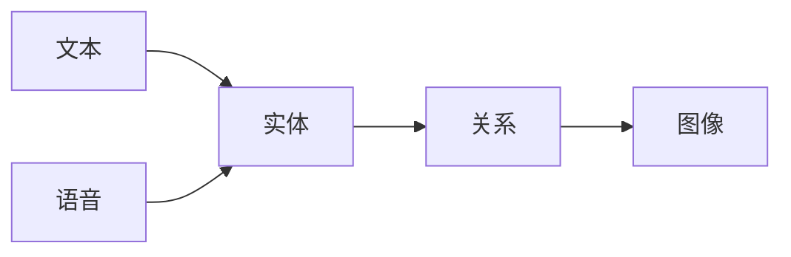
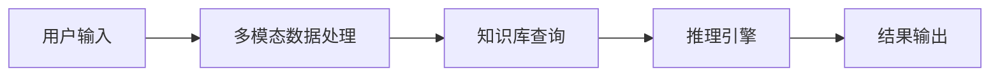

                 


# 开发具有跨模态知识推理能力的AI Agent

## 关键词
跨模态推理, AI Agent, 知识图谱, 多模态数据, 人工智能, 系统架构

## 摘要
本文详细探讨了开发具有跨模态知识推理能力的AI Agent的各个方面，包括背景介绍、核心概念、算法原理、系统架构设计、项目实战和最佳实践。通过丰富的图表和代码示例，帮助读者理解如何构建一个能够处理文本、图像和语音等多种模态数据，并具备推理能力的智能体。

---

# 第一部分: 跨模态知识推理AI Agent的背景与核心概念

## 第1章: 跨模态知识推理AI Agent的背景与问题背景

### 1.1 跨模态知识推理的定义与问题背景

#### 1.1.1 跨模态数据的定义与特点
跨模态数据是指来自不同感知模态（如文本、图像、语音、视频等）的数据。这些数据具有以下特点：
- **异构性**：不同模态的数据格式和语义结构不同。
- **互补性**：多种模态数据可以互补信息，提高推理的准确性。
- **多样性**：跨模态数据可以丰富AI Agent的认知能力。

#### 1.1.2 知识推理的核心概念
知识推理是指AI Agent基于知识库中的信息进行逻辑推理的能力。核心概念包括：
- **知识库**：存储结构化的知识，如实体和关系。
- **推理引擎**：根据知识库中的信息进行推理，得出新的结论。

#### 1.1.3 跨模态知识推理的必要性
在现实场景中，单一模态的数据往往不足以支持复杂的推理任务。例如，在医疗领域，结合文本和图像数据可以提高诊断的准确性。跨模态知识推理能够充分利用多源信息，显著提升AI Agent的智能水平。

### 1.2 跨模态知识推理AI Agent的现状与挑战

#### 1.2.1 当前AI Agent的发展现状
当前，AI Agent在单模态任务（如自然语言处理、图像识别）上已经取得了显著进展，但在跨模态知识推理方面仍存在诸多挑战，如：
- **数据异构性**：不同模态的数据难以有效融合。
- **推理复杂性**：跨模态推理需要处理多层语义关系。
- **计算资源需求**：跨模态推理通常需要大量的计算资源。

#### 1.2.2 跨模态知识推理的难点
- **模态间关联性弱**：不同模态的数据之间可能存在弱关联，导致推理困难。
- **推理模型的泛化能力不足**：现有的推理模型在跨模态场景中泛化能力有限。
- **知识表示的多样性**：如何有效地表示和融合多模态知识是一个难题。

#### 1.2.3 当前技术的局限性与未来方向
当前技术在跨模态知识推理方面主要依赖于深度学习模型，但在复杂场景下的推理能力有限。未来的发展方向包括：
- **多模态大模型**：开发能够同时处理多种模态数据的大型模型。
- **跨模态知识图谱**：构建支持跨模态推理的知识图谱。
- **人机协作推理**：结合人类知识和AI推理能力，提升推理的准确性和效率。

---

## 第2章: 跨模态知识推理的核心概念与联系

### 2.1 跨模态数据的核心特征

#### 2.1.1 文本、图像、语音等模态的特征对比
| 模态类型 | 特征描述                     |
|----------|------------------------------|
| 文本     | 离散性、序列性               |
| 图像     | 高维性、空间性               |
| 语音     | 时间序列性、情感表达性       |

#### 2.1.2 跨模态数据的关联性分析
跨模态数据的关联性可以通过以下方式分析：
- **实体对齐**：将不同模态中的实体进行映射。
- **关系推理**：分析实体之间的关系。

### 2.2 知识推理的原理与模型

#### 2.2.1 知识图谱的构建与表示
知识图谱由实体和关系组成，表示为三元组（头实体，关系，尾实体）。

#### 2.2.2 推理算法的分类与对比
| 推理算法 | 描述                       |
|----------|----------------------------|
| 前向链式推理 | 从已知事实推导新结论       |
| 反向推理   | 从目标反向寻找支持事实     |
| 概率推理   | 基于概率论进行推理         |

### 2.3 跨模态知识推理的实体关系图



---

## 第3章: 跨模态知识推理AI Agent的算法原理

### 3.1 跨模态编码器的原理

#### 3.1.1 多模态编码器的结构
多模态编码器通常包括以下模块：
- **模态特定编码器**：分别处理不同模态的数据。
- **模态融合层**：将不同模态的编码结果进行融合。

#### 3.1.2 模态融合的方法
常用的模态融合方法包括：
- **早期融合**：在特征提取阶段进行融合。
- **晚期融合**：在高层进行融合。

### 3.2 跨模态推理模型的算法流程


### 3.3 算法的数学模型与公式

#### 3.3.1 多模态编码器的数学表示
$$ y = f(x_1, x_2, ..., x_n) $$

#### 3.3.2 推理模型的损失函数
$$ L = \sum_{i=1}^{m} (y_i - \hat{y}_i)^2 $$

---

## 第4章: 跨模态知识推理AI Agent的系统分析与架构设计

### 4.1 系统架构图



### 4.2 功能模块设计

#### 4.2.1 数据处理模块
数据处理模块负责接收和解析多模态数据，例如：

```python
def process_data(text, image):
    # 处理文本数据
    text_features = encode_text(text)
    # 处理图像数据
    image_features = encode_image(image)
    return text_features, image_features
```

#### 4.2.2 知识库查询模块
知识库查询模块基于知识图谱进行实体对齐和关系推理：

```python
def query_knowledge_base(entity1, entity2):
    # 查询实体之间的关系
    relations = knowledge_graph.get_relations(entity1, entity2)
    return relations
```

#### 4.2.3 推理引擎模块
推理引擎模块负责根据查询结果进行推理：

```python
def perform_reasoning(relations, target):
    # 基于关系进行推理
    conclusion = reasoning_engine.infer(relations, target)
    return conclusion
```

---

## 第5章: 跨模态知识推理AI Agent的项目实战

### 5.1 项目环境安装

#### 5.1.1 安装依赖
```bash
pip install transformers tensorflow pytorch
```

#### 5.1.2 下载模型
```bash
wget https://example.com/weights.tar.gz
tar -zxvf weights.tar.gz
```

### 5.2 系统核心实现源代码

#### 5.2.1 多模态编码器实现
```python
class MultiModalEncoder:
    def __init__(self, text_encoder, image_encoder):
        self.text_encoder = text_encoder
        self.image_encoder = image_encoder

    def encode(self, text, image):
        text_feat = self.text_encoder(text)
        image_feat = self.image_encoder(image)
        return text_feat + image_feat
```

#### 5.2.2 推理引擎实现
```python
class ReasoningEngine:
    def __init__(self, knowledge_base):
        self.knowledge_base = knowledge_base

    def infer(self, relations, target):
        # 基于关系进行推理
        conclusion = self.knowledge_base.infer(relations, target)
        return conclusion
```

### 5.3 实际案例分析与详细讲解

#### 5.3.1 案例背景
假设我们有一个医疗AI Agent，需要根据病人的病历文本和X光图像进行诊断推理。

#### 5.3.2 数据输入
```python
text = "咳嗽，发热"
image = "xray.png"
```

#### 5.3.3 数据处理
```python
text_feat, image_feat = process_data(text, image)
```

#### 5.3.4 知识库查询
```python
relations = query_knowledge_base(text_feat, image_feat)
```

#### 5.3.5 推理引擎
```python
conclusion = perform_reasoning(relations, target)
```

#### 5.3.6 输出结果
```python
print(conclusion)
```

### 5.4 项目小结
通过上述实战，我们可以看到，开发具有跨模态知识推理能力的AI Agent需要综合运用多种技术，包括多模态数据处理、知识图谱构建和推理引擎设计。

---

## 第6章: 跨模态知识推理AI Agent的最佳实践

### 6.1 开发中的注意事项
- **数据质量**：确保多模态数据的准确性和完整性。
- **模型选择**：根据具体任务选择合适的模型架构。
- **计算资源**：跨模态推理通常需要较高的计算资源。

### 6.2 小结
本文详细介绍了开发具有跨模态知识推理能力的AI Agent的各个方面，包括背景、核心概念、算法原理和项目实战。通过本文的学习，读者可以掌握跨模态知识推理的基本方法，并能够实际应用到具体的项目中。

### 6.3 注意事项
- 在实际应用中，要注意模型的可解释性和鲁棒性。
- 定期更新知识库，以保持模型的推理能力。

### 6.4 拓展阅读
- 《Deep Learning for Multimodal Data》
- 《Knowledge Graph Construction and Reasoning》

---

## 作者

**作者：AI天才研究院/AI Genius Institute & 禅与计算机程序设计艺术 /Zen And The Art of Computer Programming**

---

通过以上内容，我们可以看到，开发具有跨模态知识推理能力的AI Agent是一个复杂但充满潜力的领域。希望本文能够为读者提供有价值的指导和启示。

