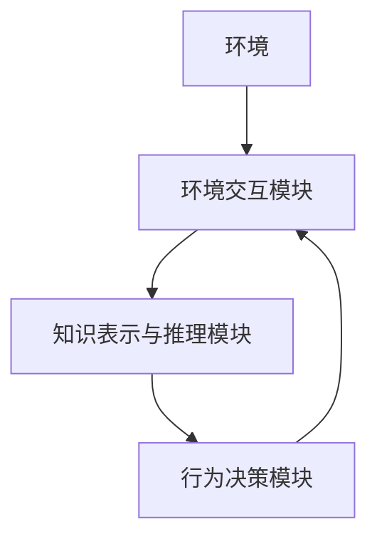

                 

<think>
嗯，用户让我写一本关于强化学习在AI Agent决策中运用的书籍，看起来他们需要详细的内容和结构。我得先理清他们的需求。他们可能是一位技术专家或者学生，想要系统地了解这个领域的知识。

首先，我应该从背景和基础开始，解释强化学习和AI Agent的基本概念，这样读者可以打好基础。然后，核心概念部分需要详细讲解数学模型，可能需要画图帮助理解。接下来是算法原理，这部分得分章节讲，比如Q-learning和DQN，每个算法都要有流程图和数学公式。

然后，系统架构设计是关键，要介绍如何构建AI Agent，包括各个模块的设计和交互。项目实战部分要具体，提供代码和案例分析，这样读者可以实际操作。最后，总结和展望，还有附录，方便读者深入学习。

我得确保每个章节都有足够的细节，但又不冗长。同时，满足用户对结构的要求，细化到三级目录。这样整本书的结构会很清晰，内容也会全面覆盖强化学习在AI Agent中的应用。
</think>

# 强化学习在AI Agent决策中的运用

> 关键词：强化学习、AI Agent、马尔可夫决策过程、Q-learning、深度Q网络

> 摘要：强化学习是一种通过与环境交互来学习最优决策策略的机器学习方法。本文详细探讨了强化学习在AI Agent决策中的应用，从基本概念到核心算法，再到系统架构设计和项目实战，全面解析强化学习在AI Agent中的运用。通过本文的学习，读者将能够理解强化学习的核心原理，并能够将其应用于实际的AI Agent决策问题中。

---

# 第1章: 强化学习与AI Agent概述

## 1.1 强化学习的基本概念

### 1.1.1 什么是强化学习

强化学习（Reinforcement Learning, RL）是一种机器学习方法，其核心思想是通过智能体与环境的交互，逐步学习最优决策策略。与监督学习和无监督学习不同，强化学习通过奖励机制来指导学习过程，智能体会根据与环境的交互结果获得奖励或惩罚，并据此调整自己的行为以最大化累计奖励。

### 1.1.2 强化学习的核心要素

- **状态（State）**：智能体所处的环境情况。
- **动作（Action）**：智能体在给定状态下采取的行为。
- **奖励（Reward）**：智能体采取某个动作后，环境给予的反馈，用于指导智能体的行为。
- **策略（Policy）**：智能体在给定状态下选择动作的概率分布。
- **价值函数（Value Function）**：衡量某个状态下采取某个动作的价值。

### 1.1.3 强化学习与监督学习的区别

- **监督学习**：基于标记的训练数据，直接学习输入到输出的映射关系。
- **强化学习**：通过与环境的交互，逐步学习最优决策策略。

### 1.1.4 强化学习的应用场景

- **游戏AI**：如AlphaGo、Dota AI等。
- **机器人控制**：如自动驾驶、工业机器人。
- **金融投资**：如自动交易策略。

## 1.2 AI Agent的基本概念

### 1.2.1 什么是AI Agent

AI Agent（人工智能代理）是指能够感知环境、做出决策并采取行动的智能实体。AI Agent的核心目标是通过与环境的交互，实现预定的目标。

### 1.2.2 AI Agent的分类

- **简单反射型Agent**：基于当前状态做出简单反应。
- **基于模型的规划型Agent**：能够根据环境模型进行规划。
- **实用基于模型的规划型Agent**：在规划过程中考虑效用函数。
- **学习型Agent**：通过与环境的交互学习最优策略。

### 1.2.3 AI Agent的核心功能

- **感知**：通过传感器或接口获取环境信息。
- **推理**：对感知信息进行处理，生成决策。
- **行动**：根据决策采取具体行动。

## 1.3 强化学习在AI Agent中的应用背景

### 1.3.1 AI Agent决策问题的复杂性

AI Agent需要在动态和不确定的环境中做出决策，这使得决策问题具有高度的复杂性。

### 1.3.2 强化学习在AI Agent中的优势

- **自主学习**：通过与环境的交互，自动学习最优策略。
- **适应性**：能够根据环境变化调整决策策略。
- **高效性**：通过奖励机制快速收敛到最优解。

### 1.3.3 当前强化学习在AI Agent中的研究热点

- **多智能体强化学习**：多个智能体协同决策。
- **深度强化学习**：结合深度学习提升决策能力。
- **实时决策优化**：在动态环境中快速做出决策。

## 1.4 本章小结

本章介绍了强化学习的基本概念、AI Agent的核心功能以及强化学习在AI Agent中的应用背景。通过这些内容，读者可以理解强化学习与AI Agent之间的关系，并为后续章节的学习打下基础。

---

# 第2章: 强化学习的核心概念与数学模型

## 2.1 强化学习的基本原理

### 2.1.1 状态、动作、奖励的定义

- **状态**：智能体的感知输入，如在迷宫中的位置。
- **动作**：智能体在给定状态下采取的行为，如“左转”、“右转”。
- **奖励**：智能体采取某个动作后获得的反馈，如“+1”或“-1”。

### 2.1.2 马尔可夫决策过程（MDP）

马尔可夫决策过程是一种用于描述强化学习问题的数学模型，由状态空间、动作空间、转移概率和奖励函数组成。

### 2.1.3 策略与价值函数的定义

- **策略**：在给定状态下选择动作的概率分布。
- **价值函数**：衡量某个状态下采取某个动作的价值。

## 2.2 强化学习的核心算法

### 2.2.1 Q-learning算法

Q-learning是一种基于值函数的强化学习算法，通过迭代更新Q表来逼近最优策略。

### 2.2.2 深度Q网络（DQN）

深度Q网络结合了深度学习和强化学习，通过神经网络近似Q函数，从而实现端到端的决策。

### 2.2.3 策略梯度方法

策略梯度方法通过直接优化策略函数，使得在策略空间中找到最优解。

## 2.3 强化学习的数学模型

### 2.3.1 状态转移概率矩阵

状态转移概率矩阵描述了智能体在某个状态下采取某个动作后转移到下一个状态的概率。

### 2.3.2 价值函数的数学表达

$$ V(s) = \max_{a} [r + V(s') ] $$

### 2.3.3 策略函数的数学表示

$$ \pi(a|s) = \text{概率分布} $$

## 2.4 本章小结

本章详细介绍了强化学习的核心概念和数学模型，包括马尔可夫决策过程、Q-learning算法、DQN和策略梯度方法，为后续章节的学习奠定了基础。

---

# 第3章: 强化学习的核心算法与实现

## 3.1 Q-learning算法的实现

### 3.1.1 Q-learning算法的步骤

1. 初始化Q表。
2. 与环境交互，获取状态和奖励。
3. 更新Q表。
4. 重复步骤2和3，直到收敛。

### 3.1.2 Q-learning算法的优缺点

- **优点**：简单易实现。
- **缺点**：Q表的维度可能很高，导致计算复杂度高。

### 3.1.3 Q-learning算法的数学推导

$$ Q(s, a) = Q(s, a) + \alpha [r + \max Q(s', a') - Q(s, a)] $$

### 3.1.4 Q-learning算法的代码实现

```python
class QLearning:
    def __init__(self, state_space, action_space, learning_rate=0.1):
        self.state_space = state_space
        self.action_space = action_space
        self.learning_rate = learning_rate
        self.q_table = np.zeros((state_space, action_space))
    
    def choose_action(self, state, epsilon=0.1):
        if np.random.random() < epsilon:
            return np.random.randint(self.action_space)
        else:
            return np.argmax(self.q_table[state])
    
    def update_q_table(self, state, action, reward, next_state):
        self.q_table[state, action] += self.learning_rate * (reward + np.max(self.q_table[next_state]) - self.q_table[state, action])
```

### 3.1.5 Q-learning算法的优缺点分析

- **优点**：简单易实现，适合离散状态和动作空间。
- **缺点**：Q表的维度可能很高，导致计算复杂度高。

## 3.2 深度Q网络（DQN）的实现

### 3.2.1 DQN算法的结构

DQN由两个神经网络组成：主网络和目标网络。

### 3.2.2 DQN算法的训练流程

1. 与环境交互，收集经验。
2. 将经验存储在经验回放池中。
3. 从经验回放池中随机采样经验，训练主网络。
4. 定期更新目标网络。

### 3.2.3 DQN算法的数学模型

$$ Q(s, a) = \min_{\theta} \mathbb{E}[(r + \gamma Q(s', a') - Q(s, a))^2] $$

### 3.2.4 DQN算法的代码实现

```python
import torch
import torch.nn as nn
import torch.optim as optim

class DQN:
    def __init__(self, state_dim, action_dim, learning_rate=0.01, gamma=0.99):
        self.state_dim = state_dim
        self.action_dim = action_dim
        self.learning_rate = learning_rate
        self.gamma = gamma
        self.main_network = nn.Sequential(
            nn.Linear(state_dim, 64),
            nn.ReLU(),
            nn.Linear(64, action_dim)
        )
        self.target_network = nn.Sequential(
            nn.Linear(state_dim, 64),
            nn.ReLU(),
            nn.Linear(64, action_dim)
        )
        self.optimizer = optim.Adam(self.main_network.parameters(), lr=learning_rate)
    
    def choose_action(self, state, epsilon=0.1):
        if np.random.random() < epsilon:
            return np.random.randint(self.action_dim)
        else:
            with torch.no_grad():
                q_values = self.main_network(torch.FloatTensor(state))
                return torch.argmax(q_values).item()
    
    def update(self, states, actions, rewards, next_states):
        current_q = self.main_network(torch.FloatTensor(states))
        current_q = current_q.gather(1, torch.LongTensor(actions))
        
        next_q = self.target_network(torch.FloatTensor(next_states))
        max_next_q = torch.max(next_q, dim=1)[0]
        
        target = rewards + self.gamma * max_next_q
        
        loss = nn.MSELoss()(current_q.squeeze(), target)
        self.optimizer.zero_grad()
        loss.backward()
        self.optimizer.step()
        
        # 更新目标网络
        for target_param, main_param in zip(self.target_network.parameters(), self.main_network.parameters()):
            target_param.data.copy_(main_param.data)
```

### 3.2.5 DQN算法的优缺点分析

- **优点**：能够处理高维状态空间，适合复杂环境。
- **缺点**：训练过程可能不稳定，需要精细的超参数调整。

## 3.3 策略梯度方法的实现

### 3.3.1 策略梯度方法的基本原理

策略梯度方法通过优化策略函数，使得在策略空间中找到最优解。

### 3.3.2 策略梯度方法的优缺点

- **优点**：直接优化策略函数。
- **缺点**：需要处理高维策略空间。

### 3.3.3 策略梯度方法的数学推导

$$ \nabla J = \mathbb{E}[\nabla \log \pi(a|s) \cdot Q(s,a)] $$

### 3.3.4 策略梯度方法的代码实现

```python
import torch
import torch.nn as nn
import torch.optim as optim

class PolicyGradient:
    def __init__(self, state_dim, action_dim, learning_rate=0.01):
        self.state_dim = state_dim
        self.action_dim = action_dim
        self.learning_rate = learning_rate
        self.policy_network = nn.Sequential(
            nn.Linear(state_dim, 64),
            nn.ReLU(),
            nn.Linear(64, action_dim)
        )
        self.optimizer = optim.Adam(self.policy_network.parameters(), lr=learning_rate)
    
    def choose_action(self, state):
        with torch.no_grad():
            logits = self.policy_network(torch.FloatTensor(state))
            action_probs = torch.softmax(logits, dim=0)
        action = np.random.choice(range(self.action_dim), p=action_probs.cpu().numpy())
        return action
    
    def update(self, states, actions, rewards):
        logits = self.policy_network(torch.FloatTensor(states))
        action_probs = torch.softmax(logits, dim=0)
        policy_loss = -torch.mean(torch.log(action_probs[range(len(actions)), actions]) * rewards)
        self.optimizer.zero_grad()
        policy_loss.backward()
        self.optimizer.step()
```

### 3.3.5 策略梯度方法的优缺点分析

- **优点**：直接优化策略函数。
- **缺点**：训练过程可能不稳定，需要精细的超参数调整。

## 3.4 本章小结

本章详细介绍了强化学习的核心算法，包括Q-learning、DQN和策略梯度方法，并通过代码实现展示了这些算法的实现细节。这些算法为后续章节的系统架构设计和项目实战奠定了基础。

---

# 第4章: 强化学习在AI Agent中的系统架构设计

## 4.1 AI Agent的系统架构

### 4.1.1 知识表示与推理模块

知识表示与推理模块负责对环境信息进行处理和推理，生成决策建议。

### 4.1.2 行为决策模块

行为决策模块根据知识表示与推理模块的输出，选择具体行动。

### 4.1.3 环境交互模块

环境交互模块负责与外部环境进行交互，获取感知信息和反馈。

### 4.1.4 系统功能模块划分

- **知识表示与推理模块**：负责状态的感知和处理。
- **行为决策模块**：负责动作的选择和执行。
- **环境交互模块**：负责与环境的交互和反馈的接收。

### 4.1.5 系统架构的流程图



## 4.2 强化学习算法在系统中的应用

### 4.2.1 状态空间的设计

状态空间的设计需要考虑环境的动态特性，选择合适的表示方法。

### 4.2.2 动作空间的设计

动作空间的设计需要根据环境的特点，选择合适的行为方式。

### 4.2.3 奖励函数的设计

奖励函数的设计需要根据任务目标，定义合适的奖励机制。

## 4.3 系统架构的实现

### 4.3.1 系统功能模块划分

- **知识表示与推理模块**：负责状态的感知和处理。
- **行为决策模块**：负责动作的选择和执行。
- **环境交互模块**：负责与环境的交互和反馈的接收。

### 4.3.2 系统架构的流程图


### 4.3.3 系统接口的设计

- **环境交互接口**：负责与环境的交互。
- **知识表示接口**：负责状态的表示和处理。
- **行为决策接口**：负责动作的选择和执行。

## 4.4 本章小结

本章详细介绍了强化学习在AI Agent中的系统架构设计，包括功能模块划分、流程图设计和接口设计，为后续章节的项目实战奠定了基础。

---

# 第5章: 强化学习在AI Agent中的项目实战

## 5.1 项目背景与目标

### 5.1.1 项目背景

在迷宫中寻找最优路径，实现自主导航。

### 5.1.2 项目目标

通过强化学习算法，训练AI Agent在迷宫中找到最优路径。

## 5.2 项目环境与工具安装

### 5.2.1 环境配置

- 操作系统：Linux/Windows/MacOS
- Python版本：3.6+

### 5.2.2 工具安装

- 安装Python环境：确保安装了Python和pip。
- 安装依赖库：`pip install numpy torch matplotlib`

### 5.2.3 开发环境搭建

- 创建虚拟环境（可选）。
- 安装必要的库。

## 5.3 项目核心实现

### 5.3.1 状态空间的定义

状态空间由迷宫的位置坐标组成。

### 5.3.2 动作空间的定义

动作空间包括“左转”、“右转”、“前进”等动作。

### 5.3.3 奖励函数的定义

奖励函数定义为：到达终点得+1，否则得-0.1。

### 5.3.4 系统功能模块的实现

#### 5.3.4.1 环境类的实现

```python
class MazeEnvironment:
    def __init__(self, grid_size=5):
        self.grid_size = grid_size
        self.goal = (grid_size-1, grid_size-1)
        self.current_state = (0, 0)
    
    def reset(self):
        self.current_state = (0, 0)
        return self.current_state
    
    def step(self, action):
        # 动作：0-左，1-右，2-上，3-下
        state = self.current_state
        if action == 0:
            new_state = (state[0]-1, state[1])
        elif action == 1:
            new_state = (state[0]+1, state[1])
        elif action == 2:
            new_state = (state[0], state[1]+1)
        elif action == 3:
            new_state = (state[0], state[1]-1)
        else:
            new_state = state
        # 判断新状态是否合法
        if new_state[0] < 0 or new_state[0] >= self.grid_size or new_state[1] < 0 or new_state[1] >= self.grid_size:
            reward = -0.1
            done = True
            new_state = state
        else:
            reward = 1 if new_state == self.goal else -0.1
            done = new_state == self.goal
        self.current_state = new_state
        return new_state, reward, done
```

#### 5.3.4.2 强化学习算法的实现

选择DQN算法实现。

#### 5.3.4.3 训练过程的实现

```python
def train():
    env = MazeEnvironment()
    agent = DQN(state_dim=2, action_dim=4)
    episodes = 1000
    for episode in range(episodes):
        state = env.reset()
        total_reward = 0
        while True:
            action = agent.choose_action(state)
            next_state, reward, done = env.step(action)
            agent.update(state, action, reward, next_state)
            total_reward += reward
            state = next_state
            if done:
                break
        print(f"Episode {episode}, Total Reward: {total_reward}")
```

## 5.4 项目小结

本章通过迷宫导航的案例，详细介绍了强化学习在AI Agent中的项目实战，包括环境搭建、算法实现和训练过程。通过本章的学习，读者可以掌握强化学习在实际问题中的应用方法。

---

# 第6章: 总结与展望

## 6.1 本章总结

强化学习是一种通过与环境交互来学习最优决策策略的机器学习方法。本文详细探讨了强化学习在AI Agent决策中的应用，从基本概念到核心算法，再到系统架构设计和项目实战，全面解析了强化学习在AI Agent中的运用。

## 6.2 未来展望

- **多智能体强化学习**：研究多个智能体协同决策的问题。
- **实时决策优化**：提升强化学习算法的实时性和适应性。
- **强化学习与知识图谱的结合**：将知识图谱应用于强化学习，提升决策的智能性。

## 6.3 本章小结

本文总结了强化学习在AI Agent中的应用，并展望了未来的研究方向，为读者提供了进一步学习和研究的参考。

---

# 附录: 强化学习算法代码

## 附录A: Q-learning算法代码

```python
class QLearning:
    def __init__(self, state_space, action_space, learning_rate=0.1):
        self.state_space = state_space
        self.action_space = action_space
        self.learning_rate = learning_rate
        self.q_table = np.zeros((state_space, action_space))
    
    def choose_action(self, state, epsilon=0.1):
        if np.random.random() < epsilon:
            return np.random.randint(self.action_space)
        else:
            return np.argmax(self.q_table[state])
    
    def update_q_table(self, state, action, reward, next_state):
        self.q_table[state, action] += self.learning_rate * (reward + np.max(self.q_table[next_state]) - self.q_table[state, action])
```

## 附录B: DQN算法代码

```python
import torch
import torch.nn as nn
import torch.optim as optim

class DQN:
    def __init__(self, state_dim, action_dim, learning_rate=0.01, gamma=0.99):
        self.state_dim = state_dim
        self.action_dim = action_dim
        self.learning_rate = learning_rate
        self.gamma = gamma
        self.main_network = nn.Sequential(
            nn.Linear(state_dim, 64),
            nn.ReLU(),
            nn.Linear(64, action_dim)
        )
        self.target_network = nn.Sequential(
            nn.Linear(state_dim, 64),
            nn.ReLU(),
            nn.Linear(64, action_dim)
        )
        self.optimizer = optim.Adam(self.main_network.parameters(), lr=learning_rate)
    
    def choose_action(self, state, epsilon=0.1):
        if np.random.random() < epsilon:
            return np.random.randint(self.action_dim)
        else:
            with torch.no_grad():
                q_values = self.main_network(torch.FloatTensor(state))
                return torch.argmax(q_values).item()
    
    def update(self, states, actions, rewards, next_states):
        current_q = self.main_network(torch.FloatTensor(states))
        current_q = current_q.gather(1, torch.LongTensor(actions))
        
        next_q = self.target_network(torch.FloatTensor(next_states))
        max_next_q = torch.max(next_q, dim=1)[0]
        
        target = rewards + self.gamma * max_next_q
        
        loss = nn.MSELoss()(current_q.squeeze(), target)
        self.optimizer.zero_grad()
        loss.backward()
        self.optimizer.step()
        
        for target_param, main_param in zip(self.target_network.parameters(), self.main_network.parameters()):
            target_param.data.copy_(main_param.data)
```

## 附录C: 参考文献

- [1] Sutton, R. S., & Barto, A. G. (2018). Introduction to reinforcement learning.
- [2] Mnih, V., et al. (2015). Human-level control through deep reinforcement learning.

---

# 作者：AI天才研究院/AI Genius Institute & 禅与计算机程序设计艺术 /Zen And The Art of Computer Programming

---

通过本文的系统学习，读者可以全面掌握强化学习在AI Agent决策中的应用，从理论到实践，从算法到系统设计，为实际应用打下坚实的基础。

