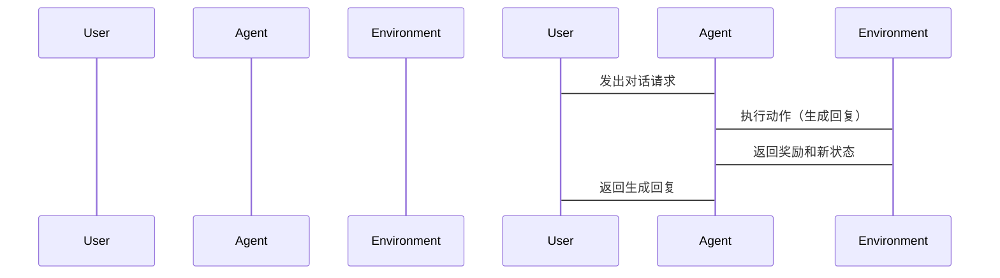

                 


# 强化学习在AI Agent对话生成中的应用

## 关键词：强化学习，AI Agent，对话生成，自然语言处理，机器学习

## 摘要：  
本文详细探讨了强化学习在AI Agent对话生成中的应用，分析了强化学习的核心概念、算法原理以及在对话生成中的具体实现。通过系统设计、项目实战和案例分析，展示了如何利用强化学习提升对话生成的质量和交互体验。文章还讨论了实际应用中的挑战与解决方案，并展望了未来的研究方向。

---

## 第1章：强化学习与AI Agent对话生成概述

### 1.1 强化学习的基本概念  
强化学习（Reinforcement Learning，RL）是一种机器学习范式，通过智能体与环境的交互，逐步学习最优策略以最大化累计奖励。其核心在于通过试错机制，智能体在环境中采取动作，根据反馈的奖励信号调整行为，最终达到目标。

### 1.2 AI Agent的基本概念  
AI Agent（智能体）是指能够感知环境、做出决策并执行动作的实体。在对话生成中，AI Agent负责理解和生成对话内容，通常需要具备自然语言处理能力，能够理解用户输入并生成符合语境的回复。

### 1.3 对话生成的背景与挑战  
对话生成是自然语言处理中的重要任务，旨在使计算机能够生成自然且有意义的对话。传统的基于规则或统计的方法存在局限性，而强化学习通过与环境的交互，能够动态优化生成策略，显著提升了对话质量。

---

## 第2章：强化学习的核心概念与原理

### 2.1 强化学习的核心概念  
- **状态（State）**：环境中的当前情况，如对话历史或上下文。  
- **动作（Action）**：智能体在状态下的行为选择，如生成一句话。  
- **奖励（Reward）**：环境对智能体动作的反馈，用于评估行为的好坏。  

### 2.2 强化学习的算法原理  
- **Q-Learning算法**：通过Q值表记录状态-动作对的期望奖励，更新公式为：  
  $$ Q(s, a) \leftarrow Q(s, a) + \alpha \left[r + \gamma \max Q(s', a') - Q(s, a)\right] $$  
- **Deep Q-Networks（DQN）**：使用深度神经网络近似Q值函数，通过经验回放和目标网络优化。  
- **Actor-Critic方法**：同时学习策略（Actor）和价值函数（Critic），策略网络负责生成动作，价值网络评估状态动作对的价值。  

---

## 第3章：对话生成中的强化学习模型

### 3.1 对话生成的基本模型  
- **基于规则的对话生成**：依赖预定义的规则，生成方式固定，难以应对复杂对话。  
- **基于统计的对话生成**：如n-gram模型，依赖历史数据，生成结果缺乏灵活性。  
- **基于深度学习的对话生成**：如Seq2Seq模型，生成结果更自然，但缺乏对生成质量的优化。  

### 3.2 强化学习在对话生成中的应用  
- **基于策略梯度的方法**：直接优化策略，生成高质量回复。  
- **基于Q-Learning的方法**：通过状态-动作-奖励机制，优化回复策略。  
- **端到端强化学习模型**：将对话生成视为马尔可夫决策过程，直接训练策略网络。  

---

## 第4章：系统设计与实现

### 4.1 系统架构设计  
- **模块划分**：包括状态感知模块、策略网络、奖励评估模块和动作执行模块。  
- **数据流设计**：从输入到输出，包括对话历史、生成回复和奖励反馈。  

### 4.2 系统交互流程图  


---

## 第5章：项目实战

### 5.1 环境搭建  
- **工具安装**：安装Python、TensorFlow、Keras等。  
- **数据准备**：收集对话数据并预处理。  

### 5.2 核心代码实现  
```python
class DQN:
    def __init__(self, state_space, action_space, gamma=0.99, epsilon=1.0):
        self.state_space = state_space
        self.action_space = action_space
        self.gamma = gamma
        self.epsilon = epsilon
        self.memory = []
        # 策略网络和目标网络
        self.model = self.build_model()
        self.target_model = self.build_model()

    def build_model(self):
        model = Sequential()
        model.add(Dense(64, activation='relu', input_dim=self.state_space))
        model.add(Dense(self.action_space, activation='linear'))
        model.compile(optimizer='adam', loss='mse')
        return model

    def remember(self, state, action, reward, next_state):
        self.memory.append((state, action, reward, next_state))

    def act(self, state):
        if random.random() < self.epsilon:
            return random.randint(0, self.action_space - 1)
        return self.model.predict(state)[0].argmax()

    def replay(self, batch_size):
        if len(self.memory) < batch_size:
            return
        minibatch = random.sample(self.memory, batch_size)
        states = np.array([t[0] for t in minibatch])
        actions = np.array([t[1] for t in minibatch])
        rewards = np.array([t[2] for t in minibatch])
        next_states = np.array([t[3] for t in minibatch])
        
        # 预测当前Q值
        q = self.model.predict(states)
        # 预测目标Q值
        q_next = self.target_model.predict(next_states)
        # 更新Q值
        q[range(batch_size), actions] = rewards + self.gamma * (q_next.max(axis=1))
        self.model.fit(states, q, epochs=1, verbose=0)
```

---

## 第6章：挑战与解决方案

### 6.1 数据稀疏性问题  
- **解决方案**：引入数据增强技术和迁移学习，利用外部数据提升模型泛化能力。  

### 6.2 计算资源需求  
- **解决方案**：优化算法复杂度，使用分布式计算和云服务加速训练。  

---

## 第7章：总结与展望

### 7.1 总结  
强化学习在AI Agent对话生成中的应用显著提升了对话质量，通过动态优化生成策略，使对话更加自然和智能。  

### 7.2 未来展望  
未来的研究方向包括多轮对话优化、情感理解和多模态对话生成，进一步提升AI Agent的交互能力。

---

## 作者：AI天才研究院（AI Genius Institute）  
联系邮箱：contact@aigeniusinstitute.com

