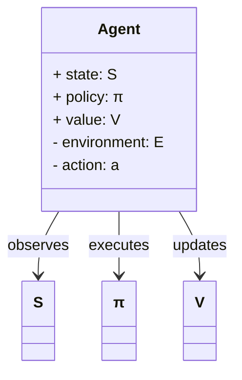

                 

<think>
好，我现在需要撰写一篇关于《强化学习在AI Agent开发中的应用》的技术博客。用户希望内容深入、结构清晰，涵盖从基础到高级的各个方面。首先，我得理解用户的需求：他们需要一个详细的目录结构，每章内容丰富，包含背景、算法、系统设计、项目实战和高级主题。

我应该从背景开始，介绍强化学习和AI Agent的基本概念。接下来，详细讲解核心算法，比如Q-Learning和Actor-Critic。然后，讨论AI Agent的设计与实现，包括系统架构和开发流程。之后，涉及系统集成与测试，确保稳定性。再通过项目实战，比如智能客服系统，展示实际应用。最后，探讨高级主题，如多智能体协作和持续学习，展望未来发展。

在撰写过程中，我需要确保每一章都有足够的细节，包括背景、原理、算法、系统设计和项目案例。同时，使用图表和数学公式来辅助理解。考虑到读者的背景，他们可能有一定的编程基础，但可能对强化学习的高级概念不太熟悉，因此内容需要平衡理论与实践，既有深入的算法讲解，又有实际的项目案例。

我还需要确保文章结构清晰，逻辑连贯，每章之间有自然的过渡，帮助读者逐步掌握强化学习在AI Agent开发中的应用。最后，总结全书，回顾知识点，并给出未来的发展方向和学习建议，以巩固读者的所学。
</think>

# 强化学习在AI Agent开发中的应用

---

## 关键词：强化学习，AI Agent，算法原理，系统设计，项目实战

---

## 摘要：  
强化学习作为一种基于试错的机器学习方法，在AI Agent开发中具有重要应用价值。本文深入探讨强化学习的核心算法、AI Agent的设计与实现、系统集成与测试、项目实战以及高级主题，帮助读者全面掌握强化学习在AI Agent开发中的应用。本文结合实际案例，通过详细的算法原理、系统架构设计和代码实现，为读者提供从理论到实践的完整指南。

---

# 第一部分：强化学习与AI Agent开发基础

## 第1章：强化学习与AI Agent概述

### 1.1 强化学习的基本概念

#### 1.1.1 强化学习的定义  
强化学习（Reinforcement Learning，简称RL）是一种基于试错的机器学习方法。学习 agent 通过与环境交互，学习采取最优动作以最大化累计奖励。  

#### 1.1.2 AI Agent的定义与特点  
AI Agent（人工智能代理）是能够感知环境、自主决策并执行任务的智能体。其特点包括自主性、反应性、目标导向性和社交能力。  

#### 1.1.3 强化学习在AI Agent中的作用  
强化学习为AI Agent提供了决策策略优化的方法，使其能够在动态环境中自主学习和适应。  

---

### 1.2 强化学习的核心概念  

#### 1.2.1 状态、动作、奖励的定义  
- **状态（State）**：环境在某一时刻的描述，如棋盘上的棋子位置。  
- **动作（Action）**：Agent在给定状态下采取的行为，如移动棋子。  
- **奖励（Reward）**：Agent采取动作后获得的反馈，用于评估动作的好坏。  

#### 1.2.2 策略与价值函数的关系  
- **策略（Policy）**：决定Agent在每个状态下采取的动作的概率分布。  
- **价值函数（Value Function）**：评估某状态下采取某个动作的长期收益。  

#### 1.2.3 探索与利用的平衡  
强化学习中，Agent需要在探索新动作和利用已知最优动作之间找到平衡，以避免陷入局部最优。  

---

### 1.3 强化学习的应用场景  

#### 1.3.1 游戏AI开发  
强化学习常用于游戏AI的开发，如AlphaGo和OpenAI的Dota AI。  

#### 1.3.2 机器人控制  
强化学习可以用于机器人导航、抓取和操作任务。  

#### 1.3.3 自动驾驶  
强化学习在自动驾驶中的路径规划和决策控制中具有重要应用。  

---

## 第2章：强化学习的核心算法原理  

### 2.1 Q-Learning算法  

#### 2.1.1 Q-Learning的基本原理  
Q-Learning是一种基于价值函数的强化学习算法，通过更新Q表（Q-Table）来存储每个状态下每个动作的期望奖励。  

#### 2.1.2 Q-Learning的数学模型  
状态-动作值函数的更新公式为：  
$$ Q(s, a) \leftarrow Q(s, a) + \alpha [r + \gamma \max Q(s', a') - Q(s, a)] $$  

#### 2.1.3 Q-Learning的优缺点  
- **优点**：简单易实现。  
- **缺点**：当状态空间较大时，Q表的存储和更新效率较低。  

---

### 2.2 Deep Q-Learning算法  

#### 2.2.1 Deep Q-Learning的基本原理  
Deep Q-Learning将Q-Learning与深度神经网络结合，通过神经网络近似Q值函数。  

#### 2.2.2 Deep Q-Learning的数学模型  
神经网络的损失函数为：  
$$ L = \mathbb{E}_{(s, a, r, s')} \left[ (r + \gamma Q(s', \pi(s')) - Q(s, a))^2 \right] $$  

#### 2.2.3 Deep Q-Learning的实现步骤  
1. 环境初始化。  
2. 采集经验并存储在经验回放池中。  
3. 随机抽取小批量经验训练神经网络。  
4. 根据策略网络选择动作。  

---

### 2.3 Actor-Critic算法  

#### 2.3.1 Actor-Critic的基本原理  
Actor-Critic算法同时学习策略（Actor）和价值函数（Critic），通过策略梯度方法优化策略。  

#### 2.3.2 Actor-Critic的数学模型  
策略梯度更新公式为：  
$$ \theta \leftarrow \theta + \alpha \nabla_\theta J(\theta) $$  

#### 2.3.3 Actor-Critic的优缺点  
- **优点**：同时优化策略和价值函数，收敛性较好。  
- **缺点**：实现复杂度较高。  

---

## 第3章：强化学习的数学模型与公式  

### 3.1 状态值函数  

#### 3.1.1 状态值函数的定义  
状态值函数$V(s)$表示在状态$s$下，按照当前策略继续行动的期望累积奖励。  

#### 3.1.2 状态值函数的公式推导  
贝尔曼方程为：  
$$ V(s) = \max_a \left[ r + \gamma V(s') \right] $$  

---

### 3.2 动作值函数  

#### 3.2.1 动作值函数的定义  
动作值函数$Q(s, a)$表示在状态$s$下采取动作$a$的期望累积奖励。  

#### 3.2.2 动作值函数的公式推导  
贝尔曼方程为：  
$$ Q(s, a) = r + \gamma \max_{a'} Q(s', a') $$  

---

### 3.3 策略函数  

#### 3.3.1 策略函数的定义  
策略函数$\pi(a|s)$表示在状态$s$下采取动作$a$的概率。  

#### 3.3.2 策略函数的优化目标  
最大化的期望累积奖励：  
$$ \max_{\pi} \mathbb{E}[R | \pi] $$  

---

## 第4章：AI Agent的设计与实现  

### 4.1 AI Agent的需求分析  

#### 4.1.1 功能需求  
- 环境感知。  
- 动作选择。  
- 状态更新。  

#### 4.1.2 性能需求  
- 响应时间。  
- 决策精度。  

---

### 4.2 AI Agent的系统架构设计  

#### 4.2.1 领域模型设计  
使用Mermaid类图描述AI Agent的组件及其关系：  



---

### 4.3 AI Agent的开发流程  

#### 4.3.1 环境搭建  
- 安装必要的库：如TensorFlow、Keras、OpenAI Gym。  

#### 4.3.2 模型训练  
- 编写训练循环，更新策略和价值函数。  

#### 4.3.3 模型部署  
- 将训练好的模型部署到目标环境中。  

---

## 第5章：系统集成与测试  

### 5.1 测试策略  

#### 5.1.1 单元测试  
- 测试单个组件的功能是否正常。  

#### 5.1.2 集成测试  
- 测试系统各组件的协同工作。  

---

### 5.2 调试技巧  

#### 5.2.1 日志记录  
- 记录训练过程中的损失值和奖励值。  

#### 5.2.2 可视化工具  
- 使用TensorBoard监控训练过程。  

---

### 5.3 性能优化  

#### 5.3.1 并行计算  
- 使用多线程或分布式训练加速。  

#### 5.3.2 模型压缩  
- 使用模型剪枝和知识蒸馏技术减少模型大小。  

---

## 第6章：项目实战——智能客服系统  

### 6.1 环境搭建  

#### 6.1.1 安装依赖  
- Python 3.8+  
- TensorFlow 2.5+  
- OpenAI Gym  

---

### 6.2 系统核心实现  

#### 6.2.1 状态空间定义  
```python
class State:
    def __init__(self, customer_emotion, issue_category):
        self.customer_emotion = customer_emotion
        self.issue_category = issue_category
```

#### 6.2.2 动作空间定义  
```python
class Action:
    def __init__(self, response_type):
        self.response_type = response_type
```

---

### 6.3 代码实现  

#### 6.3.1 训练循环  
```python
def train(agent, env, num_episodes=1000):
    for episode in range(num_episodes):
        state = env.reset()
        while not done:
            action = agent.act(state)
            next_state, reward, done = env.step(action)
            agent.remember(state, action, reward, next_state)
            agent.replay()
            state = next_state
```

---

### 6.4 实际案例分析  

#### 6.4.1 案例描述  
智能客服系统通过强化学习优化对话流程，提升客户满意度。  

#### 6.4.2 代码应用解读  
- 状态表示客户情绪和问题类别。  
- 动作表示客服的回应类型。  
- 奖励基于客户反馈生成。  

---

## 第7章：高级主题与未来发展  

### 7.1 多智能体协作  

#### 7.1.1 多智能体强化学习的挑战  
- 协作与竞争关系的建模。  
- 去中心化算法的设计。  

---

### 7.2 持续学习  

#### 7.2.1 持续学习的定义  
- AI Agent能够不断适应新任务和环境变化。  

#### 7.2.2 持续学习的应用  
- 在动态环境中部署AI Agent。  

---

## 第8章：总结与展望  

### 8.1 本章总结  
强化学习为AI Agent开发提供了强大的决策能力，通过不断优化策略和价值函数，AI Agent能够适应复杂动态环境。  

### 8.2 未来展望  
随着算法的改进和计算能力的提升，强化学习将在更多领域实现更广泛的应用，如元学习和人机协作。  

---

## 作者：AI天才研究院 & 禅与计算机程序设计艺术

---

> **本文由AI天才研究院（AI Genius Institute）与“禅与计算机程序设计艺术”联合出品，转载请注明出处。**

