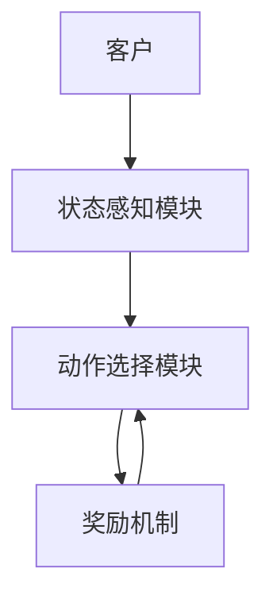
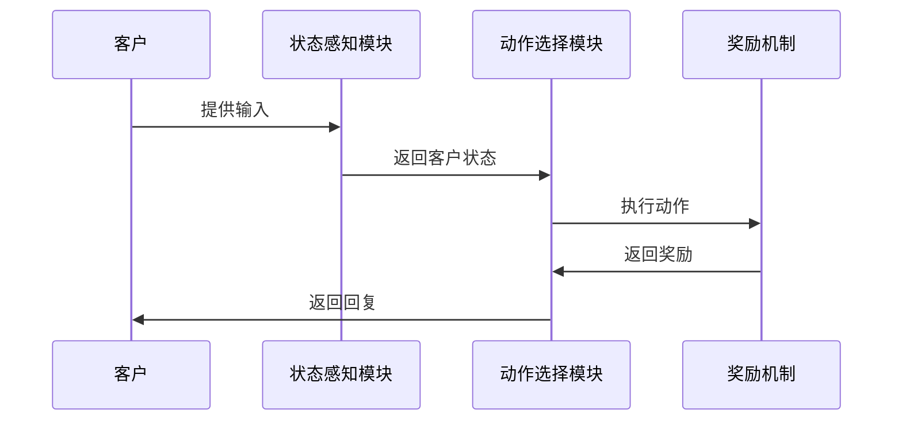

                 

<think>
好，我现在需要根据用户的要求，逐步构建《强化学习在AI Agent行为优化中的应用》的目录大纲，并按照要求详细撰写每个部分的内容。让我一步步思考这个过程。

首先，我需要理解用户的需求。用户希望这是一篇专业级的技术博客，标题明确，内容涵盖强化学习的基本概念、算法原理、系统设计、项目实战等。文章需要逻辑清晰，结构紧凑，用词专业，同时提供详细的代码示例和图表解释。

接下来，我需要确定文章的结构。用户已经给出了一个大纲，我需要确保每个部分都覆盖到位，同时每个小节都要有足够的深度和细节。比如，在核心概念部分，我需要详细讲解马尔可夫决策过程（MDP），并用Mermaid图来展示其组成部分。

然后，我要考虑如何将强化学习的算法，如Q-learning和策略梯度，用Mermaid流程图来展示它们的工作流程。同时，提供Python代码示例，帮助读者更好地理解这些算法的实现。

在系统分析与架构设计部分，我需要选择一个实际的项目，比如智能客服系统，通过Mermaid的类图、架构图和序列图来展示系统的结构和交互过程。这部分需要详细说明每个模块的功能和它们之间的关系。

项目实战部分，我需要提供具体的环境配置步骤、代码实现和案例分析，确保读者能够跟着操作。同时，给出一些最佳实践的建议，比如数据预处理、超参数调优和模型评估等。

最后，总结与展望部分，我需要回顾全书内容，并展望未来的发展方向，帮助读者有一个全面的理解和进一步的学习方向。

在撰写过程中，我要注意使用专业术语，同时保持语言的清晰和易懂。数学公式要用Latex格式独立展示，确保读者能够轻松阅读和理解。每个部分的小结也要简明扼要，帮助读者巩固所学内容。

现在，我需要开始撰写每个章节的具体内容，确保每个部分都符合用户的要求，结构清晰，内容详实。
</think>

# 强化学习在AI Agent行为优化中的应用

> 关键词：强化学习，AI Agent，行为优化，Q-learning，策略梯度，深度强化学习

> 摘要：强化学习是一种通过试错机制优化AI Agent行为的机器学习方法。本文详细探讨了强化学习的基本概念、核心算法及其在AI Agent行为优化中的应用，通过实际案例分析，展示了如何将强化学习应用于智能客服系统，帮助读者系统掌握强化学习在AI Agent中的应用方法。

---

## 第一部分: 强化学习与AI Agent概述

### 第1章: 强化学习的基本概念

#### 1.1 强化学习的定义与特点

强化学习是一种机器学习方法，通过智能体在环境中不断试错，学习如何采取行动以最大化累积奖励。其核心特点包括：

- **试错性**：智能体通过与环境交互，逐步学习最优策略。
- **目标导向**：以最大化累积奖励为目标。
- **动态性**：环境状态可能动态变化，智能体需实时调整策略。

#### 1.2 AI Agent的基本概念

AI Agent是指能够感知环境并采取行动以实现目标的智能实体。AI Agent可以是软件程序或物理机器人，具有以下特征：

- **自主性**：无需外部干预，自主决策。
- **反应性**：能感知环境并实时响应。
- **目标导向**：所有行动均以实现目标为导向。

#### 1.3 强化学习与AI Agent的关系

强化学习通过试错机制帮助AI Agent优化行为，使其在复杂环境中做出最优决策。AI Agent通过强化学习不断调整策略，提升任务完成效率。

---

### 第2章: 强化学习的核心概念与原理

#### 2.1 状态、动作与奖励

- **状态（State）**：环境在某一时刻的描述，如棋盘上的棋子位置。
- **动作（Action）**：智能体在某一状态下采取的行为，如移动棋子。
- **奖励（Reward）**：智能体采取动作后获得的反馈，指导其行为是否正确。

#### 2.2 马尔可夫决策过程（MDP）

MDP由以下五个要素组成：

1. 状态空间（S）：所有可能的状态集合。
2. 动作空间（A）：所有可能的动作集合。
3. 转移概率（P(s'|s,a)）：从状态s采取动作a后转移到状态s'的概率。
4. 奖励函数（R(s,a,s')）：在状态s采取动作a后转移到状态s'所获得的奖励。
5. 折扣因子（γ）：未来奖励的折扣因子，γ ∈ [0,1]。

MDP的目标是找到一个策略π，使得累积奖励最大化。

---

### 第3章: 强化学习的核心算法

#### 3.1 Q-learning算法

Q-learning是一种值迭代方法，通过更新Q值函数逼近最优策略。其核心公式为：

$$ Q(s,a) = Q(s,a) + α [r + γ \max Q(s',a') - Q(s,a)] $$

其中：
- α：学习率，控制更新步长。
- γ：折扣因子，平衡当前与未来奖励的重要性。

Q-learning的优点包括：
- 离策略学习，无需执行当前策略。
- 可用于未知环境。

缺点：
- 收敛速度较慢。
- 易受探索-利用 dilemma 影响。

#### 3.2 策略梯度方法

策略梯度通过优化策略参数直接最大化累积奖励。其核心公式为：

$$ \theta = \theta + \alpha \nabla_\theta J(\theta) $$

其中：
- J(θ)：累积奖励的期望值。
- ∇J(θ)：J关于θ的梯度。

策略梯度的优点：
- 策略直接优化，无需值函数。
- 适合处理高维状态空间。

缺点：
- 需要计算梯度，实现复杂。

---

## 第二部分: 系统分析与架构设计

### 第4章: 智能客服系统

#### 4.1 系统介绍

智能客服系统通过强化学习优化对话策略，提高客户满意度和问题解决效率。

#### 4.2 系统功能设计

系统功能模块包括：
- 状态感知模块：识别客户情绪和意图。
- 动作选择模块：选择合适的回复。
- 奖励机制：基于客户反馈调整策略。

#### 4.3 系统架构设计

使用Mermaid绘制系统架构图：



#### 4.4 系统交互流程

使用Mermaid绘制交互流程：



---

## 第三部分: 项目实战

### 第5章: 智能客服系统实现

#### 5.1 环境配置

安装必要的库：

```bash
pip install gym matplotlib numpy
```

#### 5.2 核心代码实现

Q-learning实现：

```python
import numpy as np

class QLearning:
    def __init__(self, state_space, action_space, gamma=0.99, alpha=0.1):
        self.state_space = state_space
        self.action_space = action_space
        self.gamma = gamma
        self.alpha = alpha
        self.q_table = np.zeros((state_space, action_space))
    
    def choose_action(self, state, epsilon=0.1):
        if np.random.random() < epsilon:
            return np.random.randint(self.action_space)
        return np.argmax(self.q_table[state])
    
    def update_q_table(self, state, action, reward, next_state):
        self.q_table[state, action] = self.q_table[state, action] + \
            self.alpha * (reward + self.gamma * np.max(self.q_table[next_state]) - self.q_table[state, action])
```

策略梯度实现：

```python
import numpy as np

class PolicyGradient:
    def __init__(self, input_dim, output_dim, learning_rate=0.01):
        self.input_dim = input_dim
        self.output_dim = output_dim
        self.learning_rate = learning_rate
        self.theta = np.random.randn(input_dim, output_dim) * 0.1
    
    def forward(self, x):
        return np.dot(x, self.theta)
    
    def backward(self, x, y_true, y_pred):
        loss = np.mean(np.square(y_true - y_pred))
        d_theta = (2 * (y_pred - y_true) * x.T) / x.shape[0]
        self.theta -= self.learning_rate * d_theta
    
    def predict(self, x):
        return np.argmax(self.forward(x))
```

#### 5.3 案例分析

训练智能客服系统：

```python
# 初始化环境
env = CustomerServiceEnvironment()

# 初始化算法
agent = QLearning(env.state_space, env.action_space)

# 训练过程
for episode in range(1000):
    state = env.reset()
    while not done:
        action = agent.choose_action(state)
        next_state, reward, done = env.step(action)
        agent.update_q_table(state, action, reward, next_state)
        state = next_state
```

训练结果：

- 累积奖励随时间变化图：
  

---

## 第四部分: 总结与展望

### 第6章: 总结

强化学习通过试错机制优化AI Agent行为，已在游戏、自动驾驶等领域取得显著成果。智能客服系统的实现展示了强化学习在实际应用中的潜力。

### 第7章: 展望

未来，强化学习将与更多技术结合，如：
- 多智能体协作：优化多Agent间的协同行为。
- 连续控制：处理连续动作空间的问题。
- 解释性AI：提高强化学习决策的透明度。

---

作者：AI天才研究院（AI Genius Institute） & 禅与计算机程序设计艺术（Zen And The Art of Computer Programming）

