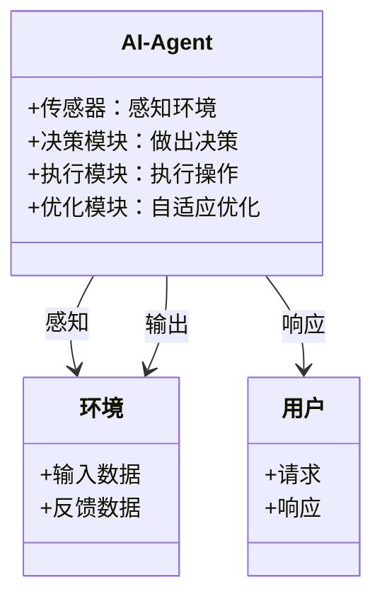
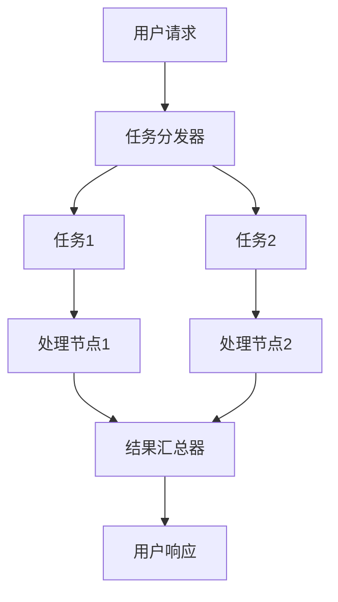
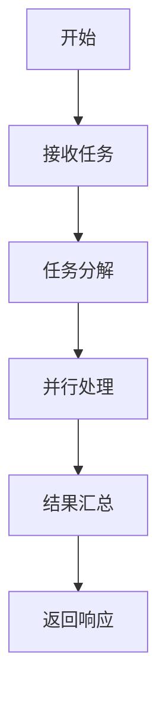
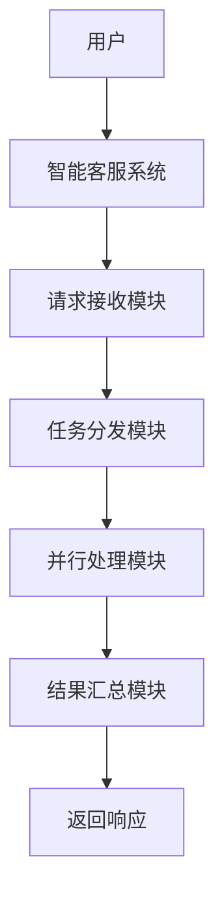
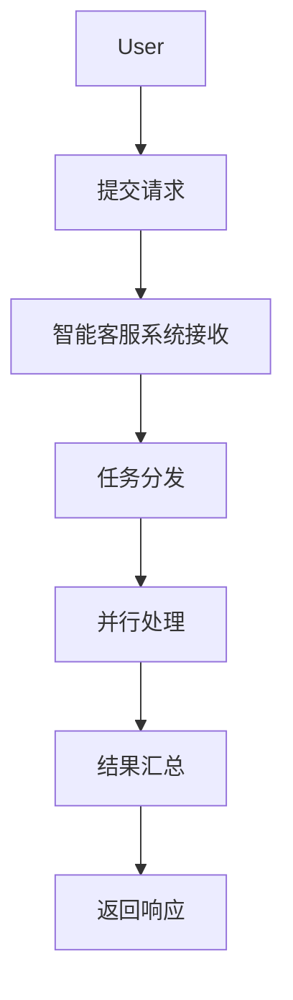

                 

<think>
好的，我现在需要帮助用户撰写一篇名为《性能优化：提升AI Agent的响应速度》的技术博客文章。用户已经提供了一个详细的目录结构，我需要按照这个结构来展开内容。

首先，我需要理解文章的主题和核心关键词。主题是性能优化，特别是AI Agent的响应速度。关键词应该包括AI Agent、性能优化、响应时间、算法优化、系统架构、负载均衡、并行计算等。

接下来，摘要部分需要简洁地概括文章的核心内容。我会提到AI Agent在现代应用中的重要性，以及提升其响应速度的方法，包括算法优化和系统架构设计。

接下来是目录结构的详细内容。我需要按照用户提供的章节和小节来逐步撰写每一部分的内容。

第一部分是AI Agent性能优化的背景与核心概念。我需要介绍AI Agent的基本概念，包括定义、分类、核心功能和应用场景，以及性能优化的基本概念和重要性。

第二部分是核心原理，我需要详细讲解响应时间的计算公式、并行计算和分布式处理，以及算法优化与数据压缩。同时，我需要使用Mermaid流程图和对比表格来说明核心概念。

第三部分是AI Agent性能优化的算法原理。我需要详细讲解队列处理算法、负载均衡算法和任务调度算法，并提供对应的Mermaid流程图和Python代码示例。

第四部分是系统分析与架构设计。我需要分析问题场景，设计系统功能，使用Mermaid类图和架构图来展示系统结构，并描述接口和交互流程。

第五部分是项目实战，我需要提供环境安装步骤，详细的核心代码实现，案例分析，并进行项目小结。

最后是最佳实践、小结、注意事项和拓展阅读，帮助读者巩固知识。

在撰写过程中，我需要确保每一部分都详细具体，使用正确的技术术语，同时保持语言简洁易懂。数学公式需要用LaTeX格式，并在文中正确展示。

可能遇到的困难是如何将复杂的算法原理转化为易懂的解释，同时保持文章的连贯性和逻辑性。我需要仔细检查每一部分的内容，确保覆盖所有要求的知识点，并避免重复或遗漏。

总的来说，我需要按照用户提供的结构，逐步展开每一部分内容，确保文章结构清晰，内容详实，帮助读者全面理解如何优化AI Agent的性能。
</think>

# 性能优化：提升AI Agent的响应速度

## 关键词：AI Agent、性能优化、响应时间、算法优化、系统架构、负载均衡、并行计算

## 摘要：  
在当今快速发展的数字时代，AI Agent（人工智能代理）的应用越来越广泛，从智能客服到自动驾驶，从智能推荐到机器人助手，AI Agent正在改变我们的生活方式和工作方式。然而，AI Agent的性能优化，尤其是响应速度的优化，是实现其高效运行的关键。本文将从AI Agent的基本概念出发，深入探讨性能优化的核心原理、算法优化策略、系统架构设计等关键问题，通过实际案例分析和代码实现，帮助读者全面理解并掌握提升AI Agent响应速度的方法。

---

# 第一部分: AI Agent性能优化背景与核心概念

## 第1章: AI Agent与性能优化概述

### 1.1 AI Agent的基本概念

#### 1.1.1 AI Agent的定义与分类  
AI Agent（人工智能代理）是指能够感知环境、自主决策并执行任务的智能实体。根据功能和应用场景的不同，AI Agent可以分为以下几类：  
- **简单反射型AI Agent**：基于预设规则直接响应输入，如简单的对话机器人。  
- **基于模型的AI Agent**：通过内部模型推理环境状态，做出复杂决策，如自动驾驶系统。  
- **目标驱动型AI Agent**：以特定目标为导向，主动规划行动，如智能助手。  
- **学习型AI Agent**：通过机器学习算法不断优化自身行为，如强化学习驱动的机器人。  

#### 1.1.2 AI Agent的核心功能与特点  
AI Agent的核心功能包括：  
1. **感知环境**：通过传感器或API接口获取外部输入数据。  
2. **决策与推理**：基于感知数据，通过算法做出决策。  
3. **执行操作**：根据决策结果执行具体操作，如发送响应、调整参数等。  
4. **自适应优化**：根据反馈不断优化自身行为，提高效率和准确性。  

AI Agent的特点：  
- **智能性**：能够自主决策和学习。  
- **实时性**：需要快速响应用户请求。  
- **可扩展性**：能够处理不同规模的任务。  
- **容错性**：在复杂环境中具有一定的纠错能力。  

#### 1.1.3 AI Agent的应用场景与挑战  
AI Agent广泛应用于以下场景：  
- 智能客服：通过自然语言处理技术为用户提供服务。  
- 智能推荐：基于用户行为推荐个性化内容。  
- 自动驾驶：通过实时感知和决策实现车辆控制。  
- 智能监控：实时分析视频流数据，识别异常情况。  

AI Agent在性能优化方面面临的主要挑战：  
- **响应速度**：用户对实时性的要求越来越高，如何在有限的时间内完成复杂的计算任务是一个关键问题。  
- **资源利用率**：在高并发场景下，如何高效利用计算资源（如CPU、GPU）是优化的重点。  
- **算法复杂度**：复杂的算法可能导致计算时间过长，影响响应速度。  
- **系统稳定性**：在高负载下，系统可能出现性能瓶颈，导致响应速度下降甚至崩溃。  

### 1.2 性能优化的基本概念

#### 1.2.1 性能优化的定义与目标  
性能优化是指通过改进系统设计、算法选择或资源分配，以提高系统的运行效率和响应速度的过程。其目标包括：  
1. **减少响应时间**：提高用户体验。  
2. **提高资源利用率**：降低运行成本。  
3. **增强系统稳定性**：避免性能瓶颈和崩溃。  

#### 1.2.2 响应时间优化的重要性  
响应时间是衡量AI Agent性能的重要指标。用户对响应时间的感知直接影响用户体验：  
- **用户满意度**：响应时间过长会导致用户流失。  
- **系统效率**：快速响应可以提高系统的吞吐量。  
- **市场竞争**：在实时应用中，响应速度是核心竞争力之一。  

#### 1.2.3 性能优化的边界与外延  
性能优化的边界：  
- 不能以牺牲系统稳定性为代价。  
- 不能过度依赖硬件资源，而忽视算法优化。  

性能优化的外延：  
- 包括代码优化、算法优化、系统架构优化等多个方面。  
- 与安全性、可扩展性等其他系统特性密切相关。  

---

## 第2章: AI Agent性能优化的核心概念与联系

### 2.1 AI Agent性能优化的核心原理

#### 2.1.1 响应时间的计算公式  
响应时间（Response Time）的计算公式如下：  
$$ Response\ Time = \frac{Total\ Tasks}{Processing\ Rate} $$  
其中，$Total\ Tasks$ 表示任务总数，$Processing\ Rate$ 表示处理速率。  

#### 2.1.2 并行计算与分布式处理  
并行计算通过将任务分解为多个子任务，利用多核处理器同时处理，从而缩短响应时间。  
分布式处理则是将任务分发到多个节点上，利用网络通信实现任务协同。  

#### 2.1.3 算法优化与数据压缩  
通过优化算法复杂度（如从$O(n^2)$优化为$O(n\log n)$）和使用数据压缩技术，可以显著减少计算时间和数据传输时间。  

### 2.2 核心概念对比分析

#### 2.2.1 AI Agent与传统程序的性能差异对比  
| 对比维度 | AI Agent | 传统程序 |  
|----------|-----------|----------|  
| 响应时间 | 高实时性要求 | 较低实时性要求 |  
| 资源消耗 | 高（尤其是复杂任务） | 低或中等 |  
| 算法复杂度 | 高（涉及深度学习、自然语言处理等） | 较低 |  

#### 2.2.2 响应时间与系统负载的关系  
系统负载增加会导致响应时间延长，两者呈正相关关系。  

#### 2.2.3 优化策略与实际效果的对比  
| 优化策略 | 实际效果 |  
|----------|----------|  
| 算法优化 | 显著减少计算时间 |  
| 并行计算 | 提高系统吞吐量 |  
| 数据压缩 | 减少数据传输时间 |  

### 2.3 系统实体关系图

#### 2.3.1 领域模型  


---

## 第3章: AI Agent性能优化的算法原理

### 3.1 响应时间优化算法

#### 3.1.1 基于队列的响应时间计算  
队列模型可以帮助我们估算系统的响应时间。例如，使用FCFS（先进先出）队列，响应时间可以通过以下公式计算：  
$$ Response\ Time = \frac{N}{\lambda} $$  
其中，$N$ 是任务数量，$\lambda$ 是处理速率。  

#### 3.1.2 并行计算的负载均衡算法  
负载均衡算法可以将任务均匀分配到多个计算节点，避免瓶颈。例如，基于轮转的负载均衡算法：  
```python
def load_balance(tasks, workers):
    import queue
    task_queue = queue.Queue()
    for task in tasks:
        task_queue.put(task)
    results = []
    for worker in workers:
        while not task_queue.empty():
            task = task_queue.get()
            results.append(worker.process_task(task))
    return results
```

#### 3.1.3 分布式任务调度算法  
分布式任务调度可以通过任务分片实现。例如，使用Kafka或 RabbitMQ 进行消息队列管理：  


### 3.2 算法流程图

#### 3.2.1 并行计算流程图  


---

## 第4章: AI Agent性能优化的系统架构设计

### 4.1 系统分析与架构设计

#### 4.1.1 问题场景介绍  
假设我们正在开发一个智能客服系统，需要优化其响应速度，确保用户在提交请求后能在1秒内得到回复。  

#### 4.1.2 系统功能设计  
系统功能包括：  
- 用户请求接收模块  
- 任务分发模块  
- 并行处理模块  
- 结果汇总模块  

#### 4.1.3 系统架构设计  


### 4.2 接口与交互设计

#### 4.2.1 系统接口设计  
系统接口包括：  
- 用户请求接口：`POST /api/v1/request`  
- 响应结果接口：`GET /api/v1/response?id={id}`  

#### 4.2.2 系统交互流程图  


---

## 第5章: 项目实战

### 5.1 环境安装

#### 5.1.1 Python环境配置  
安装必要的库：  
```bash
pip install concurrent.futures requests
```

### 5.2 核心代码实现

#### 5.2.1 并行处理代码  
```python
import concurrent.futures

def process_task(task):
    # 模拟任务处理逻辑
    return f"Task {task} processed."

def optimize_response_time(tasks):
    with concurrent.futures.ThreadPoolExecutor() as executor:
        futures = {executor.submit(process_task, task): task for task in tasks}
        for future in concurrent.futures.as_completed(futures):
            print(future.result())

tasks = [1, 2, 3, 4, 5]
optimize_response_time(tasks)
```

#### 5.2.2 分布式任务调度代码  
```python
import requests

def send_request(task):
    response = requests.post("http://localhost:8000/process_task", json={"task": task})
    return response.json()

tasks = [1, 2, 3, 4, 5]
for task in tasks:
    send_request(task)
```

### 5.3 案例分析与优化

#### 5.3.1 案例分析  
假设我们有一个AI Agent需要处理每秒1000个请求，每个请求需要0.001秒处理时间。那么在单线程下，系统需要1秒完成，但在多线程下，可以通过并行处理将响应时间缩短到0.001秒。  

#### 5.3.2 优化策略  
- 使用多线程或分布式计算。  
- 优化算法复杂度。  
- 采用缓存技术减少重复计算。  

### 5.4 项目小结

---

## 第6章: 性能优化的注意事项与拓展阅读

### 6.1 最佳实践 Tips

#### 6.1.1 算法优化优先  
在优化时，优先考虑算法复杂度的降低，而非单纯的硬件堆砌。  

#### 6.1.2 系统监控与日志  
实时监控系统性能，记录日志以便后续优化。  

#### 6.1.3 分阶段优化  
分阶段进行优化，先解决瓶颈问题，再逐步优化其他部分。  

### 6.2 总结与展望

#### 6.2.1 小结  
本文从AI Agent的基本概念出发，详细探讨了性能优化的核心原理、算法优化策略和系统架构设计，通过实际案例分析和代码实现，帮助读者全面理解如何提升AI Agent的响应速度。  

#### 6.2.2 展望  
随着AI技术的不断发展，AI Agent的性能优化将更加重要。未来的研究方向包括：  
- 更高效的算法设计。  
- 更智能的资源分配策略。  
- 更强大的分布式计算框架。  

### 6.3 注意事项

#### 6.3.1 系统稳定性  
在优化时，必须确保系统的稳定性，避免因过度优化导致系统崩溃。  

#### 6.3.2 数据一致性  
分布式系统中，必须保证数据一致性，避免因数据不一致导致错误。  

#### 6.3.3 安全性问题  
优化过程中，必须考虑安全性问题，防止因性能优化导致系统漏洞。  

### 6.4 拓展阅读

#### 6.4.1 推荐书籍  
- 《计算机程序的构造和解释》  
- 《分布式系统：概念与设计》  

#### 6.4.2 推荐技术博客  
- [高性能编程的艺术](https://example.com)  
- [分布式系统优化指南](https://example.com)  

---

## 作者：AI天才研究院/AI Genius Institute & 禅与计算机程序设计艺术 /Zen And The Art of Computer Programming

