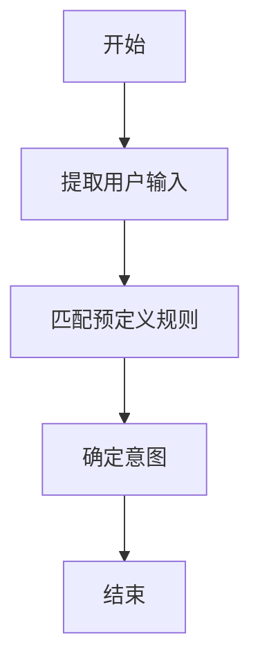
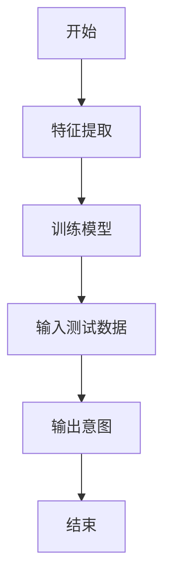
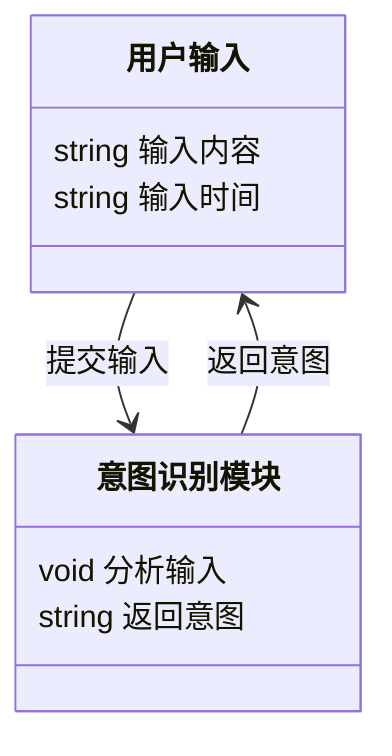
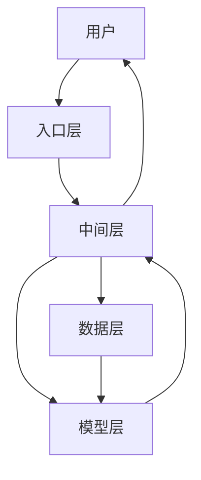
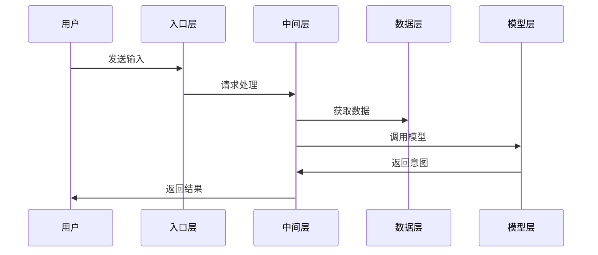

                 


# 意图识别：准确把握用户需求的关键

> 关键词：意图识别、自然语言处理、机器学习、用户需求、深度学习、算法原理、系统架构

> 摘要：意图识别是自然语言处理中的关键任务，旨在准确理解用户的意图。本文从意图识别的核心概念出发，详细分析其算法原理、系统架构设计，并通过实际案例展示其应用。通过本文，读者可以全面理解意图识别的关键技术及其实际应用。

---

# 第一部分: 意图识别概述

## 第1章: 意图识别的核心概念

### 1.1 意图识别的背景与问题背景

#### 1.1.1 自然语言处理与意图识别
自然语言处理（NLP）是人工智能领域的重要分支，旨在让计算机能够理解、处理和生成人类语言。意图识别作为NLP的核心任务之一，专注于从用户输入中提取隐含的意图或目标。例如，当用户输入“我想听周杰伦的歌”，意图识别系统需要准确识别出用户的意图是“播放音乐”。

#### 1.1.2 意图识别的定义与问题描述
意图识别（Intention Recognition）是指通过分析用户输入（文本、语音等）来确定用户的意图或目标的过程。意图识别的目标是将用户输入映射到预定义的意图类别上，例如：

- 查询信息（如天气、新闻）
- 发出指令（如播放音乐、设置闹钟）
- 进行对话（如闲聊、问答）

意图识别的核心问题在于如何准确理解用户的输入，并将其映射到正确的意图类别上。这需要结合语言学知识、统计方法和机器学习技术。

#### 1.1.3 意图识别的核心目标与边界
意图识别的核心目标是通过分析用户输入，生成准确的意图表示。其边界包括：

- 输入形式：文本、语音等
- 输出形式：意图类别或意图标签
- 应用场景：智能客服、语音助手、搜索引擎等

#### 1.1.4 意图识别的外延与应用场景
意图识别的外延包括：

- 情感分析：分析用户情绪
- 实体识别：提取关键信息（如时间、地点）
- 对话系统：基于意图生成回复

应用场景包括：

- 智能客服：自动理解用户需求
- 语音助手：如Siri、Alexa
- 智能家居：控制设备

### 1.2 意图识别的核心要素与概念结构

#### 1.2.1 意图识别的核心要素
意图识别涉及以下核心要素：

- **输入数据**：用户输入（文本、语音等）
- **意图类别**：预定义的意图标签
- **特征提取**：从输入数据中提取特征
- **模型训练**：基于特征训练意图识别模型
- **意图预测**：模型对输入数据进行意图分类

#### 1.2.2 意图识别的概念属性特征对比

| 概念         | 特征                       |
|--------------|----------------------------|
| 输入数据     | 文本、语音、图像等          |
| 意图类别     | 查询、指令、对话等          |
| 特征提取     | 词袋模型、TF-IDF、词嵌入等  |
| 模型训练     | 朴素贝叶斯、SVM、神经网络等 |
| 意图预测     | 分类任务                   |

#### 1.2.3 意图识别的ER实体关系图架构

```mermaid
erDiagram
    actor 用户 {
        key string 用户ID
        string 用户输入
    }
    intent 意图 {
        key string 意图ID
        string 意图名称
    }
    用户 --> 意图 : 提出
    意图 --> 系统响应 : 触发
```

---

## 第2章: 意图识别的算法原理

### 2.1 意图识别的主要算法

#### 2.1.1 基于规则的意图识别算法
基于规则的意图识别通过预定义的规则来匹配用户输入，常见于简单的场景。

- **规则匹配**：例如，用户输入“我要听音乐”，匹配关键词“音乐”，识别意图“播放音乐”。

#### 2.1.2 统计学习的意图识别算法
统计学习方法通过训练数据学习意图分类模型，常见于复杂场景。

- **特征提取**：TF-IDF、词袋模型
- **模型训练**：朴素贝叶斯、SVM

#### 2.1.3 深度学习的意图识别算法
深度学习方法通过端到端模型直接学习意图表示，常见于复杂场景。

- **模型选择**：卷积神经网络（CNN）、循环神经网络（RNN）
- **训练数据**：大量标注数据

### 2.2 意图识别的算法流程

#### 2.2.1 基于规则的意图识别流程



#### 2.2.2 统计学习的意图识别流程



### 2.3 意图识别算法的数学模型

#### 2.3.1 概率模型

$$ P(y|x) = \frac{P(x|y)P(y)}{P(x)} $$

其中：
- \( P(y|x) \) 是在输入 \( x \) 下意图 \( y \) 的概率
- \( P(x|y) \) 是在意图 \( y \) 下输入 \( x \) 的概率
- \( P(y) \) 是意图 \( y \) 的先验概率
- \( P(x) \) 是输入 \( x \) 的全概率

#### 2.3.2 向量空间模型

$$ \text{similarity} = \frac{\vec{x} \cdot \vec{y}}{|\vec{x}| |\vec{y}|} $$

其中：
- \( \vec{x} \) 和 \( \vec{y} \) 是输入向量和意图向量

---

## 第3章: 意图识别的系统分析与架构设计

### 3.1 问题场景介绍

#### 3.1.1 某智能客服系统的意图识别模块

- **目标**：准确识别用户意图，提供智能回复
- **需求**：支持多种输入形式（文本、语音）

### 3.2 系统功能设计

#### 3.2.1 领域模型



### 3.3 系统架构设计

#### 3.3.1 系统架构图



### 3.4 系统接口设计

#### 3.4.1 HTTP接口

- **输入接口**：`POST /intent/input`
- **输出接口**：`GET /intent/output`

#### 3.5 系统交互流程



---

## 第4章: 项目实战

### 4.1 环境安装

```bash
pip install numpy scikit-learn
```

### 4.2 核心实现

```python
from sklearn.feature_extraction.text import TfidfVectorizer
from sklearn.naive_bayes import MultinomialNB

# 数据预处理
corpus = ["我要听音乐", "给我讲个笑话", "今天天气怎么样"]
labels = ["播放音乐", "讲笑话", "查询天气"]

# 特征提取
vectorizer = TfidfVectorizer()
X = vectorizer.fit_transform(corpus)

# 模型训练
model = MultinomialNB()
model.fit(X, labels)

# 预测意图
new_input = ["我要听周杰伦的歌"]
new_X = vectorizer.transform(new_input)
predicted_intent = model.predict(new_X)
print(predicted_intent)
```

### 4.3 案例分析

- **输入**：用户输入“我要听周杰伦的歌”
- **处理步骤**：
  1. 特征提取：提取关键词“周杰伦”、“歌”
  2. 模型预测：分类为“播放音乐”
- **结果**：系统触发播放音乐功能

### 4.4 总结

意图识别项目的关键步骤包括：

1. 数据预处理
2. 特征提取
3. 模型训练
4. 意图预测

---

## 第5章: 总结与展望

### 5.1 总结

意图识别是自然语言处理中的关键任务，通过结合语言学知识、统计方法和深度学习技术，可以准确理解用户需求。本文从核心概念、算法原理、系统架构到项目实战，全面介绍了意图识别的技术细节。

### 5.2 展望

未来，意图识别将朝着以下方向发展：

1. **多模态意图识别**：结合视觉、语音等多种输入形式
2. **边缘计算**：在端侧进行意图识别，降低传输成本
3. **动态意图识别**：适应用户意图的变化

---

# 作者：AI天才研究院/AI Genius Institute & 禅与计算机程序设计艺术 /Zen And The Art of Computer Programming

---

通过以上结构，您可以根据实际需求对各部分内容进行扩展和补充，确保文章内容完整、逻辑清晰。

