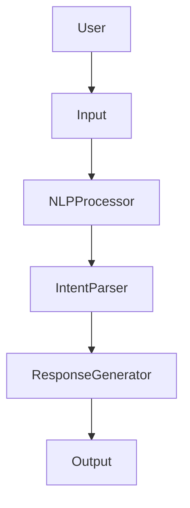
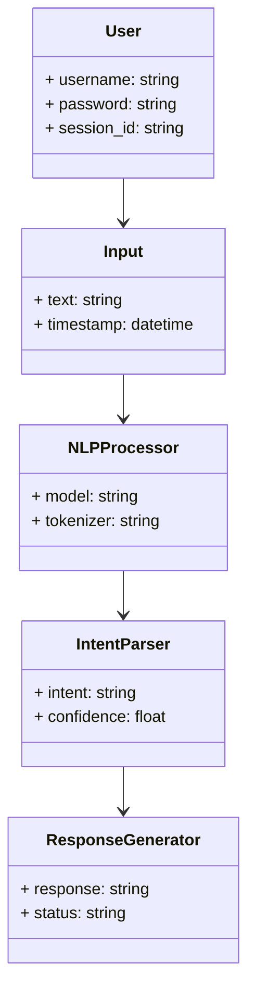
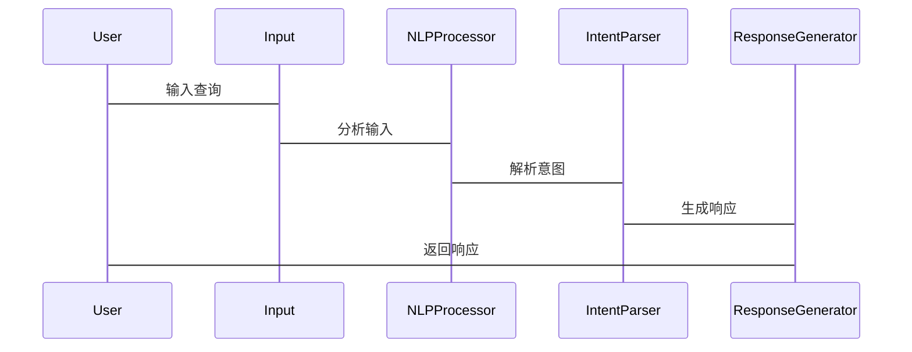

                 

<think>
好的，我将按照您的要求逐步构建《打造用户友好的AI Agent交互界面》的技术博客文章。我们从背景介绍开始，逐步深入到核心概念、算法原理、系统架构、项目实战以及最佳实践。

### 第一部分: 打造用户友好的AI Agent交互界面背景介绍

#### 第1章: AI Agent交互界面的核心概念

##### 1.1 AI Agent的基本概念

###### 1.1.1 AI Agent的定义与特点
- **定义**：AI Agent（人工智能代理）是一种能够感知环境并采取行动以实现目标的智能实体。它可以是一个软件程序，也可以是嵌入在物理设备中的智能系统。
- **特点**：
  - **自主性**：能够在没有外部干预的情况下自主运行。
  - **反应性**：能够根据环境的变化调整自己的行为。
  - **目标导向**：所有行动都以实现特定目标为导向。
  - **学习能力**：能够通过经验改进自己的性能。

##### 1.2 AI Agent交互界面的背景与现状

###### 1.2.1 交互界面设计的重要性
- **用户体验的核心地位**：交互界面是用户与AI Agent之间沟通的桥梁，直接影响用户的使用体验和满意度。
- **AI Agent交互界面的独特挑战**：
  - **复杂性**：AI Agent需要处理的任务往往涉及多个领域和复杂的数据。
  - **实时性**：用户期望AI Agent能够实时响应，这对界面的设计和后端处理提出了更高的要求。
  - **易用性**：界面需要简洁直观，使用户能够轻松完成操作。

##### 1.3 用户友好的AI Agent交互界面的设计原则

###### 1.3.1 以用户为中心的设计理念
- **用户需求分析**：在设计交互界面之前，必须深入了解用户的需求和期望。这包括用户的目标、任务、痛点以及他们如何与系统互动。
- **用户心理模型与界面设计**：界面设计应尽量贴近用户的心理模型，使用户能够快速理解和掌握如何与AI Agent互动。

---

#### 第2章: AI Agent交互界面的核心要素与系统架构

##### 2.1 AI Agent交互界面的核心要素

###### 2.1.1 自然语言处理（NLP）在交互中的应用
- **NLP技术的基本原理**：自然语言处理技术使得AI Agent能够理解和生成人类语言。这包括分词、语法分析、情感分析、实体识别等功能。
- **NLP在用户输入解析中的作用**：当用户输入查询或指令时，AI Agent需要通过NLP技术解析用户的意图，提取关键信息，并生成相应的响应。

##### 2.2 用户意图识别与反馈机制

###### 2.2.1 用户意图识别的算法原理
- **基于机器学习的意图识别**：使用训练好的模型，通过用户的输入（如文本或语音）预测其意图。
- **基于规则的意图识别**：通过预定义的规则和关键词匹配来识别用户的意图。

##### 2.3 AI Agent交互界面的实体关系分析

###### 2.3.1 ER实体关系图


---

### 第三部分: AI Agent交互界面的核心算法原理

#### 第3章: 对话生成算法原理

##### 3.1 基于Transformer的对话生成模型

###### 3.1.1 Transformer模型的基本结构
- **编码器与解码器的结构**：Transformer由编码器和解码器组成，编码器负责将输入序列映射为一个上下文向量，解码器则根据这个向量生成输出序列。
- **自注意力机制的数学公式**
$$\text{Attention}(Q, K, V) = \text{softmax}\left(\frac{QK^T}{\sqrt{d_k}}\right)V$$

##### 3.2 对话生成的损失函数

###### 3.2.1 基于交叉熵的损失函数
$$\mathcal{L} = -\sum_{t=1}^{T} \text{log}(p(y_t|y_{<t}))$$

##### 3.3 对话生成的训练流程

###### 3.3.1 基于梯度下降的优化算法
- **Adam优化器的数学公式**
$$\theta_{t+1} = \theta_t - \eta \nabla_{\theta_t} \mathcal{L}$$

---

#### 第4章: 用户意图识别算法

##### 4.1 基于卷积神经网络（CNN）的意图识别

###### 4.1.1 CNN的基本结构
- **卷积层、池化层和全连接层的作用**：卷积层用于提取局部特征，池化层用于降低维度和提取全局特征，全连接层用于分类。

##### 4.2 基于循环神经网络（RNN）的意图识别

###### 4.2.1 RNN的长短期记忆（LSTM）网络
- **LSTM的门控机制**
$$i_t = \sigma(W_i x_t + U_i h_{t-1} + b_i)$$
$$f_t = \sigma(W_f x
```

---

### 第四部分: 项目实战与系统架构

#### 第5章: 系统架构设计

##### 5.1 问题场景介绍
- **项目介绍**：本项目旨在设计和实现一个用户友好的AI Agent交互界面，通过自然语言处理技术，帮助用户更方便地与AI系统进行交互。

##### 5.2 系统功能设计

###### 5.2.1 领域模型设计


##### 5.3 系统架构设计

###### 5.3.1 系统架构图


##### 5.4 系统接口设计
- **输入接口**：用户输入的文本或语音信号。
- **输出接口**：生成的响应文本或语音信号。

##### 5.5 系统交互设计

###### 5.5.1 交互流程


---

### 第五部分: 最佳实践与小结

#### 第6章: 最佳实践

##### 6.1 设计原则
- **以用户为中心**：始终将用户体验放在首位。
- **简洁直观**：确保界面设计简洁，操作直观。
- **实时反馈**：提供即时的反馈，增强用户互动。

##### 6.2 技术实现
- **选择合适的NLP库**：如spaCy、NLTK、TensorFlow等。
- **优化意图识别算法**：通过数据增强、模型调参等方式提高准确率。

##### 6.3 测试与迭代
- **用户测试**：邀请真实用户进行测试，收集反馈。
- **持续优化**：根据反馈不断优化界面和算法。

#### 第7章: 项目小结

##### 7.1 项目总结
- **核心成果**：成功设计并实现了一个用户友好的AI Agent交互界面。
- **经验教训**：在设计过程中，用户反馈是优化界面的关键。

##### 7.2 未来展望
- **扩展功能**：增加多语言支持、情感分析等功能。
- **优化算法**：探索更先进的NLP技术和对话生成模型。

---

### 第六部分: 注意事项与扩展阅读

#### 第8章: 注意事项

##### 8.1 设计中的常见问题
- **用户混淆**：界面设计不够直观，导致用户难以理解如何操作。
- **性能瓶颈**：复杂的计算任务可能导致延迟，影响用户体验。

##### 8.2 解决方案
- **简化操作流程**：通过引导和教程帮助用户快速上手。
- **优化系统性能**：使用更高效的算法和硬件配置。

#### 第9章: 拓展阅读

##### 9.1 推荐书籍
- 《人工智能：一种现代的方法》
- 《自然语言处理入门》

##### 9.2 在线资源
- TensorFlow官方文档
- Hugging Face的Transformers库

---

### 作者：AI天才研究院/AI Genius Institute & 禅与计算机程序设计艺术 /Zen And The Art of Computer Programming

---

### 总结

通过以上步骤，我们逐步构建了一个完整且详细的《打造用户友好的AI Agent交互界面》的技术博客文章。文章从背景介绍到系统架构，再到项目实战和最佳实践，层层深入，内容丰富，适合技术专家和开发者阅读。

