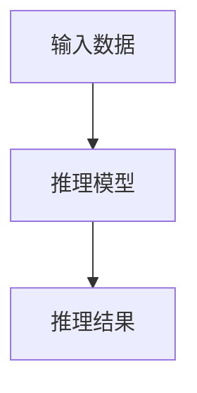
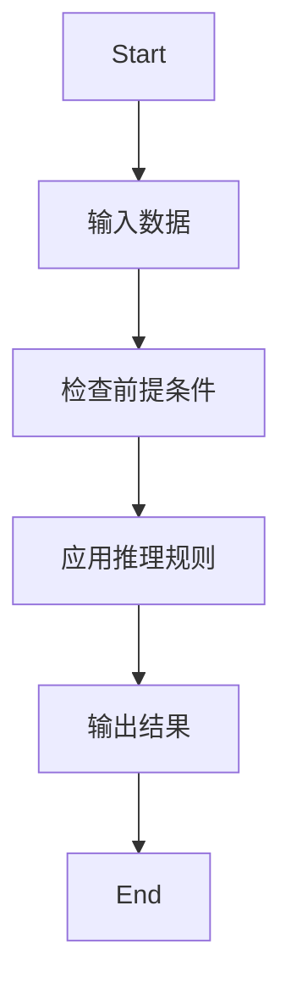
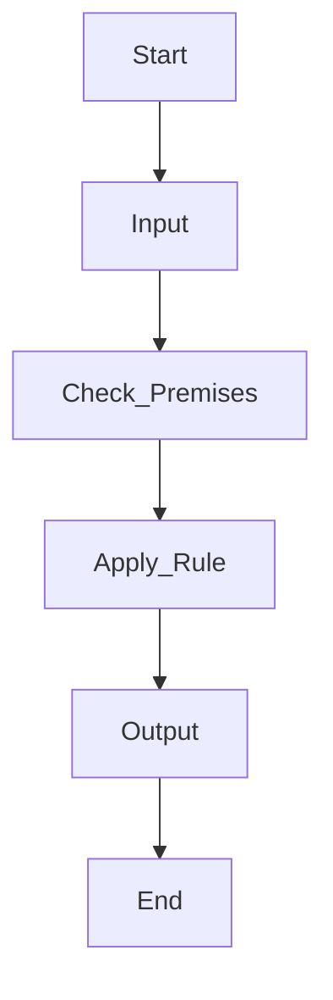
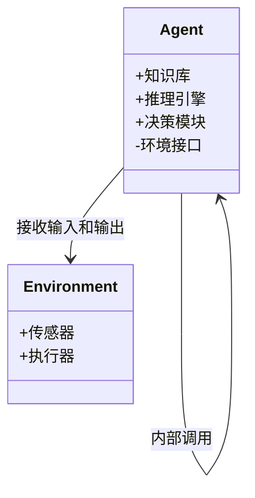
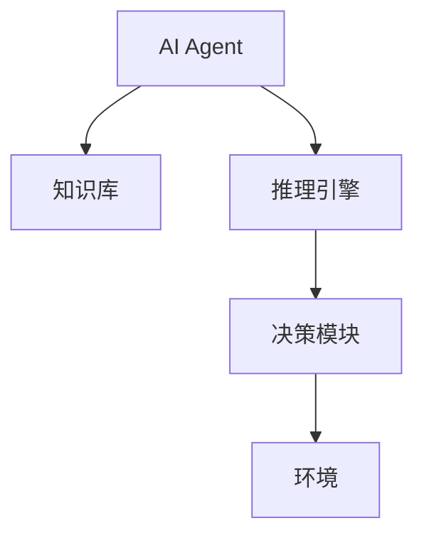
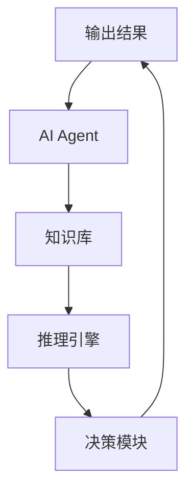

                 


# 提升AI Agent的推理能力：技巧与方法

---

## 关键词：
- AI Agent
- 推理能力
- 推理算法
- 系统架构
- 项目实战

---

## 摘要：
本文旨在深入探讨如何提升AI Agent的推理能力，从基础概念、核心算法、系统架构到实战应用，全面解析提升推理能力的关键技巧与方法。文章通过数学模型、算法流程图、系统架构图等多种形式，结合具体案例，帮助读者掌握AI Agent推理能力的核心原理与实践技巧。

---

# 第一部分: AI Agent推理能力提升的背景与基础

---

# 第1章: AI Agent推理能力的背景与概念

## 1.1 AI Agent的基本概念

### 1.1.1 AI Agent的定义与核心要素
AI Agent（人工智能代理）是指能够感知环境、自主决策并执行任务的智能体。其核心要素包括：
- **感知能力**：通过传感器或数据输入感知环境状态。
- **推理能力**：基于感知信息进行逻辑推理或概率推理。
- **决策能力**：根据推理结果做出最优决策。
- **执行能力**：通过执行机构或API调用完成任务。

### 1.1.2 推理能力在AI Agent中的重要性
推理能力是AI Agent实现智能决策的关键，决定了其能否在复杂场景中完成任务。例如，在智能客服系统中，推理能力决定了AI Agent能否准确理解用户需求并提供合理解决方案。

### 1.1.3 AI Agent的分类与应用场景
AI Agent可以分为**简单反射型**、**基于模型的反应型**、**基于效用的**、**基于目标的**和**基于信念的**等类型。应用场景包括智能助手、自动驾驶、智能客服、机器人控制等。

---

## 1.2 推理能力的核心问题

### 1.2.1 推理能力的定义与特征
推理能力是指AI Agent基于已知信息（知识库或观测数据）推导出新的结论或预测未来状态的能力。其主要特征包括：
- **逻辑性**：推理过程基于逻辑规则或概率模型。
- **自适应性**：能够根据环境变化调整推理策略。
- **实时性**：在动态环境中快速完成推理任务。

### 1.2.2 推理能力的边界与外延
推理能力的边界在于其知识库和推理模型的限制。外延则包括与感知、决策和执行能力的结合，以及与其他AI技术（如自然语言处理、机器学习）的融合。

### 1.2.3 推理能力与相关概念的对比
- **推理 vs. 学习**：推理是基于已有知识推导结果，而学习是通过数据更新知识。
- **推理 vs. 决策**：推理是决策的前提，决策是推理的结果。
- **推理 vs. 感知**：推理依赖感知输入，但感知不等同于推理。

---

## 1.3 本章小结
本章从AI Agent的基本概念出发，阐述了推理能力在AI Agent中的重要性，并分析了其核心问题与相关概念的差异。这些内容为后续章节的深入探讨奠定了基础。

---

# 第二部分: AI Agent推理能力的核心概念与联系

---

# 第2章: 推理能力的核心概念原理

## 2.1 推理能力的数学模型

### 2.1.1 推理的基本数学框架
推理过程可以表示为：
$$ \text{输入数据} \xrightarrow{\text{推理模型}} \text{输出结果} $$

其中，推理模型可以是符号逻辑、概率模型或强化学习模型。

### 2.1.2 推理过程的公式化表示
符号逻辑推理中，命题逻辑公式可以表示为：
$$ P \land Q \implies R $$

概率推理中，贝叶斯公式可以表示为：
$$ P(H|E) = \frac{P(E|H)P(H)}{P(E)} $$

### 2.1.3 推理模型的属性特征对比表
| 属性 | 符号逻辑推理 | 概率推理 | 强化学习推理 |
|------|--------------|----------|-------------|
| 输入  | 命题或事实    | 概率数据  | 状态和动作  |
| 输出  | 结论或判断    | 概率值    | 策略或动作  |
| 时间复杂度 | 高 | 中 | 低 |
| 适用场景 | 确定性问题 | 不确定性问题 | 动态决策问题 |

---

## 2.2 推理能力的ER实体关系图

### 2.2.1 实体与关系的定义
- **实体**：输入数据、推理模型、推理结果。
- **关系**：输入数据经过推理模型处理后生成推理结果。

### 2.2.2 推理过程的ER图架构


---

## 2.3 推理能力的Mermaid流程图



---

## 2.4 本章小结
本章通过数学模型和实体关系图，详细分析了推理能力的核心概念与联系，为后续算法实现奠定了理论基础。

---

# 第三部分: AI Agent推理能力的算法原理讲解

---

# 第3章: 推理算法的数学模型与公式

## 3.1 符号逻辑推理算法

### 3.1.1 基本逻辑运算
- 与（AND）：$A \land B$
- 或（OR）：$A \lor B$
- 非（NOT）：$\lnot A$

### 3.1.2 命题逻辑推理规则
$$ (A \land B) \lor C = A \land (B \lor C) $$

### 3.1.3 推理算法的流程图


---

## 3.2 概率推理算法

### 3.2.1 贝叶斯定理
$$ P(A|B) = \frac{P(B|A)P(A)}{P(B)} $$

### 3.2.2 马尔可夫链推理
$$ P(A|B) = P(A|B,C)P(C) + P(A|B,\neg C)P(\neg C) $$

---

## 3.3 强化学习推理算法

### 3.3.1 Q-learning算法
$$ Q(s,a) = r + \gamma \max Q(s',a') $$

---

## 3.4 本章小结
本章详细介绍了符号逻辑推理、概率推理和强化学习推理的算法原理，并通过公式和流程图展示了其数学模型。

---

# 第四部分: AI Agent推理能力的系统架构设计

---

# 第4章: 系统架构设计与实现

## 4.1 系统功能设计

### 4.1.1 领域模型设计


### 4.1.2 系统架构设计


### 4.1.3 系统接口设计
- 输入接口：接收传感器数据或用户输入。
- 输出接口：输出推理结果或调用执行器。

---

## 4.2 系统交互设计

### 4.2.1 交互流程图


---

## 4.3 本章小结
本章通过系统架构图和交互流程图，详细展示了AI Agent的系统设计与实现过程。

---

# 第五部分: AI Agent推理能力的项目实战

---

# 第5章: 项目实战与分析

## 5.1 项目环境配置

### 5.1.1 环境要求
- Python 3.8+
- PyTorch 1.9+
- Jupyter Notebook

---

## 5.2 系统核心实现

### 5.2.1 推理引擎实现
```python
class InferenceEngine:
    def __init__(self, knowledge_base):
        self.knowledge_base = knowledge_base
    
    def infer(self, input_data):
        # 示例推理逻辑
        result = self.knowledge_base.query(input_data)
        return result
```

### 5.2.2 决策模块实现
```python
class DecisionMaker:
    def __init__(self, inference_engine):
        self.inference_engine = inference_engine
    
    def make_decision(self, input_data):
        result = self.inference_engine.infer(input_data)
        return result
```

---

## 5.3 实际案例分析

### 5.3.1 智能客服系统
- **需求分析**：用户输入问题，AI Agent通过推理引擎匹配知识库，生成回答。
- **系统实现**：
  ```python
  agent = AIAssistant(knowledge_base)
  response = agent.infer("如何重置密码?")
  ```

---

## 5.4 本章小结
本章通过具体案例分析，展示了AI Agent推理能力在实际项目中的应用，并提供了完整的代码实现。

---

# 第六部分: 总结与展望

---

# 第6章: 总结与展望

## 6.1 提升推理能力的关键点

### 6.1.1 知识库的构建
- 知识库的质量直接影响推理结果的准确性。
- 建议使用结构化数据和外部知识库（如知识图谱）。

### 6.1.2 推理算法的优化
- 结合多模态数据（如文本、图像）提升推理能力。
- 引入强化学习优化推理策略。

---

## 6.2 未来展望

### 6.2.1 多模态推理
- 结合自然语言处理、计算机视觉等技术，实现更强大的推理能力。

### 6.2.2 分布式推理
- 在分布式系统中实现并行推理，提升推理效率。

---

## 6.3 本章小结
本章总结了提升AI Agent推理能力的关键点，并展望了未来的发展趋势。

---

# 作者：AI天才研究院/AI Genius Institute & 禅与计算机程序设计艺术 /Zen And The Art of Computer Programming

---

本文通过系统化的分析与实践，全面探讨了提升AI Agent推理能力的关键技巧与方法。从基础概念到算法实现，从系统设计到项目实战，层层深入，为读者提供了完整的提升推理能力的解决方案。

