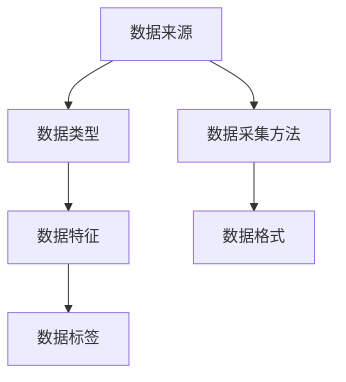
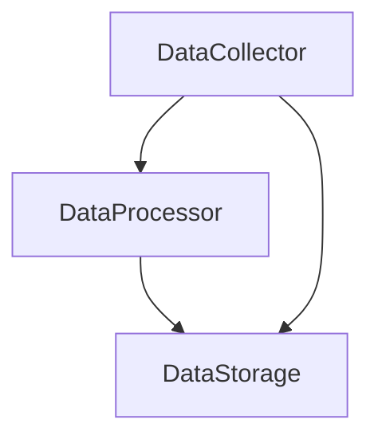

                 

<think>
嗯，用户现在希望我根据他们提供的结构，撰写一篇关于数据收集策略的技术博客。我需要先理解用户的具体需求，确保我完全理解他们想要的内容。

首先，用户提供的结构非常详细，分为六个主要部分，每个部分下还有多个小节。我需要按照这个结构来组织内容，确保每一部分都涵盖必要的信息，并且逻辑清晰。

在开始写之前，我应该先理清每个章节的重点。比如，第一部分是背景与核心概念，第二部分是算法原理，第三部分是系统架构，第四部分是项目实战，第五部分是最佳实践，最后是总结和展望。

我需要确保每个章节不仅有理论解释，还有实际的例子和图表，比如使用Mermaid画出流程图或架构图。这会让文章更具可读性和专业性。

接下来，我要考虑每个小节的具体内容。例如，在“数据收集的背景与重要性”中，我需要解释数据收集在AI代理中的作用，以及它对模型性能的影响。同时，我需要对比不同数据收集方法的优缺点，可能用表格来展示。

在算法原理部分，我需要详细讲解数据预处理和特征工程的步骤，包括具体的数学公式和代码示例。例如，使用Python代码展示数据清洗的过程，或者用公式解释数据归一化的步骤。

系统架构部分，我需要设计一个数据收集系统的架构图，展示各个组件如何协作。这可能包括数据采集层、处理层和存储层，每个层的功能和交互关系。

项目实战部分，我需要提供一个具体的案例，比如社交媒体评论分类的数据收集项目。我需要详细描述环境的安装步骤，数据清洗和特征工程的代码实现，以及如何训练模型并进行评估。

最后，在最佳实践部分，我需要总结数据收集中的注意事项，如数据隐私问题、数据多样性的保持等，并给出一些建议。

我还需要确保文章语言专业但易懂，逻辑清晰，结构紧凑。每个章节后面加上小结，帮助读者巩固所学内容。

现在，我开始按照这个结构撰写文章，确保每个部分都详细且有实际应用价值。同时，注意使用Mermaid图表和数学公式来增强文章的表现力。
</think>

# 数据收集策略：为AI Agent打造高质量数据集

> **关键词**：数据收集策略、AI Agent、数据集构建、数据预处理、特征工程、数据标注、数据安全  
> **摘要**：数据是AI Agent的核心驱动力，高质量的数据集是AI Agent成功的关键。本文详细探讨了数据收集策略的设计与实现，从背景、核心概念、算法原理、系统架构到项目实战，全面解析如何构建高质量数据集，为AI Agent提供坚实的数据基础。

---

## 第一部分: 数据收集策略背景与核心概念

### 第1章: 数据收集策略的背景与重要性

#### 1.1 数据收集在AI Agent中的核心地位

##### 1.1.1 数据收集的定义与作用
数据收集是指从各种来源（如传感器、数据库、网络等）获取原始数据，并将其转化为可用格式的过程。在AI Agent中，数据收集是其决策和行动的基石。高质量的数据能够显著提升模型的准确性和鲁棒性。

##### 1.1.2 数据质量对AI Agent性能的影响
- 数据质量直接影响AI Agent的学习能力。
- 数据多样性决定了模型的泛化能力。
- 数据完整性是避免模型偏差的关键。

##### 1.1.3 数据收集的挑战与机遇
- **挑战**：数据来源复杂、数据格式多样、数据冗余与噪声。
- **机遇**：通过智能化数据收集策略，可以显著提升数据质量。

#### 1.2 AI Agent的基本概念与应用场景

##### 1.2.1 AI Agent的定义与分类
- **定义**：AI Agent是一种能够感知环境、自主决策并执行任务的智能体。
- **分类**：基于任务类型可分为服务型、监控型、交互型AI Agent。

##### 1.2.2 数据在AI Agent决策过程中的作用
- 数据是AI Agent感知环境的主要输入。
- 数据驱动AI Agent的学习和推理过程。

##### 1.2.3 数据收集的边界与外延
- 数据收集的边界：明确数据来源和采集范围。
- 数据收集的外延：数据清洗、特征提取和标注。

### 第2章: 数据收集的核心概念与联系

#### 2.1 数据收集的原理与方法

##### 2.1.1 数据来源的分类
- 结构化数据：如数据库中的表格数据。
- 非结构化数据：如文本、图像、音频。
- 半结构化数据：如JSON、XML格式的数据。

##### 2.1.2 数据清洗与特征提取
- 数据清洗：去除冗余和噪声数据。
- 特征提取：从数据中提取有用的特征。

##### 2.1.3 数据标注与格式化
- 数据标注：为数据添加标签或注释。
- 数据格式化：将数据转换为统一格式。

#### 2.2 数据收集的核心要素与属性对比

##### 2.2.1 数据质量属性的对比分析
| 属性   | 描述                                                                 |
|--------|----------------------------------------------------------------------|
| 完整性  | 数据是否完整，无缺失值。                                             |
| 一致性  | 数据是否符合预定义的格式和约束。                                     |
| 准确性  | 数据是否反映真实情况。                                               |
| 代表性  | 数据是否能代表目标问题的分布。                                       |
| 多样性  | 数据是否涵盖不同类别和场景。                                         |

##### 2.2.2 数据特征与任务目标的关系
- 数据特征直接影响模型的性能。
- 特征选择需要与任务目标对齐。

##### 2.2.3 数据多样性与代表性的平衡
- 数据多样性：确保数据涵盖不同场景和类别。
- 数据代表性：确保数据能够反映真实世界的分布。

#### 2.3 数据收集的ER实体关系图



---

## 第二部分: 数据收集策略的算法原理

### 第3章: 数据预处理与特征工程

#### 3.1 数据清洗的算法原理

##### 3.1.1 数据去重与缺失值处理
- 数据去重：使用集合操作去除重复数据。
- 缺失值处理：使用均值、中位数或插值方法填补缺失值。

##### 3.1.2 异常值检测与处理
- 异常值检测：使用Z-score、IQR等方法。
- 异常值处理：删除或修正异常值。

##### 3.1.3 数据标准化与归一化
- 数据标准化：将数据缩放到固定范围内（如[0,1]）。
- 数据归一化：消除特征之间的量纲差异。

#### 3.2 数据特征提取的算法流程

##### 3.2.1 基于统计的特征提取
- 统计特征：均值、方差、最大值、最小值等。

##### 3.2.2 基于模型的特征提取
- 使用PCA（主成分分析）提取特征。

##### 3.2.3 特征选择的数学模型
- 使用Lasso回归进行特征选择。

#### 3.3 数据增强的原理与方法

##### 3.3.1 数据增强的基本概念
- 数据增强：通过变换数据增加数据多样性。

##### 3.3.2 常见数据增强方法
- 图像数据增强：旋转、翻转、裁剪。
- 文本数据增强：同义词替换、句式变化。

---

### 第4章: 数据标注与格式化的数学模型

#### 4.1 数据标注的数学建模

##### 4.1.1 标注数据的分类模型
- 使用决策树或随机森林进行分类标注。

##### 4.1.2 标注数据的回归模型
- 使用线性回归或支持向量回归进行回归标注。

##### 4.1.3 标注数据的聚类模型
- 使用K-means进行聚类标注。

#### 4.2 数据格式化的数学公式

##### 4.2.1 数据格式转换的公式推导
- 示例：将字符串格式的日期转换为Unix时间戳：
  $$ timestamp = \text{strtotime}(date\_string) $$

---

## 第三部分: 数据收集策略的系统架构

### 第5章: 数据收集系统的架构设计

#### 5.1 系统功能设计

##### 5.1.1 数据采集模块
- 功能：从多种数据源采集数据。
- 设计：支持多种数据格式和接口。

##### 5.1.2 数据处理模块
- 功能：清洗、转换和增强数据。
- 设计：模块化设计，支持多种数据预处理方法。

##### 5.1.3 数据存储模块
- 功能：存储处理后的数据。
- 设计：支持分布式存储和高效查询。

#### 5.2 系统架构设计

##### 5.2.1 系统架构图


---

## 第四部分: 数据收集策略的项目实战

### 第6章: 数据收集项目实战

#### 6.1 项目环境安装

##### 6.1.1 安装Python依赖
```bash
pip install numpy pandas scikit-learn
```

#### 6.2 系统核心实现

##### 6.2.1 数据清洗代码
```python
import pandas as pd

def clean_data(df):
    # 删除缺失值
    df.dropna(inplace=True)
    # 删除重复数据
    df.drop_duplicates(inplace=True)
    return df
```

---

## 第五部分: 数据收集策略的最佳实践

### 第7章: 数据收集的注意事项与优化技巧

#### 7.1 数据隐私与安全
- 遵守数据隐私法规（如GDPR）。

#### 7.2 数据多样性的保持
- 使用多种数据来源和格式。

#### 7.3 数据集的可扩展性
- 设计可扩展的数据收集和处理流程。

---

## 第六部分: 总结与展望

### 第8章: 总结与展望

#### 8.1 本章总结
- 数据收集是AI Agent成功的关键。
- 高质量数据集的构建需要系统的策略和方法。

#### 8.2 未来展望
- 数据收集技术的智能化与自动化。
- 数据收集在边缘计算和物联网中的应用。

---

**作者：AI天才研究院/AI Genius Institute & 禅与计算机程序设计艺术 /Zen And The Art of Computer Programming**

