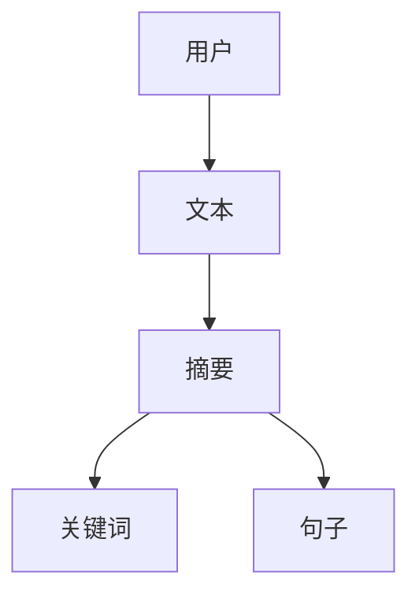
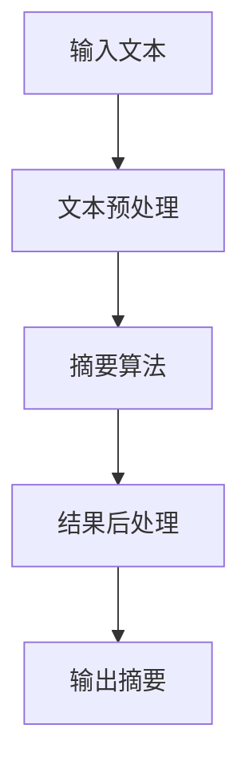
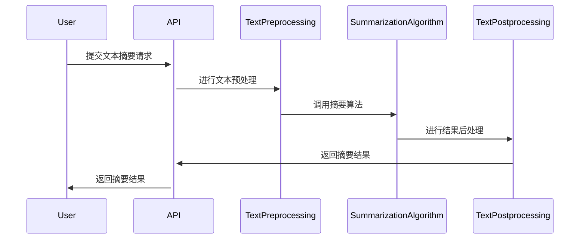

                 


# 《文本摘要技术：AI Agent信息处理的利器》

> 关键词：文本摘要技术, AI Agent, 自然语言处理, 摘要算法, 系统架构设计

> 摘要：本文将详细探讨文本摘要技术的核心概念、算法原理、系统架构设计以及实际应用场景，特别是其在AI Agent信息处理中的重要性。文章将从基础理论到实践应用，系统地分析文本摘要技术的关键要素，包括抽取式与生成式摘要方法，基于统计和基于神经网络的摘要算法，以及如何构建高效的文本摘要系统。通过案例分析和代码实现，文章将深入浅出地展示文本摘要技术的实际应用价值。

---

# 第一部分: 文本摘要技术概述

## 第1章: 文本摘要技术的背景与重要性

### 1.1 文本摘要技术的定义与背景

- **1.1.1 什么是文本摘要技术**  
  文本摘要技术是自然语言处理（NLP）领域的重要分支，旨在通过自动化手段从大量文本中提取关键信息，生成简洁、准确的摘要。它是信息处理的核心工具，能够帮助AI Agent快速理解复杂文本内容。

- **1.1.2 文本摘要技术的起源与发展**  
  文本摘要技术起源于20世纪50年代，早期基于统计方法的摘要技术逐渐发展，近年来，随着深度学习的兴起，生成式摘要技术取得了突破性进展。

- **1.1.3 AI Agent与文本摘要技术的关系**  
  AI Agent需要处理海量信息，文本摘要技术是其高效信息处理的关键工具，能够帮助AI Agent快速提取关键信息，提升决策效率。

### 1.2 文本摘要技术的核心问题

- **1.2.1 信息提取与压缩的核心问题**  
  文本摘要需要在保持原文核心信息的前提下，最大限度地压缩文本长度，同时确保语义的完整性和准确性。

- **1.2.2 文本摘要技术的关键挑战**  
  包括信息抽取的准确性、语义理解的深度、生成摘要的流畅性等。

- **1.2.3 AI Agent对文本摘要技术的需求**  
  AI Agent需要实时处理大量信息，文本摘要技术能够帮助其快速理解上下文，提升信息处理效率。

### 1.3 文本摘要技术的应用场景

- **1.3.1 在AI Agent中的应用**  
  包括信息监控、决策支持、对话生成等场景。

- **1.3.2 在自然语言处理中的应用**  
  包括新闻摘要、文献综述、自动问答系统等。

- **1.3.3 在其他领域的应用**  
  包括法律文档处理、医学信息提取等。

### 1.4 本章小结  
  本章介绍了文本摘要技术的基本概念、核心问题及其在AI Agent中的重要性，为后续内容奠定了基础。

---

## 第2章: 文本摘要技术的核心概念与联系

### 2.1 文本摘要技术的核心概念

- **2.1.1 文本摘要的基本原理**  
  文本摘要通过分析文本内容，提取关键信息，生成简洁的摘要。

- **2.1.2 文本摘要的关键属性**  
  包括简洁性、准确性、连贯性、语义保真性等。

- **2.1.3 文本摘要的核心要素**  
  包括输入文本、摘要算法、输出摘要。

### 2.2 文本摘要技术的分类与对比

- **2.2.1 抽取式摘要与生成式摘要的对比**  
  抽取式摘要通过选择原文中的关键句子或词语生成摘要；生成式摘要通过生成新的文本内容来表达原文的核心信息。

- **2.2.2 基于统计的摘要与基于神经网络的摘要的对比**  
  基于统计的方法依赖于词频、句频等特征；基于神经网络的方法利用深度学习模型进行语义理解。

- **2.2.3 其他摘要方法的对比分析**  
  包括规则驱动摘要、混合式摘要等。

### 2.3 文本摘要技术的ER实体关系图



### 2.4 本章小结  
  本章详细分析了文本摘要技术的核心概念及其分类，通过ER实体关系图展示了摘要过程中的关键要素。

---

## 第3章: 文本摘要技术的算法原理

### 3.1 基于统计的摘要算法

- **3.1.1 TF-IDF模型**  
  TF-IDF（Term Frequency-Inverse Document Frequency）用于衡量关键词的重要性。

- **3.1.2 LexRank算法**  
  LexRank基于句子重要性进行排序，选择最重要的句子生成摘要。

- **3.1.3 TextRank算法**  
  TextRank通过构建句子相似性图谱，计算句子的重要性得分。

### 3.2 基于神经网络的摘要算法

- **3.2.1 神经网络摘要模型**  
  常见的模型包括编码器-解码器结构（如Seq2Seq）和基于Transformer的模型（如Bert）。

- **3.2.2 Transformer模型在摘要中的应用**  
  Transformer模型通过自注意力机制捕捉文本中的长距离依赖关系。

- **3.2.3 摘要生成的解码策略**  
  包括贪心解码和束搜索解码。

### 3.3 基于大模型的摘要方法

- **3.3.1 预训练大模型的应用**  
  使用GPT、BERT等预训练大模型进行文本摘要。

- **3.3.2 微调与适应**  
  对大模型进行微调，使其适应特定领域的摘要任务。

### 3.4 本章小结  
  本章详细介绍了几种主流的摘要算法，包括基于统计、神经网络和大模型的摘要方法，并分析了各自的优缺点。

---

## 第4章: 文本摘要系统的架构设计

### 4.1 系统功能设计

- **4.1.1 需求分析**  
  包括输入处理、摘要生成、结果输出等功能。

- **4.1.2 功能模块划分**  
  包括文本预处理模块、摘要算法模块、结果后处理模块等。

### 4.2 系统架构设计



### 4.3 系统接口设计

- **4.3.1 API设计**  
  提供RESTful API接口，支持文本摘要的调用。

- **4.3.2 输入输出格式**  
  定义输入文本的格式和输出摘要的格式。

### 4.4 系统交互流程



### 4.5 本章小结  
  本章详细描述了文本摘要系统的架构设计，包括功能模块划分、系统接口设计和交互流程。

---

## 第5章: 项目实战——基于Python的文本摘要系统开发

### 5.1 环境安装与配置

- **5.1.1 安装Python环境**  
  安装Python 3.x及以上版本。

- **5.1.2 安装依赖库**  
  使用pip安装`numpy`, `transformers`, `torch`等库。

### 5.2 核心代码实现

```python
from transformers import BartTokenizer, BartForConditionalGeneration
import torch

model = BartForConditionalGeneration.from_pretrained('facebook/bart-large')
tokenizer = BartTokenizer.from_pretrained('facebook/bart-large')

def summarize(text):
    inputs = tokenizer.encode(text, max_length=1024, truncation=True, return_tensors='pt')
    outputs = model.generate(inputs, max_length=100, min_length=50, do_sample=False)
    summary = tokenizer.decode(outputs[0], skip_special_tokens=True)
    return summary
```

### 5.3 代码解读与分析

- **5.3.1 模型加载与初始化**  
  使用预训练的Bart模型进行摘要生成。

- **5.3.2 文本预处理**  
  对输入文本进行分词处理，生成token序列。

- **5.3.3 摘要生成**  
  调用模型生成摘要，并对生成结果进行解码。

### 5.4 案例分析与结果展示

- **5.4.1 输入文本**  
  提供一段长文本，例如一篇新闻文章。

- **5.4.2 摘要结果**  
  展示生成的摘要内容，并分析其准确性和流畅性。

### 5.5 本章小结  
  本章通过实际案例展示了如何基于Python开发一个文本摘要系统，详细讲解了环境配置、代码实现和结果分析。

---

## 第6章: 总结与展望

### 6.1 本章总结

- **6.1.1 文本摘要技术的核心内容**  
  包括算法原理、系统架构设计和实际应用。

- **6.1.2 AI Agent在信息处理中的重要作用**  
  文本摘要技术是AI Agent高效处理信息的关键工具。

### 6.2 未来展望

- **6.2.1 摘要技术的发展趋势**  
  包括多语言摘要、多模态摘要等。

- **6.2.2 AI Agent的未来应用方向**  
  包括更智能的信息处理和人机交互。

### 6.3 本章小结  
  本章总结了全文内容，并展望了文本摘要技术的未来发展方向。

---

## 第7章: 最佳实践与注意事项

### 7.1 最佳实践

- **7.1.1 数据预处理的重要性**  
  数据清洗和分词是影响摘要质量的关键因素。

- **7.1.2 模型调优技巧**  
  包括参数调整、数据增强等方法。

- **7.1.3 结果评估方法**  
  使用ROUGE、BLEU等指标评估摘要质量。

### 7.2 注意事项

- **7.2.1 数据隐私问题**  
  在处理敏感信息时，需要注意数据隐私保护。

- **7.2.2 模型的适用性**  
  不同场景下，需要选择合适的摘要算法。

### 7.3 本章小结  
  本章提供了文本摘要技术的最佳实践和注意事项，帮助读者更好地应用摘要技术。

---

## 第8章: 拓展阅读与推荐

### 8.1 经典论文推荐

- **8.1.1 Transformer模型论文**  
  "Attention Is All You Need"

- **8.1.2 文本摘要领域的经典论文**  
  "A Neural Network Based Encoder-Decoder Model for Abstractive Summarization"

### 8.2 书籍推荐

- **8.2.1 自然语言处理领域经典书籍**  
  "Speech and Language Processing"

- **8.2.2 深度学习经典书籍**  
  "Deep Learning"

### 8.3 在线资源推荐

- **8.3.1 GitHub开源项目**  
  推荐一些优秀的文本摘要开源项目。

- **8.3.2 MOOC课程推荐**  
  推荐一些关于自然语言处理和深度学习的在线课程。

### 8.4 本章小结  
  本章为读者推荐了一些拓展阅读资料和在线资源，帮助读者进一步深入学习文本摘要技术。

---

## 第9章: 作者简介与致谢

### 9.1 作者简介

- **9.1.1 作者信息**  
  AI天才研究院/AI Genius Institute  
  禅与计算机程序设计艺术/Zen And The Art of Computer Programming

### 9.2 致谢

- **9.2.1 致谢对象**  
  感谢所有支持和帮助完成本书的朋友们。

### 9.3 本章小结  
  本章介绍了作者信息并表达了感谢之情。

---

# 作者：AI天才研究院/AI Genius Institute & 禅与计算机程序设计艺术/Zen And The Art of Computer Programming

