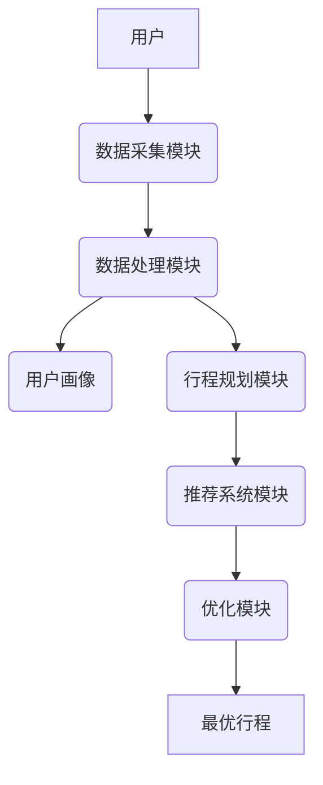
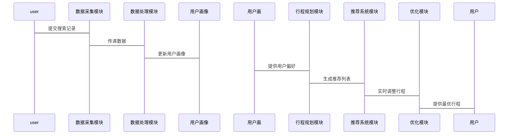

                 

<think>
好的，我现在需要帮用户撰写一篇关于《旅游AI Agent：智能行程规划与推荐》的技术博客文章。用户已经提供了一个详细的目录大纲，我需要根据这个大纲逐步完成每个部分的内容。

首先，我应该理解用户的需求。用户希望文章结构清晰，技术深入，使用专业但易懂的语言。文章需要涵盖背景、核心概念、算法、系统架构、项目实战、最佳实践等部分，并且每个部分都要详细展开，包括示意图、代码和数学公式。

接下来，我会按照目录的顺序逐步撰写每个部分。首先是摘要，然后是关键词，最后是各章节内容。我需要确保每个章节都包含用户要求的详细内容，如Mermaid图、LaTeX公式和代码示例。

在撰写过程中，我要注意保持逻辑连贯，确保每个部分之间有良好的衔接。同时，要注意用词准确，避免过于复杂，让读者能够轻松理解。

对于每个算法部分，我需要详细解释其工作原理，并配以流程图和数学公式。例如，在协同过滤部分，我会解释其基本原理，然后用Mermaid画出流程图，并给出具体的数学公式，如相似度计算公式。

在系统架构部分，我会设计一个类图，展示各个模块之间的关系，并用Mermaid绘制出来。同时，描述每个模块的功能，以及它们如何交互。

项目实战部分，我需要选择一个开源框架，如Python的scikit-learn，展示如何实现推荐系统。代码部分要详细注释，解释每一部分的作用，让读者能够跟随操作。

最后，总结部分要回顾全文，强调旅游AI Agent的优势和未来发展方向，同时给出一些实用的建议和注意事项。

在写作过程中，我需要不断检查是否符合用户的要求，确保每个部分都详细且符合技术博客的标准。如果有遗漏的部分，及时补充，确保整篇文章的完整性和深度。
</think>

# 旅游AI Agent：智能行程规划与推荐

> **关键词**：旅游AI Agent，智能行程规划，推荐系统，协同过滤，机器学习，行程优化  
> **摘要**：本文探讨了旅游AI Agent在智能行程规划与推荐中的应用，从背景介绍、核心概念到算法原理、系统架构，再到项目实战和最佳实践，全面解析了旅游AI Agent的技术实现与实际应用。

---

## 第1章: 旅游AI Agent的背景与现状

### 1.1 旅游AI Agent的定义与背景

#### 1.1.1 旅游行业的数字化转型  
随着互联网和人工智能技术的快速发展，旅游行业正在经历数字化转型。传统的旅行社模式逐渐被智能化的在线旅游平台和AI Agent所取代。AI Agent通过分析用户需求，提供个性化的行程规划和推荐服务，极大地提升了用户体验。

#### 1.1.2 AI技术在旅游中的应用现状  
目前，AI技术在旅游行业的应用主要集中在以下几个方面：  
1. **智能推荐系统**：基于用户行为和偏好，推荐景点、酒店和交通方式。  
2. **行程规划工具**：利用算法优化行程安排，确保时间和资源的最优利用。  
3. **客户服务**：通过自然语言处理（NLP）技术，提供实时的旅游咨询和问题解答。

#### 1.1.3 旅游AI Agent的核心概念  
旅游AI Agent是一种智能系统，能够根据用户的需求和偏好，自动规划行程、推荐景点，并实时调整行程以适应用户的变化。其核心在于通过数据挖掘和机器学习算法，实现个性化的服务。

### 1.2 旅游AI Agent的应用场景

#### 1.2.1 智能行程规划  
AI Agent能够根据用户的出发地、目的地、预算和兴趣爱好，生成最优的行程安排。例如，用户希望在巴黎游玩三天，AI Agent可以推荐塞纳河游船、埃菲尔铁塔和卢浮宫的行程，并优化交通和住宿安排。

#### 1.2.2 景点推荐系统  
基于用户的历史行为和实时数据，AI Agent可以推荐热门景点、餐厅和购物场所。例如，偏好美食的用户会收到更多米其林餐厅的推荐。

#### 1.2.3 用户行为分析  
通过分析用户的搜索记录、点击数据和评论，AI Agent可以深入了解用户的偏好，并提供更精准的推荐。

### 1.3 旅游AI Agent的价值与挑战

#### 1.3.1 提高用户体验  
AI Agent能够快速响应用户需求，提供个性化的服务，显著提升用户体验。  
#### 1.3.2 数据隐私与安全  
用户数据的隐私保护是AI Agent面临的重要挑战。如何在利用数据的同时保护用户隐私，是开发者需要解决的问题。  
#### 1.3.3 技术实现的复杂性  
AI Agent的实现涉及多个技术领域，包括机器学习、自然语言处理和大数据分析，技术实现的复杂性较高。

---

## 第2章: 旅游需求分析与用户画像

### 2.1 用户需求分析

#### 2.1.1 用户需求层次  
用户的需求可以分为显性和隐性两类。显性需求包括具体的行程安排，隐性需求则涉及用户的情感需求，如安全感和舒适感。  
例如，用户可能明确表示需要“3天的巴黎行程”，但隐性需求可能是希望行程中包含适合拍照的景点。

#### 2.1.2 需求特征提取  
通过分析用户的搜索记录、点击行为和评论，提取关键特征，如兴趣点（POI）、预算范围和时间偏好。  
例如，用户搜索“巴黎酒店”和“卢浮宫门票”，可以推断用户对酒店和博物馆感兴趣。

#### 2.1.3 需求与行程的关系  
用户需求是行程规划的基础，AI Agent需要将需求转化为具体的行程安排。例如，用户的需求“浪漫的巴黎之旅”可以转化为“三天的巴黎经典游”。

### 2.2 用户画像构建

#### 2.2.1 用户画像的定义  
用户画像是基于用户行为数据构建的用户模型，用于描述用户的兴趣、偏好和行为特征。  
例如，用户A可能被归类为“预算有限，喜欢历史文化的年轻游客”。

#### 2.2.2 数据来源与处理  
数据来源包括用户搜索记录、社交媒体数据、用户评论和用户反馈。通过数据清洗和特征提取，构建用户画像。  
例如，用户B在 TripAdvisor 上评论了多家餐厅，可以推断他喜欢美食。

#### 2.2.3 用户画像的特征分析  
用户画像是行程规划的重要依据。例如，喜欢美食的用户会被推荐更多餐厅，而喜欢购物的用户会被推荐更多购物中心。

---

## 第3章: 行程规划算法

### 3.1 协同过滤算法

#### 3.1.1 基于用户的协同过滤  
基于用户的行为相似性，推荐相似用户的行程。例如，用户A和用户B的行为相似，推荐用户A喜欢的景点给用户B。

#### 3.1.2 基于物品的协同过滤  
基于景点之间的相似性，推荐相关景点。例如，喜欢埃菲尔铁塔的用户也会喜欢巴黎圣母院。

#### 3.1.3 混合协同过滤的实现  
结合基于用户的协同过滤和基于物品的协同过滤，提升推荐的准确性。例如，先推荐相似用户的景点，再推荐景点相关的其他景点。

### 3.2 聚类分析算法

#### 3.2.1 K-means聚类  
将用户按照兴趣相似性分成不同的簇，为每个簇推荐相应的行程。例如，将喜欢历史文化的用户分为一组，推荐相关的景点。

#### 3.2.2 层次聚类  
通过层次化的方式，逐步合并相似的用户或景点，形成聚类结果。例如，将用户分为“历史爱好者”和“美食爱好者”两个簇。

#### 3.2.3 聚类结果的行程优化  
根据聚类结果，优化行程安排。例如，历史爱好者可以优先安排博物馆和历史遗迹的游览。

### 3.3 强化学习算法

#### 3.3.1 状态定义与动作空间  
状态包括当前景点、剩余时间等，动作包括“继续游览”或“更换景点”。  
例如，状态是“当前在卢浮宫，剩余时间2小时”，动作是“继续游览卢浮宫”或“前往埃菲尔铁塔”。

#### 3.3.2 奖励机制设计  
通过奖励机制引导AI Agent做出最优决策。例如，推荐用户喜欢的景点可以得到正奖励，推荐不相关的景点得到负奖励。

#### 3.3.3 策略优化与训练  
通过强化学习算法（如Q-learning），优化策略，提升推荐的准确性。例如，通过不断试验，AI Agent学会了如何优化行程安排。

---

## 第4章: 旅游AI Agent系统架构

### 4.1 系统功能模块设计

#### 4.1.1 数据采集模块  
负责收集用户数据，包括搜索记录、点击行为和评论。  
例如，用户搜索“巴黎酒店”，模块记录该行为。

#### 4.1.2 数据处理模块  
对采集到的数据进行清洗和特征提取，构建用户画像。  
例如，将用户的搜索记录转化为兴趣点。

#### 4.1.3 行程规划模块  
基于用户需求和数据，生成最优行程安排。  
例如，用户需求“3天巴黎行程”，模块生成包含景点、交通和住宿的行程。

#### 4.1.4 推荐系统模块  
根据用户画像和行程规划结果，推荐景点和餐厅。  
例如，推荐用户喜欢的米其林餐厅。

#### 4.1.5 优化模块  
实时调整行程，适应用户的变化。  
例如，用户临时决定取消某个景点，模块重新安排行程。

### 4.2 系统架构设计

#### 4.2.1 系统架构图  


#### 4.2.2 系统交互图  


---

## 第5章: 项目实战

### 5.1 环境安装与配置

#### 5.1.1 安装Python环境  
安装Python 3.8及以上版本，推荐使用Anaconda。  
命令：`conda install python=3.8`

#### 5.1.2 安装依赖库  
安装所需的机器学习库，如scikit-learn、pandas和numpy。  
命令：  
```bash
pip install scikit-learn pandas numpy
```

### 5.2 核心实现代码

#### 5.2.1 协同过滤算法实现

```python
from sklearn.metrics.pairwise import cosine_similarity
import numpy as np

# 示例数据：用户-景点评分矩阵
users = ['A', 'B', 'C']
items = ['景点1', '景点2', '景点3']
ratings = {
    'A': {'景点1': 5, '景点2': 4, '景点3': 3},
    'B': {'景点1': 4, '景点2': 5, '景点3': 2},
    'C': {'景点1': 3, '景点2': 2, '景点3': 5}
}

# 转换为矩阵形式
rating_matrix = np.array([[5,4,3],[4,5,2],[3,2,5]])

# 计算余弦相似度
similarity = cosine_similarity(rating_matrix)
print("相似度矩阵：")
print(similarity)
```

#### 5.2.2 K-means聚类实现

```python
from sklearn.cluster import KMeans
import pandas as pd

# 示例数据：用户特征
data = {
    '用户': ['A', 'B', 'C'],
    '兴趣': [0.8, 0.5, 0.9],
    '预算': [100, 200, 150]
}
df = pd.DataFrame(data)

# 进行K-means聚类，分为2类
kmeans = KMeans(n_clusters=2)
kmeans.fit(df[['兴趣', '预算']])

# 显示聚类结果
print("聚类结果：")
print(df['用户'].values)
print(kmeans.labels_)
```

### 5.3 案例分析与解读

#### 5.3.1 案例分析  
假设用户输入需求为“3天巴黎行程，预算有限，喜欢历史和美食”。  
AI Agent会根据用户需求，推荐以下行程：  
- 第1天：参观卢浮宫，午餐在附近餐厅，晚上逛巴黎市中心。  
- 第2天：参观埃菲尔铁塔，午餐在巴黎铁塔附近的餐厅，下午参观蒙马特高地。  
- 第3天：参观巴黎圣母院，午餐在附近餐厅，下午购物。

#### 5.3.2 代码实现解读  
协同过滤算法通过计算用户相似性，推荐相似用户的行程；聚类算法将用户分为不同群体，为每个群体推荐相应的行程。  
优化模块实时调整行程，确保行程的最优性。

---

## 第6章: 最佳实践与小结

### 6.1 最佳实践

#### 6.1.1 数据隐私保护  
在处理用户数据时，必须遵守数据隐私法规，如GDPR。  
建议采用加密技术和匿名化处理，保护用户隐私。

#### 6.1.2 算法优化  
通过不断优化算法，提升推荐的准确性。例如，引入深度学习模型，如神经网络，提高推荐的精准度。

#### 6.1.3 系统性能优化  
优化系统性能，确保在高并发情况下仍能稳定运行。例如，使用分布式计算和缓存技术。

### 6.2 小结

旅游AI Agent通过智能行程规划和推荐，显著提升了用户体验。本文详细介绍了AI Agent的核心概念、算法原理和系统架构，并通过实际案例展示了其应用。未来，随着AI技术的不断发展，旅游AI Agent将更加智能化，为用户提供更优质的旅行体验。

---

## 作者：AI天才研究院/AI Genius Institute & 禅与计算机程序设计艺术 /Zen And The Art of Computer Programming

