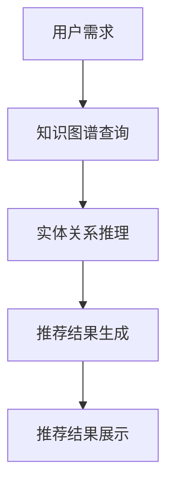
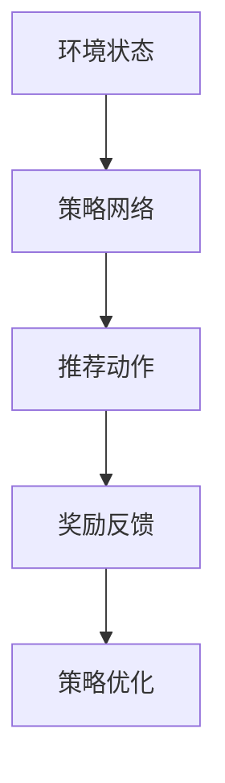
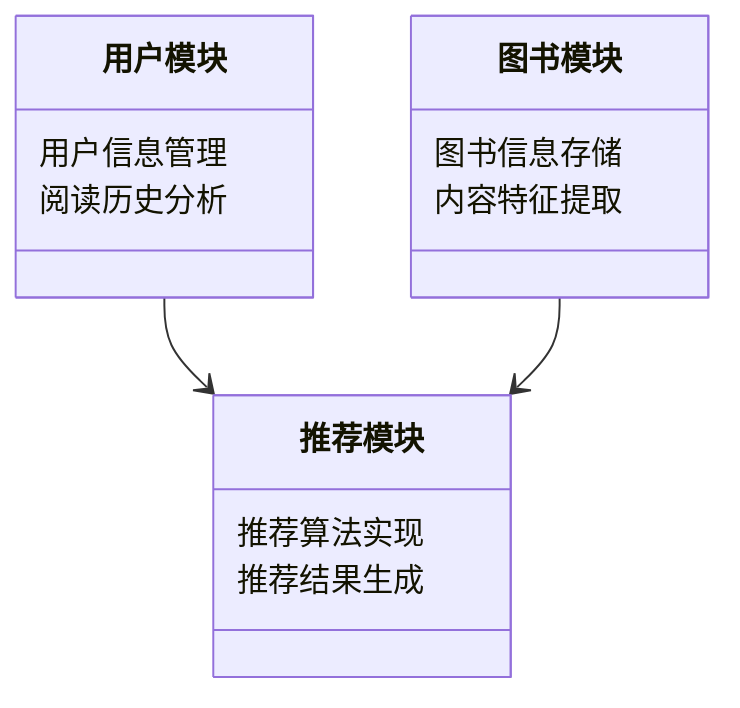

                 

<think>
嗯，用户需要我写一篇关于《智能书架：AI Agent的图书推荐系统》的技术博客文章。用户已经给出了目录大纲，现在我需要按照这个大纲来逐步完成文章。首先，我需要理解每个章节的要求，然后逐步填充内容。

首先，文章的开头需要有一个摘要，关键词和摘要部分。我需要选择5-7个核心关键词，可能包括AI Agent、图书推荐系统、知识图谱、强化学习、系统架构等。摘要部分要简明扼要地概括文章的主要内容，包括背景、技术原理和应用。

接下来是目录结构。第一部分是智能书架与AI Agent的概述，我需要先介绍智能书架的概念和AI Agent的基本原理，然后讨论它们如何结合。这部分需要确保背景清晰，概念明确。

第二部分是AI Agent的推荐算法原理，这里要详细讲解基于知识图谱和强化学习的推荐算法。我需要解释知识图谱的构建和实体关系推理，以及强化学习在推荐系统中的应用。这部分可能需要画一些流程图或架构图，并给出数学公式。

第三部分是系统架构与实现，我需要设计系统的功能模块、架构图和接口设计。这部分可能需要使用Mermaid图来展示系统结构，同时详细说明每个模块的作用和交互方式。

第四部分是项目实战与优化，这里需要包括环境搭建、核心代码实现、优化策略和案例分析。我需要给出具体的代码示例，解释如何实现推荐系统，并分析实际案例的效果。

最后，用户还要求在文章末尾加上作者信息，并提供一些最佳实践和小结。我需要确保文章结构完整，内容详实，同时保持语言的专业性和易懂性。

在写作过程中，我需要注意使用清晰的逻辑，逐步展开每个部分的内容，确保读者能够一步步理解智能书架的工作原理和实现细节。同时，数学公式和图表的使用要恰当，帮助读者更好地理解技术细节。

总的来说，我需要按照用户提供的目录大纲，逐步填充每个章节的内容，确保满足所有要求，包括关键词、摘要、详细的章节内容、数学公式、图表以及代码示例等。这样，整篇文章才能既专业又易于理解，符合用户的需求。
</think>

# 智能书架：AI Agent的图书推荐系统

## 关键词：AI Agent，图书推荐系统，知识图谱，强化学习，系统架构

## 摘要：  
智能书架是一种基于AI Agent技术的图书推荐系统，旨在通过智能化的推荐算法和系统架构，为用户提供个性化的阅读体验。本文从智能书架的概念出发，深入探讨AI Agent在推荐系统中的应用，详细分析基于知识图谱和强化学习的推荐算法原理，并结合实际案例，展示智能书架的系统架构设计与实现过程。通过本文，读者将能够全面理解智能书架的核心技术与实现细节。

---

## 第1章: 智能书架的概念与背景

### 1.1 智能书架的定义与背景

智能书架是一种结合人工智能（AI）技术的图书推荐系统，其核心在于利用AI Agent（智能体）来实现智能化的图书推荐。传统的图书推荐系统主要基于协同过滤或基于内容的推荐方法，而智能书架通过引入AI Agent技术，能够更智能地理解用户需求，并动态调整推荐策略。

#### 1.1.1 传统图书推荐系统的局限性  
传统的图书推荐系统主要依赖于协同过滤（Collaborative Filtering）和基于内容的推荐（Content-Based Filtering）方法。然而，这些方法存在以下问题：  
- **数据稀疏性**：当用户数量较少或用户评分不足时，协同过滤的效果较差。  
- **冷启动问题**：对于新用户或新书，系统难以提供有效的推荐。  
- **静态推荐**：推荐结果无法根据用户的实时需求或行为动态调整。  

#### 1.1.2 AI Agent技术的引入  
AI Agent是一种能够感知环境、自主决策并执行任务的智能实体。在智能书架中，AI Agent负责分析用户的阅读行为、偏好和需求，并结合图书的属性（如主题、作者、出版时间等）生成个性化的推荐结果。  

#### 1.1.3 智能书架的应用场景与目标  
智能书架的应用场景包括但不限于：  
- 在线图书平台（如亚马逊、当当网等）。  
- 图书馆管理系统。  
- 个性化阅读APP。  

其目标是通过智能化的推荐算法，为用户提供更精准、更个性化的阅读体验。

---

## 第2章: AI Agent的基本原理

### 2.1 AI Agent的核心概念

#### 2.1.1 什么是AI Agent  
AI Agent是一种能够感知环境、自主决策并执行任务的智能实体。它可以基于感知到的信息，通过推理和学习，做出最优决策。  

#### 2.1.2 AI Agent的分类与特点  
AI Agent可以根据智能水平分为以下几类：  
- **反应式AI Agent**：基于当前环境信息做出反应，没有内部状态。  
- **认知式AI Agent**：具有复杂的状态表示和推理能力，能够处理长期任务。  
- **学习型AI Agent**：能够通过经验改进自身的决策能力。  

#### 2.1.3 AI Agent在推荐系统中的作用  
在智能书架中，AI Agent负责以下任务：  
1. **用户行为分析**：分析用户的阅读历史、偏好和当前需求。  
2. **图书属性提取**：提取图书的主题、作者、出版时间等信息。  
3. **推荐策略生成**：根据用户需求和图书属性，生成个性化的推荐结果。  

### 2.2 图书推荐系统的核心概念

#### 2.2.1 协同过滤推荐  
协同过滤是一种基于用户相似性或物品相似性的推荐方法。  
- **用户协同过滤**：基于用户之间的相似性，推荐与相似用户喜欢的图书。  
- **物品协同过滤**：基于图书之间的相似性，推荐与当前图书类似的图书。  

#### 2.2.2 基于内容的推荐  
基于内容的推荐方法通过分析图书的内容特征（如主题、关键词）和用户偏好，生成推荐结果。  
- **文本挖掘**：从图书内容中提取关键词和主题。  
- **向量空间模型**：将图书表示为向量，计算用户偏好的相似性。  

#### 2.2.3 混合推荐模型  
混合推荐模型结合了协同过滤和基于内容的推荐方法，通过融合两者的优势，提升推荐的准确性和多样性。

---

## 第3章: 智能书架与AI Agent的结合

### 3.1 智能书架的系统架构

#### 3.1.1 系统功能模块划分  
智能书架的系统架构主要包括以下功能模块：  
- **用户模块**：负责用户信息的管理与分析。  
- **图书模块**：负责图书信息的存储与检索。  
- **推荐模块**：负责基于AI Agent的推荐算法，生成推荐结果。  

#### 3.1.2 AI Agent在推荐中的角色  
AI Agent在智能书架中的角色可以分为以下两类：  
- **感知层**：负责感知用户行为和环境信息。  
- **决策层**：负责基于感知信息，生成推荐策略。  

#### 3.1.3 系统的核心流程  
智能书架的核心流程包括：  
1. **用户信息采集**：通过用户的行为数据（如点击、收藏、购买）和阅读历史，提取用户的偏好和需求。  
2. **图书信息处理**：对图书的主题、作者、出版时间等信息进行结构化处理。  
3. **推荐策略生成**：基于AI Agent的推荐算法，生成个性化的推荐结果。  
4. **推荐结果展示**：将推荐结果通过用户界面展示给用户。  

### 3.2 智能书架的优势与挑战

#### 3.2.1 优势分析  
智能书架的优势在于：  
- **精准推荐**：通过AI Agent的智能分析，推荐结果更加精准。  
- **动态调整**：能够根据用户的实时行为动态调整推荐策略。  
- **个性化体验**：为用户提供高度个性化的阅读体验。  

#### 3.2.2 技术挑战  
智能书架在技术上面临以下挑战：  
- **数据处理的复杂性**：需要处理大量异构数据（如文本、图像、用户行为数据）。  
- **算法的计算成本**：复杂的推荐算法需要较高的计算资源。  
- **系统的实时性**：需要在实时场景中快速响应用户请求。  

---

## 第4章: 基于知识图谱的推荐算法

### 4.1 知识图谱的构建

#### 4.1.1 知识图谱的定义  
知识图谱是一种将实体及其关系以图结构形式表示的知识库。  

#### 4.1.2 图书实体的识别与抽取  
通过自然语言处理（NLP）技术，从图书文本中提取实体（如作者、主题、出版时间等）。  

#### 4.1.3 实体间关系的构建  
基于实体之间的关联性，构建知识图谱中的边（如“作者写过这本书”）。  

#### 4.1.4 知识图谱的可视化  
使用图数据库（如Neo4j）存储知识图谱，并通过可视化工具展示实体及其关系。

#### 4.1.5 知识图谱的作用  
知识图谱在推荐系统中的作用：  
- 提供图书的语义信息，帮助理解图书的内容和关联性。  
- 为推荐算法提供更丰富的上下文信息。  

### 4.2 基于知识图谱的推荐流程

#### 4.2.1 用户需求分析  
通过分析用户的阅读历史和偏好，提取用户的兴趣主题。  

#### 4.2.2 实体关系推理  
基于知识图谱，推理出与用户兴趣主题相关的图书实体。  

#### 4.2.3 推荐结果生成  
根据推理结果，生成推荐列表，并根据相关性排序。  

#### 4.2.4 算法流程图  


---

## 第5章: 基于强化学习的推荐算法

### 5.1 强化学习的基本原理

#### 5.1.1 强化学习的定义  
强化学习是一种基于奖励机制的机器学习方法，通过智能体与环境的交互，逐步优化决策策略。  

#### 5.1.2 状态、动作、奖励的定义  
- **状态（State）**：智能体所处的环境状态（如用户的阅读历史）。  
- **动作（Action）**：智能体根据当前状态做出的决策（如推荐一本书）。  
- **奖励（Reward）**：智能体动作的反馈（如用户点击推荐的图书）。  

#### 5.1.3 策略网络的构建  
策略网络负责根据当前状态，输出最优的动作。  

### 5.2 在推荐系统中的应用

#### 5.2.1 环境建模  
环境由用户、图书和推荐系统组成。  

#### 5.2.2 动作空间设计  
动作空间包括推荐特定图书、调整推荐策略等。  

#### 5.2.3 奖励函数设计  
奖励函数需要能够反映推荐效果的好坏，例如：  
- 用户点击推荐的图书，奖励+1。  
- 用户购买推荐的图书，奖励+2。  

#### 5.2.4 算法流程图  


---

## 第6章: 系统架构设计

### 6.1 系统功能模块设计

#### 6.1.1 用户模块  
用户模块负责管理用户的注册、登录和阅读历史。  

#### 6.1.2 图书模块  
图书模块负责存储和管理图书的基本信息（如书名、作者、出版时间等）和内容信息（如主题、关键词）。  

#### 6.1.3 推荐模块  
推荐模块负责基于AI Agent的推荐算法，生成推荐结果。  

### 6.2 系统架构图



---

## 第7章: 系统接口设计

### 7.1 接口需求分析

#### 7.1.1 用户接口  
用户接口包括用户注册、登录和查看推荐结果等功能。  

#### 7.1.2 图书接口  
图书接口包括图书信息查询和内容特征提取等功能。  

#### 7.1.3 推荐接口  
推荐接口包括推荐请求和推荐结果返回等功能。  

### 7.2 接口实现细节

#### 7.2.1 RESTful API设计  
推荐接口的RESTful API设计如下：  
- **GET /recommendations?user_id=1**：根据用户ID获取推荐结果。  
- **POST /recommendations**：提交推荐请求。  

#### 7.2.2 接口安全设计  
使用JWT（JSON Web Token）进行身份验证，确保接口的安全性。  

#### 7.2.3 接口性能优化  
通过缓存技术（如Redis）优化接口的响应速度。  

---

## 第8章: 项目实战与优化

### 8.1 环境搭建与核心实现

#### 8.1.1 开发环境搭建  
- **Python**：安装Python 3.x。  
- **依赖库**：安装Pip依赖库（如Flask、TensorFlow、Neo4j）。  

#### 8.1.2 数据预处理代码  
```python
import pandas as pd
# 加载用户数据
user_data = pd.read_csv('user.csv')
# 加载图书数据
book_data = pd.read_csv('book.csv')
```

#### 8.1.3 推荐算法实现  
```python
def recommend(user_id):
    # 获取用户的历史行为
    user_history = user_data[user_data['user_id'] == user_id]
    # 基于协同过滤的推荐
    similar_users = find_similar_users(user_id)
    recommended_books = []
    for user in similar_users:
        recommended_books.extend(get_books(user))
    return recommended_books
```

#### 8.1.4 系统功能模块实现  
```python
# 用户模块实现
def user_module(user_id):
    return {'name': '张三', 'preferences': ['小说', '科技']}
```

### 8.2 项目优化与案例分析

#### 8.2.1 算法优化  
- 使用分布式计算优化推荐算法的性能。  
- 引入增量学习技术，动态更新推荐模型。  

#### 8.2.2 实际案例分析  
以用户ID为1的用户为例，推荐系统为其推荐了以下图书：  
- 《1984》  
- 《动物庄园》  
- 《黑客与画家》  

---

## 第9章: 最佳实践与小结

### 9.1 最佳实践

- **数据质量管理**：确保数据的准确性和完整性。  
- **模型调优**：根据实际效果不断优化推荐算法。  
- **用户体验优化**：关注用户的反馈，提升推荐的精准度和用户体验。  

### 9.2 小结  
智能书架是一种基于AI Agent技术的图书推荐系统，其核心在于通过智能化的推荐算法和系统架构，为用户提供个性化的阅读体验。通过本文的分析，读者可以深入了解智能书架的技术实现细节和实际应用案例。

---

## 作者：AI天才研究院/AI Genius Institute & 禅与计算机程序设计艺术 /Zen And The Art of Computer Programming

---

**本文是基于AI Agent技术的智能书架系统的研究与实践，旨在为读者提供一个全面的技术视角。如需进一步了解或实践，欢迎参考相关文献和代码示例。**

