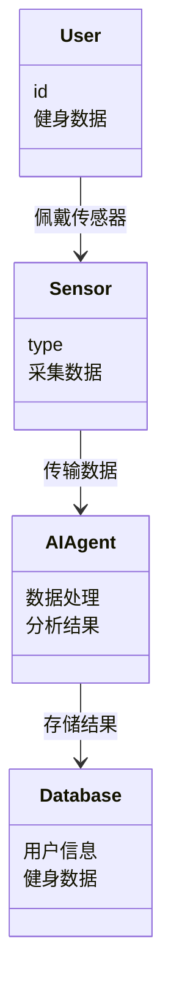
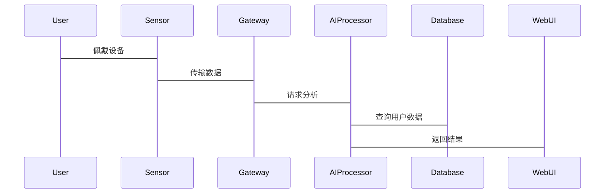

                 


```markdown
# 智能健身服：AI Agent的运动数据分析

> 关键词：智能健身服、AI Agent、运动数据分析、传感器技术、机器学习、数据隐私

> 摘要：本文深入探讨智能健身服中AI Agent的运动数据分析技术，涵盖背景介绍、核心技术、算法原理、系统架构、项目实战、案例分析及未来趋势，结合传感器、机器学习和大数据处理技术，分析其在运动表现优化中的应用，同时讨论数据隐私和伦理问题。

---

## 第1章 智能健身服与AI Agent的背景介绍

### 1.1 智能健身服的概念与背景
#### 1.1.1 传统健身服装的局限性
- 传统健身服装的功能单一，缺乏数据采集和反馈能力。
- 用户无法实时了解运动数据，难以优化运动表现。

#### 1.1.2 智能健身服的定义与特点
- 智能健身服：集成传感器、AI算法和数据处理技术的智能服装。
- 特点：实时数据采集、智能分析、个性化反馈。

#### 1.1.3 AI Agent在运动数据分析中的作用
- AI Agent：智能代理，用于数据处理、分析和决策支持。
- 通过AI Agent实现运动数据的实时分析和个性化建议。

### 1.2 运动数据分析的必要性
#### 1.2.1 运动数据分析的核心目标
- 提供实时运动反馈，优化运动表现。
- 预测运动损伤风险，制定个性化训练计划。

#### 1.2.2 数据采集的多样性与复杂性
- 数据类型：心率、加速度、步频、姿势等。
- 数据来源：多种传感器的集成。

#### 1.2.3 AI Agent在运动数据分析中的优势
- 高效处理大量数据，提供实时反馈。
- 通过机器学习模型不断优化分析结果。

### 1.3 本章小结
- 智能健身服结合AI Agent，提供高效、个性化的运动数据分析。
- AI Agent在运动数据处理中的关键作用。

---

## 第2章 智能健身服的核心技术与原理

### 2.1 AI Agent的基本原理
#### 2.1.1 AI Agent的定义与分类
- AI Agent：智能代理，分为简单反射型和基于模型的复杂型。
- 应用场景：实时数据处理、决策支持。

#### 2.1.2 AI Agent在运动数据分析中的工作流程
1. 数据采集：传感器收集运动数据。
2. 数据预处理：清洗和标准化。
3. 特征提取：关键特征识别。
4. 模型训练：机器学习算法建模。
5. 结果反馈：个性化建议生成。

#### 2.1.3 AI Agent的核心算法与技术
- 机器学习算法：随机森林、支持向量机、神经网络。
- 数据处理技术：流数据处理、实时计算。

### 2.2 运动数据分析的关键技术
#### 2.2.1 数据采集与传感器技术
- 传感器类型：加速度计、陀螺仪、心率监测器。
- 数据采集流程：信号采集、传输、存储。

#### 2.2.2 数据预处理与特征提取
- 数据清洗：去除噪声，处理缺失值。
- 特征提取：主成分分析、时间序列分析。

#### 2.2.3 数据分析与机器学习算法
- 监督学习：分类、回归。
- 无监督学习：聚类、异常检测。

### 2.3 AI Agent与运动数据分析的结合
#### 2.3.1 AI Agent在运动数据分析中的应用场景
- 实时运动表现分析。
- 个性化训练计划制定。

#### 2.3.2 AI Agent与运动数据的交互流程
1. 数据采集：传感器采集运动数据。
2. 数据传输：数据发送到AI Agent。
3. 数据分析：AI Agent处理数据，生成反馈。
4. 反馈输出：个性化建议或警报信息。

#### 2.3.3 AI Agent在运动数据分析中的优势
- 实时处理能力。
- 自适应学习能力。

### 2.4 本章小结
- AI Agent在运动数据分析中的核心技术与工作流程。
- 不同算法和技术在智能健身服中的应用。

---

## 第3章 AI Agent的运动数据分析算法原理

### 3.1 数据预处理与特征提取
#### 3.1.1 数据采集与传感器信号处理
- 传感器信号特点：时间序列、多模态。
- 数据预处理步骤：去噪、归一化。

#### 3.1.2 数据清洗与标准化
- 常见问题：噪声干扰、数据缺失。
- 处理方法：滤波、插值。

#### 3.1.3 特征提取与选择
- 特征提取方法：滑动窗口、小波变换。
- 特征选择：基于相关性的特征筛选。

### 3.2 机器学习算法在运动数据分析中的应用
#### 3.2.1 监督学习与无监督学习
- 监督学习：分类运动类型，回归预测运动表现。
- 无监督学习：聚类分析运动模式。

#### 3.2.2 深度学习模型
- RNN/LSTM：处理时间序列数据。
- CNN：特征提取。

#### 3.2.3 算法选择与优化
- 算法选择：根据数据类型和任务选择合适算法。
- 参数调优：网格搜索、随机搜索。

### 3.3 算法实现与优化
#### 3.3.1 数据预处理的代码实现
```python
import numpy as np
from sklearn.preprocessing import StandardScaler

# 示例数据
data = np.random.randn(100, 5)
scaler = StandardScaler()
data_scaled = scaler.fit_transform(data)
```

#### 3.3.2 机器学习模型的训练与评估
```python
from sklearn.model_selection import train_test_split
from sklearn.ensemble import RandomForestClassifier
from sklearn.metrics import accuracy_score

# 数据划分
X_train, X_test, y_train, y_test = train_test_split(data_scaled, labels, test_size=0.2)

# 模型训练
model = RandomForestClassifier(n_estimators=100)
model.fit(X_train, y_train)

# 模型评估
y_pred = model.predict(X_test)
print("准确率:", accuracy_score(y_test, y_pred))
```

### 3.4 本章小结
- 数据预处理和特征提取是运动数据分析的关键步骤。
- 不同算法在运动数据分析中的应用及优劣。

---

## 第4章 智能健身服的系统架构设计

### 4.1 系统功能设计
#### 4.1.1 问题场景介绍
- 用户需求：实时运动数据分析，个性化反馈。
- 系统目标：高效、准确地处理运动数据。

#### 4.1.2 领域模型设计


### 4.2 系统架构设计
#### 4.2.1 系统架构图


#### 4.2.2 接口设计
- 数据采集接口：REST API。
- 数据分析接口：WebSocket实时通信。

#### 4.2.3 交互流程


### 4.3 本章小结
- 系统架构设计的重要性。
- 不同组件的交互流程和接口设计。

---

## 第5章 项目实战：智能健身服的实现

### 5.1 环境安装与配置
- Python版本：3.8+。
- 需要的库：TensorFlow、PyTorch、Scikit-learn。

### 5.2 核心代码实现
#### 5.2.1 数据采集与预处理
```python
import numpy as np
import pandas as pd

# 示例数据集
data = pd.read_csv('fitness_data.csv')
```

#### 5.2.2 AI Agent的实现
```python
from sklearn.ensemble import RandomForestClassifier
from sklearn.metrics import accuracy_score

# 训练模型
model = RandomForestClassifier(n_estimators=100)
model.fit(X_train, y_train)

# 预测结果
y_pred = model.predict(X_test)
print("准确率:", accuracy_score(y_test, y_pred))
```

### 5.3 应用实例分析
- 实例1：心率监测与运动强度分析。
- 实例2：步频分析与运动效率优化。

### 5.4 本章小结
- 项目实现的关键步骤。
- 代码实现的具体细节。

---

## 第6章 案例分析：智能健身服的应用与优化

### 6.1 案例背景介绍
- 案例目标：优化用户运动表现。
- 数据来源：真实用户数据集。

### 6.2 数据分析与优化策略
- 数据分析结果：用户运动模式识别。
- 优化策略：个性化训练计划制定。

### 6.3 案例小结
- 数据分析对运动表现优化的指导意义。
- 智能健身服在实际应用中的价值。

---

## 第7章 未来趋势与挑战

### 7.1 未来发展趋势
- 技术进步：AI算法的不断优化。
- 应用场景扩展：更多运动类型的分析。

### 7.2 当前的挑战
- 数据隐私问题：如何保护用户数据。
- 伦理问题：AI决策的透明性和责任归属。

### 7.3 本章小结
- 智能健身服的未来发展潜力。
- 面临的主要挑战及解决方案。

---

## 附录

### 附录A 参考资料
- 推荐书籍和论文。
- 开发工具和框架。

### 附录B 工具指南
- 传感器选择指南。
- 机器学习模型部署指南。

---

## 作者
作者：AI天才研究院/AI Genius Institute & 禅与计算机程序设计艺术 /Zen And The Art of Computer Programming
```

