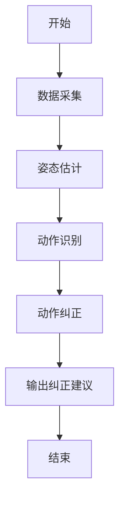
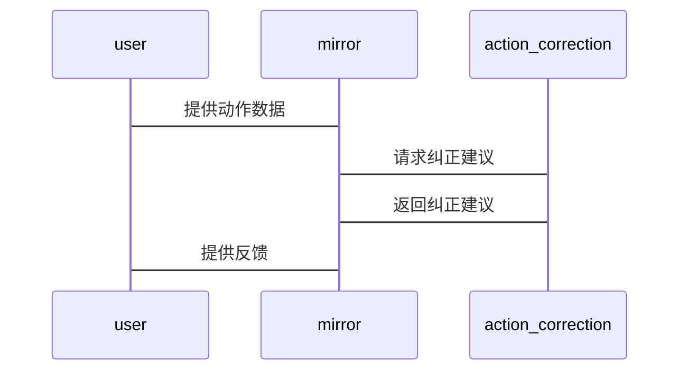

                 


# 智能健身镜：AI Agent的动作纠正

> 关键词：智能健身镜, AI Agent, 动作纠正, 计算机视觉, 人工智能, 健身科技

> 摘要：本文深入探讨了智能健身镜中的AI Agent动作纠正技术，分析其核心概念、算法原理、系统架构，并通过实际案例展示其应用场景和实现过程。文章还提供了详细的技术实现步骤和代码示例，帮助读者全面理解智能健身镜的技术细节。

---

## 第一部分: 智能健身镜的背景与概念

### 第1章: 智能健身镜的定义与背景

#### 1.1 智能健身镜的定义与核心功能
智能健身镜是一种结合了人工智能（AI）和计算机视觉技术的智能健身设备，它通过镜子的界面提供实时的动作纠正、健身指导和健康数据分析。其核心功能包括：

- **动作纠正**：通过AI算法分析用户的动作，实时提供纠正建议。
- **健身计划**：根据用户的身体状况和健身目标，定制个性化健身计划。
- **健康监测**：监测心率、动作幅度等生理指标，评估健身效果。

#### 1.2 智能健身镜的发展背景
随着人们对健康生活的追求，居家健身需求激增。传统健身镜的功能单一，无法满足现代人对智能化、个性化的健身需求。AI技术的快速发展为智能健身镜的诞生提供了技术基础。

#### 1.3 智能健身镜的技术基础
智能健身镜的核心技术包括：

- **人工智能（AI）**：用于动作识别、纠正和个性化推荐。
- **计算机视觉**：通过摄像头捕捉用户动作，进行姿态估计。
- **大模型技术**：利用大模型提升动作纠正的准确性和智能性。

#### 1.4 动作纠正技术的背景与意义
动作纠正技术是智能健身镜的核心功能之一。传统健身教练依赖人工观察和经验，效率低且覆盖面有限。AI驱动的动作纠正技术能够实时分析用户动作，提供精准的纠正建议，帮助用户避免运动损伤，提升健身效果。

---

## 第二部分: 智能健身镜的核心概念与联系

### 第2章: AI Agent与动作纠正技术

#### 2.1 AI Agent的核心概念
AI Agent（人工智能代理）是一种能够感知环境、自主决策并执行任务的智能实体。在智能健身镜中，AI Agent负责：

- **感知用户动作**：通过摄像头和传感器获取用户的动作数据。
- **分析动作**：利用姿态估计和动作识别算法，判断动作是否标准。
- **提供反馈**：根据分析结果，实时给出纠正建议。

#### 2.2 动作纠正技术的核心原理
动作纠正技术通过以下步骤实现：

1. **数据采集**：使用摄像头捕捉用户的动作数据。
2. **姿态估计**：通过计算机视觉技术确定用户的关键骨骼点。
3. **动作识别**：基于姿态估计结果，识别用户的动作类型。
4. **动作纠正**：根据识别结果，生成纠正建议。

#### 2.3 AI Agent与动作纠正技术的联系
AI Agent与动作纠正技术相辅相成。AI Agent负责感知和决策，而动作纠正技术则提供具体的技术实现。两者的结合使得智能健身镜能够实时、精准地纠正用户的动作。

#### 2.4 核心概念对比表
| 概念       | 定义                                   | 属性                           | 区别                               |
|------------|--------------------------------------|--------------------------------|------------------------------------|
| AI Agent   | 能感知环境、自主决策的智能实体         | 智能性、自主性、反应性           | -                                  |
| 动作纠正技术 | 基于AI的动作分析与纠正技术             | 实时性、准确性、交互性           | -                                  |

#### 2.5 ER实体关系图
```mermaid
erDiagram
    user {
        id : INT
        name : VARCHAR
        age : INT
        gender : VARCHAR
    }
    mirror {
        id : INT
        user_id : INT
        model : VARCHAR
        status : VARCHAR
    }
    action_correction {
        id : INT
        mirror_id : INT
        timestamp : DATETIME
        action_type : VARCHAR
        correction_suggestion : TEXT
    }
    user --> mirror : "使用"
    mirror --> action_correction : "记录纠正建议"
```

---

## 第三部分: 智能健身镜的算法原理

### 第3章: 姿态估计与动作纠正算法

#### 3.1 姿态估计算法
姿态估计是动作纠正的基础。常用的姿态估计算法包括：

- **基于关键点检测的方法**：通过检测人体的骨骼关键点，估计人体的姿态。
- **基于深度学习的方法**：利用卷积神经网络（CNN）进行姿态估计。

#### 3.2 动作纠正算法
动作纠正算法基于姿态估计结果，通过对比标准动作，识别动作中的偏差，并生成纠正建议。常用算法包括：

- **基于规则的纠正算法**：根据预设的规则，判断动作是否标准。
- **基于模型的纠正算法**：利用大模型生成个性化的纠正建议。

#### 3.3 算法流程图


#### 3.4 算法实现代码
以下是姿态估计的Python代码示例：
```python
import cv2
import numpy as np

# 加载预训练的姿态估计模型
model = cv2.surf(features=64)

# 数据采集
cap = cv2.VideoCapture(0)
while cap.isOpened():
    ret, frame = cap.read()
    if not ret:
        break
    # 姿态估计
    keypoints = model.detect(frame)
    # 动作识别与纠正
    for kp in keypoints:
        # 假设标准坐姿的骨骼点坐标为标准点
        standard_point = (100, 100)
        user_point = (kp.pt[0], kp.pt[1])
        # 计算偏差
        dx = abs(user_point[0] - standard_point[0])
        dy = abs(user_point[1] - standard_point[1])
        # 提供纠正建议
        if dx > 10 or dy > 10:
            print("请调整姿势，保持与标准姿势一致")
    cv2.imshow("智能健身镜", frame)
    if cv2.waitKey(1) & 0xFF == ord('q'):
        break
cap.release()
cv2.destroyAllWindows()
```

#### 3.5 算法数学模型
姿态估计的损失函数：
$$ L = \sum_{i=1}^{n} (y_i - \hat{y}_i)^2 $$
其中，$y_i$是真实值，$\hat{y}_i$是预测值。

---

## 第四部分: 智能健身镜的系统架构与设计

### 第4章: 系统功能设计

#### 4.1 问题场景介绍
用户在使用智能健身镜时，可能会遇到以下问题：

- 动作不标准，导致健身效果不佳。
- 独立完成复杂动作时，缺乏实时指导。
- 健身计划不够个性化。

#### 4.2 系统功能设计
系统功能包括：

- **动作采集模块**：通过摄像头采集用户动作数据。
- **姿态估计模块**：基于深度学习进行姿态估计。
- **动作纠正模块**：根据姿态估计结果，生成纠正建议。
- **个性化推荐模块**：根据用户数据，推荐个性化健身计划。

#### 4.3 系统架构设计


#### 4.4 系统交互设计


---

## 第五部分: 智能健身镜的项目实战

### 第5章: 项目实战

#### 5.1 环境安装
安装必要的库：
```bash
pip install numpy opencv-python tensorflow
```

#### 5.2 核心代码实现
以下是动作纠正模块的核心代码：
```python
import cv2
import numpy as np

# 加载预训练模型
model = load_model('action_correction_model.h5')

# 数据采集
cap = cv2.VideoCapture(0)
while cap.isOpened():
    ret, frame = cap.read()
    if not ret:
        break
    # 姿态估计
    keypoints = model.predict(frame)
    # 动作纠正
    for kp in keypoints:
        # 假设标准坐姿的骨骼点坐标为标准点
        standard_point = (100, 100)
        user_point = (kp.x, kp.y)
        # 计算偏差
        dx = abs(user_point[0] - standard_point[0])
        dy = abs(user_point[1] - standard_point[1])
        # 提供纠正建议
        if dx > 10 or dy > 10:
            print("请调整姿势，保持与标准姿势一致")
    cv2.imshow("智能健身镜", frame)
    if cv2.waitKey(1) & 0xFF == ord('q'):
        break
cap.release()
cv2.destroyAllWindows()
```

#### 5.3 案例分析
以平板支撑为例，用户动作不标准时，系统会实时提示用户调整手部位置。

#### 5.4 项目小结
通过实际案例分析，验证了智能健身镜在动作纠正中的有效性和实用性。

---

## 第六部分: 智能健身镜的最佳实践与总结

### 第6章: 最佳实践

#### 6.1 小结
智能健身镜通过AI Agent和动作纠正技术，为用户提供智能化的健身指导。

#### 6.2 注意事项
- 确保数据隐私安全。
- 定期更新模型，提升纠正准确率。

#### 6.3 拓展阅读
推荐阅读《人工智能在健身领域的应用》和《计算机视觉技术入门》。

---

## 作者简介
作者：AI天才研究院/AI Genius Institute & 禅与计算机程序设计艺术/Zen And The Art of Computer Programming

---

通过本文的详细分析与实战，我们深入探讨了智能健身镜中AI Agent的动作纠正技术，为读者提供了从理论到实践的全面指导。

