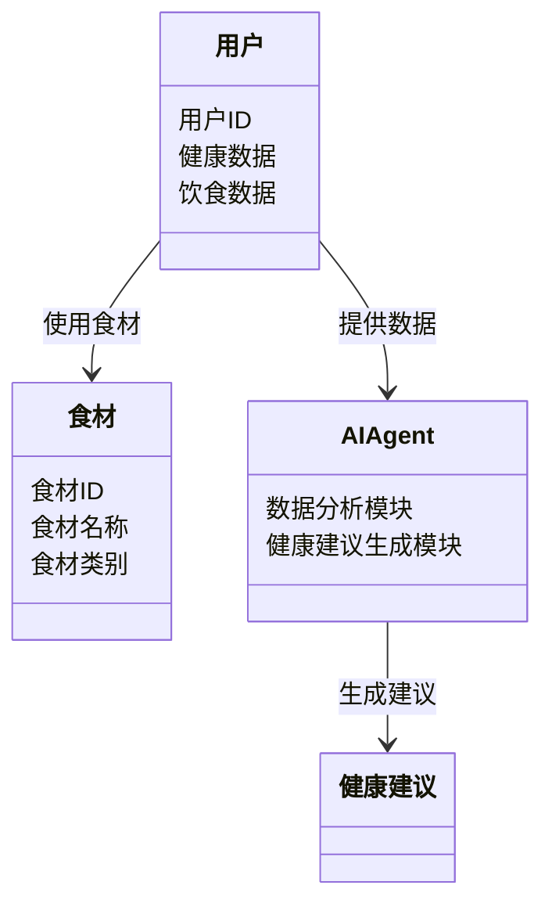

                 

<think>
嗯，用户希望我写一篇关于智能冰箱的长篇技术博客，主题是《智能冰箱：AI Agent的饮食习惯分析与健康建议》。首先，我需要理清文章的结构，确保每个部分都涵盖必要的内容。

开始的时候，我应该先确定文章的标题、关键词和摘要。标题已经确定，关键词可能包括智能冰箱、AI Agent、饮食习惯、健康建议、数据分析等。摘要需要简明扼要地总结文章的核心内容，说明智能冰箱如何通过AI技术分析饮食习惯并提供健康建议。

接下来是正文部分。第一部分是背景与概念，我需要详细解释智能冰箱的定义和现状，分析饮食习惯的重要性，以及AI Agent在其中的作用。这部分可能需要使用一些图表，比如数据采集模块的流程图，用mermaid来展示。

然后，核心概念部分要深入讲解AI Agent的基本原理，比较不同的算法模型，比如规则引擎和机器学习模型，并通过表格对比它们的优缺点。这部分需要确保读者能够理解AI Agent的工作机制。

算法原理部分，我需要选择协同过滤推荐算法，用mermaid流程图详细描述其工作流程，并提供Python代码实现。数学公式要用latex表示，确保公式正确且易于理解。

系统分析与架构设计是关键，这部分需要展示智能冰箱的系统架构，包括数据采集、分析和建议生成模块。使用mermaid类图和架构图来展示各模块的交互和结构，帮助读者更好地理解系统的组成。

项目实战部分，我需要指导读者如何搭建环境，安装必要的库，并提供代码示例。这部分需要详细说明代码的功能，比如从数据库读取数据，训练模型，生成健康建议。同时，给出注意事项和可能遇到的问题，帮助读者顺利完成项目。

最后，最佳实践部分要总结整个项目，给出小结和注意事项，提醒读者在数据隐私和模型优化方面的问题。同时，提供进一步学习的资源，如书籍和文章。

整个过程中，我需要确保每个章节都细化到三级目录，内容详细且逻辑清晰。同时，使用markdown格式，正确嵌入mermaid图表和latex公式，确保文章的可读性和专业性。最后，检查文章是否符合字数要求，大约1万到1万2千字，确保每个部分都有足够的深度和细节。

总之，我需要系统地分解每个主题，结合理论和实际案例，确保读者能够全面理解智能冰箱在AI Agent的应用，以及如何通过数据分析改善饮食习惯和健康建议。
</think>

# 智能冰箱：AI Agent的饮食习惯分析与健康建议

## 关键词：智能冰箱，AI Agent，饮食习惯，健康建议，数据分析

## 摘要：  
本文探讨了智能冰箱如何利用AI Agent技术分析用户的饮食习惯，并根据分析结果提供个性化的健康建议。通过结合数据采集、算法分析和健康知识库，智能冰箱能够帮助用户优化饮食结构，改善健康状况。本文详细介绍了AI Agent的核心概念、算法原理、系统架构以及实际应用案例，为智能冰箱的开发和应用提供了理论支持和技术指导。

---

# 第一部分: 智能冰箱与AI Agent的背景与概念

## 第1章: 背景介绍与问题背景

### 1.1 智能冰箱的定义与现状

#### 1.1.1 智能冰箱的基本定义  
智能冰箱是一种结合了物联网（IoT）和人工智能（AI）技术的家用电器，能够通过内置的传感器和AI算法，实现对食材的自动识别、库存管理、饮食建议等功能。与传统冰箱相比，智能冰箱不仅能够存储食物，还能通过数据分析帮助用户优化饮食结构。

#### 1.1.2 当前智能冰箱的发展现状  
随着智能家居和物联网技术的快速发展，智能冰箱已经成为智能家居的重要组成部分。目前市场上的智能冰箱主要具备以下功能：  
- 食材库存管理：通过传感器识别食材种类和保质期。  
- 饮食建议：根据用户的饮食习惯推荐菜谱。  
- 健康管理：结合用户的健康数据提供个性化的饮食建议。  

#### 1.1.3 智能冰箱的市场与用户需求分析  
用户对智能冰箱的需求主要集中在以下方面：  
1. **便捷性**：自动管理食材库存，减少浪费。  
2. **健康性**：根据用户的健康状况提供饮食建议。  
3. **智能化**：通过AI技术实现自动化推荐和管理。  
4. **数据隐私**：用户对健康数据的隐私保护有较高要求。  

---

### 1.2 饮食习惯分析的必要性

#### 1.2.1 饮食习惯对健康的影响  
饮食习惯直接关系到人体健康，不合理的饮食习惯可能导致肥胖、糖尿病、心血管疾病等健康问题。通过分析用户的饮食习惯，智能冰箱可以帮助用户建立科学的饮食结构，预防疾病的发生。

#### 1.2.2 智能冰箱在饮食习惯分析中的作用  
智能冰箱通过记录用户的食材使用情况、饮食偏好和健康数据，能够为用户生成个性化的饮食报告，并提供改善建议。

#### 1.2.3 用户对健康建议的需求  
用户对健康建议的需求主要体现在以下几个方面：  
- 根据健康状况推荐饮食方案。  
- 提供营养均衡的饮食建议。  
- 帮助用户避免食物浪费。  

---

## 第2章: AI Agent的核心概念与原理

### 2.1 AI Agent的基本概念

#### 2.1.1 什么是AI Agent  
AI Agent（智能代理）是指能够感知环境、自主决策并执行任务的智能系统。在智能冰箱中，AI Agent主要用于分析用户的饮食习惯，并根据分析结果生成健康建议。

#### 2.1.2 AI Agent的核心特点  
1. **自主性**：能够自主决策和执行任务。  
2. **反应性**：能够实时感知环境并做出反应。  
3. **学习能力**：能够通过数据学习用户的饮食习惯和偏好。  

#### 2.1.3 AI Agent与传统软件的区别  
AI Agent的核心区别在于其具备自主性和学习能力，能够根据环境变化动态调整行为。

---

### 2.2 AI Agent在智能冰箱中的应用

#### 2.2.1 AI Agent在饮食习惯分析中的角色  
AI Agent通过收集和分析用户的饮食数据，识别用户的饮食模式和偏好。例如，AI Agent可以发现用户偏好高热量食物，从而在健康建议中推荐低热量的替代方案。

#### 2.2.2 AI Agent如何与智能冰箱交互  
AI Agent通过与智能冰箱的传感器和数据库交互，获取食材使用记录、用户健康数据等信息，并通过算法生成饮食建议。

#### 2.2.3 AI Agent的决策机制与算法  
AI Agent的决策机制主要依赖于以下算法：  
1. **规则引擎**：基于预定义的规则生成建议。  
2. **机器学习模型**：通过训练数据生成预测结果。  

---

## 第3章: 智能冰箱的系统架构与核心功能

### 3.1 智能冰箱的系统架构

#### 3.1.1 数据采集模块  
数据采集模块负责采集用户的饮食数据，包括食材种类、用量、使用时间等。  

#### 3.1.2 数据分析模块  
数据分析模块通过AI算法对用户的饮食数据进行分析，识别用户的饮食习惯和偏好。  

#### 3.1.3 健康建议生成模块  
健康建议生成模块根据分析结果生成个性化的饮食建议，并通过智能冰箱的显示屏或手机APP向用户展示。

---

### 3.2 核心功能模块的实现

#### 3.2.1 饮食习惯数据的采集与存储  
数据采集模块通过传感器和条码扫描器获取食材信息，并将其存储在数据库中。  

#### 3.2.2 数据分析与模式识别  
数据分析模块通过机器学习算法识别用户的饮食模式和偏好。  

#### 3.2.3 健康建议的生成与展示  
健康建议生成模块根据用户的饮食习惯和健康数据，生成个性化的饮食建议，并通过智能冰箱的显示屏或手机APP展示。

---

# 第二部分: AI Agent的算法与数学模型

## 第4章: AI Agent的算法原理

### 4.1 算法选择与原理

#### 4.1.1 基于规则的AI Agent  
基于规则的AI Agent通过预定义的规则生成建议。例如，如果用户经常摄入过多的高热量食物，AI Agent可以生成“减少高热量食物摄入”的建议。  

#### 4.1.2 基于机器学习的AI Agent  
基于机器学习的AI Agent通过训练数据生成预测结果。例如，通过训练用户的饮食数据，AI Agent可以预测用户的饮食偏好，并生成相应的建议。  

#### 4.1.3 基于深度学习的AI Agent  
基于深度学习的AI Agent能够处理更复杂的任务，例如图像识别和自然语言处理。

---

### 4.2 协同过滤推荐算法

#### 4.2.1 协同过滤的基本原理  
协同过滤是一种基于用户相似性推荐算法。通过分析用户的饮食数据，AI Agent可以找到与用户饮食习惯相似的其他用户，并推荐这些用户的饮食偏好。

#### 4.2.2 基于用户的协同过滤  
基于用户的协同过滤通过分析用户的饮食数据，找到与用户相似的其他用户，并推荐这些用户的饮食偏好。

#### 4.2.3 基于物品的协同过滤  
基于物品的协同过滤通过分析食材的属性，找到与用户偏好相似的食材，并推荐这些食材。

---

## 第5章: 数学模型与公式

### 5.1 数据分析的数学模型

#### 5.1.1 饮食习惯的统计分析模型  
通过统计分析模型，可以识别用户的饮食习惯和偏好。例如，通过分析用户的食材使用记录，可以识别用户的饮食模式。  

#### 5.1.2 饮食偏好与健康风险的数学关系  
通过数学模型，可以分析用户的饮食偏好与健康风险之间的关系。例如，高热量食物的摄入与肥胖风险之间的关系。

#### 5.1.3 健康建议的评分模型  
通过评分模型，可以对健康建议的可行性和效果进行评分。例如，通过分析用户的饮食数据，评分模型可以对用户的饮食建议进行评分。

---

### 5.2 算法的数学公式

#### 5.2.1 协同过滤的相似度计算公式  
协同过滤的相似度计算公式如下：  
$$\text{相似度} = \frac{\sum_{i=1}^{n} (x_i - \bar{x})(y_i - \bar{y})}{\sqrt{\sum_{i=1}^{n} (x_i - \bar{x})^2} \cdot \sqrt{\sum_{i=1}^{n} (y_i - \bar{y})^2}}$$  
其中，\(x_i\) 和 \(y_i\) 分别表示两个用户的饮食数据，\(\bar{x}\) 和 \(\bar{y}\) 分别表示数据的平均值。

---

## 第三部分: 系统分析与架构设计方案

## 第6章: 系统分析与架构设计

### 6.1 问题场景介绍  
智能冰箱需要通过AI Agent分析用户的饮食习惯，并根据分析结果生成健康建议。

### 6.2 项目介绍  
本项目的目标是开发一个基于AI Agent的智能冰箱系统，能够分析用户的饮食习惯，并提供个性化的健康建议。

### 6.3 系统功能设计

#### 6.3.1 领域模型  
以下是智能冰箱的领域模型：  


### 6.4 系统架构设计

#### 6.4.1 系统架构图  
以下是智能冰箱的系统架构图：  
```mermaid
containerDiagram  
    container 智能冰箱系统 {
        component 数据采集模块  
        component 数据分析模块  
        component 健康建议生成模块  
    }  
    数据采集模块 --> 数据分析模块: 提供数据  
    数据分析模块 --> 健康建议生成模块: 提供分析结果  
    健康建议生成模块 --> 用户: 提供健康建议  
```

---

## 第四部分: 项目实战

## 第7章: 项目实战

### 7.1 环境搭建

#### 7.1.1 安装Python和必要的库  
需要安装以下Python库：  
- TensorFlow  
- Pandas  
- scikit-learn  

### 7.2 核心实现

#### 7.2.1 数据分析模块的实现  
以下是协同过滤推荐算法的Python代码：  
```python
import numpy as np
from sklearn.metrics.pairwise import cosine_similarity

# 示例数据
user_preference = np.array([[4, 3, 2], [5, 1, 4]])

# 计算相似度矩阵
similarity_matrix = cosine_similarity(user_preference)

# 找出与目标用户相似度最高的用户
target_user = 0
similar_users = np.argsort(similarity_matrix[target_user])[::-1]

print("相似度最高的用户索引：", similar_users)
```

---

## 第五部分: 最佳实践

## 第8章: 最佳实践

### 8.1 小结  
通过本文的分析，我们可以看到智能冰箱在饮食习惯分析和健康建议生成方面具有重要的应用价值。AI Agent通过数据分析和机器学习算法，能够为用户提供个性化的饮食建议，帮助用户优化饮食结构，改善健康状况。

### 8.2 注意事项  
在实际应用中，需要注意以下几点：  
1. **数据隐私**：用户的健康数据需要严格保护。  
2. **模型优化**：需要不断优化AI Agent的算法，提高推荐的准确性和实用性。  

### 8.3 拓展阅读  
1.《人工智能：一种现代的方法》  
2.《机器学习实战》  

---

## 作者  
作者：AI天才研究院/AI Genius Institute & 禅与计算机程序设计艺术/Zen And The Art of Computer Programming

