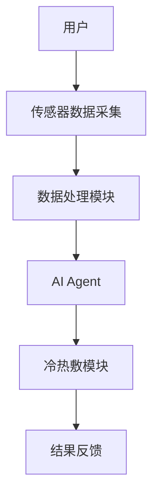
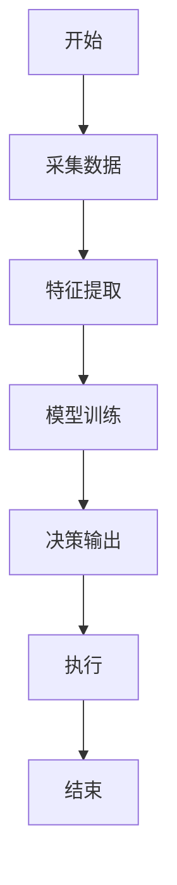
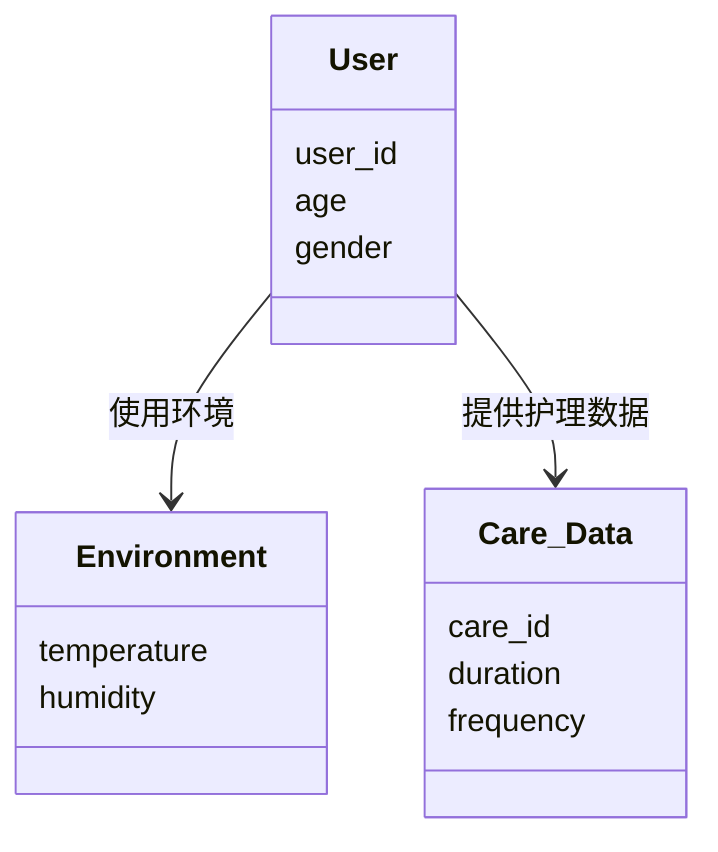

                 


# 智能冷热敷眼罩：AI Agent的眼部护理定制

## 关键词

- 智能冷热敷眼罩
- AI Agent
- 眼部护理
- 算法原理
- 系统架构
- 项目实战

## 摘要

随着人工智能技术的快速发展，智能冷热敷眼罩作为一种结合了AI Agent的创新眼部护理设备，正在逐步改变人们传统的护眼方式。本文将从智能冷热敷眼罩的发展背景、AI Agent的核心原理、算法实现、系统架构设计、项目实战以及最佳实践等方面，全面探讨智能冷热敷眼罩的技术实现与应用。通过本文的分析，读者可以深入了解如何利用AI技术实现智能化的眼部护理，以及AI Agent在智能硬件中的应用潜力。

---

## 第一部分：背景介绍

### 第1章：智能冷热敷眼罩的发展历程

#### 1.1 从传统冷热敷到智能冷热敷的演变

- **1.1.1 传统冷热敷眼罩的局限性**
  - 传统冷热敷眼罩依赖手动操作，无法根据用户需求自动调节温度和时间。
  - 缺乏实时反馈机制，无法精准满足用户的护眼需求。
  - 使用体验不够便捷，难以长期坚持。

- **1.1.2 智能冷热敷技术的出现**
  - 基于智能传感器和温控技术，实现温度的精准调节。
  - 结合AI技术，提供个性化的护眼方案。

- **1.1.3 智能冷热敷眼罩的市场现状**
  - 市场上已有多款智能冷热敷眼罩产品，但大多缺乏AI驱动的核心功能。
  - 结合AI Agent的智能冷热敷眼罩是未来的趋势。

#### 1.2 AI Agent的基本概念

- **1.2.1 人工智能代理的定义**
  - AI Agent是一种能够感知环境、自主决策并执行任务的智能系统。
  - 具备数据采集、分析、决策和执行的能力。

- **1.2.2 AI Agent的核心功能**
  - 数据采集与处理
  - 行为分析与决策
  - 自动化执行与反馈

- **1.2.3 AI Agent在医疗健康领域的应用**
  - 个性化健康管理
  - 疾病早期预警
  - 智能辅助治疗

#### 1.3 AI Agent与智能冷热敷眼罩的结合

- **1.3.1 眼部护理智能化的必要性**
  - 长期用眼导致的眼部问题日益严重，需要更高效的解决方案。
  - 智能化眼部护理设备可以提高用户体验和护理效果。

- **1.3.2 AI Agent在智能冷热敷眼罩中的作用**
  - 根据用户眼部状况实时调整冷热敷参数。
  - 提供个性化护眼建议和健康报告。

- **1.3.3 智能冷热敷眼罩的优势与前景**
  - 提高眼部护理的精准性和舒适度。
  - 结合AI技术，未来将实现更广泛的应用场景。

---

## 第二部分：核心概念与联系

### 第2章：AI Agent在智能冷热敷眼罩中的核心作用

#### 2.1 AI Agent的基本原理

- **2.1.1 数据采集与处理**
  - 通过传感器采集用户眼部的生理数据（如温度、湿度、眨眼频率等）。
  - 数据预处理和特征提取。

- **2.1.2 用户行为分析**
  - 分析用户的使用习惯和眼部健康状况。
  - 优化护眼方案。

- **2.1.3 冷热敷温度智能调节**
  - 根据用户需求和环境变化自动调节冷热敷温度。

#### 2.2 智能冷热敷眼罩的数据模型

- **2.2.1 数据模型的构建**
  - 用户数据：包括年龄、性别、用眼习惯等。
  - 环境数据：温度、湿度、光线强度等。
  - 护理数据：冷热敷温度、时间、频率等。

- **2.2.2 数据模型的实体关系图**

```mermaid
erDiagram
    user[user] {
        user_id : integer
        age : integer
        gender : string
        usage_habit : string
    }
    environment[environment] {
        temperature : integer
        humidity : integer
        light_intensity : integer
    }
    care_data[care_data] {
        care_id : integer
        temperature : integer
        duration : integer
        frequency : integer
    }
    user --> environment : 使用环境数据
    user --> care_data : 提供护理数据
    environment --> care_data : 影响护理方案
```

- **2.2.3 数据模型的优化**
  - 根据实际需求动态调整数据模型。
  - 增强数据模型的可扩展性和可维护性。

#### 2.3 AI Agent与智能冷热敷眼罩的协同工作

- **2.3.1 数据流分析**
  - 传感器数据 → 数据处理模块 → AI Agent → 冷热敷模块。

- **2.3.2 系统交互流程**



- **2.3.3 系统架构图**

```mermaid
subgraph 系统架构
    A[用户] --> B[数据采集]
    B --> C[数据处理]
    C --> D[AI Agent]
    D --> E[冷热敷执行]
    E --> F[反馈]
end
```

---

## 第三部分：算法原理讲解

### 第3章：AI Agent的核心算法

#### 3.1 数据采集与特征提取

- **3.1.1 传感器数据的采集**
  - 温度传感器：测量环境温度和眼部温度。
  - 光线传感器：测量环境光线强度。
  - 压力传感器：监测用户佩戴的舒适度。

- **3.1.2 特征提取的算法**
  - 基于时间序列的特征提取。
  - 统计特征（均值、标准差等）。
  - 机器学习特征提取（PCA、LDA等）。

#### 3.2 AI Agent的决策算法

- **3.2.1 机器学习算法的选择**
  - 线性回归：预测冷热敷温度。
  - 支持向量机：分类用户需求。
  - 随机森林：综合分析多维数据。

- **3.2.2 冷热敷温度的智能调节**
  - 基于用户数据的温度优化。
  - 动态调整温度参数。

- **3.2.3 用户反馈的处理与优化**
  - 实时反馈机制。
  - 用户偏好学习。

#### 3.3 算法流程图



---

## 第四部分：系统分析与架构设计方案

### 第4章：系统架构设计

#### 4.1 问题场景介绍

- 用户需求：个性化眼部护理。
- 系统目标：实现AI驱动的智能冷热敷。

#### 4.2 项目介绍

- 系统名称：智能冷热敷眼罩AI Agent。
- 开发目标：提供个性化、智能化的护眼方案。

#### 4.3 系统功能设计

- **领域模型**：



- **系统架构图**：

```mermaid
subgraph 前端
    UI [用户界面]
end
subgraph 后端
    Sensor [传感器]
    Controller [控制模块]
    AI_Agent [AI代理]
end
subgraph 服务层
    Database [数据库]
end
UI --> Sensor
Sensor --> Controller
Controller --> AI_Agent
AI_Agent --> Database
Database --> Controller
```

---

## 第五部分：项目实战

### 第5章：项目实战

#### 5.1 环境安装

- **开发环境**：Python 3.8+、Jupyter Notebook。
- **依赖库**：numpy、pandas、scikit-learn、mermaid。

#### 5.2 系统核心实现源代码

```python
import numpy as np
from sklearn.linear_model import LinearRegression

# 数据预处理
data = np.array([[25, 65], [26, 67], [24, 63], [27, 68]])
X = data[:, 0].reshape(-1, 1)
y = data[:, 1]

# 模型训练
model = LinearRegression()
model.fit(X, y)

# 冷热敷温度预测
new_temp = model.predict(np.array([[25]]))
print("预测温度为：", new_temp[0])
```

#### 5.3 代码应用解读与分析

- **数据预处理**：将传感器数据转换为模型可识别的格式。
- **模型训练**：使用线性回归模型进行温度预测。
- **结果分析**：根据预测结果调整冷热敷温度。

#### 5.4 实际案例分析

- **案例背景**：用户长时间使用电脑，眼部疲劳。
- **解决方案**：AI Agent根据用户数据推荐最佳冷热敷温度和时间。

#### 5.5 项目小结

- 通过项目实战，验证了AI Agent在智能冷热敷眼罩中的应用价值。
- 提供了实际案例分析，帮助读者更好地理解系统实现。

---

## 第六部分：最佳实践

### 第6章：最佳实践

#### 6.1 小结

- AI Agent在智能冷热敷眼罩中的应用前景广阔。
- 通过算法优化和系统设计，可以进一步提升用户体验。

#### 6.2 注意事项

- 数据隐私保护：确保用户数据的安全性。
- 系统稳定性：保证AI Agent的可靠性。
- 用户教育：引导用户正确使用智能设备。

#### 6.3 拓展阅读

- 推荐阅读《人工智能在医疗健康中的应用》。
- 参考《基于AI的智能硬件设计》相关文献。

---

## 作者信息

作者：AI天才研究院/AI Genius Institute & 禅与计算机程序设计艺术 /Zen And The Art of Computer Programming

---

本文通过系统性的分析和实践，深入探讨了智能冷热敷眼罩与AI Agent的结合，为读者提供了从理论到实践的全面指导。希望本文能为智能硬件和人工智能领域的研究者和开发者提供有价值的参考和启发。

