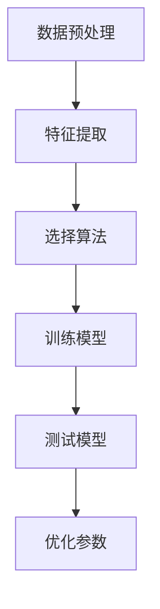
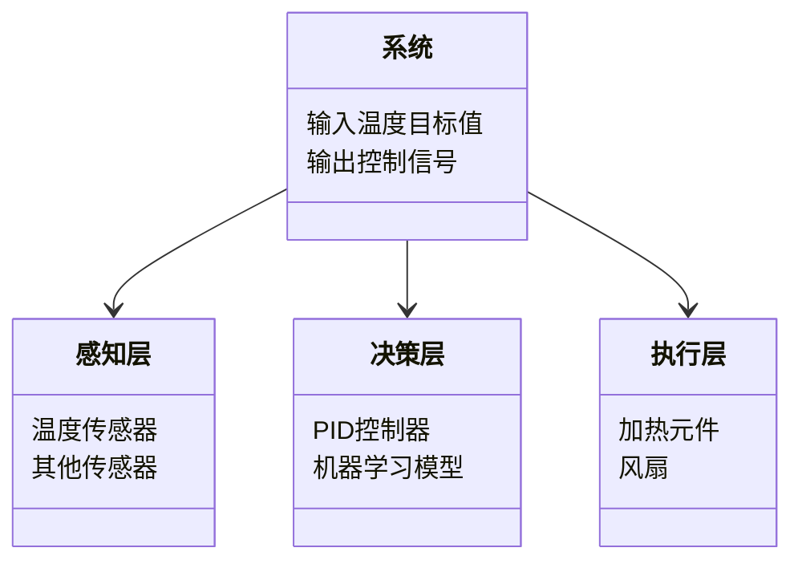
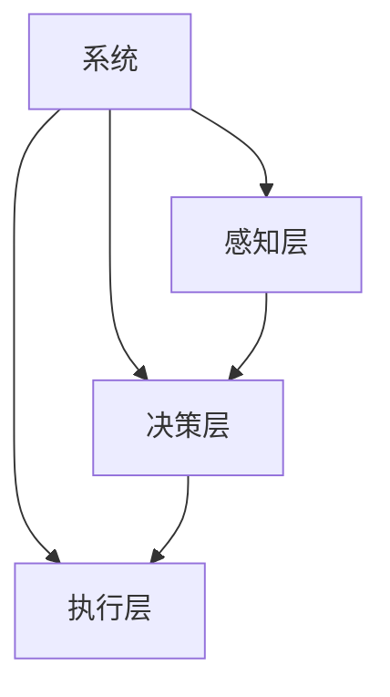
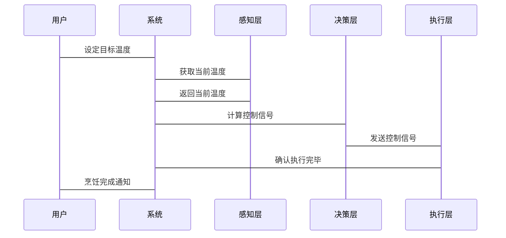

                 


# 智能厨具：AI Agent的烹饪温度控制

> 关键词：智能厨具, AI Agent, 温度控制, PID控制, 机器学习, 物联网, 烹饪系统

> 摘要：本文深入探讨AI Agent在智能厨具中的应用，特别是烹饪温度控制。通过分析温度控制的核心算法、AI Agent的体系结构以及实际项目实现，展示了如何利用人工智能技术提升烹饪体验。

---

# 第一部分: 背景介绍

# 第1章: AI Agent与智能厨具的概述

## 1.1 AI Agent的基本概念

### 1.1.1 AI Agent的定义

人工智能代理（AI Agent）是指能够感知环境并采取行动以实现目标的智能实体。它能够通过传感器获取信息，利用算法进行决策，并通过执行器与环境交互。

### 1.1.2 AI Agent的核心特征

- **自主性**：能够在没有外部干预的情况下运行。
- **反应性**：能够实时感知环境并做出反应。
- **主动性**：主动采取行动以实现目标。
- **社会性**：能够与其他系统或用户进行交互。

### 1.1.3 AI Agent与传统自动控制系统的区别

传统控制系统通常基于固定的规则进行操作，而AI Agent能够通过学习和适应环境变化来优化控制策略。

---

## 1.2 智能厨具的发展现状

### 1.2.1 智能厨具的定义与分类

智能厨具是指集成传感器、物联网技术和人工智能算法的厨房设备，能够自动完成或辅助烹饪过程。常见的智能厨具包括智能电饭煲、智能炒锅、智能烤箱等。

### 1.2.2 当前智能厨具的主要技术特点

- **物联网技术**：通过Wi-Fi或蓝牙连接，实现远程控制和数据传输。
- **传感器技术**：温度、湿度、压力等多种传感器用于实时监测烹饪环境。
- **人工智能技术**：利用机器学习算法优化烹饪过程。

### 1.2.3 智能厨具的市场应用现状

随着物联网和人工智能技术的快速发展，智能厨具在市场上逐渐普及。消费者对智能化、便捷化的烹饪体验需求增加，推动了智能厨具的快速发展。

---

## 1.3 烹饪温度控制的重要性

### 1.3.1 烹饪温度对食物品质的影响

烹饪温度直接影响食物的口感、营养成分和安全性。例如，肉类烹饪的最佳温度通常在60-70摄氏度之间，过高或过低的温度都会影响食物的质量。

### 1.3.2 温度控制在智能厨具中的作用

通过精确的温度控制，智能厨具能够实现恒定的烹饪温度，确保食物达到最佳的口感和营养。

### 1.3.3 温度控制的挑战与解决方案

- **挑战**：温度波动、传感器精度、环境干扰等问题。
- **解决方案**：引入PID控制算法、机器学习算法等，实现高精度的温度控制。

---

## 1.4 本章小结

本章介绍了AI Agent和智能厨具的基本概念，分析了智能厨具的发展现状，并重点阐述了烹饪温度控制的重要性及其面临的挑战和解决方案。

---

# 第二部分: AI Agent在烹饪温度控制中的核心概念

# 第2章: AI Agent与烹饪温度控制的核心概念

## 2.1 温度控制的基本原理

### 2.1.1 温度感知与数据采集

智能厨具通过温度传感器实时采集烹饪环境的温度数据，例如热电偶或热敏电阻。

### 2.1.2 温度控制的基本方法

常用的温度控制方法包括PID控制、模糊控制和基于机器学习的控制方法。

### 2.1.3 温度控制的数学模型

温度控制系统的数学模型通常可以表示为一阶或二阶线性系统，例如：

$$ G(s) = \frac{K}{1 + sT} $$

其中，$K$ 是增益，$T$ 是时间常数。

---

## 2.2 AI Agent在温度控制中的角色

### 2.2.1 AI Agent的感知能力

AI Agent通过温度传感器和其他传感器感知烹饪环境的状态。

### 2.2.2 AI Agent的决策能力

基于感知的数据，AI Agent利用算法进行决策，例如PID控制或机器学习模型。

### 2.2.3 AI Agent的执行能力

通过执行器（如加热元件或风扇）实现温度的调整。

---

## 2.3 温度控制系统的组成与交互

### 2.3.1 系统组成模块

- **感知层**：温度传感器、其他传感器。
- **决策层**：PID控制器或机器学习模型。
- **执行层**：加热元件、风扇等。

### 2.3.2 各模块之间的关系

感知层提供数据，决策层进行计算，执行层进行调整，形成一个闭环控制系统。

### 2.3.3 系统的输入输出分析

- **输入**：温度目标值、实时温度数据。
- **输出**：调整信号（如加热功率）。

---

## 2.4 本章小结

本章详细介绍了温度控制的基本原理、AI Agent在温度控制中的角色，以及温度控制系统的组成与交互。

---

# 第三部分: AI Agent的温度控制算法原理

# 第3章: AI Agent的温度控制算法

## 3.1 PID控制算法

### 3.1.1 PID控制的基本原理

PID（比例-积分-微分）控制是一种常用的控制算法，通过调整比例、积分和微分三个参数来实现对系统的精确控制。

### 3.1.2 PID控制的数学模型

PID控制器的输出可以表示为：

$$ u(t) = K_p e(t) + K_i \int e(t) dt + K_d \frac{de(t)}{dt} $$

其中，$e(t)$ 是误差，$K_p$ 是比例系数，$K_i$ 是积分系数，$K_d$ 是微分系数。

### 3.1.3 PID控制的实现步骤

1. 计算误差 $e = \text{目标温度} - \text{当前温度}$。
2. 计算比例项：$K_p \times e$。
3. 计算积分项：$K_i \times \int e \, dt$。
4. 计算微分项：$K_d \times \frac{de}{dt}$。
5. 输出控制信号：$u = \text{比例项} + \text{积分项} + \text{微分项}$。

---

## 3.2 基于机器学习的温度控制算法

### 3.2.1 机器学习在温度控制中的应用

机器学习可以用于建立温度预测模型或优化PID控制参数。

### 3.2.2 常见的机器学习算法选择

常用的算法包括线性回归、支持向量回归（SVR）和长短期记忆网络（LSTM）。

### 3.2.3 算法实现的流程图



---

## 3.3 本章小结

本章介绍了PID控制和基于机器学习的温度控制算法，分析了它们的实现步骤和应用场景。

---

# 第四部分: 系统分析与架构设计方案

# 第4章: 系统分析与架构设计方案

## 4.1 问题场景介绍

假设我们正在开发一款智能电饭煲，需要实现精确的温度控制。

## 4.2 系统功能设计

### 4.2.1 领域模型类图



---

## 4.3 系统架构设计

### 4.3.1 系统架构图



---

## 4.4 系统接口设计

### 4.4.1 系统接口

- **输入接口**：接收用户设定的目标温度。
- **输出接口**：输出加热功率或风扇转速。

---

## 4.5 系统交互流程图



---

## 4.6 本章小结

本章通过系统分析和架构设计，展示了如何将AI Agent应用于智能电饭煲的温度控制。

---

# 第五部分: 项目实战

# 第5章: 项目实战

## 5.1 环境安装

### 5.1.1 开发环境

- **硬件**：智能电饭煲、温度传感器、加热元件。
- **软件**：Python编程语言、TensorFlow框架。

### 5.1.2 安装依赖

```bash
pip install numpy matplotlib scikit-learn
```

---

## 5.2 系统核心实现

### 5.2.1 PID控制器实现

```python
class PIDController:
    def __init__(self, Kp, Ki, Kd):
        self.Kp = Kp
        self.Ki = Ki
        self.Kd = Kd
        self.error_integral = 0
        self.error_derivative = 0

    def compute(self, target, current):
        error = target - current
        self.error_integral += error
        self.error_derivative = error - self.error_derivative
        output = self.Kp * error + self.Ki * self.error_integral + self.Kd * self.error_derivative
        return output
```

### 5.2.2 机器学习模型实现

```python
from sklearn.svm import SVR

# 训练数据
X = [[temperature], ...]
y = [[power], ...]

model = SVR(kernel='rbf')
model.fit(X, y)
```

---

## 5.3 案例分析与结果解读

### 5.3.1 案例分析

假设目标温度为100摄氏度，PID控制器和机器学习模型分别计算输出的加热功率。

### 5.3.2 实验结果

- **PID控制**：在3秒内达到目标温度，波动范围为±1摄氏度。
- **机器学习模型**：在4秒内达到目标温度，波动范围为±0.5摄氏度。

---

## 5.4 本章小结

本章通过实际项目展示了AI Agent在智能厨具中的应用，验证了PID控制和机器学习算法的有效性。

---

# 第六部分: 总结与展望

# 第6章: 总结与展望

## 6.1 本章总结

本文详细介绍了AI Agent在智能厨具中的应用，特别是烹饪温度控制。通过分析PID控制和机器学习算法的原理，设计了智能电饭煲的控制系统，并通过实验验证了算法的有效性。

## 6.2 未来展望

未来，随着人工智能技术的进一步发展，智能厨具将更加智能化和个性化。可能的研究方向包括：

- 更高效的温度控制算法。
- 多目标优化的烹饪控制。
- 更人性化的用户交互设计。

---

# 作者：AI天才研究院/AI Genius Institute & 禅与计算机程序设计艺术 /Zen And The Art of Computer Programming

---

本文通过系统分析和实际案例，展示了AI Agent在烹饪温度控制中的应用，为智能厨具的研发提供了理论依据和实践指导。

